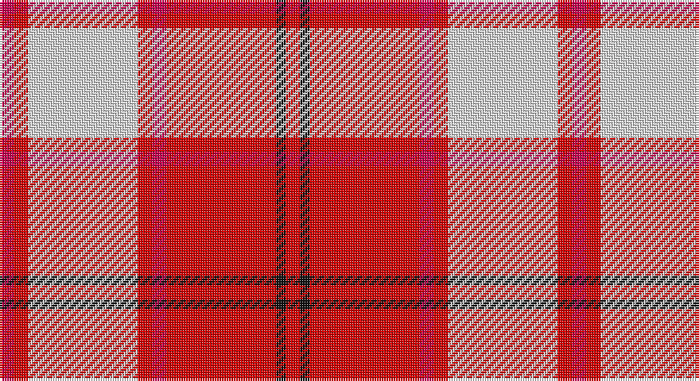

This page is one **sett** — a single exact thread-count. It belongs to the [tartan](/setts/r3k2r23ri3r3w23r3ri3/)
(the same proportion at any scale), whose colour order is pattern [RKRRRWRR](/stripes/rkrrrwrr/).

Sourced from register-of-tartans.  It is a [8 stripe tartan](/stripes/stripes8/).

Original link https://www.tartanregister.gov.uk/tartanDetails.aspx?ref=493

## Register references

External register numbers recorded for this tartan.

- Scottish Register of Tartans: [493](https://www.tartanregister.gov.uk/tartanDetails.aspx?ref=493)
- Scottish Tartans World Register: 1598

## Thread count
R/6 Ra6 LN46 Ra6 R6 Ra46 K4 Ra/6

One full sett is **240 threads**.

## Palette

Palette: <strong>Tartan Register</strong> <small style="color:#888">(3 of 4 colours)</small>
<table><thead><tr><th>Colour</th><th>Threads</th><th>Shade</th><th>Base</th><th>OKLCh</th></tr></thead><tbody><tr><td>R/</td><td style="text-align:right;font-variant-numeric:tabular-nums">6</td><td><code style="background-color:#C80050;">#C80050</code> <small style="color:#888">#C80050</small></td><td>R <code style="background-color:#CC0000;">#CC0000</code></td><td><small style="color:#888">oklch(53.2% 0.213 9.9)</small></td></tr><tr><td>Ra</td><td style="text-align:right;font-variant-numeric:tabular-nums">6</td><td><code style="background-color:#DC0000;">#DC0000</code> <small style="color:#888">#DC0000</small></td><td>R <code style="background-color:#CC0000;">#CC0000</code></td><td><small style="color:#888">oklch(56.2% 0.230 29.2)</small></td></tr><tr><td>LN</td><td style="text-align:right;font-variant-numeric:tabular-nums">46</td><td><code style="background-color:#E0E0E0;">#E0E0E0</code> <small style="color:#888">#E0E0E0</small></td><td>W <code style="background-color:#F7F7F7;">#F7F7F7</code></td><td><small style="color:#888">oklch(90.7% 0.000 89.9)</small></td></tr><tr><td>Ra</td><td style="text-align:right;font-variant-numeric:tabular-nums">6</td><td><code style="background-color:#DC0000;">#DC0000</code> <small style="color:#888">#DC0000</small></td><td>R <code style="background-color:#CC0000;">#CC0000</code></td><td><small style="color:#888">oklch(56.2% 0.230 29.2)</small></td></tr><tr><td>R</td><td style="text-align:right;font-variant-numeric:tabular-nums">6</td><td><code style="background-color:#C80050;">#C80050</code> <small style="color:#888">#C80050</small></td><td>R <code style="background-color:#CC0000;">#CC0000</code></td><td><small style="color:#888">oklch(53.2% 0.213 9.9)</small></td></tr><tr><td>Ra</td><td style="text-align:right;font-variant-numeric:tabular-nums">46</td><td><code style="background-color:#DC0000;">#DC0000</code> <small style="color:#888">#DC0000</small></td><td>R <code style="background-color:#CC0000;">#CC0000</code></td><td><small style="color:#888">oklch(56.2% 0.230 29.2)</small></td></tr><tr><td>K</td><td style="text-align:right;font-variant-numeric:tabular-nums">4</td><td><code style="background-color:#101010;">#101010</code> <small style="color:#888">#101010</small></td><td>K <code style="background-color:#000000;">#000000</code></td><td><small style="color:#888">oklch(17.3% 0.000 89.9)</small></td></tr><tr><td>Ra/</td><td style="text-align:right;font-variant-numeric:tabular-nums">6</td><td><code style="background-color:#DC0000;">#DC0000</code> <small style="color:#888">#DC0000</small></td><td>R <code style="background-color:#CC0000;">#CC0000</code></td><td><small style="color:#888">oklch(56.2% 0.230 29.2)</small></td></tr></tbody></table>

# Sample pattern

## Nearest tartans

The nearest existing variants by ΔTartan distance, with this tartan at the top so the swatches line up against it.

ΔTartan

Tartan

Sett

—

<a href="/ttd/edit/#slug=r3k2r23ri3r3w23r3ri3~x2">Cameron Hose #2</a> <a class="nn-out" href="/variants/s8/r3k2r23ri3r3w23r3ri3~x2/" title="open its dictionary page">↗</a>

0.48

<a href="/ttd/edit/#slug=r3ri3w23ri3r3ri23k2ri3~x2&amp;base=r3k2r23ri3r3w23r3ri3~x2">Cameron, Hose for E</a> <a class="nn-out" href="/variants/s8/r3ri3w23ri3r3ri23k2ri3~x2/" title="open its dictionary page">↗</a>

0.77

<a href="/ttd/edit/#slug=r3k2r23ri3r3lb23r3ri3~x2&amp;base=r3k2r23ri3r3w23r3ri3~x2">Hose #2</a> <a class="nn-out" href="/variants/s8/r3k2r23ri3r3lb23r3ri3~x2/" title="open its dictionary page">↗</a>

0.88

<a href="/ttd/edit/#slug=r35db2w2db2r4ri10w25r3~x2&amp;base=r3k2r23ri3r3w23r3ri3~x2">Longniddry Dress, Red (Dance)</a> <a class="nn-out" href="/variants/s8/r35db2w2db2r4ri10w25r3~x2/" title="open its dictionary page">↗</a>

1.08

<a href="/ttd/edit/#slug=w4ri2w25r21w3r8ly3~x2&amp;base=r3k2r23ri3r3w23r3ri3~x2">MacPherson Dress Red</a> <a class="nn-out" href="/variants/s7/w4ri2w25r21w3r8ly3~x2/" title="open its dictionary page">↗</a>

1.09

<a href="/ttd/edit/#slug=r2ri1r10ri2w10db1w2~x4&amp;base=r3k2r23ri3r3w23r3ri3~x2">Lennox Dress #2</a> <a class="nn-out" href="/variants/s7/r2ri1r10ri2w10db1w2~x4/" title="open its dictionary page">↗</a>

1.09

<a href="/ttd/edit/#slug=ri3r2db2r30w30db2w3~x2&amp;base=r3k2r23ri3r3w23r3ri3~x2">Torridon, Cherry (Dance)</a> <a class="nn-out" href="/variants/s7/ri3r2db2r30w30db2w3~x2/" title="open its dictionary page">↗</a>

1.09

<a href="/ttd/edit/#slug=r8m2r24m5w25dy2w8~x2&amp;base=r3k2r23ri3r3w23r3ri3~x2">Lennox Dress District Tartan</a> <a class="nn-out" href="/variants/s7/r8m2r24m5w25dy2w8~x2/" title="open its dictionary page">↗</a>

1.12

<a href="/ttd/edit/#slug=k1r8dg1r1w8r1k1~x6&amp;base=r3k2r23ri3r3w23r3ri3~x2">Cameron Hose</a> <a class="nn-out" href="/variants/s7/k1r8dg1r1w8r1k1~x6/" title="open its dictionary page">↗</a>

1.17

<a href="/ttd/edit/#slug=w5k2w30r24w3r8dt3~x2&amp;base=r3k2r23ri3r3w23r3ri3~x2">Arduaine, Red (Dance)</a> <a class="nn-out" href="/variants/s7/w5k2w30r24w3r8dt3~x2/" title="open its dictionary page">↗</a>

1.22

<a href="/ttd/edit/#slug=r8dp2r24dp5w25dy2w8~x2&amp;base=r3k2r23ri3r3w23r3ri3~x2">MacGiboney (Personal)</a> <a class="nn-out" href="/variants/s7/r8dp2r24dp5w25dy2w8~x2/" title="open its dictionary page">↗</a>

## Neighbour map

Every grey dot is one of 14360 variants placed by the first two principal components of the ΔTartan feature space (44% of its variance). Red is this tartan; blue dots are its nearest — click one to open its page.

<svg viewBox="0 0 640 380" role="img" style="max-width:100%;height:auto;border:1px solid #e0e0e0;border-radius:4px;display:block" xmlns="http://www.w3.org/2000/svg"><image href="/nn/cloud.v1.png" width="640" height="380"/><a href="/variants/s8/r3ri3w23ri3r3ri23k2ri3~x2/"><circle cx="284.0" cy="137.4" r="4" fill="#3465a4"><title>Cameron, Hose for E</title></circle></a><a href="/variants/s8/r3k2r23ri3r3lb23r3ri3~x2/"><circle cx="306.2" cy="150.2" r="4" fill="#3465a4"><title>Hose #2</title></circle></a><a href="/variants/s8/r35db2w2db2r4ri10w25r3~x2/"><circle cx="296.5" cy="122.6" r="4" fill="#3465a4"><title>Longniddry Dress, Red (Dance)</title></circle></a><a href="/variants/s7/w4ri2w25r21w3r8ly3~x2/"><circle cx="287.8" cy="154.9" r="4" fill="#3465a4"><title>MacPherson Dress Red</title></circle></a><a href="/variants/s7/r2ri1r10ri2w10db1w2~x4/"><circle cx="235.9" cy="158.9" r="4" fill="#3465a4"><title>Lennox Dress #2</title></circle></a><a href="/variants/s7/ri3r2db2r30w30db2w3~x2/"><circle cx="283.3" cy="126.8" r="4" fill="#3465a4"><title>Torridon, Cherry (Dance)</title></circle></a><a href="/variants/s7/r8m2r24m5w25dy2w8~x2/"><circle cx="252.3" cy="159.5" r="4" fill="#3465a4"><title>Lennox Dress District Tartan</title></circle></a><a href="/variants/s7/k1r8dg1r1w8r1k1~x6/"><circle cx="243.2" cy="157.2" r="4" fill="#3465a4"><title>Cameron Hose</title></circle></a><a href="/variants/s7/w5k2w30r24w3r8dt3~x2/"><circle cx="295.3" cy="141.5" r="4" fill="#3465a4"><title>Arduaine, Red (Dance)</title></circle></a><a href="/variants/s7/r8dp2r24dp5w25dy2w8~x2/"><circle cx="247.0" cy="157.2" r="4" fill="#3465a4"><title>MacGiboney (Personal)</title></circle></a><circle cx="293.0" cy="138.2" r="5" fill="#c00000"/></svg>

ID: /variants/s8/r3k2r23ri3r3w23r3ri3~x2/
