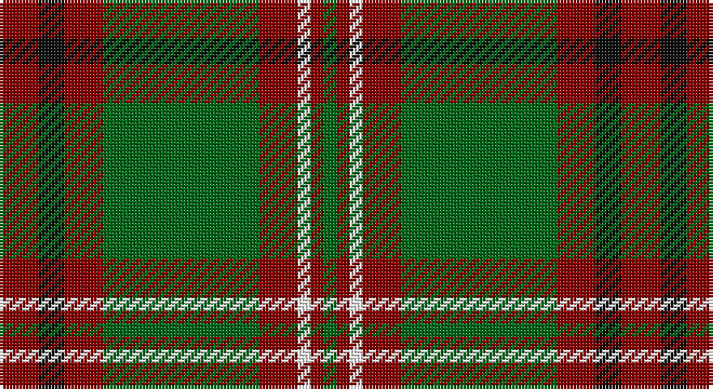

This page is one **sett** — a single exact thread-count. It belongs to the [tartan](/setts/r3k2r3g12r3w1r1g1/)
(the same proportion at any scale), whose colour order is pattern [GRWRGRKR](/stripes/grwrgrkr/).

Sourced from register-of-tartans.  It is a [8 stripe tartan](/stripes/stripes8/).

Original link https://www.tartanregister.gov.uk/tartanDetails.aspx?ref=2305

## Register references

External register numbers recorded for this tartan.

- Scottish Register of Tartans: [2305](https://www.tartanregister.gov.uk/tartanDetails.aspx?ref=2305)
- Scottish Tartans Authority (ITI): 2238
- Scottish Tartans World Register: 2238

## Thread count
DR/12 K8 DR12 G48 DR12 W4 DR4 G/4

One full sett is **192 threads**.

## Palette

Palette: <strong>Tartan Register</strong>
<table><thead><tr><th>Colour</th><th>Threads</th><th>Shade</th><th>Base</th><th>OKLCh</th></tr></thead><tbody><tr><td>DR/</td><td style="text-align:right;font-variant-numeric:tabular-nums">12</td><td><code style="background-color:#880000;">#880000</code> <small style="color:#888">#880000</small></td><td>R <code style="background-color:#CC0000;">#CC0000</code></td><td><small style="color:#888">oklch(39.4% 0.162 29.2)</small></td></tr><tr><td>K</td><td style="text-align:right;font-variant-numeric:tabular-nums">8</td><td><code style="background-color:#101010;">#101010</code> <small style="color:#888">#101010</small></td><td>K <code style="background-color:#000000;">#000000</code></td><td><small style="color:#888">oklch(17.3% 0.000 89.9)</small></td></tr><tr><td>DR</td><td style="text-align:right;font-variant-numeric:tabular-nums">12</td><td><code style="background-color:#880000;">#880000</code> <small style="color:#888">#880000</small></td><td>R <code style="background-color:#CC0000;">#CC0000</code></td><td><small style="color:#888">oklch(39.4% 0.162 29.2)</small></td></tr><tr><td>G</td><td style="text-align:right;font-variant-numeric:tabular-nums">48</td><td><code style="background-color:#006818;">#006818</code> <small style="color:#888">#006818</small></td><td>G <code style="background-color:#006100;">#006100</code></td><td><small style="color:#888">oklch(45.0% 0.142 145.0)</small></td></tr><tr><td>DR</td><td style="text-align:right;font-variant-numeric:tabular-nums">12</td><td><code style="background-color:#880000;">#880000</code> <small style="color:#888">#880000</small></td><td>R <code style="background-color:#CC0000;">#CC0000</code></td><td><small style="color:#888">oklch(39.4% 0.162 29.2)</small></td></tr><tr><td>W</td><td style="text-align:right;font-variant-numeric:tabular-nums">4</td><td><code style="background-color:#FFFFFF;">#FFFFFF</code> <small style="color:#888">#FFFFFF</small></td><td>W <code style="background-color:#F7F7F7;">#F7F7F7</code></td><td><small style="color:#888">oklch(100.0% 0.000 89.9)</small></td></tr><tr><td>DR</td><td style="text-align:right;font-variant-numeric:tabular-nums">4</td><td><code style="background-color:#880000;">#880000</code> <small style="color:#888">#880000</small></td><td>R <code style="background-color:#CC0000;">#CC0000</code></td><td><small style="color:#888">oklch(39.4% 0.162 29.2)</small></td></tr><tr><td>G/</td><td style="text-align:right;font-variant-numeric:tabular-nums">4</td><td><code style="background-color:#006818;">#006818</code> <small style="color:#888">#006818</small></td><td>G <code style="background-color:#006100;">#006100</code></td><td><small style="color:#888">oklch(45.0% 0.142 145.0)</small></td></tr></tbody></table>

# Sample pattern

## Nearest tartans

The nearest existing variants by ΔTartan distance, with this tartan at the top so the swatches line up against it.

ΔTartan

Tartan

Sett

—

<a href="/ttd/edit/#slug=r3k2r3g12r3w1r1g1~x4">MacCall/McCall</a> <a class="nn-out" href="/variants/s8/r3k2r3g12r3w1r1g1~x4/" title="open its dictionary page">↗</a>

0.72

<a href="/ttd/edit/#slug=ly5dg14dy4db4dy27dg3dy4ly5&amp;base=r3k2r3g12r3w1r1g1~x4">Invertere Corporate Tartan</a> <a class="nn-out" href="/variants/s8/ly5dg14dy4db4dy27dg3dy4ly5/" title="open its dictionary page">↗</a>

0.87

<a href="/ttd/edit/#slug=r5k2dg1k2r5k2dg18lo3~x2&amp;base=r3k2r3g12r3w1r1g1~x4">Midpac Tissue (non woven)</a> <a class="nn-out" href="/variants/s8/r5k2dg1k2r5k2dg18lo3~x2/" title="open its dictionary page">↗</a>

1.01

<a href="/ttd/edit/#slug=ly5dg14o4db4o27dg3o4ly5~x2&amp;base=r3k2r3g12r3w1r1g1~x4">Invertere</a> <a class="nn-out" href="/variants/s8/ly5dg14o4db4o27dg3o4ly5~x2/" title="open its dictionary page">↗</a>

1.01

<a href="/ttd/edit/#slug=k4lo15dg5k3dg7k3dg30r20dg3~x2&amp;base=r3k2r3g12r3w1r1g1~x4">MacKillen</a> <a class="nn-out" href="/variants/s9/k4lo15dg5k3dg7k3dg30r20dg3~x2/" title="open its dictionary page">↗</a>

1.05

<a href="/ttd/edit/#slug=r4t3r32db30r4g32r3g32r3g3~x2&amp;base=r3k2r3g12r3w1r1g1~x4">Unidentified Plaid 6</a> <a class="nn-out" href="/variants/s10/r4t3r32db30r4g32r3g32r3g3~x2/" title="open its dictionary page">↗</a>

1.13

<a href="/ttd/edit/#slug=g4r4k12w2k12g32r4k3~x2&amp;base=r3k2r3g12r3w1r1g1~x4">MacHardy (Clans Originaux)</a> <a class="nn-out" href="/variants/s8/g4r4k12w2k12g32r4k3~x2/" title="open its dictionary page">↗</a>

1.13

<a href="/ttd/edit/#slug=g36k2g2k2g3k12t10r20~x2&amp;base=r3k2r3g12r3w1r1g1~x4">Georgia, State of</a> <a class="nn-out" href="/variants/s8/g36k2g2k2g3k12t10r20~x2/" title="open its dictionary page">↗</a>

1.14

<a href="/ttd/edit/#slug=r8g2r12k6r3db3g24k2~x2&amp;base=r3k2r3g12r3w1r1g1~x4">McInery (Personal)</a> <a class="nn-out" href="/variants/s8/r8g2r12k6r3db3g24k2~x2/" title="open its dictionary page">↗</a>

1.16

<a href="/ttd/edit/#slug=t2dg1t1dg12r2dg1ri6ly2~x2&amp;base=r3k2r3g12r3w1r1g1~x4">Manitoba Red</a> <a class="nn-out" href="/variants/s8/t2dg1t1dg12r2dg1ri6ly2~x2/" title="open its dictionary page">↗</a>

1.18

<a href="/ttd/edit/#slug=ly5g14dy4db4dy27g3dy4ly5~x2&amp;base=r3k2r3g12r3w1r1g1~x4">Invertere (Daks #2) (Fashion)</a> <a class="nn-out" href="/variants/s8/ly5g14dy4db4dy27g3dy4ly5~x2/" title="open its dictionary page">↗</a>

## Neighbour map

Every grey dot is one of 14360 variants placed by the first two principal components of the ΔTartan feature space (44% of its variance). Red is this tartan; blue dots are its nearest — click one to open its page.

<svg viewBox="0 0 640 380" role="img" style="max-width:100%;height:auto;border:1px solid #e0e0e0;border-radius:4px;display:block" xmlns="http://www.w3.org/2000/svg"><image href="/nn/cloud.v1.png" width="640" height="380"/><a href="/variants/s8/ly5dg14dy4db4dy27dg3dy4ly5/"><circle cx="288.9" cy="202.4" r="4" fill="#3465a4"><title>Invertere Corporate Tartan</title></circle></a><a href="/variants/s8/r5k2dg1k2r5k2dg18lo3~x2/"><circle cx="308.5" cy="164.4" r="4" fill="#3465a4"><title>Midpac Tissue (non woven)</title></circle></a><a href="/variants/s8/ly5dg14o4db4o27dg3o4ly5~x2/"><circle cx="270.4" cy="189.7" r="4" fill="#3465a4"><title>Invertere</title></circle></a><a href="/variants/s9/k4lo15dg5k3dg7k3dg30r20dg3~x2/"><circle cx="268.8" cy="197.1" r="4" fill="#3465a4"><title>MacKillen</title></circle></a><a href="/variants/s10/r4t3r32db30r4g32r3g32r3g3~x2/"><circle cx="260.7" cy="183.6" r="4" fill="#3465a4"><title>Unidentified Plaid 6</title></circle></a><a href="/variants/s8/g4r4k12w2k12g32r4k3~x2/"><circle cx="296.3" cy="177.0" r="4" fill="#3465a4"><title>MacHardy (Clans Originaux)</title></circle></a><a href="/variants/s8/g36k2g2k2g3k12t10r20~x2/"><circle cx="273.2" cy="166.1" r="4" fill="#3465a4"><title>Georgia, State of</title></circle></a><a href="/variants/s8/r8g2r12k6r3db3g24k2~x2/"><circle cx="281.0" cy="201.8" r="4" fill="#3465a4"><title>McInery (Personal)</title></circle></a><a href="/variants/s8/t2dg1t1dg12r2dg1ri6ly2~x2/"><circle cx="273.5" cy="164.5" r="4" fill="#3465a4"><title>Manitoba Red</title></circle></a><a href="/variants/s8/ly5g14dy4db4dy27g3dy4ly5~x2/"><circle cx="277.8" cy="195.0" r="4" fill="#3465a4"><title>Invertere (Daks #2) (Fashion)</title></circle></a><circle cx="307.1" cy="183.3" r="5" fill="#c00000"/></svg>

ID: /variants/s8/r3k2r3g12r3w1r1g1~x4/
