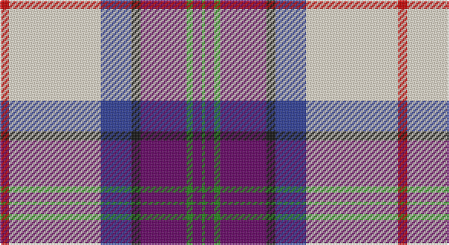

This page is one **sett** — a single exact thread-count. It belongs to the [tartan](/setts/r3w30db10k3dp15g2dp3g1/)
(the same proportion at any scale), whose colour order is pattern [GBGBKBWR](/stripes/gbgbkbwr/).

Sourced from tartans-authority.  It is a [8 stripe tartan](/stripes/stripes8/).

Original link http://www.tartansauthority.com/tartan-ferret/display/7833/

## Also known as

This cloth is also recorded under:

- S.O.B.H.D.

2 attestations — the source records this cloth was collapsed from (oldest owns this page)

<ul>
<li>pre 2008 — S.O.B.H.D. (Corporate) (tartans-authority, <a href="http://www.tartansauthority.com/tartan-ferret/display/7833/">record</a>)</li>
<li>undated — SOBHD (register-of-tartans, <a href="https://www.tartanregister.gov.uk/tartanDetails.aspx?ref=5786">record</a>)</li>
</ul>

## Register references

External register numbers recorded for this tartan.

- Scottish Register of Tartans: [5786](https://www.tartanregister.gov.uk/tartanDetails.aspx?ref=5786)
- Scottish Tartans Authority (ITI): 7833

## Thread count
R/6 W60 B20 K6 P30 G4 P6 G/2

One full sett is **260 threads**.

## Palette

Palette: <strong>Tartan Register</strong> <small style="color:#888">(2 of 6 colours)</small>
<table><thead><tr><th>Colour</th><th>Threads</th><th>Shade</th><th>Base</th><th>OKLCh</th></tr></thead><tbody><tr><td>R/</td><td style="text-align:right;font-variant-numeric:tabular-nums">6</td><td><code style="background-color:#C80000;">#C80000</code> <small style="color:#888">#C80000</small></td><td>R <code style="background-color:#CC0000;">#CC0000</code></td><td><small style="color:#888">oklch(52.3% 0.215 29.2)</small></td></tr><tr><td>W</td><td style="text-align:right;font-variant-numeric:tabular-nums">60</td><td><code style="background-color:#F0E4CC;">#F0E4CC</code> <small style="color:#888">#F0E4CC</small></td><td>W <code style="background-color:#F7F7F7;">#F7F7F7</code></td><td><small style="color:#888">oklch(92.2% 0.034 84.6)</small></td></tr><tr><td>B</td><td style="text-align:right;font-variant-numeric:tabular-nums">20</td><td><code style="background-color:#2C3C98;">#2C3C98</code> <small style="color:#888">#2C3C98</small></td><td>B <code style="background-color:#2A418A;">#2A418A</code></td><td><small style="color:#888">oklch(40.2% 0.151 270.5)</small></td></tr><tr><td>K</td><td style="text-align:right;font-variant-numeric:tabular-nums">6</td><td><code style="background-color:#101010;">#101010</code> <small style="color:#888">#101010</small></td><td>K <code style="background-color:#000000;">#000000</code></td><td><small style="color:#888">oklch(17.3% 0.000 89.9)</small></td></tr><tr><td>P</td><td style="text-align:right;font-variant-numeric:tabular-nums">30</td><td><code style="background-color:#640064;">#640064</code> <small style="color:#888">#640064</small></td><td>B <code style="background-color:#2A418A;">#2A418A</code></td><td><small style="color:#888">oklch(35.3% 0.162 328.4)</small></td></tr><tr><td>G</td><td style="text-align:right;font-variant-numeric:tabular-nums">4</td><td><code style="background-color:#208414;">#208414</code> <small style="color:#888">#208414</small></td><td>G <code style="background-color:#006100;">#006100</code></td><td><small style="color:#888">oklch(53.7% 0.169 141.7)</small></td></tr><tr><td>P</td><td style="text-align:right;font-variant-numeric:tabular-nums">6</td><td><code style="background-color:#640064;">#640064</code> <small style="color:#888">#640064</small></td><td>B <code style="background-color:#2A418A;">#2A418A</code></td><td><small style="color:#888">oklch(35.3% 0.162 328.4)</small></td></tr><tr><td>G/</td><td style="text-align:right;font-variant-numeric:tabular-nums">2</td><td><code style="background-color:#208414;">#208414</code> <small style="color:#888">#208414</small></td><td>G <code style="background-color:#006100;">#006100</code></td><td><small style="color:#888">oklch(53.7% 0.169 141.7)</small></td></tr></tbody></table>

# Sample pattern

## Nearest tartans

The nearest existing variants by ΔTartan distance, with this tartan at the top so the swatches line up against it.

ΔTartan

Tartan

Sett

—

<a href="/ttd/edit/#slug=r3w30db10k3dp15g2dp3g1~x2">S.O.B.H.D. (Corporate)</a> <a class="nn-out" href="/variants/s8/r3w30db10k3dp15g2dp3g1~x2/" title="open its dictionary page">↗</a>

1.05

<a href="/ttd/edit/#slug=w37k4db12g12w2lr2r23w4r6~x2&amp;base=r3w30db10k3dp15g2dp3g1~x2">Hebridean Arisaid, Red/White (Dance)</a> <a class="nn-out" href="/variants/s9/w37k4db12g12w2lr2r23w4r6~x2/" title="open its dictionary page">↗</a>

1.17

<a href="/ttd/edit/#slug=w18k1db4g4dp10lo2~x4&amp;base=r3w30db10k3dp15g2dp3g1~x2">Edgar-Feyen (Personal)</a> <a class="nn-out" href="/variants/s6/w18k1db4g4dp10lo2~x4/" title="open its dictionary page">↗</a>

1.20

<a href="/ttd/edit/#slug=w50k1dp14g14w2dp2w2k4ly2db30~x2&amp;base=r3w30db10k3dp15g2dp3g1~x2">MacBeth Dress (Dance)</a> <a class="nn-out" href="/variants/s10/w50k1dp14g14w2dp2w2k4ly2db30~x2/" title="open its dictionary page">↗</a>

1.22

<a href="/ttd/edit/#slug=g9mi2m2k3m18mi1db2g2db19w33db2~x2&amp;base=r3w30db10k3dp15g2dp3g1~x2">Pride of Scotland Dress (Dance)</a> <a class="nn-out" href="/variants/s11/g9mi2m2k3m18mi1db2g2db19w33db2~x2/" title="open its dictionary page">↗</a>

1.28

<a href="/ttd/edit/#slug=w2b27k1g3k1n10k1r24w2~x2&amp;base=r3w30db10k3dp15g2dp3g1~x2">Scotland's Charity Air Ambulance</a> <a class="nn-out" href="/variants/s9/w2b27k1g3k1n10k1r24w2~x2/" title="open its dictionary page">↗</a>

1.34

<a href="/ttd/edit/#slug=w4k2w30g3p3g3p7db14g3r3~x2&amp;base=r3w30db10k3dp15g2dp3g1~x2">Edinburgh, dress</a> <a class="nn-out" href="/variants/s10/w4k2w30g3p3g3p7db14g3r3~x2/" title="open its dictionary page">↗</a>

1.34

<a href="/ttd/edit/#slug=ly2r1t16k5p2w11p1~x4&amp;base=r3w30db10k3dp15g2dp3g1~x2">Dignan</a> <a class="nn-out" href="/variants/s7/ly2r1t16k5p2w11p1~x4/" title="open its dictionary page">↗</a>

1.35

<a href="/ttd/edit/#slug=w4k2w30g3dp3g3dp7db14g3r3~x2&amp;base=r3w30db10k3dp15g2dp3g1~x2">Edinburgh Dress (Dance)</a> <a class="nn-out" href="/variants/s10/w4k2w30g3dp3g3dp7db14g3r3~x2/" title="open its dictionary page">↗</a>

1.38

<a href="/ttd/edit/#slug=m50ly4w16db2w4db2w15g27r4~x2&amp;base=r3w30db10k3dp15g2dp3g1~x2">Rosevear</a> <a class="nn-out" href="/variants/s9/m50ly4w16db2w4db2w15g27r4~x2/" title="open its dictionary page">↗</a>

1.38

<a href="/ttd/edit/#slug=db4w8db8w10k16lg4r38ly1&amp;base=r3w30db10k3dp15g2dp3g1~x2">Edinburgh Napier University</a> <a class="nn-out" href="/variants/s8/db4w8db8w10k16lg4r38ly1/" title="open its dictionary page">↗</a>

## Neighbour map

Every grey dot is one of 14360 variants placed by the first two principal components of the ΔTartan feature space (44% of its variance). Red is this tartan; blue dots are its nearest — click one to open its page.

<svg viewBox="0 0 640 380" role="img" style="max-width:100%;height:auto;border:1px solid #e0e0e0;border-radius:4px;display:block" xmlns="http://www.w3.org/2000/svg"><image href="/nn/cloud.v1.png" width="640" height="380"/><a href="/variants/s9/w37k4db12g12w2lr2r23w4r6~x2/"><circle cx="164.6" cy="98.4" r="4" fill="#3465a4"><title>Hebridean Arisaid, Red/White (Dance)</title></circle></a><a href="/variants/s6/w18k1db4g4dp10lo2~x4/"><circle cx="183.6" cy="121.3" r="4" fill="#3465a4"><title>Edgar-Feyen (Personal)</title></circle></a><a href="/variants/s10/w50k1dp14g14w2dp2w2k4ly2db30~x2/"><circle cx="221.0" cy="43.6" r="4" fill="#3465a4"><title>MacBeth Dress (Dance)</title></circle></a><a href="/variants/s11/g9mi2m2k3m18mi1db2g2db19w33db2~x2/"><circle cx="162.6" cy="59.8" r="4" fill="#3465a4"><title>Pride of Scotland Dress (Dance)</title></circle></a><a href="/variants/s9/w2b27k1g3k1n10k1r24w2~x2/"><circle cx="204.2" cy="76.5" r="4" fill="#3465a4"><title>Scotland's Charity Air Ambulance</title></circle></a><a href="/variants/s10/w4k2w30g3p3g3p7db14g3r3~x2/"><circle cx="181.6" cy="90.6" r="4" fill="#3465a4"><title>Edinburgh, dress</title></circle></a><a href="/variants/s7/ly2r1t16k5p2w11p1~x4/"><circle cx="159.1" cy="116.6" r="4" fill="#3465a4"><title>Dignan</title></circle></a><a href="/variants/s10/w4k2w30g3dp3g3dp7db14g3r3~x2/"><circle cx="172.7" cy="84.6" r="4" fill="#3465a4"><title>Edinburgh Dress (Dance)</title></circle></a><a href="/variants/s9/m50ly4w16db2w4db2w15g27r4~x2/"><circle cx="191.4" cy="85.8" r="4" fill="#3465a4"><title>Rosevear</title></circle></a><a href="/variants/s8/db4w8db8w10k16lg4r38ly1/"><circle cx="189.5" cy="70.3" r="4" fill="#3465a4"><title>Edinburgh Napier University</title></circle></a><circle cx="203.3" cy="74.8" r="5" fill="#c00000"/></svg>

ID: /variants/s8/r3w30db10k3dp15g2dp3g1~x2/
