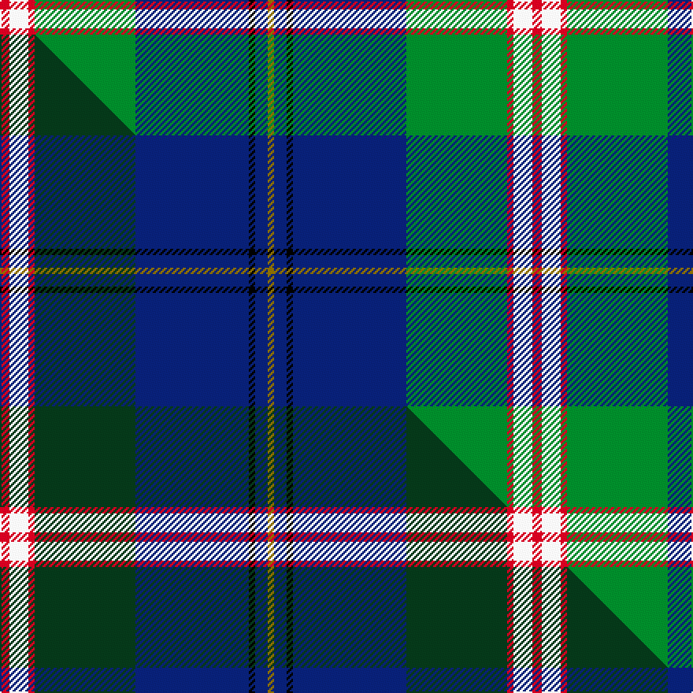

This is one **variant** — a specific cloth: this exact thread count and colourway, with its own
provenance below. It is one weaving of the [sett](/tartans/c/ca/canadian-centennial/) (the scale-free proportion — the
same cloth at any scale or shade), whose colour order is pattern [GBKBGRWR](/stripes/gbkbgrwr/).

Part of the [Canadian Centennial](/tartans/c/ca/canadian-centennial/) tartan — the named design grouping this sett with its other cloths.

Sourced from house-of-tartan.  It is a [8 stripe tartan](/stripes/stripes8/).

Original link [http://www.house-of-tartan.scotland.net/house/TartanViewjs.asp?colr=Def&tnam=1704](http://www.house-of-tartan.scotland.net/house/TartanViewjs.asp?colr=Def&tnam=1704)

## Provenance

Earliest known date: 1966 This tartan was approved by the Centennial Commission. The six colours represent the wealth of Canada in her people and her natural resources.

2 attestations — the source records this cloth was collapsed from (oldest owns this page)

<ul>
<li>1966 — Canadian Centennial District Tartan (house-of-tartan, <a href="http://www.house-of-tartan.scotland.net/house/TartanViewjs.asp?colr=Def&tnam=1704">record</a>) </li>
<li>undated — Canadian Centennial (weddslist, <a href="http://www.weddslist.com/cgi-bin/tartans/pg.pl?source=sts">record</a>) </li>
</ul>

Dataset <small>— provenance for this record, inherited from the source manifest</small>

<dl class="dataset-prov">
<dt>source</dt><dd><a href="/sources/house-of-tartan/">House of Tartan</a></dd>
<dt>data captured from</dt><dd><a href="https://github.com/thetartan/tartan-database/blob/master/data/house-of-tartan/data.csv">https://github.com/thetartan/tartan-database/blob/master/data/house-of-tartan/data.csv</a></dd>
<dt>data date</dt><dd>1966 <small>(this record)</small></dd>
<dt>licence</dt><dd><a href="https://creativecommons.org/licenses/by-nc-nd/4.0/">CC BY-NC-ND 4.0</a></dd>
</dl>

Capture chain <small>— the hands this data passed through, oldest first; each capture carries its own licence</small>

<ol class="capture-chain">
<li><a href="http://www.house-of-tartan.scotland.net/">House of Tartan</a> <small>the weaver/retailer's database — the site is now offline; the URL is kept as the ultimate source's identity</small></li>
<li><a href="https://github.com/thetartan/tartan-database">thetartan/tartan-database</a> <small>2016-2017</small> · <a href="https://creativecommons.org/licenses/by-nc-nd/4.0/">CC BY-NC-ND 4.0</a> <small>Levko Kravets's frozen compilation — the capture we vendored, and where its CC licence text came from</small></li>
<li>this dictionary <small>captured 2026-06-10 · commit 5bf86c7566</small> <small>each re-capture is a git commit to data/sources</small></li>
</ol>

## Thread count
R/6 W12 R4 G64 DB72 K4 DB8 Y/4

One full sett is **338 threads**.

## Palette
<table><thead><tr><th>Colour</th><th>Shade</th><th>OKLCh</th></tr></thead><tbody><tr><td>DB</td><td><code style="background-color:#082077;">#082077</code> <small style="color:#888">#082077</small></td><td><small style="color:#888">oklch(30.0% 0.149 265.1)</small></td></tr><tr><td>G</td><td><code style="background-color:#008B2A;">#008B2A</code> <small style="color:#888">#008B2A</small></td><td><small style="color:#888">oklch(55.4% 0.170 145.9)</small></td></tr><tr><td>K</td><td><code style="background-color:#000000;">#000000</code> <small style="color:#888">#000000</small></td><td><small style="color:#888">oklch(0.0% 0.000 0.0)</small></td></tr><tr><td>W</td><td><code style="background-color:#F7F7F7;">#F7F7F7</code> <small style="color:#888">#F7F7F7</small></td><td><small style="color:#888">oklch(97.6% 0.000 89.9)</small></td></tr><tr><td>R</td><td><code style="background-color:#D60020;">#D60020</code> <small style="color:#888">#D60020</small></td><td><small style="color:#888">oklch(55.2% 0.224 25.5)</small></td></tr><tr><td>Y</td><td><code style="background-color:#8B6E00;">#8B6E00</code> <small style="color:#888">#8B6E00</small></td><td><small style="color:#888">oklch(55.1% 0.113 90.4)</small></td></tr></tbody></table>

# Sample pattern

[Sample sheet (PDF)](swatch.pdf) — the woven sample, thread count and palette on one printable A4, rendered on demand (the same sheet the TTD print page downloads).

## Compared to the master

This cloth is one sett of its design; the master sett (the exemplar the design is anchored on) is below for comparison.

Its **ΔTartan distance** from the master is **0.16** — the same measure the nearest-tartans table ranks by (0 is identical; a re-scale of the same cloth is near 0, a recolour or a different proportion further).

<figure class="master-compare" style="margin:0">

this sett
master sett ★

<figcaption style="color:#888;font-size:smaller">One weave of this sett against the <a href="/setts/r3w6r2dg32db36k2db4y2/">master sett ★</a>, split on the diagonal: a shared proportion runs seamlessly across it with only the shades shifting; a different proportion breaks on it.</figcaption>
</figure>

## Nearest tartan variants

The nearest existing variants by ΔTartan distance, with this cloth at the top so the swatches line up against it.

ΔTartan

Threads

Variant

Sett

—

338

<a href="/variants/s8/r3w6r2g32db36k2db4y2~x2/">Canadian Centennial District Tartan</a>

<a href="/ttd/edit/#slug=r3w6r2dg32db36k2db4y2~x2&amp;base=r3w6r2g32db36k2db4y2~x2" title="compare in the TTD">0.16</a>

338

<a href="/variants/s8/r3w6r2dg32db36k2db4y2~x2/">Canadian Centennial</a>

<a href="/ttd/edit/#slug=r3w6r2dg32db36k2db4lo2~x2&amp;base=r3w6r2g32db36k2db4y2~x2" title="compare in the TTD">0.41</a>

338

<a href="/variants/s8/r3w6r2dg32db36k2db4lo2~x2/">Canadian Centennial (Commemorative)</a>

<a href="/ttd/edit/#slug=dp6r2dp1g25db16k2db4~x2~dp2712327&amp;base=r3w6r2g32db36k2db4y2~x2" title="compare in the TTD">1.46</a>

204

<a href="/variants/s7/dp6r2dp1g25db16k2db4~x2~dp2712327/">Laurie Clan Tartan</a>

<a href="/ttd/edit/#slug=k3g36db28r2db2y3~x2&amp;base=r3w6r2g32db36k2db4y2~x2" title="compare in the TTD">1.65</a>

284

<a href="/variants/s6/k3g36db28r2db2y3~x2/">Carmichael Family Tartan</a>

<a href="/ttd/edit/#slug=dp6y2dp1g25db16k2db4~x2~dp2712327&amp;base=r3w6r2g32db36k2db4y2~x2" title="compare in the TTD">1.76</a>

204

<a href="/variants/s7/dp6y2dp1g25db16k2db4~x2~dp2712327/">Lowry Clan Tartan</a>

<a href="/ttd/edit/#slug=dp6dy2dp1g25db16k2db4~x2~dp2712327&amp;base=r3w6r2g32db36k2db4y2~x2" title="compare in the TTD">1.76</a>

204

<a href="/variants/s7/dp6dy2dp1g25db16k2db4~x2~dp2712327/">Lawrie Clan Tartan</a>

<a href="/ttd/edit/#slug=db11k6g25r1ly2y1db25k5ly7~x2&amp;base=r3w6r2g32db36k2db4y2~x2" title="compare in the TTD">1.79</a>

296

<a href="/variants/s9/db11k6g25r1ly2y1db25k5ly7~x2/">Army Ranger</a>

<a href="/ttd/edit/#slug=w1dp3g6k1db12ly1db2ly1~x4&amp;base=r3w6r2g32db36k2db4y2~x2" title="compare in the TTD">1.98</a>

208

<a href="/variants/s8/w1dp3g6k1db12ly1db2ly1~x4/">Lambert, Patrice (Personal)</a>

<a href="/ttd/edit/#slug=y1db2y1db12k1g6dp3w1~x4&amp;base=r3w6r2g32db36k2db4y2~x2" title="compare in the TTD">1.98</a>

208

<a href="/variants/s8/y1db2y1db12k1g6dp3w1~x4/">Lambert, Patrice (Personal)</a>

<a href="/ttd/edit/#slug=g45w2r3k15r3db15r3db15~x2&amp;base=r3w6r2g32db36k2db4y2~x2" title="compare in the TTD">1.99</a>

284

<a href="/variants/s8/g45w2r3k15r3db15r3db15~x2/">MacNeil 3</a>

## Neighbour map

Every grey dot is one of 13662 variants placed by the first two principal components of the ΔTartan feature space (42% of its variance). Red is this tartan; blue dots are its nearest — click one to open its page. The map is a flat projection of a many-dimensional space — [how to read it](/posts/neighbourhood-maps/).

<svg viewBox="0 0 640 380" role="img" style="max-width:100%;height:auto;border:1px solid #e0e0e0;border-radius:4px;display:block" xmlns="http://www.w3.org/2000/svg"><image href="/nn/cloud.v1.png" width="640" height="380"/><a href="/variants/s8/r3w6r2dg32db36k2db4y2~x2/"><circle cx="241.5" cy="118.6" r="4" fill="#3465a4"><title>Canadian Centennial</title></circle></a><a href="/variants/s8/r3w6r2dg32db36k2db4lo2~x2/"><circle cx="236.1" cy="116.5" r="4" fill="#3465a4"><title>Canadian Centennial (Commemorative)</title></circle></a><a href="/variants/s7/dp6r2dp1g25db16k2db4~x2~dp2712327/"><circle cx="251.5" cy="139.5" r="4" fill="#3465a4"><title>Laurie Clan Tartan</title></circle></a><a href="/variants/s6/k3g36db28r2db2y3~x2/"><circle cx="278.3" cy="150.4" r="4" fill="#3465a4"><title>Carmichael Family Tartan</title></circle></a><a href="/variants/s7/dp6y2dp1g25db16k2db4~x2~dp2712327/"><circle cx="255.1" cy="141.7" r="4" fill="#3465a4"><title>Lowry Clan Tartan</title></circle></a><a href="/variants/s7/dp6dy2dp1g25db16k2db4~x2~dp2712327/"><circle cx="256.5" cy="142.0" r="4" fill="#3465a4"><title>Lawrie Clan Tartan</title></circle></a><a href="/variants/s9/db11k6g25r1ly2y1db25k5ly7~x2/"><circle cx="176.8" cy="110.6" r="4" fill="#3465a4"><title>Army Ranger</title></circle></a><a href="/variants/s8/w1dp3g6k1db12ly1db2ly1~x4/"><circle cx="211.7" cy="135.1" r="4" fill="#3465a4"><title>Lambert, Patrice (Personal)</title></circle></a><a href="/variants/s8/y1db2y1db12k1g6dp3w1~x4/"><circle cx="226.4" cy="139.8" r="4" fill="#3465a4"><title>Lambert, Patrice (Personal)</title></circle></a><a href="/variants/s8/g45w2r3k15r3db15r3db15~x2/"><circle cx="203.1" cy="123.7" r="4" fill="#3465a4"><title>MacNeil 3</title></circle></a><circle cx="218.6" cy="114.4" r="5" fill="#c00000"/><text x="320" y="376" text-anchor="middle" font-size="11" fill="#999">ground</text><text x="11" y="190" text-anchor="middle" font-size="11" fill="#999" transform="rotate(-90 11 190)">complexity</text></svg>

ID: /variants/s8/r3w6r2g32db36k2db4y2~x2/
