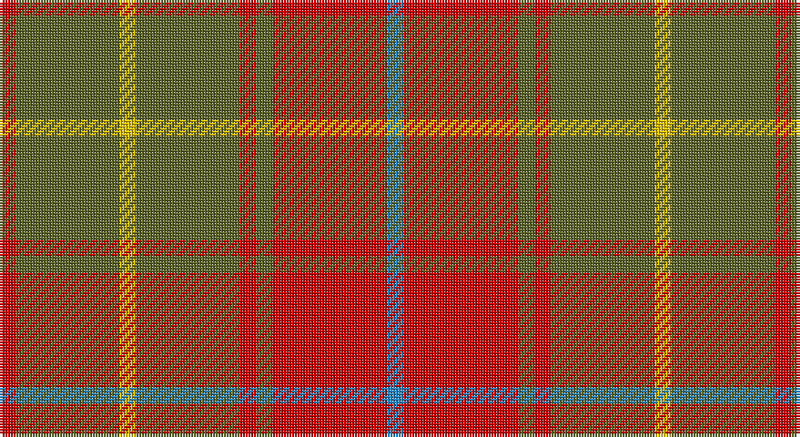

This page is one **sett** — a single exact thread-count. It belongs to the [tartan](/setts/r3y19ly3y19r3y3r21t3/)
(the same proportion at any scale), whose colour order is pattern [BRGRGYGR](/stripes/brgrgygr/).

Part of the [Burnett of Powis](/tartans/burnett-of-powis/) tartan — the named design grouping this sett with its other cloths.

Sourced from tartans-authority.  It is a [8 stripe tartan](/stripes/stripes8/).

Original link http://www.tartansauthority.com/tartan-ferret/display/3951/

## Register references

External register numbers recorded for this tartan.

- Scottish Tartans Authority (ITI): 3951

## Thread count
R/6 G38 Y6 G38 R6 G6 R42 B/6

One full sett is **284 threads**.

## Palette

Palette: <strong>Tartan Register</strong>
<table><thead><tr><th>Colour</th><th>Threads</th><th>Shade</th><th>Base</th><th>OKLCh</th></tr></thead><tbody><tr><td>R/</td><td style="text-align:right;font-variant-numeric:tabular-nums">6</td><td><code style="background-color:#C80000;">#C80000</code> <small style="color:#888">#C80000</small></td><td>R <code style="background-color:#CC0000;">#CC0000</code></td><td><small style="color:#888">oklch(52.3% 0.215 29.2)</small></td></tr><tr><td>G</td><td style="text-align:right;font-variant-numeric:tabular-nums">38</td><td><code style="background-color:#5C6428;">#5C6428</code> <small style="color:#888">#5C6428</small></td><td>G <code style="background-color:#006100;">#006100</code></td><td><small style="color:#888">oklch(48.3% 0.084 116.0)</small></td></tr><tr><td>Y</td><td style="text-align:right;font-variant-numeric:tabular-nums">6</td><td><code style="background-color:#E8C000;">#E8C000</code> <small style="color:#888">#E8C000</small></td><td>Y <code style="background-color:#F2BF00;">#F2BF00</code></td><td><small style="color:#888">oklch(81.9% 0.168 93.7)</small></td></tr><tr><td>G</td><td style="text-align:right;font-variant-numeric:tabular-nums">38</td><td><code style="background-color:#5C6428;">#5C6428</code> <small style="color:#888">#5C6428</small></td><td>G <code style="background-color:#006100;">#006100</code></td><td><small style="color:#888">oklch(48.3% 0.084 116.0)</small></td></tr><tr><td>R</td><td style="text-align:right;font-variant-numeric:tabular-nums">6</td><td><code style="background-color:#C80000;">#C80000</code> <small style="color:#888">#C80000</small></td><td>R <code style="background-color:#CC0000;">#CC0000</code></td><td><small style="color:#888">oklch(52.3% 0.215 29.2)</small></td></tr><tr><td>G</td><td style="text-align:right;font-variant-numeric:tabular-nums">6</td><td><code style="background-color:#5C6428;">#5C6428</code> <small style="color:#888">#5C6428</small></td><td>G <code style="background-color:#006100;">#006100</code></td><td><small style="color:#888">oklch(48.3% 0.084 116.0)</small></td></tr><tr><td>R</td><td style="text-align:right;font-variant-numeric:tabular-nums">42</td><td><code style="background-color:#C80000;">#C80000</code> <small style="color:#888">#C80000</small></td><td>R <code style="background-color:#CC0000;">#CC0000</code></td><td><small style="color:#888">oklch(52.3% 0.215 29.2)</small></td></tr><tr><td>B/</td><td style="text-align:right;font-variant-numeric:tabular-nums">6</td><td><code style="background-color:#2888C4;">#2888C4</code> <small style="color:#888">#2888C4</small></td><td>B <code style="background-color:#2A418A;">#2A418A</code></td><td><small style="color:#888">oklch(60.1% 0.125 241.5)</small></td></tr></tbody></table>

# Sample pattern

## Compared to the master

This cloth is one sett of its design; the master sett (the exemplar the design is anchored on) is below for comparison.

<figure style="margin:0"><figcaption style="color:#888;font-size:smaller">this sett</figcaption></figure>
<figure style="margin:0"><figcaption style="color:#888;font-size:smaller"><a href="/setts/y19ly3y19r3y19ly3y19r3y3r21t3r21y3r3/">master sett →</a></figcaption></figure>

## Nearest tartans

The nearest existing variants by ΔTartan distance, with this tartan at the top so the swatches line up against it.

ΔTartan

Tartan

Sett

—

<a href="/ttd/edit/#slug=r3y19ly3y19r3y3r21t3~x2">Burnett of Powis (Personal)</a> <a class="nn-out" href="/variants/s8/r3y19ly3y19r3y3r21t3~x2/" title="open its dictionary page">↗</a>

1.03

<a href="/ttd/edit/#slug=dt5r19dti2y8r3y18dti2y9dti2~x2&amp;base=r3y19ly3y19r3y3r21t3~x2">Hubbard (2016)</a> <a class="nn-out" href="/variants/s9/dt5r19dti2y8r3y18dti2y9dti2~x2/" title="open its dictionary page">↗</a>

1.18

<a href="/ttd/edit/#slug=r3lo8r3lo20dy20lo3dy8lo3~x2&amp;base=r3y19ly3y19r3y3r21t3~x2">Miyuki #4</a> <a class="nn-out" href="/variants/s8/r3lo8r3lo20dy20lo3dy8lo3~x2/" title="open its dictionary page">↗</a>

1.19

<a href="/ttd/edit/#slug=y19ly3y19r3y19ly3y19r3y3r21t3r21y3r3~x2&amp;base=r3y19ly3y19r3y3r21t3~x2">Burnett of Powis (Modern) (Personal)</a> <a class="nn-out" href="/variants/s14/y19ly3y19r3y19ly3y19r3y3r21t3r21y3r3~x2/" title="open its dictionary page">↗</a>

1.32

<a href="/ttd/edit/#slug=r4g14ly3g14r4g3r29y4~x2&amp;base=r3y19ly3y19r3y3r21t3~x2">Burnett</a> <a class="nn-out" href="/variants/s8/r4g14ly3g14r4g3r29y4~x2/" title="open its dictionary page">↗</a>

1.35

<a href="/ttd/edit/#slug=lr1r8dg2r2dg6r1dg6r2dg2r8ly1~x2&amp;base=r3y19ly3y19r3y3r21t3~x2">Bruce</a> <a class="nn-out" href="/variants/s11/lr1r8dg2r2dg6r1dg6r2dg2r8ly1~x2/" title="open its dictionary page">↗</a>

1.36

<a href="/ttd/edit/#slug=dg4r2dg13lb2r13dg2r4~x2&amp;base=r3y19ly3y19r3y3r21t3~x2">Crossnor School</a> <a class="nn-out" href="/variants/s7/dg4r2dg13lb2r13dg2r4~x2/" title="open its dictionary page">↗</a>

1.41

<a href="/ttd/edit/#slug=r12n2lr1n2r3dg8r3n1~x2&amp;base=r3y19ly3y19r3y3r21t3~x2">Chisholm</a> <a class="nn-out" href="/variants/s8/r12n2lr1n2r3dg8r3n1~x2/" title="open its dictionary page">↗</a>

1.41

<a href="/ttd/edit/#slug=r12n2lr1n2r3dg8r3n1&amp;base=r3y19ly3y19r3y3r21t3~x2">Chisholm</a> <a class="nn-out" href="/variants/s8/r12n2lr1n2r3dg8r3n1/" title="open its dictionary page">↗</a>

1.41

<a href="/ttd/edit/#slug=o24dr2o3oi6o3dr2dg15o20dr4~x2&amp;base=r3y19ly3y19r3y3r21t3~x2">Land's End (Unnamed Camel)</a> <a class="nn-out" href="/variants/s9/o24dr2o3oi6o3dr2dg15o20dr4~x2/" title="open its dictionary page">↗</a>

1.44

<a href="/ttd/edit/#slug=dg1ri8dg8r1dg8ri8lb1~x2&amp;base=r3y19ly3y19r3y3r21t3~x2">MacKinnon Hunting</a> <a class="nn-out" href="/variants/s7/dg1ri8dg8r1dg8ri8lb1~x2/" title="open its dictionary page">↗</a>

## Neighbour map

Every grey dot is one of 14360 variants placed by the first two principal components of the ΔTartan feature space (44% of its variance). Red is this tartan; blue dots are its nearest — click one to open its page.

<svg viewBox="0 0 640 380" role="img" style="max-width:100%;height:auto;border:1px solid #e0e0e0;border-radius:4px;display:block" xmlns="http://www.w3.org/2000/svg"><image href="/nn/cloud.v1.png" width="640" height="380"/><a href="/variants/s9/dt5r19dti2y8r3y18dti2y9dti2~x2/"><circle cx="316.8" cy="213.0" r="4" fill="#3465a4"><title>Hubbard (2016)</title></circle></a><a href="/variants/s8/r3lo8r3lo20dy20lo3dy8lo3~x2/"><circle cx="350.3" cy="256.4" r="4" fill="#3465a4"><title>Miyuki #4</title></circle></a><a href="/variants/s14/y19ly3y19r3y19ly3y19r3y3r21t3r21y3r3~x2/"><circle cx="353.8" cy="209.8" r="4" fill="#3465a4"><title>Burnett of Powis (Modern) (Personal)</title></circle></a><a href="/variants/s8/r4g14ly3g14r4g3r29y4~x2/"><circle cx="307.7" cy="194.5" r="4" fill="#3465a4"><title>Burnett</title></circle></a><a href="/variants/s11/lr1r8dg2r2dg6r1dg6r2dg2r8ly1~x2/"><circle cx="326.6" cy="211.7" r="4" fill="#3465a4"><title>Bruce</title></circle></a><a href="/variants/s7/dg4r2dg13lb2r13dg2r4~x2/"><circle cx="326.5" cy="251.0" r="4" fill="#3465a4"><title>Crossnor School</title></circle></a><a href="/variants/s8/r12n2lr1n2r3dg8r3n1~x2/"><circle cx="376.4" cy="207.5" r="4" fill="#3465a4"><title>Chisholm</title></circle></a><a href="/variants/s8/r12n2lr1n2r3dg8r3n1/"><circle cx="376.4" cy="207.5" r="4" fill="#3465a4"><title>Chisholm</title></circle></a><a href="/variants/s9/o24dr2o3oi6o3dr2dg15o20dr4~x2/"><circle cx="409.7" cy="212.7" r="4" fill="#3465a4"><title>Land's End (Unnamed Camel)</title></circle></a><a href="/variants/s7/dg1ri8dg8r1dg8ri8lb1~x2/"><circle cx="303.1" cy="241.2" r="4" fill="#3465a4"><title>MacKinnon Hunting</title></circle></a><circle cx="351.4" cy="226.0" r="5" fill="#c00000"/></svg>

ID: /variants/s8/r3y19ly3y19r3y3r21t3~x2/
