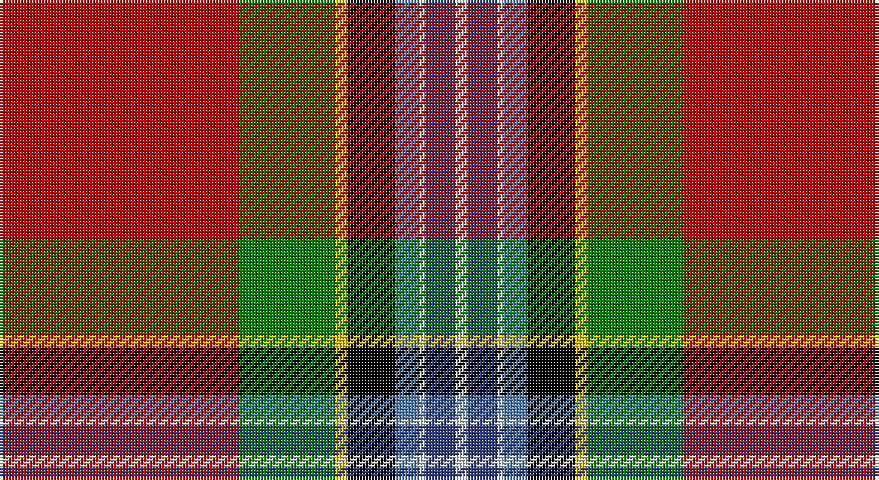

This page is one **sett** — a single exact thread-count. It belongs to the [tartan](/setts/r40g16ly2k8t4w1db5w2/)
(the same proportion at any scale), whose colour order is pattern [RGYKBWBW](/stripes/rgykbwbw/).

Part of the [Ancient Caledonian Society](/tartans/ancient-caledonian-society/) tartan — the named design grouping this sett with its other cloths.

Sourced from weddslist.  It is a [8 stripe tartan](/stripes/stripes8/).

Original link http://www.weddslist.com/cgi-bin/tartans/pg.pl?source=sts

## Provenance

Earliest known date: 1847 Coat at Banff museum. The MacPherson of MacPherson's Rant was hanged at Banff market cross.

## Also known as

This cloth is also recorded under:

- Caledonian Soc., Ancient
- Caledonian Society Ancient Artifact
- Caledonian Society, Ancient

2 attestations — the source records this cloth was collapsed from (oldest owns this page)

<ul>
<li>undated — Caledonian Society, Ancient (weddslist, <a href="http://www.weddslist.com/cgi-bin/tartans/pg.pl?source=sts">record</a>)</li>
<li>undated — Caledonian Society Ancient Artifact Tartan (house-of-tartan, <a href="http://www.house-of-tartan.scotland.net/house/TartanViewjs.asp?colr=Def&tnam=1554">record</a>)</li>
</ul>

## Thread count
R/80 G32 Y4 K16 Ba8 LN2 B10 LN/4

One full sett is **228 threads**.

## Palette

Palette: <strong>Tartan Register</strong> <small style="color:#888">(2 of 7 colours)</small>
<table><thead><tr><th>Colour</th><th>Threads</th><th>Shade</th><th>Base</th><th>OKLCh</th></tr></thead><tbody><tr><td>R/</td><td style="text-align:right;font-variant-numeric:tabular-nums">80</td><td><code style="background-color:#C00000;">#C00000</code> <small style="color:#888">#C00000</small></td><td>R <code style="background-color:#CC0000;">#CC0000</code></td><td><small style="color:#888">oklch(50.7% 0.208 29.2)</small></td></tr><tr><td>G</td><td style="text-align:right;font-variant-numeric:tabular-nums">32</td><td><code style="background-color:#008000;">#008000</code> <small style="color:#888">#008000</small></td><td>G <code style="background-color:#006100;">#006100</code></td><td><small style="color:#888">oklch(52.0% 0.177 142.5)</small></td></tr><tr><td>Y</td><td style="text-align:right;font-variant-numeric:tabular-nums">4</td><td><code style="background-color:#F0C000;">#F0C000</code> <small style="color:#888">#F0C000</small></td><td>Y <code style="background-color:#F2BF00;">#F2BF00</code></td><td><small style="color:#888">oklch(82.7% 0.169 90.5)</small></td></tr><tr><td>K</td><td style="text-align:right;font-variant-numeric:tabular-nums">16</td><td><code style="background-color:#000000;">#000000</code> <small style="color:#888">#000000</small></td><td>K <code style="background-color:#000000;">#000000</code></td><td><small style="color:#888">oklch(0.0% 0.000 0.0)</small></td></tr><tr><td>Ba</td><td style="text-align:right;font-variant-numeric:tabular-nums">8</td><td><code style="background-color:#5480B0;">#5480B0</code> <small style="color:#888">#5480B0</small></td><td>B <code style="background-color:#2A418A;">#2A418A</code></td><td><small style="color:#888">oklch(58.8% 0.089 251.5)</small></td></tr><tr><td>LN</td><td style="text-align:right;font-variant-numeric:tabular-nums">2</td><td><code style="background-color:#E0E0E0;">#E0E0E0</code> <small style="color:#888">#E0E0E0</small></td><td>W <code style="background-color:#F7F7F7;">#F7F7F7</code></td><td><small style="color:#888">oklch(90.7% 0.000 89.9)</small></td></tr><tr><td>B</td><td style="text-align:right;font-variant-numeric:tabular-nums">10</td><td><code style="background-color:#304080;">#304080</code> <small style="color:#888">#304080</small></td><td>B <code style="background-color:#2A418A;">#2A418A</code></td><td><small style="color:#888">oklch(39.4% 0.109 270.2)</small></td></tr><tr><td>LN/</td><td style="text-align:right;font-variant-numeric:tabular-nums">4</td><td><code style="background-color:#E0E0E0;">#E0E0E0</code> <small style="color:#888">#E0E0E0</small></td><td>W <code style="background-color:#F7F7F7;">#F7F7F7</code></td><td><small style="color:#888">oklch(90.7% 0.000 89.9)</small></td></tr></tbody></table>

# Sample pattern

## Compared to the master

This cloth is one sett of its design; the master sett (the exemplar the design is anchored on) is below for comparison.

<figure style="margin:0"><figcaption style="color:#888;font-size:smaller">this sett</figcaption></figure>
<figure style="margin:0"><figcaption style="color:#888;font-size:smaller"><a href="/setts/r40g16ly2k8y4w1db5w2/">master sett →</a></figcaption></figure>

## Nearest tartans

The nearest existing variants by ΔTartan distance, with this tartan at the top so the swatches line up against it.

ΔTartan

Tartan

Sett

—

<a href="/ttd/edit/#slug=r40g16ly2k8t4w1db5w2~x2">Caledonian Society, Ancient</a> <a class="nn-out" href="/variants/s8/r40g16ly2k8t4w1db5w2~x2/" title="open its dictionary page">↗</a>

0.44

<a href="/ttd/edit/#slug=r40g16ly2k8y4w1db5w2~x2&amp;base=r40g16ly2k8t4w1db5w2~x2">Ancient Caledonian Society</a> <a class="nn-out" href="/variants/s8/r40g16ly2k8y4w1db5w2~x2/" title="open its dictionary page">↗</a>

1.19

<a href="/ttd/edit/#slug=w2r2db14g16ly2k2g2r35g1~x2&amp;base=r40g16ly2k8t4w1db5w2~x2">King (Austria) (Personal)</a> <a class="nn-out" href="/variants/s9/w2r2db14g16ly2k2g2r35g1~x2/" title="open its dictionary page">↗</a>

1.19

<a href="/ttd/edit/#slug=r48g16k8w3ly3r2o3w3db8k1r4ly4w3~x2&amp;base=r40g16ly2k8t4w1db5w2~x2">MacGill</a> <a class="nn-out" href="/variants/s13/r48g16k8w3ly3r2o3w3db8k1r4ly4w3~x2/" title="open its dictionary page">↗</a>

1.32

<a href="/ttd/edit/#slug=r26g5dg7ri2do9loi1lo1dg4~x2&amp;base=r40g16ly2k8t4w1db5w2~x2">Tartan Army Whisky</a> <a class="nn-out" href="/variants/s8/r26g5dg7ri2do9loi1lo1dg4~x2/" title="open its dictionary page">↗</a>

1.35

<a href="/ttd/edit/#slug=r64t12k16ly2k4w3dg32r8k4r3w2~x2&amp;base=r40g16ly2k8t4w1db5w2~x2">Royal Stewart</a> <a class="nn-out" href="/variants/s11/r64t12k16ly2k4w3dg32r8k4r3w2~x2/" title="open its dictionary page">↗</a>

1.40

<a href="/ttd/edit/#slug=r48t8k10ly2k3w2g25r10k3r3w2~x2&amp;base=r40g16ly2k8t4w1db5w2~x2">Followers' Plaid</a> <a class="nn-out" href="/variants/s11/r48t8k10ly2k3w2g25r10k3r3w2~x2/" title="open its dictionary page">↗</a>

1.43

<a href="/ttd/edit/#slug=db3r2db2r35lo2db3k2db5k4g13k1w3~x2&amp;base=r40g16ly2k8t4w1db5w2~x2">Celtic Nations (Fashion)</a> <a class="nn-out" href="/variants/s12/db3r2db2r35lo2db3k2db5k4g13k1w3~x2/" title="open its dictionary page">↗</a>

1.45

<a href="/ttd/edit/#slug=r26w1k8ly1dg13k1w4k1ly2k4t3r8~x4&amp;base=r40g16ly2k8t4w1db5w2~x2">Drummond Relic</a> <a class="nn-out" href="/variants/s12/r26w1k8ly1dg13k1w4k1ly2k4t3r8~x4/" title="open its dictionary page">↗</a>

1.45

<a href="/ttd/edit/#slug=t14k8ly2k3w4k3g21r48t4r5k3~x2&amp;base=r40g16ly2k8t4w1db5w2~x2">MacLean of Duart 2</a> <a class="nn-out" href="/variants/s11/t14k8ly2k3w4k3g21r48t4r5k3~x2/" title="open its dictionary page">↗</a>

1.46

<a href="/ttd/edit/#slug=y9t5k8ly2k4w4k4dg31r50t4r4k3~x2&amp;base=r40g16ly2k8t4w1db5w2~x2">MacLean of Duart</a> <a class="nn-out" href="/variants/s12/y9t5k8ly2k4w4k4dg31r50t4r4k3~x2/" title="open its dictionary page">↗</a>

## Neighbour map

Every grey dot is one of 14360 variants placed by the first two principal components of the ΔTartan feature space (44% of its variance). Red is this tartan; blue dots are its nearest — click one to open its page.

<svg viewBox="0 0 640 380" role="img" style="max-width:100%;height:auto;border:1px solid #e0e0e0;border-radius:4px;display:block" xmlns="http://www.w3.org/2000/svg"><image href="/nn/cloud.v1.png" width="640" height="380"/><a href="/variants/s8/r40g16ly2k8y4w1db5w2~x2/"><circle cx="274.4" cy="56.7" r="4" fill="#3465a4"><title>Ancient Caledonian Society</title></circle></a><a href="/variants/s9/w2r2db14g16ly2k2g2r35g1~x2/"><circle cx="288.4" cy="77.0" r="4" fill="#3465a4"><title>King (Austria) (Personal)</title></circle></a><a href="/variants/s13/r48g16k8w3ly3r2o3w3db8k1r4ly4w3~x2/"><circle cx="259.7" cy="14.0" r="4" fill="#3465a4"><title>MacGill</title></circle></a><a href="/variants/s8/r26g5dg7ri2do9loi1lo1dg4~x2/"><circle cx="236.0" cy="77.0" r="4" fill="#3465a4"><title>Tartan Army Whisky</title></circle></a><a href="/variants/s11/r64t12k16ly2k4w3dg32r8k4r3w2~x2/"><circle cx="265.4" cy="61.1" r="4" fill="#3465a4"><title>Royal Stewart</title></circle></a><a href="/variants/s11/r48t8k10ly2k3w2g25r10k3r3w2~x2/"><circle cx="280.4" cy="76.3" r="4" fill="#3465a4"><title>Followers' Plaid</title></circle></a><a href="/variants/s12/db3r2db2r35lo2db3k2db5k4g13k1w3~x2/"><circle cx="279.2" cy="50.4" r="4" fill="#3465a4"><title>Celtic Nations (Fashion)</title></circle></a><a href="/variants/s12/r26w1k8ly1dg13k1w4k1ly2k4t3r8~x4/"><circle cx="228.6" cy="67.9" r="4" fill="#3465a4"><title>Drummond Relic</title></circle></a><a href="/variants/s11/t14k8ly2k3w4k3g21r48t4r5k3~x2/"><circle cx="219.4" cy="71.8" r="4" fill="#3465a4"><title>MacLean of Duart 2</title></circle></a><a href="/variants/s12/y9t5k8ly2k4w4k4dg31r50t4r4k3~x2/"><circle cx="199.8" cy="53.8" r="4" fill="#3465a4"><title>MacLean of Duart</title></circle></a><circle cx="262.7" cy="53.0" r="5" fill="#c00000"/></svg>

ID: /variants/s8/r40g16ly2k8t4w1db5w2~x2/
