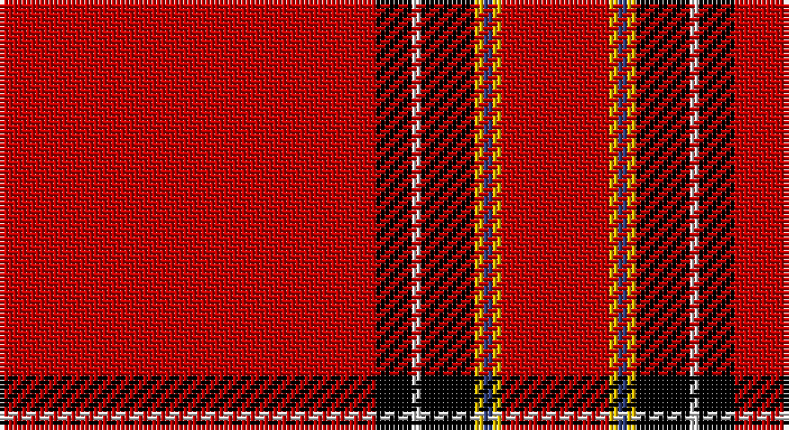

This page is one **sett** — a single exact thread-count. It belongs to the [tartan](/setts/r42k4w1k6ly1db1ly1r12/)
(the same proportion at any scale), whose colour order is pattern [RKWKYBYR](/stripes/rkwkybyr/).

Part of the [Princess Elizabeth](/tartans/princess-elizabeth/) tartan — the named design grouping this sett with its other cloths.

Sourced from weddslist.  It is a [8 stripe tartan](/stripes/stripes8/).

Original link http://www.weddslist.com/cgi-bin/tartans/pg.pl?source=sts

## Provenance

Earliest known date: pre 2003 Also Earl of Inverness

## Also known as

This cloth is also recorded under:

- Princess Elizabeth #2
- Princess Elizabeth Royal

2 attestations — the source records this cloth was collapsed from (oldest owns this page)

<ul>
<li>undated — Princess Elizabeth (weddslist, <a href="http://www.weddslist.com/cgi-bin/tartans/pg.pl?source=sts">record</a>)</li>
<li>undated — Princess Elizabeth Royal Family Tartan (house-of-tartan, <a href="http://www.house-of-tartan.scotland.net/house/TartanViewjs.asp?colr=Def&tnam=1613">record</a>)</li>
</ul>

## Thread count
R/84 K8 LN2 K12 Y2 B2 Y2 R/24

One full sett is **164 threads**.

## Palette

Palette: <strong>Tartan Register</strong> <small style="color:#888">(2 of 5 colours)</small>
<table><thead><tr><th>Colour</th><th>Threads</th><th>Shade</th><th>Base</th><th>OKLCh</th></tr></thead><tbody><tr><td>R/</td><td style="text-align:right;font-variant-numeric:tabular-nums">84</td><td><code style="background-color:#C00000;">#C00000</code> <small style="color:#888">#C00000</small></td><td>R <code style="background-color:#CC0000;">#CC0000</code></td><td><small style="color:#888">oklch(50.7% 0.208 29.2)</small></td></tr><tr><td>K</td><td style="text-align:right;font-variant-numeric:tabular-nums">8</td><td><code style="background-color:#000000;">#000000</code> <small style="color:#888">#000000</small></td><td>K <code style="background-color:#000000;">#000000</code></td><td><small style="color:#888">oklch(0.0% 0.000 0.0)</small></td></tr><tr><td>LN</td><td style="text-align:right;font-variant-numeric:tabular-nums">2</td><td><code style="background-color:#E0E0E0;">#E0E0E0</code> <small style="color:#888">#E0E0E0</small></td><td>W <code style="background-color:#F7F7F7;">#F7F7F7</code></td><td><small style="color:#888">oklch(90.7% 0.000 89.9)</small></td></tr><tr><td>K</td><td style="text-align:right;font-variant-numeric:tabular-nums">12</td><td><code style="background-color:#000000;">#000000</code> <small style="color:#888">#000000</small></td><td>K <code style="background-color:#000000;">#000000</code></td><td><small style="color:#888">oklch(0.0% 0.000 0.0)</small></td></tr><tr><td>Y</td><td style="text-align:right;font-variant-numeric:tabular-nums">2</td><td><code style="background-color:#F0C000;">#F0C000</code> <small style="color:#888">#F0C000</small></td><td>Y <code style="background-color:#F2BF00;">#F2BF00</code></td><td><small style="color:#888">oklch(82.7% 0.169 90.5)</small></td></tr><tr><td>B</td><td style="text-align:right;font-variant-numeric:tabular-nums">2</td><td><code style="background-color:#304080;">#304080</code> <small style="color:#888">#304080</small></td><td>B <code style="background-color:#2A418A;">#2A418A</code></td><td><small style="color:#888">oklch(39.4% 0.109 270.2)</small></td></tr><tr><td>Y</td><td style="text-align:right;font-variant-numeric:tabular-nums">2</td><td><code style="background-color:#F0C000;">#F0C000</code> <small style="color:#888">#F0C000</small></td><td>Y <code style="background-color:#F2BF00;">#F2BF00</code></td><td><small style="color:#888">oklch(82.7% 0.169 90.5)</small></td></tr><tr><td>R/</td><td style="text-align:right;font-variant-numeric:tabular-nums">24</td><td><code style="background-color:#C00000;">#C00000</code> <small style="color:#888">#C00000</small></td><td>R <code style="background-color:#CC0000;">#CC0000</code></td><td><small style="color:#888">oklch(50.7% 0.208 29.2)</small></td></tr></tbody></table>

# Sample pattern

## Compared to the master

This cloth is one sett of its design; the master sett (the exemplar the design is anchored on) is below for comparison.

<figure style="margin:0"><figcaption style="color:#888;font-size:smaller">this sett</figcaption></figure>
<figure style="margin:0"><figcaption style="color:#888;font-size:smaller"><a href="/setts/r60db8w3db10ly3t4ly3r19/">master sett →</a></figcaption></figure>

## Nearest tartans

The nearest existing variants by ΔTartan distance, with this tartan at the top so the swatches line up against it.

ΔTartan

Tartan

Sett

—

<a href="/ttd/edit/#slug=r42k4w1k6ly1db1ly1r12~x2">Princess Elizabeth</a> <a class="nn-out" href="/variants/s8/r42k4w1k6ly1db1ly1r12~x2/" title="open its dictionary page">↗</a>

0.90

<a href="/ttd/edit/#slug=r56w2k12ly3r12ly3r12g3~x2&amp;base=r42k4w1k6ly1db1ly1r12~x2">Hackston, or Halkerston</a> <a class="nn-out" href="/variants/s8/r56w2k12ly3r12ly3r12g3~x2/" title="open its dictionary page">↗</a>

0.92

<a href="/ttd/edit/#slug=r72k6lb2k11ly2db2ly2r18~x2&amp;base=r42k4w1k6ly1db1ly1r12~x2">Princess Elizabeth (Royal)</a> <a class="nn-out" href="/variants/s8/r72k6lb2k11ly2db2ly2r18~x2/" title="open its dictionary page">↗</a>

0.94

<a href="/ttd/edit/#slug=r48w4db4k4r12db4r1ly4~x2&amp;base=r42k4w1k6ly1db1ly1r12~x2">Brodie (W &amp; A Smith)</a> <a class="nn-out" href="/variants/s8/r48w4db4k4r12db4r1ly4~x2/" title="open its dictionary page">↗</a>

0.98

<a href="/ttd/edit/#slug=r48lb4db4k4r12db4r1ly4&amp;base=r42k4w1k6ly1db1ly1r12~x2">Brodie</a> <a class="nn-out" href="/variants/s8/r48lb4db4k4r12db4r1ly4/" title="open its dictionary page">↗</a>

1.15

<a href="/ttd/edit/#slug=r48lr4db4k4r12db4r1ly4~x2&amp;base=r42k4w1k6ly1db1ly1r12~x2">Brodie</a> <a class="nn-out" href="/variants/s8/r48lr4db4k4r12db4r1ly4~x2/" title="open its dictionary page">↗</a>

1.15

<a href="/ttd/edit/#slug=r48lr4db4k4r12db4r1ly4&amp;base=r42k4w1k6ly1db1ly1r12~x2">Brodie</a> <a class="nn-out" href="/variants/s8/r48lr4db4k4r12db4r1ly4/" title="open its dictionary page">↗</a>

1.32

<a href="/ttd/edit/#slug=db3w2k2r62db2k2ly2w2~x2&amp;base=r42k4w1k6ly1db1ly1r12~x2">Singer Sewing Machine Company</a> <a class="nn-out" href="/variants/s8/db3w2k2r62db2k2ly2w2~x2/" title="open its dictionary page">↗</a>

1.33

<a href="/ttd/edit/#slug=r64db4r1k4r12w4r1w4k4r1~x2&amp;base=r42k4w1k6ly1db1ly1r12~x2">Ramsay (Angus &amp; Mearns)</a> <a class="nn-out" href="/variants/s10/r64db4r1k4r12w4r1w4k4r1~x2/" title="open its dictionary page">↗</a>

1.34

<a href="/ttd/edit/#slug=r72db6ly2db11t2db2t2r9k2~x2&amp;base=r42k4w1k6ly1db1ly1r12~x2">Junor (Personal)</a> <a class="nn-out" href="/variants/s9/r72db6ly2db11t2db2t2r9k2~x2/" title="open its dictionary page">↗</a>

1.44

<a href="/ttd/edit/#slug=r36db3w1db6g1k1g1r9~x4&amp;base=r42k4w1k6ly1db1ly1r12~x2">Inverness - 1829 (District)</a> <a class="nn-out" href="/variants/s8/r36db3w1db6g1k1g1r9~x4/" title="open its dictionary page">↗</a>

## Neighbour map

Every grey dot is one of 14360 variants placed by the first two principal components of the ΔTartan feature space (44% of its variance). Red is this tartan; blue dots are its nearest — click one to open its page.

<svg viewBox="0 0 640 380" role="img" style="max-width:100%;height:auto;border:1px solid #e0e0e0;border-radius:4px;display:block" xmlns="http://www.w3.org/2000/svg"><image href="/nn/cloud.v1.png" width="640" height="380"/><a href="/variants/s8/r56w2k12ly3r12ly3r12g3~x2/"><circle cx="497.6" cy="95.8" r="4" fill="#3465a4"><title>Hackston, or Halkerston</title></circle></a><a href="/variants/s8/r72k6lb2k11ly2db2ly2r18~x2/"><circle cx="549.6" cy="84.6" r="4" fill="#3465a4"><title>Princess Elizabeth (Royal)</title></circle></a><a href="/variants/s8/r48w4db4k4r12db4r1ly4~x2/"><circle cx="497.1" cy="65.8" r="4" fill="#3465a4"><title>Brodie (W &amp; A Smith)</title></circle></a><a href="/variants/s8/r48lb4db4k4r12db4r1ly4/"><circle cx="502.1" cy="68.1" r="4" fill="#3465a4"><title>Brodie</title></circle></a><a href="/variants/s8/r48lr4db4k4r12db4r1ly4~x2/"><circle cx="516.0" cy="81.2" r="4" fill="#3465a4"><title>Brodie</title></circle></a><a href="/variants/s8/r48lr4db4k4r12db4r1ly4/"><circle cx="516.0" cy="81.2" r="4" fill="#3465a4"><title>Brodie</title></circle></a><a href="/variants/s8/db3w2k2r62db2k2ly2w2~x2/"><circle cx="565.0" cy="77.5" r="4" fill="#3465a4"><title>Singer Sewing Machine Company</title></circle></a><a href="/variants/s10/r64db4r1k4r12w4r1w4k4r1~x2/"><circle cx="580.6" cy="59.2" r="4" fill="#3465a4"><title>Ramsay (Angus &amp; Mearns)</title></circle></a><a href="/variants/s9/r72db6ly2db11t2db2t2r9k2~x2/"><circle cx="526.4" cy="70.4" r="4" fill="#3465a4"><title>Junor (Personal)</title></circle></a><a href="/variants/s8/r36db3w1db6g1k1g1r9~x4/"><circle cx="555.2" cy="91.7" r="4" fill="#3465a4"><title>Inverness - 1829 (District)</title></circle></a><circle cx="542.8" cy="72.1" r="5" fill="#c00000"/></svg>

ID: /variants/s8/r42k4w1k6ly1db1ly1r12~x2/
