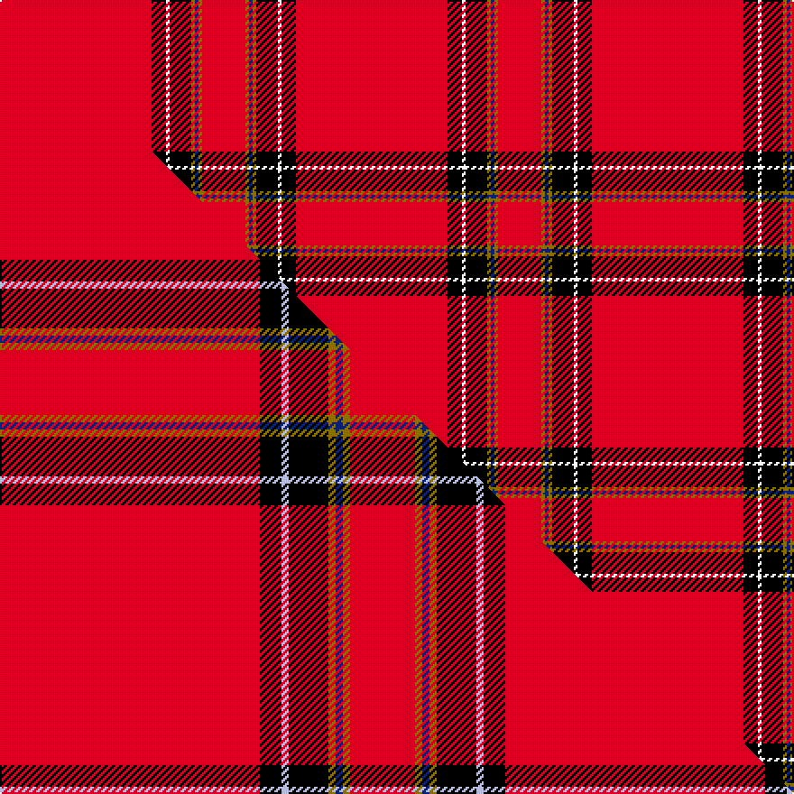

This is one **variant** — a specific cloth: this exact thread count and colourway, with its own
provenance below. It is one weaving of the [sett](/setts/r42k4w1k6y1db1y1r12/) (the scale-free proportion — the
same cloth at any scale or shade), whose colour order is pattern [RGBGKWKR](/stripes/rgbgkwkr/).

Part of the [Princess Elizabeth](/tartans/princess-elizabeth/) tartan — the named design grouping this sett with its other cloths.

Sourced from house-of-tartan.  It is a [8 stripe tartan](/stripes/stripes8/).

Original link [http://www.house-of-tartan.scotland.net/house/TartanViewjs.asp?colr=Def&tnam=1613](http://www.house-of-tartan.scotland.net/house/TartanViewjs.asp?colr=Def&tnam=1613)

## Provenance

Earliest known date: pre 2003 Also Earl of Inverness

2 attestations — the source records this cloth was collapsed from (oldest owns this page)

<ul>
<li>pre 2003 — Princess Elizabeth Royal Family Tartan (house-of-tartan, <a href="http://www.house-of-tartan.scotland.net/house/TartanViewjs.asp?colr=Def&tnam=1613">record</a>) </li>
<li>undated — Princess Elizabeth (weddslist, <a href="http://www.weddslist.com/cgi-bin/tartans/pg.pl?source=sts">record</a>) </li>
</ul>

Dataset <small>— provenance for this record, inherited from the source manifest</small>

<dl class="dataset-prov">
<dt>source</dt><dd><a href="/sources/house-of-tartan/">House of Tartan</a></dd>
<dt>data captured from</dt><dd><a href="https://github.com/thetartan/tartan-database/blob/master/data/house-of-tartan/data.csv">https://github.com/thetartan/tartan-database/blob/master/data/house-of-tartan/data.csv</a></dd>
<dt>data date</dt><dd>pre 2003 <small>(this record)</small></dd>
<dt>licence</dt><dd><a href="https://creativecommons.org/licenses/by-nc-nd/4.0/">CC BY-NC-ND 4.0</a></dd>
</dl>

Capture chain <small>— the hands this data passed through, oldest first; each capture carries its own licence</small>

<ol class="capture-chain">
<li><a href="http://www.house-of-tartan.scotland.net/">House of Tartan</a> <small>the weaver/retailer's database — the site is now offline; the URL is kept as the ultimate source's identity</small></li>
<li><a href="https://github.com/thetartan/tartan-database">thetartan/tartan-database</a> <small>2016-2017</small> · <a href="https://creativecommons.org/licenses/by-nc-nd/4.0/">CC BY-NC-ND 4.0</a> <small>Levko Kravets's frozen compilation — the capture we vendored, and where its CC licence text came from</small></li>
<li>this dictionary <small>captured 2026-06-10 · commit 5bf86c7566</small> <small>each re-capture is a git commit to data/sources</small></li>
</ol>

## Thread count
R/84 K8 W2 K12 Y2 DB2 Y2 R/24

One full sett is **164 threads**.

## Palette
<table><thead><tr><th>Colour</th><th>Shade</th><th>OKLCh</th></tr></thead><tbody><tr><td>DB</td><td><code style="background-color:#082077;">#082077</code> <small style="color:#888">#082077</small></td><td><small style="color:#888">oklch(30.0% 0.149 265.1)</small></td></tr><tr><td>K</td><td><code style="background-color:#000000;">#000000</code> <small style="color:#888">#000000</small></td><td><small style="color:#888">oklch(0.0% 0.000 0.0)</small></td></tr><tr><td>W</td><td><code style="background-color:#F7F7F7;">#F7F7F7</code> <small style="color:#888">#F7F7F7</small></td><td><small style="color:#888">oklch(97.6% 0.000 89.9)</small></td></tr><tr><td>R</td><td><code style="background-color:#D60020;">#D60020</code> <small style="color:#888">#D60020</small></td><td><small style="color:#888">oklch(55.2% 0.224 25.5)</small></td></tr><tr><td>Y</td><td><code style="background-color:#8B6E00;">#8B6E00</code> <small style="color:#888">#8B6E00</small></td><td><small style="color:#888">oklch(55.1% 0.113 90.4)</small></td></tr></tbody></table>

# Sample pattern

## Compared to the master

This cloth is one sett of its design; the master sett (the exemplar the design is anchored on) is below for comparison.

Its **ΔTartan distance** from the master is **0.51** — the same measure the nearest-tartans table ranks by (0 is identical; a re-scale of the same cloth is near 0, a recolour or a different proportion further).

<figure class="master-compare" style="margin:0">

this sett
master sett ★

<figcaption style="color:#888;font-size:smaller">One weave of this sett against the <a href="/setts/r72k6lb2k11y2db2y2r18/">master sett ★</a>, split on the diagonal: a shared proportion runs seamlessly across it with only the shades shifting; a different proportion breaks on it.</figcaption>
</figure>

## Nearest tartan variants

The nearest existing variants by ΔTartan distance, with this cloth at the top so the swatches line up against it.

ΔTartan

Threads

Variant

Sett

—

164

<a href="/variants/s8/r42k4w1k6y1db1y1r12~x2/">Princess Elizabeth Royal Family Tartan</a>

<a href="/ttd/edit/#slug=r72k6lb2k11y2db2y2r18~x2&amp;base=r42k4w1k6y1db1y1r12~x2" title="compare in the TTD">0.51</a>

280

<a href="/variants/s8/r72k6lb2k11y2db2y2r18~x2/">Princess Elizabeth (Royal)</a>

<a href="/ttd/edit/#slug=r114db10w3db16y3k3y3r28~x2&amp;base=r42k4w1k6y1db1y1r12~x2" title="compare in the TTD">1.06</a>

436

<a href="/variants/s8/r114db10w3db16y3k3y3r28~x2/">Inverness #2</a>

<a href="/ttd/edit/#slug=r100db10w5db14y4dbi8y4r24~db1004274-dbi1406275&amp;base=r42k4w1k6y1db1y1r12~x2" title="compare in the TTD">1.64</a>

214

<a href="/variants/s8/r100db10w5db14y4dbi8y4r24~db1004274-dbi1406275/">Earl of Inverness (Royal)</a>

<a href="/ttd/edit/#slug=r48w3k3g2y6g2r6~x4&amp;base=r42k4w1k6y1db1y1r12~x2" title="compare in the TTD">1.70</a>

344

<a href="/variants/s7/r48w3k3g2y6g2r6~x4/">Ferguson the Astronomer</a>

<a href="/ttd/edit/#slug=r70t1r2g12k2g1k10w1~x2&amp;base=r42k4w1k6y1db1y1r12~x2" title="compare in the TTD">1.98</a>

254

<a href="/variants/s8/r70t1r2g12k2g1k10w1~x2/">Zamzam (Personal)</a>

<a href="/ttd/edit/#slug=r56w2k12y3r12y3r12g3~x2&amp;base=r42k4w1k6y1db1y1r12~x2" title="compare in the TTD">1.98</a>

294

<a href="/variants/s8/r56w2k12y3r12y3r12g3~x2/">Hackston, or Halkerston</a>

<a href="/ttd/edit/#slug=g4r16k5r50g4w1~x4&amp;base=r42k4w1k6y1db1y1r12~x2" title="compare in the TTD">2.03</a>

620

<a href="/variants/s6/g4r16k5r50g4w1~x4/">Chalet</a>

<a href="/ttd/edit/#slug=r18g1k5g1k1g1r9~x2&amp;base=r42k4w1k6y1db1y1r12~x2" title="compare in the TTD">2.05</a>

90

<a href="/variants/s7/r18g1k5g1k1g1r9~x2/">Duke of Sussex</a>

<a href="/ttd/edit/#slug=y8k2r23k1r17k1g4w3~x2&amp;base=r42k4w1k6y1db1y1r12~x2" title="compare in the TTD">2.05</a>

214

<a href="/variants/s8/y8k2r23k1r17k1g4w3~x2/">Hoa Sen</a>

<a href="/ttd/edit/#slug=lb5k1w11k1r42k1~x2&amp;base=r42k4w1k6y1db1y1r12~x2" title="compare in the TTD">2.30</a>

232

<a href="/variants/s6/lb5k1w11k1r42k1~x2/">Davet (2014)</a>

## Neighbour map

Every grey dot is one of 13621 variants placed by the first two principal components of the ΔTartan feature space (42% of its variance). Red is this tartan; blue dots are its nearest — click one to open its page.

<svg viewBox="0 0 640 380" role="img" style="max-width:100%;height:auto;border:1px solid #e0e0e0;border-radius:4px;display:block" xmlns="http://www.w3.org/2000/svg"><image href="/nn/cloud.v1.png" width="640" height="380"/><a href="/variants/s8/r72k6lb2k11y2db2y2r18~x2/"><circle cx="478.4" cy="55.8" r="4" fill="#3465a4"><title>Princess Elizabeth (Royal)</title></circle></a><a href="/variants/s8/r114db10w3db16y3k3y3r28~x2/"><circle cx="521.6" cy="65.7" r="4" fill="#3465a4"><title>Inverness #2</title></circle></a><a href="/variants/s8/r100db10w5db14y4dbi8y4r24~db1004274-dbi1406275/"><circle cx="478.9" cy="102.3" r="4" fill="#3465a4"><title>Earl of Inverness (Royal)</title></circle></a><a href="/variants/s7/r48w3k3g2y6g2r6~x4/"><circle cx="491.6" cy="90.9" r="4" fill="#3465a4"><title>Ferguson the Astronomer</title></circle></a><a href="/variants/s8/r70t1r2g12k2g1k10w1~x2/"><circle cx="451.8" cy="40.0" r="4" fill="#3465a4"><title>Zamzam (Personal)</title></circle></a><a href="/variants/s8/r56w2k12y3r12y3r12g3~x2/"><circle cx="462.6" cy="82.3" r="4" fill="#3465a4"><title>Hackston, or Halkerston</title></circle></a><a href="/variants/s6/g4r16k5r50g4w1~x4/"><circle cx="557.9" cy="90.2" r="4" fill="#3465a4"><title>Chalet</title></circle></a><a href="/variants/s7/r18g1k5g1k1g1r9~x2/"><circle cx="448.0" cy="136.7" r="4" fill="#3465a4"><title>Duke of Sussex</title></circle></a><a href="/variants/s8/y8k2r23k1r17k1g4w3~x2/"><circle cx="371.3" cy="111.3" r="4" fill="#3465a4"><title>Hoa Sen</title></circle></a><a href="/variants/s6/lb5k1w11k1r42k1~x2/"><circle cx="422.7" cy="83.3" r="4" fill="#3465a4"><title>Davet (2014)</title></circle></a><circle cx="490.8" cy="49.7" r="5" fill="#c00000"/><text x="320" y="376" text-anchor="middle" font-size="11" fill="#999">ground</text><text x="11" y="190" text-anchor="middle" font-size="11" fill="#999" transform="rotate(-90 11 190)">complexity</text></svg>

ID: /variants/s8/r42k4w1k6y1db1y1r12~x2/
