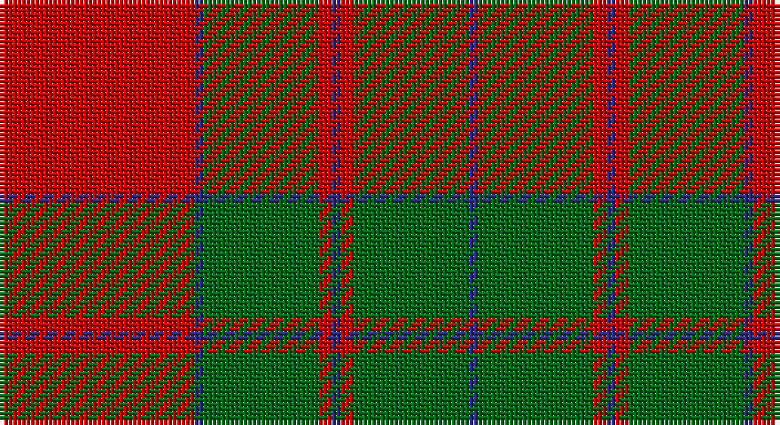

This page is one **sett** — a single exact thread-count. It belongs to the [tartan](/setts/r44db2g26r3db2/)
(the same proportion at any scale), whose colour order is pattern [BGRBRGBR](/stripes/bgrbrgbr/).

Part of the [Unidentified Cant](/tartans/unidentified-cant/) tartan — the named design grouping this sett with its other cloths.

Sourced from register-of-tartans.  It is a [8 stripe tartan](/stripes/stripes8/).

Original link https://www.tartanregister.gov.uk/tartanDetails.aspx?ref=4909

## Also known as

This cloth is also recorded under:

- Unidentified Cant #01
- Unidentified Cant #03
- Unidentified Cant #04
- Unidentified Cant #05
- Unidentified Cant #06
- Unidentified Cant #07
- Unidentified Cant #08
- Unidentified Cant #09
- Unidentified Cant #10
- Unidentified Cant #11
- Unidentified Cant #12
- Unidentified Cant #13
- Unidentified Cant #14

## Register references

External register numbers recorded for this tartan.

- Scottish Register of Tartans: [4909](https://www.tartanregister.gov.uk/tartanDetails.aspx?ref=4909)
- Scottish Tartans Authority (ITI): 3920

## Thread count
R/44 DB2 Ga26 R3 DB2 R3 Ga26 DB/2

One full sett is **170 threads**.

## Palette

Palette: <strong>Tartan Register</strong>
<table><thead><tr><th>Colour</th><th>Threads</th><th>Shade</th><th>Base</th><th>OKLCh</th></tr></thead><tbody><tr><td>R/</td><td style="text-align:right;font-variant-numeric:tabular-nums">44</td><td><code style="background-color:#C80000;">#C80000</code> <small style="color:#888">#C80000</small></td><td>R <code style="background-color:#CC0000;">#CC0000</code></td><td><small style="color:#888">oklch(52.3% 0.215 29.2)</small></td></tr><tr><td>DB</td><td style="text-align:right;font-variant-numeric:tabular-nums">2</td><td><code style="background-color:#2C2C80;">#2C2C80</code> <small style="color:#888">#2C2C80</small></td><td>B <code style="background-color:#2A418A;">#2A418A</code></td><td><small style="color:#888">oklch(35.0% 0.138 276.6)</small></td></tr><tr><td>Ga</td><td style="text-align:right;font-variant-numeric:tabular-nums">26</td><td><code style="background-color:#006818;">#006818</code> <small style="color:#888">#006818</small></td><td>G <code style="background-color:#006100;">#006100</code></td><td><small style="color:#888">oklch(45.0% 0.142 145.0)</small></td></tr><tr><td>R</td><td style="text-align:right;font-variant-numeric:tabular-nums">3</td><td><code style="background-color:#C80000;">#C80000</code> <small style="color:#888">#C80000</small></td><td>R <code style="background-color:#CC0000;">#CC0000</code></td><td><small style="color:#888">oklch(52.3% 0.215 29.2)</small></td></tr><tr><td>DB</td><td style="text-align:right;font-variant-numeric:tabular-nums">2</td><td><code style="background-color:#2C2C80;">#2C2C80</code> <small style="color:#888">#2C2C80</small></td><td>B <code style="background-color:#2A418A;">#2A418A</code></td><td><small style="color:#888">oklch(35.0% 0.138 276.6)</small></td></tr><tr><td>R</td><td style="text-align:right;font-variant-numeric:tabular-nums">3</td><td><code style="background-color:#C80000;">#C80000</code> <small style="color:#888">#C80000</small></td><td>R <code style="background-color:#CC0000;">#CC0000</code></td><td><small style="color:#888">oklch(52.3% 0.215 29.2)</small></td></tr><tr><td>Ga</td><td style="text-align:right;font-variant-numeric:tabular-nums">26</td><td><code style="background-color:#006818;">#006818</code> <small style="color:#888">#006818</small></td><td>G <code style="background-color:#006100;">#006100</code></td><td><small style="color:#888">oklch(45.0% 0.142 145.0)</small></td></tr><tr><td>DB/</td><td style="text-align:right;font-variant-numeric:tabular-nums">2</td><td><code style="background-color:#2C2C80;">#2C2C80</code> <small style="color:#888">#2C2C80</small></td><td>B <code style="background-color:#2A418A;">#2A418A</code></td><td><small style="color:#888">oklch(35.0% 0.138 276.6)</small></td></tr></tbody></table>

# Sample pattern

## Compared to the master

This cloth is one sett of its design; the master sett (the exemplar the design is anchored on) is below for comparison.

<figure style="margin:0"><figcaption style="color:#888;font-size:smaller">this sett</figcaption></figure>
<figure style="margin:0"><figcaption style="color:#888;font-size:smaller"><a href="/setts/db80r56dg3r56dg88r64db3r4dg3r4db3r64/">master sett →</a></figcaption></figure>

## Nearest tartans

The nearest existing variants by ΔTartan distance, with this tartan at the top so the swatches line up against it.

ΔTartan

Tartan

Sett

—

<a href="/ttd/edit/#slug=r44db2g26r3db2">Unidentified Cant #09</a> <a class="nn-out" href="/variants/s8/r44db2g26r3db2/" title="open its dictionary page">↗</a>

0.76

<a href="/ttd/edit/#slug=g18r3g2r2db6r2g2r24g1r2g6~x2&amp;base=r44db2g26r3db2">MacDonell of Glengarry</a> <a class="nn-out" href="/variants/s11/g18r3g2r2db6r2g2r24g1r2g6~x2/" title="open its dictionary page">↗</a>

0.78

<a href="/ttd/edit/#slug=r2db1g2db1g19db2r27g2~x2&amp;base=r44db2g26r3db2">Thomas of Wales</a> <a class="nn-out" href="/variants/s8/r2db1g2db1g19db2r27g2~x2/" title="open its dictionary page">↗</a>

0.97

<a href="/ttd/edit/#slug=r4g4lo4g12r22lo1g4~x4&amp;base=r44db2g26r3db2">Spice Apple</a> <a class="nn-out" href="/variants/s7/r4g4lo4g12r22lo1g4~x4/" title="open its dictionary page">↗</a>

1.03

<a href="/ttd/edit/#slug=dg18r3dg2r2db6r2dg2r24dg1r2dg6~x2&amp;base=r44db2g26r3db2">MacDonell of Glengarry #4</a> <a class="nn-out" href="/variants/s11/dg18r3dg2r2db6r2dg2r24dg1r2dg6~x2/" title="open its dictionary page">↗</a>

1.06

<a href="/ttd/edit/#slug=g12r4k1r2k1r4g16r20g2r8~x2&amp;base=r44db2g26r3db2">Livingstone #2</a> <a class="nn-out" href="/variants/s10/g12r4k1r2k1r4g16r20g2r8~x2/" title="open its dictionary page">↗</a>

1.14

<a href="/variants/s10/r32lo1g8lo1g8lo1~x2/">Unidentified #62</a>

1.16

<a href="/ttd/edit/#slug=r1g10r1db4r18g1~x4&amp;base=r44db2g26r3db2">Robertson 6</a> <a class="nn-out" href="/variants/s6/r1g10r1db4r18g1~x4/" title="open its dictionary page">↗</a>

1.18

<a href="/ttd/edit/#slug=g5w2r27g27r5w2~x2&amp;base=r44db2g26r3db2">MacDonald of Glenaladale (symmetrical)</a> <a class="nn-out" href="/variants/s6/g5w2r27g27r5w2~x2/" title="open its dictionary page">↗</a>

1.18

<a href="/ttd/edit/#slug=r12db2r3g20k4g20r30k2r1~x2&amp;base=r44db2g26r3db2">Oriel #1 (District)</a> <a class="nn-out" href="/variants/s9/r12db2r3g20k4g20r30k2r1~x2/" title="open its dictionary page">↗</a>

1.22

<a href="/ttd/edit/#slug=dg22k1dg2k1dg3k8r20k1r3~x4&amp;base=r44db2g26r3db2">Stewart of Atholl (Clan)</a> <a class="nn-out" href="/variants/s9/dg22k1dg2k1dg3k8r20k1r3~x4/" title="open its dictionary page">↗</a>

## Neighbour map

Every grey dot is one of 14360 variants placed by the first two principal components of the ΔTartan feature space (44% of its variance). Red is this tartan; blue dots are its nearest — click one to open its page.

<svg viewBox="0 0 640 380" role="img" style="max-width:100%;height:auto;border:1px solid #e0e0e0;border-radius:4px;display:block" xmlns="http://www.w3.org/2000/svg"><image href="/nn/cloud.v1.png" width="640" height="380"/><a href="/variants/s11/g18r3g2r2db6r2g2r24g1r2g6~x2/"><circle cx="362.4" cy="147.6" r="4" fill="#3465a4"><title>MacDonell of Glengarry</title></circle></a><a href="/variants/s8/r2db1g2db1g19db2r27g2~x2/"><circle cx="403.9" cy="147.1" r="4" fill="#3465a4"><title>Thomas of Wales</title></circle></a><a href="/variants/s7/r4g4lo4g12r22lo1g4~x4/"><circle cx="367.6" cy="184.7" r="4" fill="#3465a4"><title>Spice Apple</title></circle></a><a href="/variants/s11/dg18r3dg2r2db6r2dg2r24dg1r2dg6~x2/"><circle cx="359.9" cy="143.0" r="4" fill="#3465a4"><title>MacDonell of Glengarry #4</title></circle></a><a href="/variants/s10/g12r4k1r2k1r4g16r20g2r8~x2/"><circle cx="386.9" cy="176.7" r="4" fill="#3465a4"><title>Livingstone #2</title></circle></a><a href="/variants/s10/r32lo1g8lo1g8lo1~x2/"><circle cx="398.6" cy="150.4" r="4" fill="#3465a4"><title>Unidentified #62</title></circle></a><a href="/variants/s6/r1g10r1db4r18g1~x4/"><circle cx="396.6" cy="186.7" r="4" fill="#3465a4"><title>Robertson 6</title></circle></a><a href="/variants/s6/g5w2r27g27r5w2~x2/"><circle cx="334.3" cy="199.7" r="4" fill="#3465a4"><title>MacDonald of Glenaladale (symmetrical)</title></circle></a><a href="/variants/s9/r12db2r3g20k4g20r30k2r1~x2/"><circle cx="344.2" cy="146.3" r="4" fill="#3465a4"><title>Oriel #1 (District)</title></circle></a><a href="/variants/s9/dg22k1dg2k1dg3k8r20k1r3~x4/"><circle cx="326.9" cy="162.7" r="4" fill="#3465a4"><title>Stewart of Atholl (Clan)</title></circle></a><circle cx="375.7" cy="170.7" r="5" fill="#c00000"/></svg>

ID: /variants/s8/r44db2g26r3db2/
