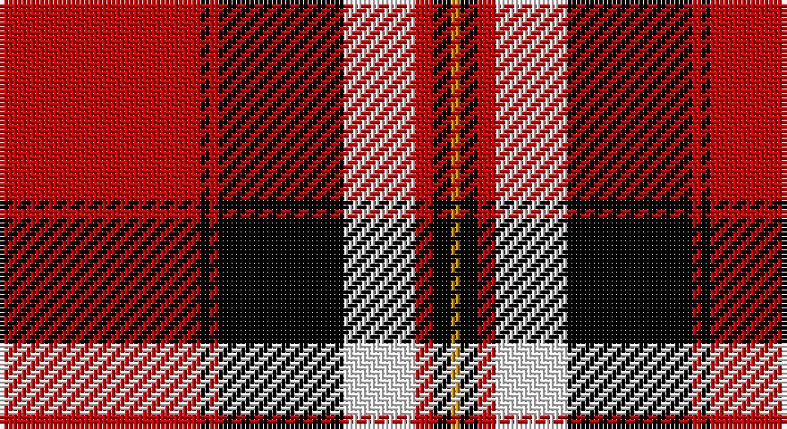

This page is one **sett** — a single exact thread-count. It belongs to the [tartan](/setts/r45k2r2k28w16r4k4lo2/)
(the same proportion at any scale), whose colour order is pattern [RKRKWRKY](/stripes/rkrkwrky/).

Part of the [Barbecue](/tartans/barbecue/) tartan — the named design grouping this sett with its other cloths.

Sourced from register-of-tartans.  It is a [8 stripe tartan](/stripes/stripes8/).

Original link https://www.tartanregister.gov.uk/tartanDetails.aspx?ref=209

## Also known as

This cloth is also recorded under:

- Barbecue Plaid
- Barbecue, Plaid

## Register references

External register numbers recorded for this tartan.

- Scottish Register of Tartans: [209](https://www.tartanregister.gov.uk/tartanDetails.aspx?ref=209)
- Scottish Tartans Authority (ITI): 1607
- Scottish Tartans World Register: 1607

## Thread count
R/45 K2 R2 K28 W16 R4 K4 DY/2

One full sett is **159 threads**.

## Palette

Palette: <strong>Tartan Register</strong> <small style="color:#888">(5 of 6 colours)</small>
<table><thead><tr><th>Colour</th><th>Threads</th><th>Shade</th><th>Base</th><th>OKLCh</th></tr></thead><tbody><tr><td>R/</td><td style="text-align:right;font-variant-numeric:tabular-nums">45</td><td><code style="background-color:#C80000;">#C80000</code> <small style="color:#888">#C80000</small></td><td>R <code style="background-color:#CC0000;">#CC0000</code></td><td><small style="color:#888">oklch(52.3% 0.215 29.2)</small></td></tr><tr><td>K</td><td style="text-align:right;font-variant-numeric:tabular-nums">2</td><td><code style="background-color:#000000;">#000000</code> <small style="color:#888">#000000</small></td><td>K <code style="background-color:#000000;">#000000</code></td><td><small style="color:#888">oklch(0.0% 0.000 0.0)</small></td></tr><tr><td>R</td><td style="text-align:right;font-variant-numeric:tabular-nums">2</td><td><code style="background-color:#C80000;">#C80000</code> <small style="color:#888">#C80000</small></td><td>R <code style="background-color:#CC0000;">#CC0000</code></td><td><small style="color:#888">oklch(52.3% 0.215 29.2)</small></td></tr><tr><td>K</td><td style="text-align:right;font-variant-numeric:tabular-nums">28</td><td><code style="background-color:#000000;">#000000</code> <small style="color:#888">#000000</small></td><td>K <code style="background-color:#000000;">#000000</code></td><td><small style="color:#888">oklch(0.0% 0.000 0.0)</small></td></tr><tr><td>W</td><td style="text-align:right;font-variant-numeric:tabular-nums">16</td><td><code style="background-color:#FCFCFC;">#FCFCFC</code> <small style="color:#888">#FCFCFC</small></td><td>W <code style="background-color:#F7F7F7;">#F7F7F7</code></td><td><small style="color:#888">oklch(99.1% 0.000 89.9)</small></td></tr><tr><td>R</td><td style="text-align:right;font-variant-numeric:tabular-nums">4</td><td><code style="background-color:#C80000;">#C80000</code> <small style="color:#888">#C80000</small></td><td>R <code style="background-color:#CC0000;">#CC0000</code></td><td><small style="color:#888">oklch(52.3% 0.215 29.2)</small></td></tr><tr><td>K</td><td style="text-align:right;font-variant-numeric:tabular-nums">4</td><td><code style="background-color:#000000;">#000000</code> <small style="color:#888">#000000</small></td><td>K <code style="background-color:#000000;">#000000</code></td><td><small style="color:#888">oklch(0.0% 0.000 0.0)</small></td></tr><tr><td>DY/</td><td style="text-align:right;font-variant-numeric:tabular-nums">2</td><td><code style="background-color:#C88C00;">#C88C00</code> <small style="color:#888">#C88C00</small></td><td>Y <code style="background-color:#F2BF00;">#F2BF00</code></td><td><small style="color:#888">oklch(68.2% 0.142 78.2)</small></td></tr></tbody></table>

# Sample pattern

## Nearest tartans

The nearest existing variants by ΔTartan distance, with this tartan at the top so the swatches line up against it.

ΔTartan

Tartan

Sett

—

<a href="/ttd/edit/#slug=r45k2r2k28w16r4k4lo2">Barbecue Plaid</a> <a class="nn-out" href="/variants/s8/r45k2r2k28w16r4k4lo2/" title="open its dictionary page">↗</a>

0.95

<a href="/ttd/edit/#slug=w10k2w2k66ly6r48k5r8&amp;base=r45k2r2k28w16r4k4lo2">Sutherland de Albergaria (Personal)</a> <a class="nn-out" href="/variants/s8/w10k2w2k66ly6r48k5r8/" title="open its dictionary page">↗</a>

1.17

<a href="/ttd/edit/#slug=k3r1k30r28db1r1w3~x2&amp;base=r45k2r2k28w16r4k4lo2">Cunningham #3</a> <a class="nn-out" href="/variants/s7/k3r1k30r28db1r1w3~x2/" title="open its dictionary page">↗</a>

1.19

<a href="/ttd/edit/#slug=w3k3w3k37r40w1r2lo3~x2&amp;base=r45k2r2k28w16r4k4lo2">Marjoribanks (Clan)</a> <a class="nn-out" href="/variants/s8/w3k3w3k37r40w1r2lo3~x2/" title="open its dictionary page">↗</a>

1.20

<a href="/ttd/edit/#slug=db5r12k38r4w2r2w2r2w2r4~x2&amp;base=r45k2r2k28w16r4k4lo2">Good Conduct (USA)</a> <a class="nn-out" href="/variants/s10/db5r12k38r4w2r2w2r2w2r4~x2/" title="open its dictionary page">↗</a>

1.21

<a href="/ttd/edit/#slug=r50ly8k2w2k2ly8k22r3~x2&amp;base=r45k2r2k28w16r4k4lo2">FIRES Center of Excelence</a> <a class="nn-out" href="/variants/s8/r50ly8k2w2k2ly8k22r3~x2/" title="open its dictionary page">↗</a>

1.23

<a href="/ttd/edit/#slug=w6k2w2k31r41k2r2k4~x2&amp;base=r45k2r2k28w16r4k4lo2">University of Nebraska Alumni Association</a> <a class="nn-out" href="/variants/s8/w6k2w2k31r41k2r2k4~x2/" title="open its dictionary page">↗</a>

1.28

<a href="/ttd/edit/#slug=o5k1r2k4r36k23w4ly2~x2&amp;base=r45k2r2k28w16r4k4lo2">Aberdeen F.C.</a> <a class="nn-out" href="/variants/s8/o5k1r2k4r36k23w4ly2~x2/" title="open its dictionary page">↗</a>

1.33

<a href="/ttd/edit/#slug=g4r4k2r20t1k7r2g10r3k2~x2&amp;base=r45k2r2k28w16r4k4lo2">MacKillop</a> <a class="nn-out" href="/variants/s10/g4r4k2r20t1k7r2g10r3k2~x2/" title="open its dictionary page">↗</a>

1.33

<a href="/ttd/edit/#slug=w3k3w3k36r40w1r2ly3~x2&amp;base=r45k2r2k28w16r4k4lo2">Marjoribanks</a> <a class="nn-out" href="/variants/s8/w3k3w3k36r40w1r2ly3~x2/" title="open its dictionary page">↗</a>

1.34

<a href="/ttd/edit/#slug=k4r26k4w2k13ly4~x2&amp;base=r45k2r2k28w16r4k4lo2">Dunbar #2</a> <a class="nn-out" href="/variants/s6/k4r26k4w2k13ly4~x2/" title="open its dictionary page">↗</a>

## Neighbour map

Every grey dot is one of 14360 variants placed by the first two principal components of the ΔTartan feature space (44% of its variance). Red is this tartan; blue dots are its nearest — click one to open its page.

<svg viewBox="0 0 640 380" role="img" style="max-width:100%;height:auto;border:1px solid #e0e0e0;border-radius:4px;display:block" xmlns="http://www.w3.org/2000/svg"><image href="/nn/cloud.v1.png" width="640" height="380"/><a href="/variants/s8/w10k2w2k66ly6r48k5r8/"><circle cx="320.2" cy="107.6" r="4" fill="#3465a4"><title>Sutherland de Albergaria (Personal)</title></circle></a><a href="/variants/s7/k3r1k30r28db1r1w3~x2/"><circle cx="348.9" cy="118.2" r="4" fill="#3465a4"><title>Cunningham #3</title></circle></a><a href="/variants/s8/w3k3w3k37r40w1r2lo3~x2/"><circle cx="327.3" cy="93.8" r="4" fill="#3465a4"><title>Marjoribanks (Clan)</title></circle></a><a href="/variants/s10/db5r12k38r4w2r2w2r2w2r4~x2/"><circle cx="303.6" cy="104.1" r="4" fill="#3465a4"><title>Good Conduct (USA)</title></circle></a><a href="/variants/s8/r50ly8k2w2k2ly8k22r3~x2/"><circle cx="336.0" cy="107.6" r="4" fill="#3465a4"><title>FIRES Center of Excelence</title></circle></a><a href="/variants/s8/w6k2w2k31r41k2r2k4~x2/"><circle cx="334.7" cy="138.2" r="4" fill="#3465a4"><title>University of Nebraska Alumni Association</title></circle></a><a href="/variants/s8/o5k1r2k4r36k23w4ly2~x2/"><circle cx="299.5" cy="84.6" r="4" fill="#3465a4"><title>Aberdeen F.C.</title></circle></a><a href="/variants/s10/g4r4k2r20t1k7r2g10r3k2~x2/"><circle cx="291.9" cy="134.1" r="4" fill="#3465a4"><title>MacKillop</title></circle></a><a href="/variants/s8/w3k3w3k36r40w1r2ly3~x2/"><circle cx="319.8" cy="93.9" r="4" fill="#3465a4"><title>Marjoribanks</title></circle></a><a href="/variants/s6/k4r26k4w2k13ly4~x2/"><circle cx="280.3" cy="166.4" r="4" fill="#3465a4"><title>Dunbar #2</title></circle></a><circle cx="282.5" cy="114.8" r="5" fill="#c00000"/></svg>

ID: /variants/s8/r45k2r2k28w16r4k4lo2/
