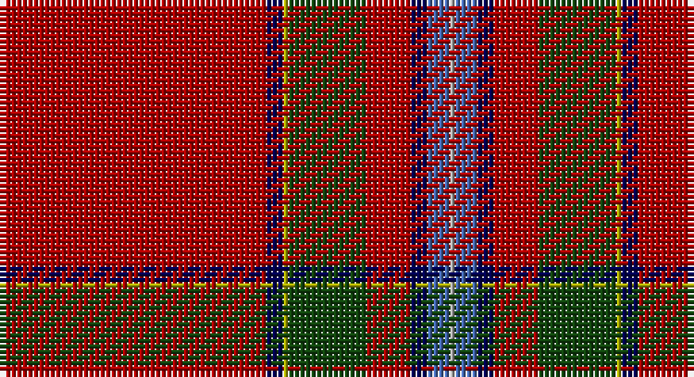

This page is one **sett** — a single exact thread-count. It belongs to the [tartan](/setts/r48db3ly1dg14r8db3b4lr1/)
(the same proportion at any scale), whose colour order is pattern [RBYGRBBY](/stripes/rbygrbby/).

Part of the [Prince Charles Cloak](/tartans/prince-charles-cloak/) tartan — the named design grouping this sett with its other cloths.

Sourced from weddslist.  It is a [8 stripe tartan](/stripes/stripes8/).

Original link http://www.weddslist.com/cgi-bin/tartans/pg.pl?source=x

## Thread count
DR/48 DB3 LG1 DG14 DR8 DB3 B4 N/1

One full sett is **115 threads**.

## Palette

Palette: <strong>custom</strong>
<table><thead><tr><th>Colour</th><th>Threads</th><th>Shade</th><th>Base</th><th>OKLCh</th></tr></thead><tbody><tr><td>DR/</td><td style="text-align:right;font-variant-numeric:tabular-nums">48</td><td><code style="background-color:#AA0000;">#AA0000</code> <small style="color:#888">#AA0000</small></td><td>R <code style="background-color:#CC0000;">#CC0000</code></td><td><small style="color:#888">oklch(46.3% 0.190 29.2)</small></td></tr><tr><td>DB</td><td style="text-align:right;font-variant-numeric:tabular-nums">3</td><td><code style="background-color:#000052;">#000052</code> <small style="color:#888">#000052</small></td><td>B <code style="background-color:#2A418A;">#2A418A</code></td><td><small style="color:#888">oklch(19.8% 0.137 264.1)</small></td></tr><tr><td>LG</td><td style="text-align:right;font-variant-numeric:tabular-nums">1</td><td><code style="background-color:#AAAA00;">#AAAA00</code> <small style="color:#888">#AAAA00</small></td><td>Y <code style="background-color:#F2BF00;">#F2BF00</code></td><td><small style="color:#888">oklch(71.4% 0.156 109.8)</small></td></tr><tr><td>DG</td><td style="text-align:right;font-variant-numeric:tabular-nums">14</td><td><code style="background-color:#11450D;">#11450D</code> <small style="color:#888">#11450D</small></td><td>G <code style="background-color:#006100;">#006100</code></td><td><small style="color:#888">oklch(34.4% 0.101 142.1)</small></td></tr><tr><td>DR</td><td style="text-align:right;font-variant-numeric:tabular-nums">8</td><td><code style="background-color:#AA0000;">#AA0000</code> <small style="color:#888">#AA0000</small></td><td>R <code style="background-color:#CC0000;">#CC0000</code></td><td><small style="color:#888">oklch(46.3% 0.190 29.2)</small></td></tr><tr><td>DB</td><td style="text-align:right;font-variant-numeric:tabular-nums">3</td><td><code style="background-color:#000052;">#000052</code> <small style="color:#888">#000052</small></td><td>B <code style="background-color:#2A418A;">#2A418A</code></td><td><small style="color:#888">oklch(19.8% 0.137 264.1)</small></td></tr><tr><td>B</td><td style="text-align:right;font-variant-numeric:tabular-nums">4</td><td><code style="background-color:#4367AE;">#4367AE</code> <small style="color:#888">#4367AE</small></td><td>B <code style="background-color:#2A418A;">#2A418A</code></td><td><small style="color:#888">oklch(52.2% 0.120 262.7)</small></td></tr><tr><td>N/</td><td style="text-align:right;font-variant-numeric:tabular-nums">1</td><td><code style="background-color:#AAAAAA;">#AAAAAA</code> <small style="color:#888">#AAAAAA</small></td><td>Y <code style="background-color:#F2BF00;">#F2BF00</code></td><td><small style="color:#888">oklch(73.8% 0.000 89.9)</small></td></tr></tbody></table>

# Sample pattern

## Nearest tartans

The nearest existing variants by ΔTartan distance, with this tartan at the top so the swatches line up against it.

ΔTartan

Tartan

Sett

—

<a href="/ttd/edit/#slug=r48db3ly1dg14r8db3b4lr1">Prince Charles Cloak</a> <a class="nn-out" href="/variants/s8/r48db3ly1dg14r8db3b4lr1/" title="open its dictionary page">↗</a>

0.00

<a href="/ttd/edit/#slug=r48db3ly1dg14r8db3b4lr1~x2&amp;base=r48db3ly1dg14r8db3b4lr1">Prince Charles Cloak</a> <a class="nn-out" href="/variants/s8/r48db3ly1dg14r8db3b4lr1~x2/" title="open its dictionary page">↗</a>

0.99

<a href="/ttd/edit/#slug=r36lr1db3ly1dg16r8db3b2lr1~x2&amp;base=r48db3ly1dg14r8db3b4lr1">Drummond of Perth</a> <a class="nn-out" href="/variants/s9/r36lr1db3ly1dg16r8db3b2lr1~x2/" title="open its dictionary page">↗</a>

0.99

<a href="/ttd/edit/#slug=r36lr1db3ly1dg16r8db3b2lr1&amp;base=r48db3ly1dg14r8db3b4lr1">Drummond of Perth</a> <a class="nn-out" href="/variants/s9/r36lr1db3ly1dg16r8db3b2lr1/" title="open its dictionary page">↗</a>

0.99

<a href="/ttd/edit/#slug=r72g3ly2g26r14db6t6w2&amp;base=r48db3ly1dg14r8db3b4lr1">Stewart of Fingask - 1745 (Clan?)</a> <a class="nn-out" href="/variants/s8/r72g3ly2g26r14db6t6w2/" title="open its dictionary page">↗</a>

1.15

<a href="/ttd/edit/#slug=r48db3ly1dg14r8db3lb4lr1&amp;base=r48db3ly1dg14r8db3b4lr1">Prince Charles Cloak</a> <a class="nn-out" href="/variants/s8/r48db3ly1dg14r8db3lb4lr1/" title="open its dictionary page">↗</a>

1.16

<a href="/ttd/edit/#slug=r70k2ly1dg18r10k4t4w1~x2&amp;base=r48db3ly1dg14r8db3b4lr1">MacIngust</a> <a class="nn-out" href="/variants/s8/r70k2ly1dg18r10k4t4w1~x2/" title="open its dictionary page">↗</a>

1.17

<a href="/ttd/edit/#slug=r38ly1db3w1g13r6db3t3w1~x2&amp;base=r48db3ly1dg14r8db3b4lr1">Drummond, Ancient</a> <a class="nn-out" href="/variants/s9/r38ly1db3w1g13r6db3t3w1~x2/" title="open its dictionary page">↗</a>

1.18

<a href="/ttd/edit/#slug=r36w1db3ly1dg16r8db3t2w1~x2&amp;base=r48db3ly1dg14r8db3b4lr1">Perthshire or Drummond of Perth</a> <a class="nn-out" href="/variants/s9/r36w1db3ly1dg16r8db3t2w1~x2/" title="open its dictionary page">↗</a>

1.18

<a href="/ttd/edit/#slug=r72dg3ly2dg26r14db6t6w2&amp;base=r48db3ly1dg14r8db3b4lr1">Stuart/Stewart of Fingask</a> <a class="nn-out" href="/variants/s8/r72dg3ly2dg26r14db6t6w2/" title="open its dictionary page">↗</a>

1.23

<a href="/ttd/edit/#slug=r72db6ly1db12k4w1n4w1k5~x2&amp;base=r48db3ly1dg14r8db3b4lr1">Inverness Cathedral (Corporate)</a> <a class="nn-out" href="/variants/s9/r72db6ly1db12k4w1n4w1k5~x2/" title="open its dictionary page">↗</a>

## Neighbour map

Every grey dot is one of 14360 variants placed by the first two principal components of the ΔTartan feature space (44% of its variance). Red is this tartan; blue dots are its nearest — click one to open its page.

<svg viewBox="0 0 640 380" role="img" style="max-width:100%;height:auto;border:1px solid #e0e0e0;border-radius:4px;display:block" xmlns="http://www.w3.org/2000/svg"><image href="/nn/cloud.v1.png" width="640" height="380"/><a href="/variants/s8/r48db3ly1dg14r8db3b4lr1~x2/"><circle cx="470.6" cy="80.4" r="4" fill="#3465a4"><title>Prince Charles Cloak</title></circle></a><a href="/variants/s9/r36lr1db3ly1dg16r8db3b2lr1~x2/"><circle cx="403.1" cy="85.2" r="4" fill="#3465a4"><title>Drummond of Perth</title></circle></a><a href="/variants/s9/r36lr1db3ly1dg16r8db3b2lr1/"><circle cx="403.1" cy="85.2" r="4" fill="#3465a4"><title>Drummond of Perth</title></circle></a><a href="/variants/s8/r72g3ly2g26r14db6t6w2/"><circle cx="430.4" cy="84.4" r="4" fill="#3465a4"><title>Stewart of Fingask - 1745 (Clan?)</title></circle></a><a href="/variants/s8/r48db3ly1dg14r8db3lb4lr1/"><circle cx="442.7" cy="60.6" r="4" fill="#3465a4"><title>Prince Charles Cloak</title></circle></a><a href="/variants/s8/r70k2ly1dg18r10k4t4w1~x2/"><circle cx="502.0" cy="60.2" r="4" fill="#3465a4"><title>MacIngust</title></circle></a><a href="/variants/s9/r38ly1db3w1g13r6db3t3w1~x2/"><circle cx="410.5" cy="69.7" r="4" fill="#3465a4"><title>Drummond, Ancient</title></circle></a><a href="/variants/s9/r36w1db3ly1dg16r8db3t2w1~x2/"><circle cx="396.9" cy="75.4" r="4" fill="#3465a4"><title>Perthshire or Drummond of Perth</title></circle></a><a href="/variants/s8/r72dg3ly2dg26r14db6t6w2/"><circle cx="422.5" cy="77.6" r="4" fill="#3465a4"><title>Stuart/Stewart of Fingask</title></circle></a><a href="/variants/s9/r72db6ly1db12k4w1n4w1k5~x2/"><circle cx="465.8" cy="42.8" r="4" fill="#3465a4"><title>Inverness Cathedral (Corporate)</title></circle></a><circle cx="470.6" cy="80.4" r="5" fill="#c00000"/></svg>

ID: /variants/s8/r48db3ly1dg14r8db3b4lr1/
