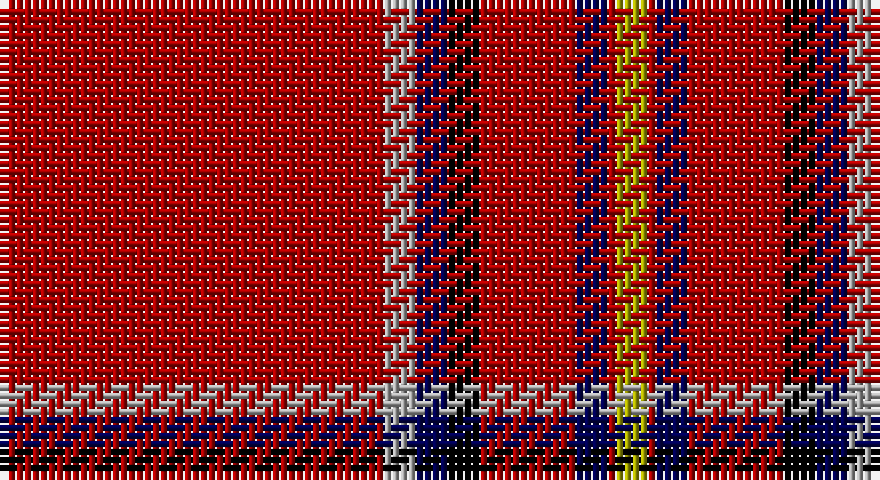

This page is one **sett** — a single exact thread-count. It belongs to the [tartan](/setts/r48lr4db4k4r12db4r1ly4/)
(the same proportion at any scale), whose colour order is pattern [RYBKRBRY](/stripes/rybkrbry/).

Sourced from weddslist.  It is a [8 stripe tartan](/stripes/stripes8/).

Original link http://www.weddslist.com/cgi-bin/tartans/pg.pl?source=x

## Thread count
DR/48 N4 DB4 K4 DR12 DB4 DR1 LG/4

One full sett is **110 threads**.

## Palette

Palette: <strong>Ingles Buchan</strong> <small style="color:#888">(1 of 5 colours)</small>
<table><thead><tr><th>Colour</th><th>Threads</th><th>Shade</th><th>Base</th><th>OKLCh</th></tr></thead><tbody><tr><td>DR/</td><td style="text-align:right;font-variant-numeric:tabular-nums">48</td><td><code style="background-color:#AA0000;">#AA0000</code> <small style="color:#888">#AA0000</small></td><td>R <code style="background-color:#CC0000;">#CC0000</code></td><td><small style="color:#888">oklch(46.3% 0.190 29.2)</small></td></tr><tr><td>N</td><td style="text-align:right;font-variant-numeric:tabular-nums">4</td><td><code style="background-color:#AAAAAA;">#AAAAAA</code> <small style="color:#888">#AAAAAA</small></td><td>Y <code style="background-color:#F2BF00;">#F2BF00</code></td><td><small style="color:#888">oklch(73.8% 0.000 89.9)</small></td></tr><tr><td>DB</td><td style="text-align:right;font-variant-numeric:tabular-nums">4</td><td><code style="background-color:#000052;">#000052</code> <small style="color:#888">#000052</small></td><td>B <code style="background-color:#2A418A;">#2A418A</code></td><td><small style="color:#888">oklch(19.8% 0.137 264.1)</small></td></tr><tr><td>K</td><td style="text-align:right;font-variant-numeric:tabular-nums">4</td><td><code style="background-color:#000000;">#000000</code> <small style="color:#888">#000000</small></td><td>K <code style="background-color:#000000;">#000000</code></td><td><small style="color:#888">oklch(0.0% 0.000 0.0)</small></td></tr><tr><td>DR</td><td style="text-align:right;font-variant-numeric:tabular-nums">12</td><td><code style="background-color:#AA0000;">#AA0000</code> <small style="color:#888">#AA0000</small></td><td>R <code style="background-color:#CC0000;">#CC0000</code></td><td><small style="color:#888">oklch(46.3% 0.190 29.2)</small></td></tr><tr><td>DB</td><td style="text-align:right;font-variant-numeric:tabular-nums">4</td><td><code style="background-color:#000052;">#000052</code> <small style="color:#888">#000052</small></td><td>B <code style="background-color:#2A418A;">#2A418A</code></td><td><small style="color:#888">oklch(19.8% 0.137 264.1)</small></td></tr><tr><td>DR</td><td style="text-align:right;font-variant-numeric:tabular-nums">1</td><td><code style="background-color:#AA0000;">#AA0000</code> <small style="color:#888">#AA0000</small></td><td>R <code style="background-color:#CC0000;">#CC0000</code></td><td><small style="color:#888">oklch(46.3% 0.190 29.2)</small></td></tr><tr><td>LG/</td><td style="text-align:right;font-variant-numeric:tabular-nums">4</td><td><code style="background-color:#AAAA00;">#AAAA00</code> <small style="color:#888">#AAAA00</small></td><td>Y <code style="background-color:#F2BF00;">#F2BF00</code></td><td><small style="color:#888">oklch(71.4% 0.156 109.8)</small></td></tr></tbody></table>

# Sample pattern

## Nearest tartans

The nearest existing variants by ΔTartan distance, with this tartan at the top so the swatches line up against it.

ΔTartan

Tartan

Sett

—

<a href="/ttd/edit/#slug=r48lr4db4k4r12db4r1ly4">Brodie</a> <a class="nn-out" href="/variants/s8/r48lr4db4k4r12db4r1ly4/" title="open its dictionary page">↗</a>

0.00

<a href="/ttd/edit/#slug=r48lr4db4k4r12db4r1ly4~x2&amp;base=r48lr4db4k4r12db4r1ly4">Brodie</a> <a class="nn-out" href="/variants/s8/r48lr4db4k4r12db4r1ly4~x2/" title="open its dictionary page">↗</a>

0.83

<a href="/ttd/edit/#slug=r48lb4db4k4r12db4r1ly4&amp;base=r48lr4db4k4r12db4r1ly4">Brodie</a> <a class="nn-out" href="/variants/s8/r48lb4db4k4r12db4r1ly4/" title="open its dictionary page">↗</a>

0.93

<a href="/ttd/edit/#slug=r48w4db4k4r12db4r1ly4~x2&amp;base=r48lr4db4k4r12db4r1ly4">Brodie (W &amp; A Smith)</a> <a class="nn-out" href="/variants/s8/r48w4db4k4r12db4r1ly4~x2/" title="open its dictionary page">↗</a>

0.95

<a href="/ttd/edit/#slug=r70b1r2g12k2g1k10w1~x2&amp;base=r48lr4db4k4r12db4r1ly4">Zamzam (Personal)</a> <a class="nn-out" href="/variants/s8/r70b1r2g12k2g1k10w1~x2/" title="open its dictionary page">↗</a>

1.01

<a href="/ttd/edit/#slug=r72db6ly2db11t2db2t2r9k2~x2&amp;base=r48lr4db4k4r12db4r1ly4">Junor (Personal)</a> <a class="nn-out" href="/variants/s9/r72db6ly2db11t2db2t2r9k2~x2/" title="open its dictionary page">↗</a>

1.12

<a href="/ttd/edit/#slug=r72k6lb2k11ly2db2ly2r18~x2&amp;base=r48lr4db4k4r12db4r1ly4">Princess Elizabeth (Royal)</a> <a class="nn-out" href="/variants/s8/r72k6lb2k11ly2db2ly2r18~x2/" title="open its dictionary page">↗</a>

1.12

<a href="/ttd/edit/#slug=r70k2ly1dg18r10k4t4w1~x2&amp;base=r48lr4db4k4r12db4r1ly4">MacIngust</a> <a class="nn-out" href="/variants/s8/r70k2ly1dg18r10k4t4w1~x2/" title="open its dictionary page">↗</a>

1.14

<a href="/ttd/edit/#slug=ri90lr1k2lb10k5r2lr2lb2~x2&amp;base=r48lr4db4k4r12db4r1ly4">Lock in Northumberland (Name)</a> <a class="nn-out" href="/variants/s8/ri90lr1k2lb10k5r2lr2lb2~x2/" title="open its dictionary page">↗</a>

1.15

<a href="/ttd/edit/#slug=r42k4w1k6ly1db1ly1r12~x2&amp;base=r48lr4db4k4r12db4r1ly4">Princess Elizabeth</a> <a class="nn-out" href="/variants/s8/r42k4w1k6ly1db1ly1r12~x2/" title="open its dictionary page">↗</a>

1.18

<a href="/ttd/edit/#slug=r36db3w1db6g1k1g1r9~x4&amp;base=r48lr4db4k4r12db4r1ly4">Inverness - 1829 (District)</a> <a class="nn-out" href="/variants/s8/r36db3w1db6g1k1g1r9~x4/" title="open its dictionary page">↗</a>

## Neighbour map

Every grey dot is one of 14360 variants placed by the first two principal components of the ΔTartan feature space (44% of its variance). Red is this tartan; blue dots are its nearest — click one to open its page.

<svg viewBox="0 0 640 380" role="img" style="max-width:100%;height:auto;border:1px solid #e0e0e0;border-radius:4px;display:block" xmlns="http://www.w3.org/2000/svg"><image href="/nn/cloud.v1.png" width="640" height="380"/><a href="/variants/s8/r48lr4db4k4r12db4r1ly4~x2/"><circle cx="516.0" cy="81.2" r="4" fill="#3465a4"><title>Brodie</title></circle></a><a href="/variants/s8/r48lb4db4k4r12db4r1ly4/"><circle cx="502.1" cy="68.1" r="4" fill="#3465a4"><title>Brodie</title></circle></a><a href="/variants/s8/r48w4db4k4r12db4r1ly4~x2/"><circle cx="497.1" cy="65.8" r="4" fill="#3465a4"><title>Brodie (W &amp; A Smith)</title></circle></a><a href="/variants/s8/r70b1r2g12k2g1k10w1~x2/"><circle cx="525.6" cy="67.4" r="4" fill="#3465a4"><title>Zamzam (Personal)</title></circle></a><a href="/variants/s9/r72db6ly2db11t2db2t2r9k2~x2/"><circle cx="526.4" cy="70.4" r="4" fill="#3465a4"><title>Junor (Personal)</title></circle></a><a href="/variants/s8/r72k6lb2k11ly2db2ly2r18~x2/"><circle cx="549.6" cy="84.6" r="4" fill="#3465a4"><title>Princess Elizabeth (Royal)</title></circle></a><a href="/variants/s8/r70k2ly1dg18r10k4t4w1~x2/"><circle cx="502.0" cy="60.2" r="4" fill="#3465a4"><title>MacIngust</title></circle></a><a href="/variants/s8/ri90lr1k2lb10k5r2lr2lb2~x2/"><circle cx="579.1" cy="65.6" r="4" fill="#3465a4"><title>Lock in Northumberland (Name)</title></circle></a><a href="/variants/s8/r42k4w1k6ly1db1ly1r12~x2/"><circle cx="542.8" cy="72.1" r="4" fill="#3465a4"><title>Princess Elizabeth</title></circle></a><a href="/variants/s8/r36db3w1db6g1k1g1r9~x4/"><circle cx="555.2" cy="91.7" r="4" fill="#3465a4"><title>Inverness - 1829 (District)</title></circle></a><circle cx="516.0" cy="81.2" r="5" fill="#c00000"/></svg>

ID: /variants/s8/r48lr4db4k4r12db4r1ly4/
