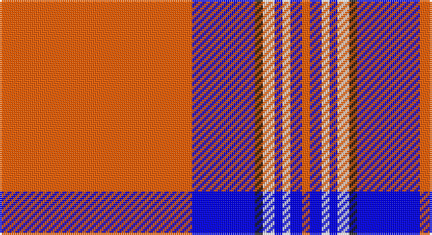

This page is one **sett** — a single exact thread-count. It belongs to the [tartan](/setts/r49b16k2w3b2w2b3r2/)
(the same proportion at any scale), whose colour order is pattern [RBKWBWBR](/stripes/rbkwbwbr/).

Sourced from register-of-tartans.  It is a [8 stripe tartan](/stripes/stripes8/).

Original link https://www.tartanregister.gov.uk/tartanDetails.aspx?ref=1856

## Register references

External register numbers recorded for this tartan.

- Scottish Register of Tartans: [1856](https://www.tartanregister.gov.uk/tartanDetails.aspx?ref=1856)
- Scottish Tartans Authority (ITI): 2395
- Scottish Tartans World Register: 2395

## Thread count
R/98 B32 K4 W6 B4 W4 B6 R/4

One full sett is **214 threads**.

## Palette

Palette: <strong>Tartan Register</strong> <small style="color:#888">(3 of 4 colours)</small>
<table><thead><tr><th>Colour</th><th>Threads</th><th>Shade</th><th>Base</th><th>OKLCh</th></tr></thead><tbody><tr><td>R/</td><td style="text-align:right;font-variant-numeric:tabular-nums">98</td><td><code style="background-color:#FF5F04;">#FF5F04</code> <small style="color:#888">#FF5F04</small></td><td>R <code style="background-color:#CC0000;">#CC0000</code></td><td><small style="color:#888">oklch(68.7% 0.209 41.2)</small></td></tr><tr><td>B</td><td style="text-align:right;font-variant-numeric:tabular-nums">32</td><td><code style="background-color:#0000FF;">#0000FF</code> <small style="color:#888">#0000FF</small></td><td>B <code style="background-color:#2A418A;">#2A418A</code></td><td><small style="color:#888">oklch(45.2% 0.313 264.1)</small></td></tr><tr><td>K</td><td style="text-align:right;font-variant-numeric:tabular-nums">4</td><td><code style="background-color:#101010;">#101010</code> <small style="color:#888">#101010</small></td><td>K <code style="background-color:#000000;">#000000</code></td><td><small style="color:#888">oklch(17.3% 0.000 89.9)</small></td></tr><tr><td>W</td><td style="text-align:right;font-variant-numeric:tabular-nums">6</td><td><code style="background-color:#FCFCFC;">#FCFCFC</code> <small style="color:#888">#FCFCFC</small></td><td>W <code style="background-color:#F7F7F7;">#F7F7F7</code></td><td><small style="color:#888">oklch(99.1% 0.000 89.9)</small></td></tr><tr><td>B</td><td style="text-align:right;font-variant-numeric:tabular-nums">4</td><td><code style="background-color:#0000FF;">#0000FF</code> <small style="color:#888">#0000FF</small></td><td>B <code style="background-color:#2A418A;">#2A418A</code></td><td><small style="color:#888">oklch(45.2% 0.313 264.1)</small></td></tr><tr><td>W</td><td style="text-align:right;font-variant-numeric:tabular-nums">4</td><td><code style="background-color:#FCFCFC;">#FCFCFC</code> <small style="color:#888">#FCFCFC</small></td><td>W <code style="background-color:#F7F7F7;">#F7F7F7</code></td><td><small style="color:#888">oklch(99.1% 0.000 89.9)</small></td></tr><tr><td>B</td><td style="text-align:right;font-variant-numeric:tabular-nums">6</td><td><code style="background-color:#0000FF;">#0000FF</code> <small style="color:#888">#0000FF</small></td><td>B <code style="background-color:#2A418A;">#2A418A</code></td><td><small style="color:#888">oklch(45.2% 0.313 264.1)</small></td></tr><tr><td>R/</td><td style="text-align:right;font-variant-numeric:tabular-nums">4</td><td><code style="background-color:#FF5F04;">#FF5F04</code> <small style="color:#888">#FF5F04</small></td><td>R <code style="background-color:#CC0000;">#CC0000</code></td><td><small style="color:#888">oklch(68.7% 0.209 41.2)</small></td></tr></tbody></table>

# Sample pattern

## Nearest tartans

The nearest existing variants by ΔTartan distance, with this tartan at the top so the swatches line up against it.

ΔTartan

Tartan

Sett

—

<a href="/ttd/edit/#slug=r49b16k2w3b2w2b3r2~x2">Irn Bru</a> <a class="nn-out" href="/variants/s8/r49b16k2w3b2w2b3r2~x2/" title="open its dictionary page">↗</a>

1.07

<a href="/ttd/edit/#slug=o49db16k2w3db2w2db3o2~x2&amp;base=r49b16k2w3b2w2b3r2~x2">Irn Bru (Corporate)</a> <a class="nn-out" href="/variants/s8/o49db16k2w3db2w2db3o2~x2/" title="open its dictionary page">↗</a>

1.42

<a href="/ttd/edit/#slug=lo49db16k2w3db2w2db3lo2~x2&amp;base=r49b16k2w3b2w2b3r2~x2">Irn Bru Corporate Tartan</a> <a class="nn-out" href="/variants/s8/lo49db16k2w3db2w2db3lo2~x2/" title="open its dictionary page">↗</a>

1.52

<a href="/ttd/edit/#slug=r50db14w6db9ly3db4r4~x2&amp;base=r49b16k2w3b2w2b3r2~x2">Texas Lone Star</a> <a class="nn-out" href="/variants/s7/r50db14w6db9ly3db4r4~x2/" title="open its dictionary page">↗</a>

1.53

<a href="/ttd/edit/#slug=lo98db32k3w6db4w4db6lo4&amp;base=r49b16k2w3b2w2b3r2~x2">Irn Bru</a> <a class="nn-out" href="/variants/s8/lo98db32k3w6db4w4db6lo4/" title="open its dictionary page">↗</a>

1.58

<a href="/ttd/edit/#slug=r52lo2db16lo2db3w5~x2&amp;base=r49b16k2w3b2w2b3r2~x2">Brock University Alumni Association</a> <a class="nn-out" href="/variants/s6/r52lo2db16lo2db3w5~x2/" title="open its dictionary page">↗</a>

1.66

<a href="/ttd/edit/#slug=r2w28db4w2k6w2r4k1r2w1~x2&amp;base=r49b16k2w3b2w2b3r2~x2">Rothesay, Dress (VS)</a> <a class="nn-out" href="/variants/s10/r2w28db4w2k6w2r4k1r2w1~x2/" title="open its dictionary page">↗</a>

1.78

<a href="/ttd/edit/#slug=w3db1w30db1p28w1p1w3~x2&amp;base=r49b16k2w3b2w2b3r2~x2">Dunlop, dress</a> <a class="nn-out" href="/variants/s8/w3db1w30db1p28w1p1w3~x2/" title="open its dictionary page">↗</a>

1.88

<a href="/ttd/edit/#slug=t5k1w11k1r42k1~x2&amp;base=r49b16k2w3b2w2b3r2~x2">Davet (2014)</a> <a class="nn-out" href="/variants/s6/t5k1w11k1r42k1~x2/" title="open its dictionary page">↗</a>

1.88

<a href="/ttd/edit/#slug=r50db14w6db9lo3db4r4~x2&amp;base=r49b16k2w3b2w2b3r2~x2">Texas Lone Star (Fashion)</a> <a class="nn-out" href="/variants/s7/r50db14w6db9lo3db4r4~x2/" title="open its dictionary page">↗</a>

1.89

<a href="/ttd/edit/#slug=ly27k4w4r64w4r4k4r4k12~x2&amp;base=r49b16k2w3b2w2b3r2~x2">O'Meehan (Name)</a> <a class="nn-out" href="/variants/s9/ly27k4w4r64w4r4k4r4k12~x2/" title="open its dictionary page">↗</a>

## Neighbour map

Every grey dot is one of 14360 variants placed by the first two principal components of the ΔTartan feature space (44% of its variance). Red is this tartan; blue dots are its nearest — click one to open its page.

<svg viewBox="0 0 640 380" role="img" style="max-width:100%;height:auto;border:1px solid #e0e0e0;border-radius:4px;display:block" xmlns="http://www.w3.org/2000/svg"><image href="/nn/cloud.v1.png" width="640" height="380"/><a href="/variants/s8/o49db16k2w3db2w2db3o2~x2/"><circle cx="418.0" cy="99.1" r="4" fill="#3465a4"><title>Irn Bru (Corporate)</title></circle></a><a href="/variants/s8/lo49db16k2w3db2w2db3lo2~x2/"><circle cx="412.4" cy="102.8" r="4" fill="#3465a4"><title>Irn Bru Corporate Tartan</title></circle></a><a href="/variants/s7/r50db14w6db9ly3db4r4~x2/"><circle cx="348.6" cy="124.0" r="4" fill="#3465a4"><title>Texas Lone Star</title></circle></a><a href="/variants/s8/lo98db32k3w6db4w4db6lo4/"><circle cx="426.6" cy="86.1" r="4" fill="#3465a4"><title>Irn Bru</title></circle></a><a href="/variants/s6/r52lo2db16lo2db3w5~x2/"><circle cx="419.0" cy="119.9" r="4" fill="#3465a4"><title>Brock University Alumni Association</title></circle></a><a href="/variants/s10/r2w28db4w2k6w2r4k1r2w1~x2/"><circle cx="360.9" cy="78.2" r="4" fill="#3465a4"><title>Rothesay, Dress (VS)</title></circle></a><a href="/variants/s8/w3db1w30db1p28w1p1w3~x2/"><circle cx="375.1" cy="107.8" r="4" fill="#3465a4"><title>Dunlop, dress</title></circle></a><a href="/variants/s6/t5k1w11k1r42k1~x2/"><circle cx="462.6" cy="91.0" r="4" fill="#3465a4"><title>Davet (2014)</title></circle></a><a href="/variants/s7/r50db14w6db9lo3db4r4~x2/"><circle cx="371.1" cy="139.4" r="4" fill="#3465a4"><title>Texas Lone Star (Fashion)</title></circle></a><a href="/variants/s9/ly27k4w4r64w4r4k4r4k12~x2/"><circle cx="325.6" cy="110.0" r="4" fill="#3465a4"><title>O'Meehan (Name)</title></circle></a><circle cx="401.1" cy="90.4" r="5" fill="#c00000"/></svg>

ID: /variants/s8/r49b16k2w3b2w2b3r2~x2/
