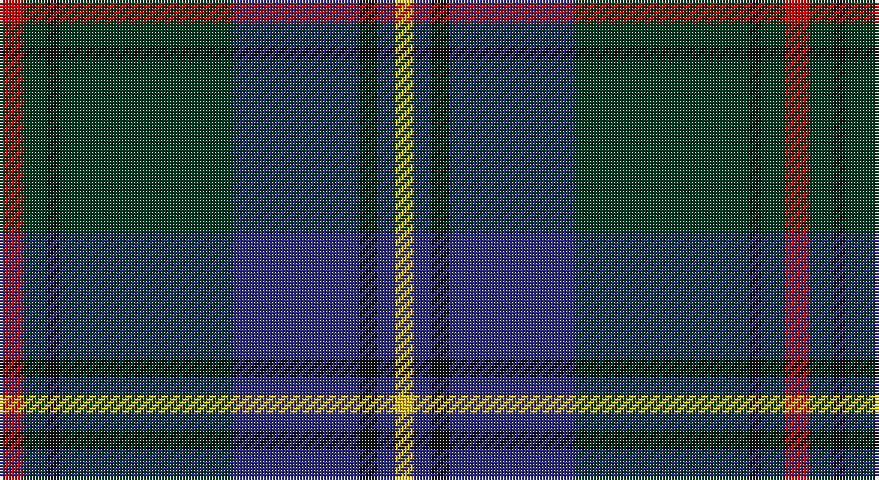

This page is one **sett** — a single exact thread-count. It belongs to the [tartan](/setts/r4dg4k2dg29db21k3db3ly3/)
(the same proportion at any scale), whose colour order is pattern [RGKGBKBY](/stripes/rgkgbkby/).

Part of the [Peter of Lee](/tartans/peter-of-lee/) tartan — the named design grouping this sett with its other cloths.

Sourced from tartans-authority.  It is a [8 stripe tartan](/stripes/stripes8/).

Original link http://www.tartansauthority.com/tartan-ferret/display/5507/

## Register references

External register numbers recorded for this tartan.

- Scottish Tartans Authority (ITI): 5507

## Thread count
R/8 DG8 K4 DG58 DB42 K6 DB6 Y/6

One full sett is **262 threads**.

## Palette

Palette: <strong>Tartan Register</strong>
<table><thead><tr><th>Colour</th><th>Threads</th><th>Shade</th><th>Base</th><th>OKLCh</th></tr></thead><tbody><tr><td>R/</td><td style="text-align:right;font-variant-numeric:tabular-nums">8</td><td><code style="background-color:#C80000;">#C80000</code> <small style="color:#888">#C80000</small></td><td>R <code style="background-color:#CC0000;">#CC0000</code></td><td><small style="color:#888">oklch(52.3% 0.215 29.2)</small></td></tr><tr><td>DG</td><td style="text-align:right;font-variant-numeric:tabular-nums">8</td><td><code style="background-color:#003820;">#003820</code> <small style="color:#888">#003820</small></td><td>G <code style="background-color:#006100;">#006100</code></td><td><small style="color:#888">oklch(30.0% 0.070 158.3)</small></td></tr><tr><td>K</td><td style="text-align:right;font-variant-numeric:tabular-nums">4</td><td><code style="background-color:#101010;">#101010</code> <small style="color:#888">#101010</small></td><td>K <code style="background-color:#000000;">#000000</code></td><td><small style="color:#888">oklch(17.3% 0.000 89.9)</small></td></tr><tr><td>DG</td><td style="text-align:right;font-variant-numeric:tabular-nums">58</td><td><code style="background-color:#003820;">#003820</code> <small style="color:#888">#003820</small></td><td>G <code style="background-color:#006100;">#006100</code></td><td><small style="color:#888">oklch(30.0% 0.070 158.3)</small></td></tr><tr><td>DB</td><td style="text-align:right;font-variant-numeric:tabular-nums">42</td><td><code style="background-color:#2C2C80;">#2C2C80</code> <small style="color:#888">#2C2C80</small></td><td>B <code style="background-color:#2A418A;">#2A418A</code></td><td><small style="color:#888">oklch(35.0% 0.138 276.6)</small></td></tr><tr><td>K</td><td style="text-align:right;font-variant-numeric:tabular-nums">6</td><td><code style="background-color:#101010;">#101010</code> <small style="color:#888">#101010</small></td><td>K <code style="background-color:#000000;">#000000</code></td><td><small style="color:#888">oklch(17.3% 0.000 89.9)</small></td></tr><tr><td>DB</td><td style="text-align:right;font-variant-numeric:tabular-nums">6</td><td><code style="background-color:#2C2C80;">#2C2C80</code> <small style="color:#888">#2C2C80</small></td><td>B <code style="background-color:#2A418A;">#2A418A</code></td><td><small style="color:#888">oklch(35.0% 0.138 276.6)</small></td></tr><tr><td>Y/</td><td style="text-align:right;font-variant-numeric:tabular-nums">6</td><td><code style="background-color:#E8C000;">#E8C000</code> <small style="color:#888">#E8C000</small></td><td>Y <code style="background-color:#F2BF00;">#F2BF00</code></td><td><small style="color:#888">oklch(81.9% 0.168 93.7)</small></td></tr></tbody></table>

# Sample pattern

## Compared to the master

This cloth is one sett of its design; the master sett (the exemplar the design is anchored on) is below for comparison.

<figure style="margin:0"><figcaption style="color:#888;font-size:smaller">this sett</figcaption></figure>
<figure style="margin:0"><figcaption style="color:#888;font-size:smaller"><a href="/setts/db3k3db21dg29k2dg4r4dg4k2dg29db21k3db3ly3/">master sett →</a></figcaption></figure>

## Nearest tartans

The nearest existing variants by ΔTartan distance, with this tartan at the top so the swatches line up against it.

ΔTartan

Tartan

Sett

—

<a href="/ttd/edit/#slug=r4dg4k2dg29db21k3db3ly3~x2">Peter of Lee (Chief) (Personal)</a> <a class="nn-out" href="/variants/s8/r4dg4k2dg29db21k3db3ly3~x2/" title="open its dictionary page">↗</a>

0.80

<a href="/ttd/edit/#slug=dr4dg27o2db25lo5dg3o3~x2&amp;base=r4dg4k2dg29db21k3db3ly3~x2">Kilkenny, County (District)</a> <a class="nn-out" href="/variants/s7/dr4dg27o2db25lo5dg3o3~x2/" title="open its dictionary page">↗</a>

0.89

<a href="/variants/s8/dt30lb2k6db3r3~x4/">Edinburgh Crystal Corporate Tartan</a>

0.90

<a href="/ttd/edit/#slug=lb2dt19k4dt4k4g9db2k1~x4&amp;base=r4dg4k2dg29db21k3db3ly3~x2">Dollar Academy (1999)</a> <a class="nn-out" href="/variants/s8/lb2dt19k4dt4k4g9db2k1~x4/" title="open its dictionary page">↗</a>

0.95

<a href="/ttd/edit/#slug=r2db12dg2g11dg4db5g2dg24w2~x2&amp;base=r4dg4k2dg29db21k3db3ly3~x2">Fraser Gathering, Green (1997)</a> <a class="nn-out" href="/variants/s9/r2db12dg2g11dg4db5g2dg24w2~x2/" title="open its dictionary page">↗</a>

1.01

<a href="/ttd/edit/#slug=lb4dt38g6dr2g6dr36lo2dr3~x2&amp;base=r4dg4k2dg29db21k3db3ly3~x2">Scotland 2000 (Commemorative)</a> <a class="nn-out" href="/variants/s8/lb4dt38g6dr2g6dr36lo2dr3~x2/" title="open its dictionary page">↗</a>

1.05

<a href="/ttd/edit/#slug=dp6r2dp1g25db16k2db4~x2&amp;base=r4dg4k2dg29db21k3db3ly3~x2">Laurie Clan Tartan</a> <a class="nn-out" href="/variants/s7/dp6r2dp1g25db16k2db4~x2/" title="open its dictionary page">↗</a>

1.05

<a href="/ttd/edit/#slug=w2n4dy3dt3dy3dt20dy3n16dt8lt2~x2&amp;base=r4dg4k2dg29db21k3db3ly3~x2">Sverker</a> <a class="nn-out" href="/variants/s10/w2n4dy3dt3dy3dt20dy3n16dt8lt2~x2/" title="open its dictionary page">↗</a>

1.06

<a href="/ttd/edit/#slug=dp6ly2dp1g25db16k2db4~x2&amp;base=r4dg4k2dg29db21k3db3ly3~x2">Lowry</a> <a class="nn-out" href="/variants/s7/dp6ly2dp1g25db16k2db4~x2/" title="open its dictionary page">↗</a>

1.08

<a href="/ttd/edit/#slug=dg15db20k2r4k2db20dg15k2ly2~x2&amp;base=r4dg4k2dg29db21k3db3ly3~x2">Manroth (Personal)</a> <a class="nn-out" href="/variants/s9/dg15db20k2r4k2db20dg15k2ly2~x2/" title="open its dictionary page">↗</a>

1.09

<a href="/ttd/edit/#slug=dp6o2dp1g25db16k2db4~x2&amp;base=r4dg4k2dg29db21k3db3ly3~x2">Lawrie Clan Tartan</a> <a class="nn-out" href="/variants/s7/dp6o2dp1g25db16k2db4~x2/" title="open its dictionary page">↗</a>

## Neighbour map

Every grey dot is one of 14360 variants placed by the first two principal components of the ΔTartan feature space (44% of its variance). Red is this tartan; blue dots are its nearest — click one to open its page.

<svg viewBox="0 0 640 380" role="img" style="max-width:100%;height:auto;border:1px solid #e0e0e0;border-radius:4px;display:block" xmlns="http://www.w3.org/2000/svg"><image href="/nn/cloud.v1.png" width="640" height="380"/><a href="/variants/s7/dr4dg27o2db25lo5dg3o3~x2/"><circle cx="282.7" cy="195.6" r="4" fill="#3465a4"><title>Kilkenny, County (District)</title></circle></a><a href="/variants/s8/dt30lb2k6db3r3~x4/"><circle cx="330.7" cy="165.2" r="4" fill="#3465a4"><title>Edinburgh Crystal Corporate Tartan</title></circle></a><a href="/variants/s8/lb2dt19k4dt4k4g9db2k1~x4/"><circle cx="306.2" cy="182.9" r="4" fill="#3465a4"><title>Dollar Academy (1999)</title></circle></a><a href="/variants/s9/r2db12dg2g11dg4db5g2dg24w2~x2/"><circle cx="251.1" cy="183.7" r="4" fill="#3465a4"><title>Fraser Gathering, Green (1997)</title></circle></a><a href="/variants/s8/lb4dt38g6dr2g6dr36lo2dr3~x2/"><circle cx="292.7" cy="157.5" r="4" fill="#3465a4"><title>Scotland 2000 (Commemorative)</title></circle></a><a href="/variants/s7/dp6r2dp1g25db16k2db4~x2/"><circle cx="299.5" cy="166.8" r="4" fill="#3465a4"><title>Laurie Clan Tartan</title></circle></a><a href="/variants/s10/w2n4dy3dt3dy3dt20dy3n16dt8lt2~x2/"><circle cx="255.4" cy="184.5" r="4" fill="#3465a4"><title>Sverker</title></circle></a><a href="/variants/s7/dp6ly2dp1g25db16k2db4~x2/"><circle cx="303.8" cy="170.1" r="4" fill="#3465a4"><title>Lowry</title></circle></a><a href="/variants/s9/dg15db20k2r4k2db20dg15k2ly2~x2/"><circle cx="270.4" cy="203.4" r="4" fill="#3465a4"><title>Manroth (Personal)</title></circle></a><a href="/variants/s7/dp6o2dp1g25db16k2db4~x2/"><circle cx="304.5" cy="170.4" r="4" fill="#3465a4"><title>Lawrie Clan Tartan</title></circle></a><circle cx="297.5" cy="177.0" r="5" fill="#c00000"/></svg>

ID: /variants/s8/r4dg4k2dg29db21k3db3ly3~x2/
