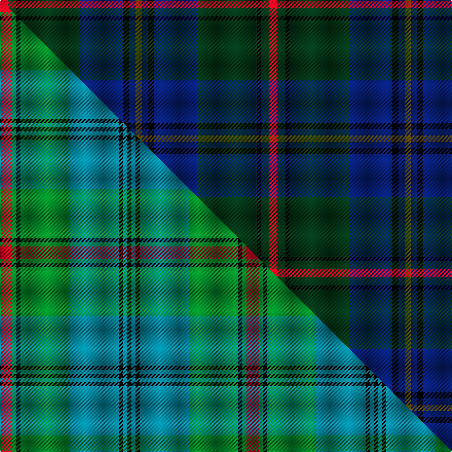

This page is one **sett** — a single exact thread-count. It belongs to the [tartan](/setts/r4dg4k2dg29db21k3db3y3/)
(the same proportion at any scale), whose colour order is pattern [GBKBGKGR](/stripes/gbkbgkgr/).

Part of the [Peter of Lee](/tartans/peter-of-lee/) tartan — the named design grouping this sett with its other cloths.

Sourced from tartans-authority.  It is a [8 stripe tartan](/stripes/stripes8/).

Original link http://www.tartansauthority.com/tartan-ferret/display/5507/

## Register references

External register numbers recorded for this tartan.

- Scottish Tartans Authority (ITI): 5507

## Thread count
R/8 DG8 K4 DG58 DB42 K6 DB6 Y/6

One full sett is **262 threads**.

## Palette
<table><thead><tr><th>Colour</th><th>Shade</th><th>OKLCh</th></tr></thead><tbody><tr><td>DB</td><td><code style="background-color:#082077;">#082077</code> <small style="color:#888">#082077</small></td><td><small style="color:#888">oklch(30.0% 0.149 265.1)</small></td></tr><tr><td>DG</td><td><code style="background-color:#053819;">#053819</code> <small style="color:#888">#053819</small></td><td><small style="color:#888">oklch(30.0% 0.075 151.3)</small></td></tr><tr><td>K</td><td><code style="background-color:#000000;">#000000</code> <small style="color:#888">#000000</small></td><td><small style="color:#888">oklch(0.0% 0.000 0.0)</small></td></tr><tr><td>R</td><td><code style="background-color:#D60020;">#D60020</code> <small style="color:#888">#D60020</small></td><td><small style="color:#888">oklch(55.2% 0.224 25.5)</small></td></tr><tr><td>Y</td><td><code style="background-color:#8B6E00;">#8B6E00</code> <small style="color:#888">#8B6E00</small></td><td><small style="color:#888">oklch(55.1% 0.113 90.4)</small></td></tr></tbody></table>

# Sample pattern

## Compared to the master

This cloth is one sett of its design; the master sett (the exemplar the design is anchored on) is below for comparison.

Its **ΔTartan distance** from the master is **2.60** — the same measure the nearest-tartans table ranks by (0 is identical; a re-scale of the same cloth is near 0, a recolour or a different proportion further).

<figure class="master-compare" style="margin:0">

this sett
master sett ★

<figcaption style="color:#888;font-size:smaller">One weave of this sett against the <a href="/setts/r3g1k1g12t12k1t1k1/">master sett ★</a>, split on the diagonal: a shared proportion runs seamlessly across it with only the shades shifting; a different proportion breaks on it.</figcaption>
</figure>

## Nearest variants

The nearest existing variants by ΔTartan distance, with this cloth at the top so the swatches line up against it.

ΔTartan

Threads

Variant

Sett

—

262

<a href="/variants/s8/r4dg4k2dg29db21k3db3y3~x2/">Peter of Lee (Chief) (Personal)</a>

<a href="/ttd/edit/#slug=r4dg3k2dg38db30k3db3k3~x2&amp;base=r4dg4k2dg29db21k3db3y3~x2" title="compare in the TTD">0.63</a>

330

<a href="/variants/s8/r4dg3k2dg38db30k3db3k3~x2/">Peter of Lee</a>

<a href="/ttd/edit/#slug=db4k3db28w2dp6dg28n2dg4dp4~x2~dg1806142-n1805302&amp;base=r4dg4k2dg29db21k3db3y3~x2" title="compare in the TTD">1.95</a>

308

<a href="/variants/s9/db4k3db28w2dp6dg28n2dg4dp4~x2~dg1806142-n1805302/">Canmore</a>

<a href="/ttd/edit/#slug=dg30db6r2db2dy2db15w2~x2&amp;base=r4dg4k2dg29db21k3db3y3~x2" title="compare in the TTD">2.06</a>

172

<a href="/variants/s7/dg30db6r2db2dy2db15w2~x2/">Hydesville Tower (Corporate)</a>

<a href="/ttd/edit/#slug=dg15db20k2r4k2db20dg15k2dy2~x2&amp;base=r4dg4k2dg29db21k3db3y3~x2" title="compare in the TTD">2.24</a>

294

<a href="/variants/s9/dg15db20k2r4k2db20dg15k2dy2~x2/">Manroth (Personal)</a>

<a href="/ttd/edit/#slug=dg27dr2dg4o15db26k2db6~x2~dg1703114&amp;base=r4dg4k2dg29db21k3db3y3~x2" title="compare in the TTD">2.24</a>

262

<a href="/variants/s7/dg27dr2dg4o15db26k2db6~x2~dg1703114/">Bailies of Bennachie Corporate Tartan</a>

<a href="/ttd/edit/#slug=dp6ly2dp1dg25db16k2db4~x2&amp;base=r4dg4k2dg29db21k3db3y3~x2" title="compare in the TTD">2.38</a>

204

<a href="/variants/s7/dp6ly2dp1dg25db16k2db4~x2/">Lowry</a>

<a href="/ttd/edit/#slug=dg4dr2dg20db8k8db4lb1lo2k1~x2&amp;base=r4dg4k2dg29db21k3db3y3~x2" title="compare in the TTD">2.48</a>

190

<a href="/variants/s9/dg4dr2dg20db8k8db4lb1lo2k1~x2/">Dodd of Branford (Name)</a>

<a href="/ttd/edit/#slug=o4dg9w2dg24db37r3~x2&amp;base=r4dg4k2dg29db21k3db3y3~x2" title="compare in the TTD">2.51</a>

302

<a href="/variants/s6/o4dg9w2dg24db37r3~x2/">Hardie (Name)</a>

<a href="/ttd/edit/#slug=dr4dg27o2db25ly5dg3o3~x2&amp;base=r4dg4k2dg29db21k3db3y3~x2" title="compare in the TTD">2.57</a>

262

<a href="/variants/s7/dr4dg27o2db25ly5dg3o3~x2/">Kilkenny, County (District)</a>

<a href="/ttd/edit/#slug=db50dg26k9dg4w2r2dg10~x2&amp;base=r4dg4k2dg29db21k3db3y3~x2" title="compare in the TTD">2.58</a>

292

<a href="/variants/s7/db50dg26k9dg4w2r2dg10~x2/">Java St Andrew Society hunting</a>

## Neighbour map

Every grey dot is one of 13620 variants placed by the first two principal components of the ΔTartan feature space (42% of its variance). Red is this tartan; blue dots are its nearest — click one to open its page.

<svg viewBox="0 0 640 380" role="img" style="max-width:100%;height:auto;border:1px solid #e0e0e0;border-radius:4px;display:block" xmlns="http://www.w3.org/2000/svg"><image href="/nn/cloud.v1.png" width="640" height="380"/><a href="/variants/s8/r4dg3k2dg38db30k3db3k3~x2/"><circle cx="351.4" cy="159.2" r="4" fill="#3465a4"><title>Peter of Lee</title></circle></a><a href="/variants/s9/db4k3db28w2dp6dg28n2dg4dp4~x2~dg1806142-n1805302/"><circle cx="220.6" cy="140.3" r="4" fill="#3465a4"><title>Canmore</title></circle></a><a href="/variants/s7/dg30db6r2db2dy2db15w2~x2/"><circle cx="358.0" cy="179.1" r="4" fill="#3465a4"><title>Hydesville Tower (Corporate)</title></circle></a><a href="/variants/s9/dg15db20k2r4k2db20dg15k2dy2~x2/"><circle cx="297.0" cy="194.7" r="4" fill="#3465a4"><title>Manroth (Personal)</title></circle></a><a href="/variants/s7/dg27dr2dg4o15db26k2db6~x2~dg1703114/"><circle cx="252.6" cy="190.1" r="4" fill="#3465a4"><title>Bailies of Bennachie Corporate Tartan</title></circle></a><a href="/variants/s7/dp6ly2dp1dg25db16k2db4~x2/"><circle cx="326.9" cy="162.6" r="4" fill="#3465a4"><title>Lowry</title></circle></a><a href="/variants/s9/dg4dr2dg20db8k8db4lb1lo2k1~x2/"><circle cx="240.8" cy="127.0" r="4" fill="#3465a4"><title>Dodd of Branford (Name)</title></circle></a><a href="/variants/s6/o4dg9w2dg24db37r3~x2/"><circle cx="329.3" cy="183.0" r="4" fill="#3465a4"><title>Hardie (Name)</title></circle></a><a href="/variants/s7/dr4dg27o2db25ly5dg3o3~x2/"><circle cx="278.4" cy="184.1" r="4" fill="#3465a4"><title>Kilkenny, County (District)</title></circle></a><a href="/variants/s7/db50dg26k9dg4w2r2dg10~x2/"><circle cx="330.3" cy="146.9" r="4" fill="#3465a4"><title>Java St Andrew Society hunting</title></circle></a><circle cx="302.4" cy="161.7" r="5" fill="#c00000"/><text x="320" y="376" text-anchor="middle" font-size="11" fill="#999">ground</text><text x="11" y="190" text-anchor="middle" font-size="11" fill="#999" transform="rotate(-90 11 190)">complexity</text></svg>

ID: /variants/s8/r4dg4k2dg29db21k3db3y3~x2/
