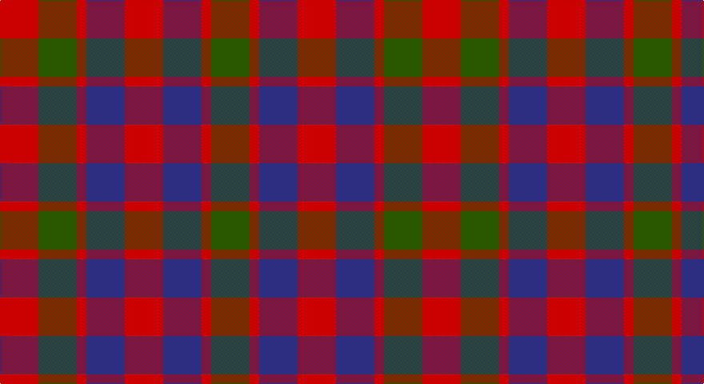

This page is one **sett** — a single exact thread-count. It belongs to the [tartan](/setts/r4dg4r1db4r4/)
(the same proportion at any scale), whose colour order is pattern [GRBRBRGR](/stripes/grbrbrgr/).

Sourced from register-of-tartans.  It is a [8 stripe tartan](/stripes/stripes8/).

Original link https://www.tartanregister.gov.uk/tartanDetails.aspx?ref=1472

## Also known as

This cloth is also recorded under:

- Gow

## Register references

External register numbers recorded for this tartan.

- Scottish Register of Tartans: [1472](https://www.tartanregister.gov.uk/tartanDetails.aspx?ref=1472)
- Scottish Tartans Authority (ITI): 5916

## Thread count
R/48 G48 R12 DB48 R48 DB48 R12 G/48

One full sett is **528 threads**.

## Palette

Palette: <strong>Tartan Register</strong>
<table><thead><tr><th>Colour</th><th>Threads</th><th>Shade</th><th>Base</th><th>OKLCh</th></tr></thead><tbody><tr><td>R/</td><td style="text-align:right;font-variant-numeric:tabular-nums">48</td><td><code style="background-color:#C80000;">#C80000</code> <small style="color:#888">#C80000</small></td><td>R <code style="background-color:#CC0000;">#CC0000</code></td><td><small style="color:#888">oklch(52.3% 0.215 29.2)</small></td></tr><tr><td>G</td><td style="text-align:right;font-variant-numeric:tabular-nums">48</td><td><code style="background-color:#285800;">#285800</code> <small style="color:#888">#285800</small></td><td>G <code style="background-color:#006100;">#006100</code></td><td><small style="color:#888">oklch(41.0% 0.122 135.8)</small></td></tr><tr><td>R</td><td style="text-align:right;font-variant-numeric:tabular-nums">12</td><td><code style="background-color:#C80000;">#C80000</code> <small style="color:#888">#C80000</small></td><td>R <code style="background-color:#CC0000;">#CC0000</code></td><td><small style="color:#888">oklch(52.3% 0.215 29.2)</small></td></tr><tr><td>DB</td><td style="text-align:right;font-variant-numeric:tabular-nums">48</td><td><code style="background-color:#2C2C80;">#2C2C80</code> <small style="color:#888">#2C2C80</small></td><td>B <code style="background-color:#2A418A;">#2A418A</code></td><td><small style="color:#888">oklch(35.0% 0.138 276.6)</small></td></tr><tr><td>R</td><td style="text-align:right;font-variant-numeric:tabular-nums">48</td><td><code style="background-color:#C80000;">#C80000</code> <small style="color:#888">#C80000</small></td><td>R <code style="background-color:#CC0000;">#CC0000</code></td><td><small style="color:#888">oklch(52.3% 0.215 29.2)</small></td></tr><tr><td>DB</td><td style="text-align:right;font-variant-numeric:tabular-nums">48</td><td><code style="background-color:#2C2C80;">#2C2C80</code> <small style="color:#888">#2C2C80</small></td><td>B <code style="background-color:#2A418A;">#2A418A</code></td><td><small style="color:#888">oklch(35.0% 0.138 276.6)</small></td></tr><tr><td>R</td><td style="text-align:right;font-variant-numeric:tabular-nums">12</td><td><code style="background-color:#C80000;">#C80000</code> <small style="color:#888">#C80000</small></td><td>R <code style="background-color:#CC0000;">#CC0000</code></td><td><small style="color:#888">oklch(52.3% 0.215 29.2)</small></td></tr><tr><td>G/</td><td style="text-align:right;font-variant-numeric:tabular-nums">48</td><td><code style="background-color:#285800;">#285800</code> <small style="color:#888">#285800</small></td><td>G <code style="background-color:#006100;">#006100</code></td><td><small style="color:#888">oklch(41.0% 0.122 135.8)</small></td></tr></tbody></table>

# Sample pattern

## Nearest tartans

The nearest existing variants by ΔTartan distance, with this tartan at the top so the swatches line up against it.

ΔTartan

Tartan

Sett

—

<a href="/ttd/edit/#slug=r4dg4r1db4r4~x12">Gow</a> <a class="nn-out" href="/variants/s8/r4dg4r1db4r4~x12/" title="open its dictionary page">↗</a>

0.89

<a href="/variants/s8/r5dp5r1g5r5~x8/">Gow (Portrait)</a>

0.93

<a href="/ttd/edit/#slug=g16r12db16r6db4r6db7r20db8g8db12~x2&amp;base=r4dg4r1db4r4~x12">Fiddes</a> <a class="nn-out" href="/variants/s11/g16r12db16r6db4r6db7r20db8g8db12~x2/" title="open its dictionary page">↗</a>

0.97

<a href="/ttd/edit/#slug=dg16r12db16r6db4r6db7r20db8dg8db12~x2&amp;base=r4dg4r1db4r4~x12">Fiddes #2</a> <a class="nn-out" href="/variants/s11/dg16r12db16r6db4r6db7r20db8dg8db12~x2/" title="open its dictionary page">↗</a>

1.22

<a href="/ttd/edit/#slug=dg14db8dg14r14k3r14~x2&amp;base=r4dg4r1db4r4~x12">Tulsa, City of</a> <a class="nn-out" href="/variants/s6/dg14db8dg14r14k3r14~x2/" title="open its dictionary page">↗</a>

1.33

<a href="/ttd/edit/#slug=o10g14o3db14o10g14o3db4~x2&amp;base=r4dg4r1db4r4~x12">Glasgow District Tartan</a> <a class="nn-out" href="/variants/s8/o10g14o3db14o10g14o3db4~x2/" title="open its dictionary page">↗</a>

1.34

<a href="/variants/s8/dg6dp6y1r6dg6r6y1dp6~x4/">Wilson's No.223</a>

1.34

<a href="/ttd/edit/#slug=db13r4db4r9db14r4db14g15r8g8r4~x2&amp;base=r4dg4r1db4r4~x12">McCaslin</a> <a class="nn-out" href="/variants/s11/db13r4db4r9db14r4db14g15r8g8r4~x2/" title="open its dictionary page">↗</a>

1.35

<a href="/ttd/edit/#slug=r3dg3r3dg10db10r3db3r3~x2&amp;base=r4dg4r1db4r4~x12">Flora MacDonald</a> <a class="nn-out" href="/variants/s8/r3dg3r3dg10db10r3db3r3~x2/" title="open its dictionary page">↗</a>

1.40

<a href="/ttd/edit/#slug=g6dp3k3dp3k3dp3g6r2~x2&amp;base=r4dg4r1db4r4~x12">Wilson's No.137</a> <a class="nn-out" href="/variants/s8/g6dp3k3dp3k3dp3g6r2~x2/" title="open its dictionary page">↗</a>

1.40

<a href="/ttd/edit/#slug=r5g6ly2g6r5b6r2~x2&amp;base=r4dg4r1db4r4~x12">Gleneagles Group</a> <a class="nn-out" href="/variants/s7/r5g6ly2g6r5b6r2~x2/" title="open its dictionary page">↗</a>

## Neighbour map

Every grey dot is one of 14360 variants placed by the first two principal components of the ΔTartan feature space (44% of its variance). Red is this tartan; blue dots are its nearest — click one to open its page.

<svg viewBox="0 0 640 380" role="img" style="max-width:100%;height:auto;border:1px solid #e0e0e0;border-radius:4px;display:block" xmlns="http://www.w3.org/2000/svg"><image href="/nn/cloud.v1.png" width="640" height="380"/><a href="/variants/s8/r5dp5r1g5r5~x8/"><circle cx="187.5" cy="280.4" r="4" fill="#3465a4"><title>Gow (Portrait)</title></circle></a><a href="/variants/s11/g16r12db16r6db4r6db7r20db8g8db12~x2/"><circle cx="195.0" cy="267.2" r="4" fill="#3465a4"><title>Fiddes</title></circle></a><a href="/variants/s11/dg16r12db16r6db4r6db7r20db8dg8db12~x2/"><circle cx="192.4" cy="263.8" r="4" fill="#3465a4"><title>Fiddes #2</title></circle></a><a href="/variants/s6/dg14db8dg14r14k3r14~x2/"><circle cx="182.0" cy="291.5" r="4" fill="#3465a4"><title>Tulsa, City of</title></circle></a><a href="/variants/s8/o10g14o3db14o10g14o3db4~x2/"><circle cx="180.1" cy="274.4" r="4" fill="#3465a4"><title>Glasgow District Tartan</title></circle></a><a href="/variants/s8/dg6dp6y1r6dg6r6y1dp6~x4/"><circle cx="142.4" cy="256.9" r="4" fill="#3465a4"><title>Wilson's No.223</title></circle></a><a href="/variants/s11/db13r4db4r9db14r4db14g15r8g8r4~x2/"><circle cx="201.6" cy="276.4" r="4" fill="#3465a4"><title>McCaslin</title></circle></a><a href="/variants/s8/r3dg3r3dg10db10r3db3r3~x2/"><circle cx="175.1" cy="276.4" r="4" fill="#3465a4"><title>Flora MacDonald</title></circle></a><a href="/variants/s8/g6dp3k3dp3k3dp3g6r2~x2/"><circle cx="131.8" cy="296.9" r="4" fill="#3465a4"><title>Wilson's No.137</title></circle></a><a href="/variants/s7/r5g6ly2g6r5b6r2~x2/"><circle cx="138.2" cy="311.5" r="4" fill="#3465a4"><title>Gleneagles Group</title></circle></a><circle cx="170.5" cy="296.8" r="5" fill="#c00000"/></svg>

ID: /variants/s8/r4dg4r1db4r4~x12/
