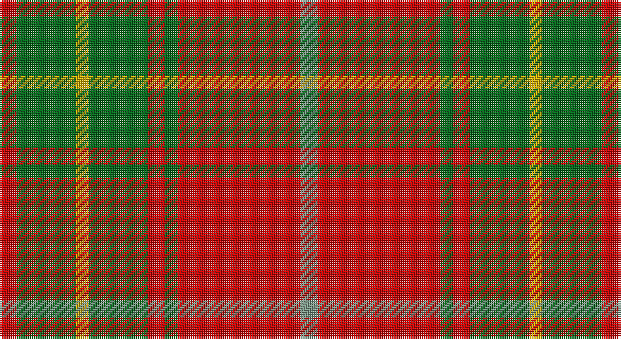

This page is one **sett** — a single exact thread-count. It belongs to the [tartan](/setts/r4g14ly3g14r4g3r29y4/)
(the same proportion at any scale), whose colour order is pattern [GRGRGYGR](/stripes/grgrgygr/).

Part of the [Burnett](/tartans/burnett/) tartan — the named design grouping this sett with its other cloths.

Sourced from register-of-tartans.  It is a [8 stripe tartan](/stripes/stripes8/).

Original link https://www.tartanregister.gov.uk/tartanDetails.aspx?ref=443

2 attestations — the source records this cloth was collapsed from (oldest owns this page)

<ul>
<li>01/01/2002 — Burnett (register-of-tartans, <a href="https://www.tartanregister.gov.uk/tartanDetails.aspx?ref=443">record</a>)</li>
<li>pre 2002 — Burnett (Name) (tartans-authority, <a href="http://www.tartansauthority.com/tartan-ferret/display/2355/">record</a>)</li>
</ul>

## Register references

External register numbers recorded for this tartan.

- Scottish Register of Tartans: [443](https://www.tartanregister.gov.uk/tartanDetails.aspx?ref=443)
- Scottish Tartans Authority (ITI): 2355
- Scottish Tartans World Register: 2355

## Thread count
R/8 G28 Y6 G28 R8 G6 R58 LG/8

One full sett is **284 threads**.

## Palette

Palette: <strong>Tartan Register</strong>
<table><thead><tr><th>Colour</th><th>Threads</th><th>Shade</th><th>Base</th><th>OKLCh</th></tr></thead><tbody><tr><td>R/</td><td style="text-align:right;font-variant-numeric:tabular-nums">8</td><td><code style="background-color:#C80000;">#C80000</code> <small style="color:#888">#C80000</small></td><td>R <code style="background-color:#CC0000;">#CC0000</code></td><td><small style="color:#888">oklch(52.3% 0.215 29.2)</small></td></tr><tr><td>G</td><td style="text-align:right;font-variant-numeric:tabular-nums">28</td><td><code style="background-color:#006818;">#006818</code> <small style="color:#888">#006818</small></td><td>G <code style="background-color:#006100;">#006100</code></td><td><small style="color:#888">oklch(45.0% 0.142 145.0)</small></td></tr><tr><td>Y</td><td style="text-align:right;font-variant-numeric:tabular-nums">6</td><td><code style="background-color:#D8B000;">#D8B000</code> <small style="color:#888">#D8B000</small></td><td>Y <code style="background-color:#F2BF00;">#F2BF00</code></td><td><small style="color:#888">oklch(77.1% 0.158 92.3)</small></td></tr><tr><td>G</td><td style="text-align:right;font-variant-numeric:tabular-nums">28</td><td><code style="background-color:#006818;">#006818</code> <small style="color:#888">#006818</small></td><td>G <code style="background-color:#006100;">#006100</code></td><td><small style="color:#888">oklch(45.0% 0.142 145.0)</small></td></tr><tr><td>R</td><td style="text-align:right;font-variant-numeric:tabular-nums">8</td><td><code style="background-color:#C80000;">#C80000</code> <small style="color:#888">#C80000</small></td><td>R <code style="background-color:#CC0000;">#CC0000</code></td><td><small style="color:#888">oklch(52.3% 0.215 29.2)</small></td></tr><tr><td>G</td><td style="text-align:right;font-variant-numeric:tabular-nums">6</td><td><code style="background-color:#006818;">#006818</code> <small style="color:#888">#006818</small></td><td>G <code style="background-color:#006100;">#006100</code></td><td><small style="color:#888">oklch(45.0% 0.142 145.0)</small></td></tr><tr><td>R</td><td style="text-align:right;font-variant-numeric:tabular-nums">58</td><td><code style="background-color:#C80000;">#C80000</code> <small style="color:#888">#C80000</small></td><td>R <code style="background-color:#CC0000;">#CC0000</code></td><td><small style="color:#888">oklch(52.3% 0.215 29.2)</small></td></tr><tr><td>LG/</td><td style="text-align:right;font-variant-numeric:tabular-nums">8</td><td><code style="background-color:#789484;">#789484</code> <small style="color:#888">#789484</small></td><td>G <code style="background-color:#006100;">#006100</code></td><td><small style="color:#888">oklch(64.0% 0.040 160.0)</small></td></tr></tbody></table>

# Sample pattern

## Nearest tartans

The nearest existing variants by ΔTartan distance, with this tartan at the top so the swatches line up against it.

ΔTartan

Tartan

Sett

—

<a href="/ttd/edit/#slug=r4g14ly3g14r4g3r29y4~x2">Burnett</a> <a class="nn-out" href="/variants/s8/r4g14ly3g14r4g3r29y4~x2/" title="open its dictionary page">↗</a>

0.75

<a href="/ttd/edit/#slug=r2ri1r10ri2g10lr1g2~x4&amp;base=r4g14ly3g14r4g3r29y4~x2">Lennox</a> <a class="nn-out" href="/variants/s7/r2ri1r10ri2g10lr1g2~x4/" title="open its dictionary page">↗</a>

0.77

<a href="/ttd/edit/#slug=g28r7m7g14m7r48k4~x2&amp;base=r4g14ly3g14r4g3r29y4~x2">MacNab 6</a> <a class="nn-out" href="/variants/s7/g28r7m7g14m7r48k4~x2/" title="open its dictionary page">↗</a>

0.79

<a href="/ttd/edit/#slug=r2ri1r10ri2g10w1g2~x2&amp;base=r4g14ly3g14r4g3r29y4~x2">Lennox</a> <a class="nn-out" href="/variants/s7/r2ri1r10ri2g10w1g2~x2/" title="open its dictionary page">↗</a>

0.88

<a href="/ttd/edit/#slug=g6r2ri2g4ri2r12k1~x2&amp;base=r4g14ly3g14r4g3r29y4~x2">MacNab 5</a> <a class="nn-out" href="/variants/s7/g6r2ri2g4ri2r12k1~x2/" title="open its dictionary page">↗</a>

0.94

<a href="/ttd/edit/#slug=db1r12g6ly1g6db1~x4&amp;base=r4g14ly3g14r4g3r29y4~x2">Cetoloni (Personal)</a> <a class="nn-out" href="/variants/s6/db1r12g6ly1g6db1~x4/" title="open its dictionary page">↗</a>

0.99

<a href="/ttd/edit/#slug=w2r4g8r16t2r3g16r4t2r4w2~x2&amp;base=r4g14ly3g14r4g3r29y4~x2">MacKinnon 7</a> <a class="nn-out" href="/variants/s11/w2r4g8r16t2r3g16r4t2r4w2~x2/" title="open its dictionary page">↗</a>

1.03

<a href="/ttd/edit/#slug=k1r9dg2r2dg4lr1dg4r1~x2&amp;base=r4g14ly3g14r4g3r29y4~x2">Comyn</a> <a class="nn-out" href="/variants/s8/k1r9dg2r2dg4lr1dg4r1~x2/" title="open its dictionary page">↗</a>

1.06

<a href="/ttd/edit/#slug=r12db2w1db2r3g8r3db1~x2&amp;base=r4g14ly3g14r4g3r29y4~x2">Chisholm, The</a> <a class="nn-out" href="/variants/s8/r12db2w1db2r3g8r3db1~x2/" title="open its dictionary page">↗</a>

1.10

<a href="/ttd/edit/#slug=w1r8g2r2g6r1g6r2g2r8ly1~x4&amp;base=r4g14ly3g14r4g3r29y4~x2">Bruce (Vestiarium)</a> <a class="nn-out" href="/variants/s11/w1r8g2r2g6r1g6r2g2r8ly1~x4/" title="open its dictionary page">↗</a>

1.12

<a href="/ttd/edit/#slug=k1r9dg2r2dg4lb1dg4r1~x2&amp;base=r4g14ly3g14r4g3r29y4~x2">Comyn</a> <a class="nn-out" href="/variants/s8/k1r9dg2r2dg4lb1dg4r1~x2/" title="open its dictionary page">↗</a>

## Neighbour map

Every grey dot is one of 14360 variants placed by the first two principal components of the ΔTartan feature space (44% of its variance). Red is this tartan; blue dots are its nearest — click one to open its page.

<svg viewBox="0 0 640 380" role="img" style="max-width:100%;height:auto;border:1px solid #e0e0e0;border-radius:4px;display:block" xmlns="http://www.w3.org/2000/svg"><image href="/nn/cloud.v1.png" width="640" height="380"/><a href="/variants/s7/r2ri1r10ri2g10lr1g2~x4/"><circle cx="284.3" cy="198.7" r="4" fill="#3465a4"><title>Lennox</title></circle></a><a href="/variants/s7/g28r7m7g14m7r48k4~x2/"><circle cx="288.4" cy="187.6" r="4" fill="#3465a4"><title>MacNab 6</title></circle></a><a href="/variants/s7/r2ri1r10ri2g10w1g2~x2/"><circle cx="269.2" cy="191.9" r="4" fill="#3465a4"><title>Lennox</title></circle></a><a href="/variants/s7/g6r2ri2g4ri2r12k1~x2/"><circle cx="287.1" cy="191.1" r="4" fill="#3465a4"><title>MacNab 5</title></circle></a><a href="/variants/s6/db1r12g6ly1g6db1~x4/"><circle cx="287.5" cy="198.5" r="4" fill="#3465a4"><title>Cetoloni (Personal)</title></circle></a><a href="/variants/s11/w2r4g8r16t2r3g16r4t2r4w2~x2/"><circle cx="264.3" cy="180.1" r="4" fill="#3465a4"><title>MacKinnon 7</title></circle></a><a href="/variants/s8/k1r9dg2r2dg4lr1dg4r1~x2/"><circle cx="304.6" cy="206.9" r="4" fill="#3465a4"><title>Comyn</title></circle></a><a href="/variants/s8/r12db2w1db2r3g8r3db1~x2/"><circle cx="323.2" cy="178.7" r="4" fill="#3465a4"><title>Chisholm, The</title></circle></a><a href="/variants/s11/w1r8g2r2g6r1g6r2g2r8ly1~x4/"><circle cx="303.8" cy="196.1" r="4" fill="#3465a4"><title>Bruce (Vestiarium)</title></circle></a><a href="/variants/s8/k1r9dg2r2dg4lb1dg4r1~x2/"><circle cx="282.4" cy="192.6" r="4" fill="#3465a4"><title>Comyn</title></circle></a><circle cx="307.7" cy="194.5" r="5" fill="#c00000"/></svg>

ID: /variants/s8/r4g14ly3g14r4g3r29y4~x2/
