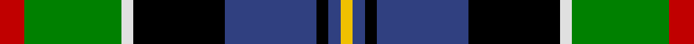
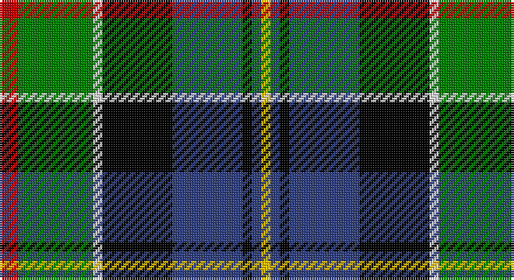

This page is one **sett** — a single exact thread-count. It belongs to the [tartan](/setts/r4g16w2k15db15k2db2ly2/)
(the same proportion at any scale), whose colour order is pattern [RGWKBKBY](/stripes/rgwkbkby/).

Sourced from weddslist.  It is a [8 stripe tartan](/stripes/stripes8/).

Original link http://www.weddslist.com/cgi-bin/tartans/pg.pl?source=sts

## Provenance

Earliest known date: 1979 This is a modern family tartan designed by the representer of the family of Cowan of Inveresk, in the parish of that name in Musselburgh, Mr Robert Cowan of Atlanta, Georgia. Cowans are a Sept of the Colquhouns, variously spelt Macillechomhghain, Comhain, Comhan and Cowen. Cowans not associated with the Inveresk branch of the family may wear the Colquhoun tartan on which this design is based.

2 attestations — the source records this cloth was collapsed from (oldest owns this page)

<ul>
<li>undated — Cowan, of Inveresk (weddslist, <a href="http://www.weddslist.com/cgi-bin/tartans/pg.pl?source=sts">record</a>)</li>
<li>undated — Cowan of Inveresk Family Tartan (house-of-tartan, <a href="http://www.house-of-tartan.scotland.net/house/TartanViewjs.asp?colr=Def&tnam=1549">record</a>)</li>
</ul>

## Thread count
R/8 G32 LN4 K30 B30 K4 B4 Y/4

One full sett is **220 threads**.

## Palette

Palette: <strong>Tartan Register</strong> <small style="color:#888">(2 of 6 colours)</small>
<table><thead><tr><th>Colour</th><th>Threads</th><th>Shade</th><th>Base</th><th>OKLCh</th></tr></thead><tbody><tr><td>R/</td><td style="text-align:right;font-variant-numeric:tabular-nums">8</td><td><code style="background-color:#C00000;">#C00000</code> <small style="color:#888">#C00000</small></td><td>R <code style="background-color:#CC0000;">#CC0000</code></td><td><small style="color:#888">oklch(50.7% 0.208 29.2)</small></td></tr><tr><td>G</td><td style="text-align:right;font-variant-numeric:tabular-nums">32</td><td><code style="background-color:#008000;">#008000</code> <small style="color:#888">#008000</small></td><td>G <code style="background-color:#006100;">#006100</code></td><td><small style="color:#888">oklch(52.0% 0.177 142.5)</small></td></tr><tr><td>LN</td><td style="text-align:right;font-variant-numeric:tabular-nums">4</td><td><code style="background-color:#E0E0E0;">#E0E0E0</code> <small style="color:#888">#E0E0E0</small></td><td>W <code style="background-color:#F7F7F7;">#F7F7F7</code></td><td><small style="color:#888">oklch(90.7% 0.000 89.9)</small></td></tr><tr><td>K</td><td style="text-align:right;font-variant-numeric:tabular-nums">30</td><td><code style="background-color:#000000;">#000000</code> <small style="color:#888">#000000</small></td><td>K <code style="background-color:#000000;">#000000</code></td><td><small style="color:#888">oklch(0.0% 0.000 0.0)</small></td></tr><tr><td>B</td><td style="text-align:right;font-variant-numeric:tabular-nums">30</td><td><code style="background-color:#304080;">#304080</code> <small style="color:#888">#304080</small></td><td>B <code style="background-color:#2A418A;">#2A418A</code></td><td><small style="color:#888">oklch(39.4% 0.109 270.2)</small></td></tr><tr><td>K</td><td style="text-align:right;font-variant-numeric:tabular-nums">4</td><td><code style="background-color:#000000;">#000000</code> <small style="color:#888">#000000</small></td><td>K <code style="background-color:#000000;">#000000</code></td><td><small style="color:#888">oklch(0.0% 0.000 0.0)</small></td></tr><tr><td>B</td><td style="text-align:right;font-variant-numeric:tabular-nums">4</td><td><code style="background-color:#304080;">#304080</code> <small style="color:#888">#304080</small></td><td>B <code style="background-color:#2A418A;">#2A418A</code></td><td><small style="color:#888">oklch(39.4% 0.109 270.2)</small></td></tr><tr><td>Y/</td><td style="text-align:right;font-variant-numeric:tabular-nums">4</td><td><code style="background-color:#F0C000;">#F0C000</code> <small style="color:#888">#F0C000</small></td><td>Y <code style="background-color:#F2BF00;">#F2BF00</code></td><td><small style="color:#888">oklch(82.7% 0.169 90.5)</small></td></tr></tbody></table>

# Sample pattern

## Nearest tartans

The nearest existing variants by ΔTartan distance, with this tartan at the top so the swatches line up against it.

ΔTartan

Tartan

Sett

—

<a href="/ttd/edit/#slug=r4g16w2k15db15k2db2ly2~x2">Cowan, of Inveresk</a> <a class="nn-out" href="/variants/s8/r4g16w2k15db15k2db2ly2~x2/" title="open its dictionary page">↗</a>

0.69

<a href="/ttd/edit/#slug=g2dp2g10k6r2k6t10k1lb2~x2&amp;base=r4g16w2k15db15k2db2ly2~x2">Birch (Personal) (Estimated threadcount)</a> <a class="nn-out" href="/variants/s9/g2dp2g10k6r2k6t10k1lb2~x2/" title="open its dictionary page">↗</a>

0.69

<a href="/ttd/edit/#slug=r4dg16w2k15db15k2db2ly2~x2&amp;base=r4g16w2k15db15k2db2ly2~x2">Cowan of Inveresk (Personal)</a> <a class="nn-out" href="/variants/s8/r4dg16w2k15db15k2db2ly2~x2/" title="open its dictionary page">↗</a>

0.77

<a href="/ttd/edit/#slug=w2r2db16k14g15r2ly2~x2&amp;base=r4g16w2k15db15k2db2ly2~x2">Council of Scottish Clans &amp; Ass. (Co</a> <a class="nn-out" href="/variants/s7/w2r2db16k14g15r2ly2~x2/" title="open its dictionary page">↗</a>

0.93

<a href="/ttd/edit/#slug=r5db3r3db29k29g29w4r4~x2&amp;base=r4g16w2k15db15k2db2ly2~x2">Borrodale</a> <a class="nn-out" href="/variants/s8/r5db3r3db29k29g29w4r4~x2/" title="open its dictionary page">↗</a>

0.95

<a href="/ttd/edit/#slug=db34w5db5r5db5dr26g33o6~x2&amp;base=r4g16w2k15db15k2db2ly2~x2">Blairmore</a> <a class="nn-out" href="/variants/s8/db34w5db5r5db5dr26g33o6~x2/" title="open its dictionary page">↗</a>

0.97

<a href="/ttd/edit/#slug=r2g8w1k8db8k1db1~x4&amp;base=r4g16w2k15db15k2db2ly2~x2">Colquhoun</a> <a class="nn-out" href="/variants/s7/r2g8w1k8db8k1db1~x4/" title="open its dictionary page">↗</a>

0.97

<a href="/ttd/edit/#slug=r3g18r4t3r4k13r3db18g2ly3~x2&amp;base=r4g16w2k15db15k2db2ly2~x2">Stirling, and Bannockburn</a> <a class="nn-out" href="/variants/s10/r3g18r4t3r4k13r3db18g2ly3~x2/" title="open its dictionary page">↗</a>

1.02

<a href="/ttd/edit/#slug=dr2lb1g7r1k7g1db7r1g2~x8&amp;base=r4g16w2k15db15k2db2ly2~x2">MacCraig</a> <a class="nn-out" href="/variants/s9/dr2lb1g7r1k7g1db7r1g2~x8/" title="open its dictionary page">↗</a>

1.02

<a href="/variants/s10/k5lb14ki3k7g3ki3g7ki6db24w3~x2/">Kagame (Personal)</a>

1.03

<a href="/ttd/edit/#slug=k6g14t2r3t2k16ly2b16g16r3~x2&amp;base=r4g16w2k15db15k2db2ly2~x2">Unnamed 4</a> <a class="nn-out" href="/variants/s10/k6g14t2r3t2k16ly2b16g16r3~x2/" title="open its dictionary page">↗</a>

## Neighbour map

Every grey dot is one of 14360 variants placed by the first two principal components of the ΔTartan feature space (44% of its variance). Red is this tartan; blue dots are its nearest — click one to open its page.

<svg viewBox="0 0 640 380" role="img" style="max-width:100%;height:auto;border:1px solid #e0e0e0;border-radius:4px;display:block" xmlns="http://www.w3.org/2000/svg"><image href="/nn/cloud.v1.png" width="640" height="380"/><a href="/variants/s9/g2dp2g10k6r2k6t10k1lb2~x2/"><circle cx="76.5" cy="159.3" r="4" fill="#3465a4"><title>Birch (Personal) (Estimated threadcount)</title></circle></a><a href="/variants/s8/r4dg16w2k15db15k2db2ly2~x2/"><circle cx="88.2" cy="168.6" r="4" fill="#3465a4"><title>Cowan of Inveresk (Personal)</title></circle></a><a href="/variants/s7/w2r2db16k14g15r2ly2~x2/"><circle cx="84.4" cy="168.5" r="4" fill="#3465a4"><title>Council of Scottish Clans &amp; Ass. (Co</title></circle></a><a href="/variants/s8/r5db3r3db29k29g29w4r4~x2/"><circle cx="114.1" cy="169.0" r="4" fill="#3465a4"><title>Borrodale</title></circle></a><a href="/variants/s8/db34w5db5r5db5dr26g33o6~x2/"><circle cx="119.1" cy="180.2" r="4" fill="#3465a4"><title>Blairmore</title></circle></a><a href="/variants/s7/r2g8w1k8db8k1db1~x4/"><circle cx="110.6" cy="193.4" r="4" fill="#3465a4"><title>Colquhoun</title></circle></a><a href="/variants/s10/r3g18r4t3r4k13r3db18g2ly3~x2/"><circle cx="71.0" cy="146.1" r="4" fill="#3465a4"><title>Stirling, and Bannockburn</title></circle></a><a href="/variants/s9/dr2lb1g7r1k7g1db7r1g2~x8/"><circle cx="102.8" cy="178.2" r="4" fill="#3465a4"><title>MacCraig</title></circle></a><a href="/variants/s10/k5lb14ki3k7g3ki3g7ki6db24w3~x2/"><circle cx="57.9" cy="151.9" r="4" fill="#3465a4"><title>Kagame (Personal)</title></circle></a><a href="/variants/s10/k6g14t2r3t2k16ly2b16g16r3~x2/"><circle cx="91.8" cy="158.3" r="4" fill="#3465a4"><title>Unnamed 4</title></circle></a><circle cx="79.2" cy="163.9" r="5" fill="#c00000"/></svg>

ID: /variants/s8/r4g16w2k15db15k2db2ly2~x2/
