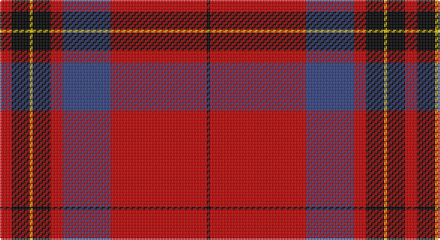

This page is one **sett** — a single exact thread-count. It belongs to the [tartan](/setts/r4k6ly1k6r4db16r32k1/)
(the same proportion at any scale), whose colour order is pattern [KRBRKYKR](/stripes/krbrkykr/).

Part of the [Leslie](/tartans/leslie/) tartan — the named design grouping this sett with its other cloths.

Sourced from weddslist.  It is a [8 stripe tartan](/stripes/stripes8/).

Original link http://www.weddslist.com/cgi-bin/tartans/pg.pl?source=sts

## Provenance

Earliest known date: 1842 The Vestarium Scoticum

## Also known as

This cloth is also recorded under:

- Leslie Dress
- Leslie Red

4 attestations — the source records this cloth was collapsed from (oldest owns this page)

<ul>
<li>undated — Leslie (weddslist, <a href="http://www.weddslist.com/cgi-bin/tartans/pg.pl?source=sts">record</a>)</li>
<li>undated — Leslie Dress (weddslist, <a href="http://www.weddslist.com/cgi-bin/tartans/pg.pl?source=tinsel">record</a>)</li>
<li>undated — Leslie Dress (weddslist, <a href="http://www.weddslist.com/cgi-bin/tartans/pg.pl?source=x">record</a>)</li>
<li>undated — Leslie Clan Tartan (house-of-tartan, <a href="http://www.house-of-tartan.scotland.net/house/TartanViewjs.asp?colr=Def&tnam=1142">record</a>)</li>
</ul>

## Thread count
R/8 K12 Y2 K12 R8 B32 R64 K/2

One full sett is **270 threads**.

## Palette

Palette: <strong>Ingles Buchan</strong> <small style="color:#888">(1 of 4 colours)</small>
<table><thead><tr><th>Colour</th><th>Threads</th><th>Shade</th><th>Base</th><th>OKLCh</th></tr></thead><tbody><tr><td>R/</td><td style="text-align:right;font-variant-numeric:tabular-nums">8</td><td><code style="background-color:#C00000;">#C00000</code> <small style="color:#888">#C00000</small></td><td>R <code style="background-color:#CC0000;">#CC0000</code></td><td><small style="color:#888">oklch(50.7% 0.208 29.2)</small></td></tr><tr><td>K</td><td style="text-align:right;font-variant-numeric:tabular-nums">12</td><td><code style="background-color:#000000;">#000000</code> <small style="color:#888">#000000</small></td><td>K <code style="background-color:#000000;">#000000</code></td><td><small style="color:#888">oklch(0.0% 0.000 0.0)</small></td></tr><tr><td>Y</td><td style="text-align:right;font-variant-numeric:tabular-nums">2</td><td><code style="background-color:#F0C000;">#F0C000</code> <small style="color:#888">#F0C000</small></td><td>Y <code style="background-color:#F2BF00;">#F2BF00</code></td><td><small style="color:#888">oklch(82.7% 0.169 90.5)</small></td></tr><tr><td>K</td><td style="text-align:right;font-variant-numeric:tabular-nums">12</td><td><code style="background-color:#000000;">#000000</code> <small style="color:#888">#000000</small></td><td>K <code style="background-color:#000000;">#000000</code></td><td><small style="color:#888">oklch(0.0% 0.000 0.0)</small></td></tr><tr><td>R</td><td style="text-align:right;font-variant-numeric:tabular-nums">8</td><td><code style="background-color:#C00000;">#C00000</code> <small style="color:#888">#C00000</small></td><td>R <code style="background-color:#CC0000;">#CC0000</code></td><td><small style="color:#888">oklch(50.7% 0.208 29.2)</small></td></tr><tr><td>B</td><td style="text-align:right;font-variant-numeric:tabular-nums">32</td><td><code style="background-color:#304080;">#304080</code> <small style="color:#888">#304080</small></td><td>B <code style="background-color:#2A418A;">#2A418A</code></td><td><small style="color:#888">oklch(39.4% 0.109 270.2)</small></td></tr><tr><td>R</td><td style="text-align:right;font-variant-numeric:tabular-nums">64</td><td><code style="background-color:#C00000;">#C00000</code> <small style="color:#888">#C00000</small></td><td>R <code style="background-color:#CC0000;">#CC0000</code></td><td><small style="color:#888">oklch(50.7% 0.208 29.2)</small></td></tr><tr><td>K/</td><td style="text-align:right;font-variant-numeric:tabular-nums">2</td><td><code style="background-color:#000000;">#000000</code> <small style="color:#888">#000000</small></td><td>K <code style="background-color:#000000;">#000000</code></td><td><small style="color:#888">oklch(0.0% 0.000 0.0)</small></td></tr></tbody></table>

# Sample pattern

## Compared to the master

This cloth is one sett of its design; the master sett (the exemplar the design is anchored on) is below for comparison.

<figure style="margin:0"><figcaption style="color:#888;font-size:smaller">this sett</figcaption></figure>
<figure style="margin:0"><figcaption style="color:#888;font-size:smaller"><a href="/setts/db50r2k3ly2k3r2k3ly2k3r2db3r12k2/">master sett →</a></figcaption></figure>

## Nearest tartans

The nearest existing variants by ΔTartan distance, with this tartan at the top so the swatches line up against it.

ΔTartan

Tartan

Sett

—

<a href="/ttd/edit/#slug=r4k6ly1k6r4db16r32k1~x2">Leslie</a> <a class="nn-out" href="/variants/s8/r4k6ly1k6r4db16r32k1~x2/" title="open its dictionary page">↗</a>

0.43

<a href="/ttd/edit/#slug=r4k6ly1k6r4db16r32db1~x2&amp;base=r4k6ly1k6r4db16r32k1~x2">Leslie Dress</a> <a class="nn-out" href="/variants/s8/r4k6ly1k6r4db16r32db1~x2/" title="open its dictionary page">↗</a>

0.77

<a href="/ttd/edit/#slug=lo4k17r1k4r2k4r33w3~x2&amp;base=r4k6ly1k6r4db16r32k1~x2">Mens Bigi</a> <a class="nn-out" href="/variants/s8/lo4k17r1k4r2k4r33w3~x2/" title="open its dictionary page">↗</a>

0.95

<a href="/ttd/edit/#slug=k3r1k30r28db1r1w3~x2&amp;base=r4k6ly1k6r4db16r32k1~x2">Cunningham #3</a> <a class="nn-out" href="/variants/s7/k3r1k30r28db1r1w3~x2/" title="open its dictionary page">↗</a>

1.07

<a href="/ttd/edit/#slug=r4k12w1k12r4k4r24g1r4~x4&amp;base=r4k6ly1k6r4db16r32k1~x2">Wemyss</a> <a class="nn-out" href="/variants/s9/r4k12w1k12r4k4r24g1r4~x4/" title="open its dictionary page">↗</a>

1.08

<a href="/ttd/edit/#slug=r11w1r32k8db6k1db16k1~x2&amp;base=r4k6ly1k6r4db16r32k1~x2">Ostermeier (2015)</a> <a class="nn-out" href="/variants/s8/r11w1r32k8db6k1db16k1~x2/" title="open its dictionary page">↗</a>

1.11

<a href="/ttd/edit/#slug=w10k2w2k66ly6r48k5r8&amp;base=r4k6ly1k6r4db16r32k1~x2">Sutherland de Albergaria (Personal)</a> <a class="nn-out" href="/variants/s8/w10k2w2k66ly6r48k5r8/" title="open its dictionary page">↗</a>

1.13

<a href="/ttd/edit/#slug=k4w1k28r30dp1r3~x2&amp;base=r4k6ly1k6r4db16r32k1~x2">Ramsay (Red)</a> <a class="nn-out" href="/variants/s6/k4w1k28r30dp1r3~x2/" title="open its dictionary page">↗</a>

1.17

<a href="/ttd/edit/#slug=k6r4lb3r44k32r3k3lo3k2r3~x2&amp;base=r4k6ly1k6r4db16r32k1~x2">Smeaton 1985 (Name)</a> <a class="nn-out" href="/variants/s10/k6r4lb3r44k32r3k3lo3k2r3~x2/" title="open its dictionary page">↗</a>

1.19

<a href="/ttd/edit/#slug=dg2r2db1r24lb1db6r3dg12r4db1&amp;base=r4k6ly1k6r4db16r32k1~x2">MacDonell of Keppoch</a> <a class="nn-out" href="/variants/s10/dg2r2db1r24lb1db6r3dg12r4db1/" title="open its dictionary page">↗</a>

1.21

<a href="/ttd/edit/#slug=r2db12r2dg12r24w1~x2&amp;base=r4k6ly1k6r4db16r32k1~x2">Fraser</a> <a class="nn-out" href="/variants/s6/r2db12r2dg12r24w1~x2/" title="open its dictionary page">↗</a>

## Neighbour map

Every grey dot is one of 14360 variants placed by the first two principal components of the ΔTartan feature space (44% of its variance). Red is this tartan; blue dots are its nearest — click one to open its page.

<svg viewBox="0 0 640 380" role="img" style="max-width:100%;height:auto;border:1px solid #e0e0e0;border-radius:4px;display:block" xmlns="http://www.w3.org/2000/svg"><image href="/nn/cloud.v1.png" width="640" height="380"/><a href="/variants/s8/r4k6ly1k6r4db16r32db1~x2/"><circle cx="351.8" cy="117.9" r="4" fill="#3465a4"><title>Leslie Dress</title></circle></a><a href="/variants/s8/lo4k17r1k4r2k4r33w3~x2/"><circle cx="363.9" cy="123.0" r="4" fill="#3465a4"><title>Mens Bigi</title></circle></a><a href="/variants/s7/k3r1k30r28db1r1w3~x2/"><circle cx="348.9" cy="118.2" r="4" fill="#3465a4"><title>Cunningham #3</title></circle></a><a href="/variants/s9/r4k12w1k12r4k4r24g1r4~x4/"><circle cx="358.1" cy="141.5" r="4" fill="#3465a4"><title>Wemyss</title></circle></a><a href="/variants/s8/r11w1r32k8db6k1db16k1~x2/"><circle cx="351.3" cy="114.3" r="4" fill="#3465a4"><title>Ostermeier (2015)</title></circle></a><a href="/variants/s8/w10k2w2k66ly6r48k5r8/"><circle cx="320.2" cy="107.6" r="4" fill="#3465a4"><title>Sutherland de Albergaria (Personal)</title></circle></a><a href="/variants/s6/k4w1k28r30dp1r3~x2/"><circle cx="366.7" cy="141.2" r="4" fill="#3465a4"><title>Ramsay (Red)</title></circle></a><a href="/variants/s10/k6r4lb3r44k32r3k3lo3k2r3~x2/"><circle cx="358.3" cy="113.0" r="4" fill="#3465a4"><title>Smeaton 1985 (Name)</title></circle></a><a href="/variants/s10/dg2r2db1r24lb1db6r3dg12r4db1/"><circle cx="373.4" cy="120.1" r="4" fill="#3465a4"><title>MacDonell of Keppoch</title></circle></a><a href="/variants/s6/r2db12r2dg12r24w1~x2/"><circle cx="321.0" cy="162.2" r="4" fill="#3465a4"><title>Fraser</title></circle></a><circle cx="359.0" cy="119.9" r="5" fill="#c00000"/></svg>

ID: /variants/s8/r4k6ly1k6r4db16r32k1~x2/
