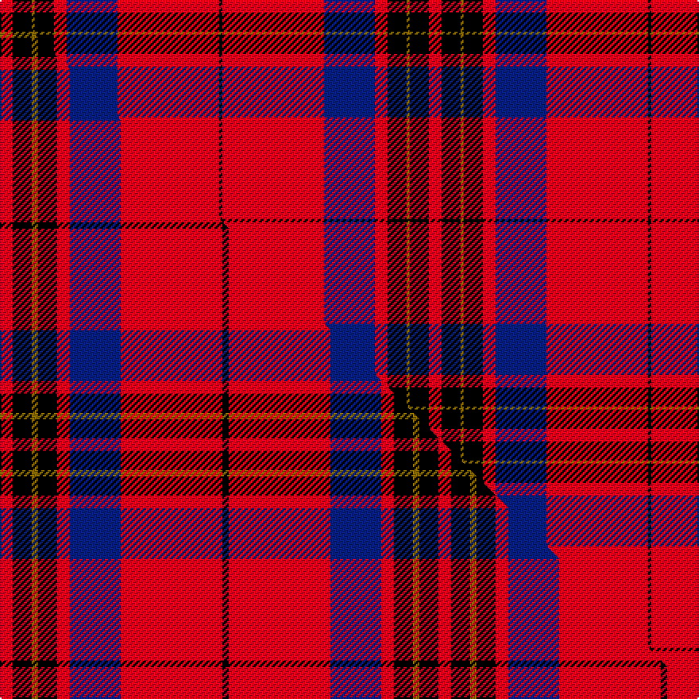

This is one **variant** — a specific cloth: this exact thread count and colourway, with its own
provenance below. It is one weaving of the [sett](/tartans/l/le/leslie-2/) (the scale-free proportion — the
same cloth at any scale or shade), whose colour order is pattern [KRBRKGKR](/stripes/krbrkgkr/).

Part of the [Leslie](/tartans/l/le/leslie-2/) tartan — the named design grouping this sett with its other cloths.

Sourced from house-of-tartan.  It is a [8 stripe tartan](/stripes/stripes8/).

Original link [http://www.house-of-tartan.scotland.net/house/TartanViewjs.asp?colr=Def&tnam=1142](http://www.house-of-tartan.scotland.net/house/TartanViewjs.asp?colr=Def&tnam=1142)

## Provenance

Earliest known date: 1842 The Vestarium Scoticum

4 attestations — the source records this cloth was collapsed from (oldest owns this page)

<ul>
<li>1842 — Leslie Clan Tartan (house-of-tartan, <a href="http://www.house-of-tartan.scotland.net/house/TartanViewjs.asp?colr=Def&tnam=1142">record</a>) </li>
<li>undated — Leslie (weddslist, <a href="http://www.weddslist.com/cgi-bin/tartans/pg.pl?source=sts">record</a>) </li>
<li>undated — Leslie Dress (weddslist, <a href="http://www.weddslist.com/cgi-bin/tartans/pg.pl?source=tinsel">record</a>) </li>
<li>undated — Leslie Dress (weddslist, <a href="http://www.weddslist.com/cgi-bin/tartans/pg.pl?source=x">record</a>) </li>
</ul>

Dataset <small>— provenance for this record, inherited from the source manifest</small>

<dl class="dataset-prov">
<dt>source</dt><dd><a href="/sources/house-of-tartan/">House of Tartan</a></dd>
<dt>data captured from</dt><dd><a href="https://github.com/thetartan/tartan-database/blob/master/data/house-of-tartan/data.csv">https://github.com/thetartan/tartan-database/blob/master/data/house-of-tartan/data.csv</a></dd>
<dt>data date</dt><dd>1842 <small>(this record)</small></dd>
<dt>licence</dt><dd><a href="https://creativecommons.org/licenses/by-nc-nd/4.0/">CC BY-NC-ND 4.0</a></dd>
</dl>

Capture chain <small>— the hands this data passed through, oldest first; each capture carries its own licence</small>

<ol class="capture-chain">
<li><a href="http://www.house-of-tartan.scotland.net/">House of Tartan</a> <small>the weaver/retailer's database — the site is now offline; the URL is kept as the ultimate source's identity</small></li>
<li><a href="https://github.com/thetartan/tartan-database">thetartan/tartan-database</a> <small>2016-2017</small> · <a href="https://creativecommons.org/licenses/by-nc-nd/4.0/">CC BY-NC-ND 4.0</a> <small>Levko Kravets's frozen compilation — the capture we vendored, and where its CC licence text came from</small></li>
<li>this dictionary <small>captured 2026-06-10 · commit 5bf86c7566</small> <small>each re-capture is a git commit to data/sources</small></li>
</ol>

## Thread count
R/8 K12 Y2 K12 R8 DB32 R64 K/2

One full sett is **270 threads**.

## Palette
<table><thead><tr><th>Colour</th><th>Shade</th><th>OKLCh</th></tr></thead><tbody><tr><td>DB</td><td><code style="background-color:#082077;">#082077</code> <small style="color:#888">#082077</small></td><td><small style="color:#888">oklch(30.0% 0.149 265.1)</small></td></tr><tr><td>K</td><td><code style="background-color:#000000;">#000000</code> <small style="color:#888">#000000</small></td><td><small style="color:#888">oklch(0.0% 0.000 0.0)</small></td></tr><tr><td>R</td><td><code style="background-color:#D60020;">#D60020</code> <small style="color:#888">#D60020</small></td><td><small style="color:#888">oklch(55.2% 0.224 25.5)</small></td></tr><tr><td>Y</td><td><code style="background-color:#8B6E00;">#8B6E00</code> <small style="color:#888">#8B6E00</small></td><td><small style="color:#888">oklch(55.1% 0.113 90.4)</small></td></tr></tbody></table>

# Sample pattern

## Compared to the master

This cloth is one sett of its design; the master sett (the exemplar the design is anchored on) is below for comparison.

Its **ΔTartan distance** from the master is **0.49** — the same measure the nearest-tartans table ranks by (0 is identical; a re-scale of the same cloth is near 0, a recolour or a different proportion further).

<figure class="master-compare" style="margin:0">

this sett
master sett ★

<figcaption style="color:#888;font-size:smaller">One weave of this sett against the <a href="/setts/r2k3y1k3r2db8r16k1/">master sett ★</a>, split on the diagonal: a shared proportion runs seamlessly across it with only the shades shifting; a different proportion breaks on it.</figcaption>
</figure>

## Nearest tartan variants

The nearest existing variants by ΔTartan distance, with this cloth at the top so the swatches line up against it.

ΔTartan

Threads

Variant

Sett

—

270

<a href="/variants/s8/r4k6y1k6r4db16r32k1~x2/">Leslie Clan Tartan</a>

<a href="/ttd/edit/#slug=r2k3y1k3r2db8r16k1~x4&amp;base=r4k6y1k6r4db16r32k1~x2" title="compare in the TTD">0.49</a>

276

<a href="/variants/s8/r2k3y1k3r2db8r16k1~x4/">Leslie Red (VS) (Clan)</a>

<a href="/ttd/edit/#slug=r4k6y1k6r4db16r32db1~x2&amp;base=r4k6y1k6r4db16r32k1~x2" title="compare in the TTD">1.03</a>

270

<a href="/variants/s8/r4k6y1k6r4db16r32db1~x2/">Leslie Dress</a>

<a href="/ttd/edit/#slug=r11w1r32k8db6k1db16k1~x2&amp;base=r4k6y1k6r4db16r32k1~x2" title="compare in the TTD">1.29</a>

280

<a href="/variants/s8/r11w1r32k8db6k1db16k1~x2/">Ostermeier (2015)</a>

<a href="/ttd/edit/#slug=r1k3lb2k28r30k1r2lb1~x2&amp;base=r4k6y1k6r4db16r32k1~x2" title="compare in the TTD">1.30</a>

268

<a href="/variants/s8/r1k3lb2k28r30k1r2lb1~x2/">Las Vegas Fire Fighters</a>

<a href="/ttd/edit/#slug=n3k14r3k14lb3r32k2r6k2~x2&amp;base=r4k6y1k6r4db16r32k1~x2" title="compare in the TTD">2.25</a>

306

<a href="/variants/s9/n3k14r3k14lb3r32k2r6k2~x2/">Gallmore (Fashion)</a>

<a href="/ttd/edit/#slug=k3r1k30r28db1r1w3~x2&amp;base=r4k6y1k6r4db16r32k1~x2" title="compare in the TTD">2.31</a>

256

<a href="/variants/s7/k3r1k30r28db1r1w3~x2/">Cunningham (VS) Clan Tartan</a>

<a href="/ttd/edit/#slug=y1k3r24k3r3k24r3k3w1~x2&amp;base=r4k6y1k6r4db16r32k1~x2" title="compare in the TTD">2.34</a>

256

<a href="/variants/s9/y1k3r24k3r3k24r3k3w1~x2/">Maciver of Strathendry Castle Dress (Personal)</a>

<a href="/ttd/edit/#slug=y27k4w4r64w4r4k4r4k12~x2&amp;base=r4k6y1k6r4db16r32k1~x2" title="compare in the TTD">2.38</a>

430

<a href="/variants/s9/y27k4w4r64w4r4k4r4k12~x2/">O'Meehan (Name)</a>

<a href="/ttd/edit/#slug=r4k12w1k12r4k4r24g1r4~x2&amp;base=r4k6y1k6r4db16r32k1~x2" title="compare in the TTD">2.43</a>

248

<a href="/variants/s9/r4k12w1k12r4k4r24g1r4~x2/">Wemyss Clan Tartan</a>

<a href="/ttd/edit/#slug=r4k12w1k12r4k4r24g1r4~x4&amp;base=r4k6y1k6r4db16r32k1~x2" title="compare in the TTD">2.43</a>

496

<a href="/variants/s9/r4k12w1k12r4k4r24g1r4~x4/">Wemyss</a>

## Neighbour map

Every grey dot is one of 13657 variants placed by the first two principal components of the ΔTartan feature space (42% of its variance). Red is this tartan; blue dots are its nearest — click one to open its page. The map is a flat projection of a many-dimensional space — [how to read it](/posts/neighbourhood-maps/).

<svg viewBox="0 0 640 380" role="img" style="max-width:100%;height:auto;border:1px solid #e0e0e0;border-radius:4px;display:block" xmlns="http://www.w3.org/2000/svg"><image href="/nn/cloud.v1.png" width="640" height="380"/><a href="/variants/s8/r2k3y1k3r2db8r16k1~x4/"><circle cx="281.2" cy="130.0" r="4" fill="#3465a4"><title>Leslie Red (VS) (Clan)</title></circle></a><a href="/variants/s8/r4k6y1k6r4db16r32db1~x2/"><circle cx="320.1" cy="102.4" r="4" fill="#3465a4"><title>Leslie Dress</title></circle></a><a href="/variants/s8/r11w1r32k8db6k1db16k1~x2/"><circle cx="317.8" cy="109.4" r="4" fill="#3465a4"><title>Ostermeier (2015)</title></circle></a><a href="/variants/s8/r1k3lb2k28r30k1r2lb1~x2/"><circle cx="316.6" cy="98.5" r="4" fill="#3465a4"><title>Las Vegas Fire Fighters</title></circle></a><a href="/variants/s9/n3k14r3k14lb3r32k2r6k2~x2/"><circle cx="267.4" cy="121.9" r="4" fill="#3465a4"><title>Gallmore (Fashion)</title></circle></a><a href="/variants/s7/k3r1k30r28db1r1w3~x2/"><circle cx="292.7" cy="95.6" r="4" fill="#3465a4"><title>Cunningham (VS) Clan Tartan</title></circle></a><a href="/variants/s9/y1k3r24k3r3k24r3k3w1~x2/"><circle cx="295.2" cy="96.6" r="4" fill="#3465a4"><title>Maciver of Strathendry Castle Dress (Personal)</title></circle></a><a href="/variants/s9/y27k4w4r64w4r4k4r4k12~x2/"><circle cx="296.2" cy="109.3" r="4" fill="#3465a4"><title>O'Meehan (Name)</title></circle></a><a href="/variants/s9/r4k12w1k12r4k4r24g1r4~x2/"><circle cx="295.4" cy="113.7" r="4" fill="#3465a4"><title>Wemyss Clan Tartan</title></circle></a><a href="/variants/s9/r4k12w1k12r4k4r24g1r4~x4/"><circle cx="295.4" cy="113.7" r="4" fill="#3465a4"><title>Wemyss</title></circle></a><circle cx="316.6" cy="100.7" r="5" fill="#c00000"/><text x="320" y="376" text-anchor="middle" font-size="11" fill="#999">ground</text><text x="11" y="190" text-anchor="middle" font-size="11" fill="#999" transform="rotate(-90 11 190)">complexity</text></svg>

ID: /variants/s8/r4k6y1k6r4db16r32k1~x2/
