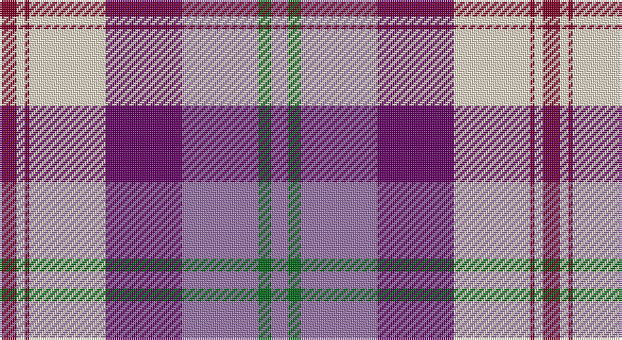

This page is one **sett** — a single exact thread-count. It belongs to the [tartan](/setts/r4w2r1w18dp18m18g3m4/)
(the same proportion at any scale), whose colour order is pattern [RGRBWRWR](/stripes/rgrbwrwr/).

Sourced from tartans-authority.  It is a [8 stripe tartan](/stripes/stripes8/).

Original link http://www.tartansauthority.com/tartan-ferret/display/7582/

## Provenance

Earliest known date: March 2008 One of a series of dancer's tartans for the House of Edgar's in-house collection designed by Kirsty Anderson.

## Also known as

This cloth is also recorded under:

- Gigha, Lilac

3 attestations — the source records this cloth was collapsed from (oldest owns this page)

<ul>
<li>March 2008 — Gigha, Lilac (Dance) (tartans-authority, <a href="http://www.tartansauthority.com/tartan-ferret/display/7582/">record</a>)</li>
<li>undated — Gigha Lilac (register-of-tartans, <a href="https://www.tartanregister.gov.uk/tartanDetails.aspx?ref=5606">record</a>)</li>
<li>undated — Gigha Lilac Fashion Tartan (house-of-tartan, <a href="http://www.house-of-tartan.scotland.net/house/TartanViewjs.asp?colr=Def&tnam=7582">record</a>)</li>
</ul>

## Register references

External register numbers recorded for this tartan.

- Scottish Register of Tartans: [5606](https://www.tartanregister.gov.uk/tartanDetails.aspx?ref=5606)
- Scottish Tartans Authority (ITI): 7582

## Thread count
DR/8 W4 DR2 W36 P36 LP36 G6 LP/8

One full sett is **256 threads**.

## Palette

Palette: <strong>Tartan Register</strong> <small style="color:#888">(3 of 5 colours)</small>
<table><thead><tr><th>Colour</th><th>Threads</th><th>Shade</th><th>Base</th><th>OKLCh</th></tr></thead><tbody><tr><td>DR/</td><td style="text-align:right;font-variant-numeric:tabular-nums">8</td><td><code style="background-color:#800028;">#800028</code> <small style="color:#888">#800028</small></td><td>R <code style="background-color:#CC0000;">#CC0000</code></td><td><small style="color:#888">oklch(38.2% 0.152 14.5)</small></td></tr><tr><td>W</td><td style="text-align:right;font-variant-numeric:tabular-nums">4</td><td><code style="background-color:#F0E0C8;">#F0E0C8</code> <small style="color:#888">#F0E0C8</small></td><td>W <code style="background-color:#F7F7F7;">#F7F7F7</code></td><td><small style="color:#888">oklch(91.3% 0.036 78.1)</small></td></tr><tr><td>DR</td><td style="text-align:right;font-variant-numeric:tabular-nums">2</td><td><code style="background-color:#800028;">#800028</code> <small style="color:#888">#800028</small></td><td>R <code style="background-color:#CC0000;">#CC0000</code></td><td><small style="color:#888">oklch(38.2% 0.152 14.5)</small></td></tr><tr><td>W</td><td style="text-align:right;font-variant-numeric:tabular-nums">36</td><td><code style="background-color:#F0E0C8;">#F0E0C8</code> <small style="color:#888">#F0E0C8</small></td><td>W <code style="background-color:#F7F7F7;">#F7F7F7</code></td><td><small style="color:#888">oklch(91.3% 0.036 78.1)</small></td></tr><tr><td>P</td><td style="text-align:right;font-variant-numeric:tabular-nums">36</td><td><code style="background-color:#640064;">#640064</code> <small style="color:#888">#640064</small></td><td>B <code style="background-color:#2A418A;">#2A418A</code></td><td><small style="color:#888">oklch(35.3% 0.162 328.4)</small></td></tr><tr><td>LP</td><td style="text-align:right;font-variant-numeric:tabular-nums">36</td><td><code style="background-color:#9874A8;">#9874A8</code> <small style="color:#888">#9874A8</small></td><td>R <code style="background-color:#CC0000;">#CC0000</code></td><td><small style="color:#888">oklch(61.3% 0.087 315.2)</small></td></tr><tr><td>G</td><td style="text-align:right;font-variant-numeric:tabular-nums">6</td><td><code style="background-color:#006818;">#006818</code> <small style="color:#888">#006818</small></td><td>G <code style="background-color:#006100;">#006100</code></td><td><small style="color:#888">oklch(45.0% 0.142 145.0)</small></td></tr><tr><td>LP/</td><td style="text-align:right;font-variant-numeric:tabular-nums">8</td><td><code style="background-color:#9874A8;">#9874A8</code> <small style="color:#888">#9874A8</small></td><td>R <code style="background-color:#CC0000;">#CC0000</code></td><td><small style="color:#888">oklch(61.3% 0.087 315.2)</small></td></tr></tbody></table>

# Sample pattern

## Nearest tartans

The nearest existing variants by ΔTartan distance, with this tartan at the top so the swatches line up against it.

ΔTartan

Tartan

Sett

—

<a href="/ttd/edit/#slug=r4w2r1w18dp18m18g3m4~x2">Gigha, Lilac (Dance)</a> <a class="nn-out" href="/variants/s8/r4w2r1w18dp18m18g3m4~x2/" title="open its dictionary page">↗</a>

0.88

<a href="/ttd/edit/#slug=dt1lr7w1o3w1o7dt4p13w1~x4&amp;base=r4w2r1w18dp18m18g3m4~x2">Wcwm 1893-11</a> <a class="nn-out" href="/variants/s9/dt1lr7w1o3w1o7dt4p13w1~x4/" title="open its dictionary page">↗</a>

0.97

<a href="/ttd/edit/#slug=ri22w2db11ly4db11r6db2w10~x2&amp;base=r4w2r1w18dp18m18g3m4~x2">Thousand Islands Int. Council (Corp)</a> <a class="nn-out" href="/variants/s8/ri22w2db11ly4db11r6db2w10~x2/" title="open its dictionary page">↗</a>

1.14

<a href="/ttd/edit/#slug=w17k2n6t6w1n1dp10k2dp3~x4&amp;base=r4w2r1w18dp18m18g3m4~x2">Hebridean Arisaid Blue (Dance) Fashion Tartan</a> <a class="nn-out" href="/variants/s9/w17k2n6t6w1n1dp10k2dp3~x4/" title="open its dictionary page">↗</a>

1.23

<a href="/ttd/edit/#slug=w3lr4w1lr15p24do15ly1do4ly3~x4&amp;base=r4w2r1w18dp18m18g3m4~x2">Sean F Forrester (Personal)</a> <a class="nn-out" href="/variants/s9/w3lr4w1lr15p24do15ly1do4ly3~x4/" title="open its dictionary page">↗</a>

1.29

<a href="/ttd/edit/#slug=r6db2p21w3dg19w26dg3w5~x2&amp;base=r4w2r1w18dp18m18g3m4~x2">Culloden, dress Ancient</a> <a class="nn-out" href="/variants/s8/r6db2p21w3dg19w26dg3w5~x2/" title="open its dictionary page">↗</a>

1.31

<a href="/ttd/edit/#slug=db48r10w2r10dg17k3w17k3w34~x2&amp;base=r4w2r1w18dp18m18g3m4~x2">Unidentified #43</a> <a class="nn-out" href="/variants/s9/db48r10w2r10dg17k3w17k3w34~x2/" title="open its dictionary page">↗</a>

1.37

<a href="/ttd/edit/#slug=r6db2dp21w3dg19w26dg3w5~x2&amp;base=r4w2r1w18dp18m18g3m4~x2">Culloden Dress Ancient</a> <a class="nn-out" href="/variants/s8/r6db2dp21w3dg19w26dg3w5~x2/" title="open its dictionary page">↗</a>

1.45

<a href="/ttd/edit/#slug=m18w2m2t3m2w2m4k10mi2w25k3~x2&amp;base=r4w2r1w18dp18m18g3m4~x2">MacKellar Dress, Cerise (Dance)</a> <a class="nn-out" href="/variants/s11/m18w2m2t3m2w2m4k10mi2w25k3~x2/" title="open its dictionary page">↗</a>

1.46

<a href="/ttd/edit/#slug=lp26w2lp3db15y26m2y3db4~x2&amp;base=r4w2r1w18dp18m18g3m4~x2">Scottish Highlander, dress</a> <a class="nn-out" href="/variants/s8/lp26w2lp3db15y26m2y3db4~x2/" title="open its dictionary page">↗</a>

1.46

<a href="/ttd/edit/#slug=r6t3dp24ly2k23w23k2w6~x2&amp;base=r4w2r1w18dp18m18g3m4~x2">Culloden Dress</a> <a class="nn-out" href="/variants/s8/r6t3dp24ly2k23w23k2w6~x2/" title="open its dictionary page">↗</a>

## Neighbour map

Every grey dot is one of 14360 variants placed by the first two principal components of the ΔTartan feature space (44% of its variance). Red is this tartan; blue dots are its nearest — click one to open its page.

<svg viewBox="0 0 640 380" role="img" style="max-width:100%;height:auto;border:1px solid #e0e0e0;border-radius:4px;display:block" xmlns="http://www.w3.org/2000/svg"><image href="/nn/cloud.v1.png" width="640" height="380"/><a href="/variants/s9/dt1lr7w1o3w1o7dt4p13w1~x4/"><circle cx="137.4" cy="136.4" r="4" fill="#3465a4"><title>Wcwm 1893-11</title></circle></a><a href="/variants/s8/ri22w2db11ly4db11r6db2w10~x2/"><circle cx="132.9" cy="160.1" r="4" fill="#3465a4"><title>Thousand Islands Int. Council (Corp)</title></circle></a><a href="/variants/s9/w17k2n6t6w1n1dp10k2dp3~x4/"><circle cx="151.5" cy="123.6" r="4" fill="#3465a4"><title>Hebridean Arisaid Blue (Dance) Fashion Tartan</title></circle></a><a href="/variants/s9/w3lr4w1lr15p24do15ly1do4ly3~x4/"><circle cx="182.4" cy="120.5" r="4" fill="#3465a4"><title>Sean F Forrester (Personal)</title></circle></a><a href="/variants/s8/r6db2p21w3dg19w26dg3w5~x2/"><circle cx="154.6" cy="140.9" r="4" fill="#3465a4"><title>Culloden, dress Ancient</title></circle></a><a href="/variants/s9/db48r10w2r10dg17k3w17k3w34~x2/"><circle cx="167.8" cy="113.4" r="4" fill="#3465a4"><title>Unidentified #43</title></circle></a><a href="/variants/s8/r6db2dp21w3dg19w26dg3w5~x2/"><circle cx="151.8" cy="142.5" r="4" fill="#3465a4"><title>Culloden Dress Ancient</title></circle></a><a href="/variants/s11/m18w2m2t3m2w2m4k10mi2w25k3~x2/"><circle cx="180.3" cy="105.6" r="4" fill="#3465a4"><title>MacKellar Dress, Cerise (Dance)</title></circle></a><a href="/variants/s8/lp26w2lp3db15y26m2y3db4~x2/"><circle cx="177.9" cy="147.4" r="4" fill="#3465a4"><title>Scottish Highlander, dress</title></circle></a><a href="/variants/s8/r6t3dp24ly2k23w23k2w6~x2/"><circle cx="96.7" cy="123.4" r="4" fill="#3465a4"><title>Culloden Dress</title></circle></a><circle cx="154.8" cy="131.7" r="5" fill="#c00000"/></svg>

ID: /variants/s8/r4w2r1w18dp18m18g3m4~x2/
