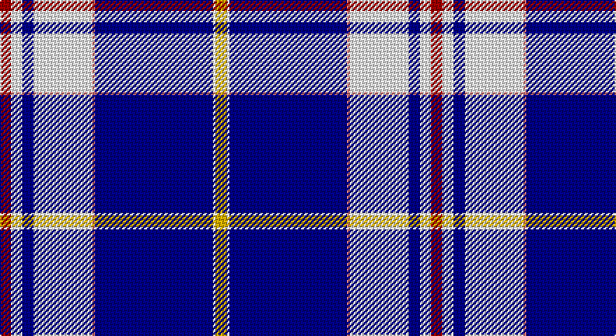

This page is one **sett** — a single exact thread-count. It belongs to the [tartan](/setts/r4w4db4w21ri1db42w1ly4/)
(the same proportion at any scale), whose colour order is pattern [RWBWRBWY](/stripes/rwbwrbwy/).

Sourced from register-of-tartans.  It is a [8 stripe tartan](/stripes/stripes8/).

Original link https://www.tartanregister.gov.uk/tartanDetails.aspx?ref=3367

2 attestations — the source records this cloth was collapsed from (oldest owns this page)

<ul>
<li>01/03/2004 — Presley of Memphis (register-of-tartans, <a href="https://www.tartanregister.gov.uk/tartanDetails.aspx?ref=3367">record</a>)</li>
<li>April 2004 — Presley of Memphis (Fashion) (tartans-authority, <a href="http://www.tartansauthority.com/tartan-ferret/display/6237/">record</a>)</li>
</ul>

## Register references

External register numbers recorded for this tartan.

- Scottish Register of Tartans: [3367](https://www.tartanregister.gov.uk/tartanDetails.aspx?ref=3367)
- Scottish Tartans Authority (ITI): 6237
- Scottish Tartans World Register: 2993

## Thread count
DR/8 W8 DB8 W42 LR2 DB84 W2 Y/8

One full sett is **308 threads**.

## Palette

Palette: <strong>Tartan Register</strong> <small style="color:#888">(3 of 5 colours)</small>
<table><thead><tr><th>Colour</th><th>Threads</th><th>Shade</th><th>Base</th><th>OKLCh</th></tr></thead><tbody><tr><td>DR/</td><td style="text-align:right;font-variant-numeric:tabular-nums">8</td><td><code style="background-color:#A00000;">#A00000</code> <small style="color:#888">#A00000</small></td><td>R <code style="background-color:#CC0000;">#CC0000</code></td><td><small style="color:#888">oklch(44.3% 0.182 29.2)</small></td></tr><tr><td>W</td><td style="text-align:right;font-variant-numeric:tabular-nums">8</td><td><code style="background-color:#FCFCFC;">#FCFCFC</code> <small style="color:#888">#FCFCFC</small></td><td>W <code style="background-color:#F7F7F7;">#F7F7F7</code></td><td><small style="color:#888">oklch(99.1% 0.000 89.9)</small></td></tr><tr><td>DB</td><td style="text-align:right;font-variant-numeric:tabular-nums">8</td><td><code style="background-color:#000088;">#000088</code> <small style="color:#888">#000088</small></td><td>B <code style="background-color:#2A418A;">#2A418A</code></td><td><small style="color:#888">oklch(28.3% 0.196 264.1)</small></td></tr><tr><td>W</td><td style="text-align:right;font-variant-numeric:tabular-nums">42</td><td><code style="background-color:#FCFCFC;">#FCFCFC</code> <small style="color:#888">#FCFCFC</small></td><td>W <code style="background-color:#F7F7F7;">#F7F7F7</code></td><td><small style="color:#888">oklch(99.1% 0.000 89.9)</small></td></tr><tr><td>LR</td><td style="text-align:right;font-variant-numeric:tabular-nums">2</td><td><code style="background-color:#E87878;">#E87878</code> <small style="color:#888">#E87878</small></td><td>R <code style="background-color:#CC0000;">#CC0000</code></td><td><small style="color:#888">oklch(70.0% 0.139 21.2)</small></td></tr><tr><td>DB</td><td style="text-align:right;font-variant-numeric:tabular-nums">84</td><td><code style="background-color:#000088;">#000088</code> <small style="color:#888">#000088</small></td><td>B <code style="background-color:#2A418A;">#2A418A</code></td><td><small style="color:#888">oklch(28.3% 0.196 264.1)</small></td></tr><tr><td>W</td><td style="text-align:right;font-variant-numeric:tabular-nums">2</td><td><code style="background-color:#FCFCFC;">#FCFCFC</code> <small style="color:#888">#FCFCFC</small></td><td>W <code style="background-color:#F7F7F7;">#F7F7F7</code></td><td><small style="color:#888">oklch(99.1% 0.000 89.9)</small></td></tr><tr><td>Y/</td><td style="text-align:right;font-variant-numeric:tabular-nums">8</td><td><code style="background-color:#E0B000;">#E0B000</code> <small style="color:#888">#E0B000</small></td><td>Y <code style="background-color:#F2BF00;">#F2BF00</code></td><td><small style="color:#888">oklch(77.9% 0.159 88.8)</small></td></tr></tbody></table>

# Sample pattern

## Nearest tartans

The nearest existing variants by ΔTartan distance, with this tartan at the top so the swatches line up against it.

ΔTartan

Tartan

Sett

—

<a href="/ttd/edit/#slug=r4w4db4w21ri1db42w1ly4~x2">Presley of Memphis</a> <a class="nn-out" href="/variants/s8/r4w4db4w21ri1db42w1ly4~x2/" title="open its dictionary page">↗</a>

1.33

<a href="/ttd/edit/#slug=r4lt16k3db44r1w3ly2~x2&amp;base=r4w4db4w21ri1db42w1ly4~x2">Dress Blue</a> <a class="nn-out" href="/variants/s7/r4lt16k3db44r1w3ly2~x2/" title="open its dictionary page">↗</a>

1.44

<a href="/ttd/edit/#slug=ly2db26lb3db3r1db3lb7db6lb15w1lb2~x2&amp;base=r4w4db4w21ri1db42w1ly4~x2">Vilaro-Thomas (Personal)</a> <a class="nn-out" href="/variants/s11/ly2db26lb3db3r1db3lb7db6lb15w1lb2~x2/" title="open its dictionary page">↗</a>

1.45

<a href="/ttd/edit/#slug=r4lb16k3db44r1w3lo2~x2&amp;base=r4w4db4w21ri1db42w1ly4~x2">Dress Blue (Fashion)</a> <a class="nn-out" href="/variants/s7/r4lb16k3db44r1w3lo2~x2/" title="open its dictionary page">↗</a>

1.45

<a href="/ttd/edit/#slug=dbi32w2db1w2dbi4db1g8w8lo8db1dbi16db1w4~x2&amp;base=r4w4db4w21ri1db42w1ly4~x2">Spirit of India (Fashion)</a> <a class="nn-out" href="/variants/s13/dbi32w2db1w2dbi4db1g8w8lo8db1dbi16db1w4~x2/" title="open its dictionary page">↗</a>

1.55

<a href="/ttd/edit/#slug=k4r2k28b31ly1b2ly1b2w3~x2&amp;base=r4w4db4w21ri1db42w1ly4~x2">Hill</a> <a class="nn-out" href="/variants/s9/k4r2k28b31ly1b2ly1b2w3~x2/" title="open its dictionary page">↗</a>

1.59

<a href="/ttd/edit/#slug=r3g2k9b2k2b24ly2b2ly1~x2&amp;base=r4w4db4w21ri1db42w1ly4~x2">Bell of the Borders.</a> <a class="nn-out" href="/variants/s9/r3g2k9b2k2b24ly2b2ly1~x2/" title="open its dictionary page">↗</a>

1.60

<a href="/ttd/edit/#slug=k4w1lb2w1k16t36lb4~x2&amp;base=r4w4db4w21ri1db42w1ly4~x2">NHS Grampian (Corporate)</a> <a class="nn-out" href="/variants/s7/k4w1lb2w1k16t36lb4~x2/" title="open its dictionary page">↗</a>

1.61

<a href="/ttd/edit/#slug=lo3db4w10dg2w2dg5db34ly3~x2&amp;base=r4w4db4w21ri1db42w1ly4~x2">Royal Troon Golf Club, The</a> <a class="nn-out" href="/variants/s8/lo3db4w10dg2w2dg5db34ly3~x2/" title="open its dictionary page">↗</a>

1.63

<a href="/ttd/edit/#slug=db4r2db40k11g2w16r2~x2&amp;base=r4w4db4w21ri1db42w1ly4~x2">Sinclair, Blue (Personal)</a> <a class="nn-out" href="/variants/s7/db4r2db40k11g2w16r2~x2/" title="open its dictionary page">↗</a>

1.65

<a href="/ttd/edit/#slug=w4dt8w4lt8w2lt2w4dt42r1ly2r1dt2~x2&amp;base=r4w4db4w21ri1db42w1ly4~x2">StammBar</a> <a class="nn-out" href="/variants/s12/w4dt8w4lt8w2lt2w4dt42r1ly2r1dt2~x2/" title="open its dictionary page">↗</a>

## Neighbour map

Every grey dot is one of 14360 variants placed by the first two principal components of the ΔTartan feature space (44% of its variance). Red is this tartan; blue dots are its nearest — click one to open its page.

<svg viewBox="0 0 640 380" role="img" style="max-width:100%;height:auto;border:1px solid #e0e0e0;border-radius:4px;display:block" xmlns="http://www.w3.org/2000/svg"><image href="/nn/cloud.v1.png" width="640" height="380"/><a href="/variants/s7/r4lt16k3db44r1w3ly2~x2/"><circle cx="327.5" cy="76.7" r="4" fill="#3465a4"><title>Dress Blue</title></circle></a><a href="/variants/s11/ly2db26lb3db3r1db3lb7db6lb15w1lb2~x2/"><circle cx="313.6" cy="102.1" r="4" fill="#3465a4"><title>Vilaro-Thomas (Personal)</title></circle></a><a href="/variants/s7/r4lb16k3db44r1w3lo2~x2/"><circle cx="336.3" cy="75.4" r="4" fill="#3465a4"><title>Dress Blue (Fashion)</title></circle></a><a href="/variants/s13/dbi32w2db1w2dbi4db1g8w8lo8db1dbi16db1w4~x2/"><circle cx="308.6" cy="81.0" r="4" fill="#3465a4"><title>Spirit of India (Fashion)</title></circle></a><a href="/variants/s9/k4r2k28b31ly1b2ly1b2w3~x2/"><circle cx="294.4" cy="96.6" r="4" fill="#3465a4"><title>Hill</title></circle></a><a href="/variants/s9/r3g2k9b2k2b24ly2b2ly1~x2/"><circle cx="316.7" cy="96.5" r="4" fill="#3465a4"><title>Bell of the Borders.</title></circle></a><a href="/variants/s7/k4w1lb2w1k16t36lb4~x2/"><circle cx="348.4" cy="123.5" r="4" fill="#3465a4"><title>NHS Grampian (Corporate)</title></circle></a><a href="/variants/s8/lo3db4w10dg2w2dg5db34ly3~x2/"><circle cx="303.1" cy="118.0" r="4" fill="#3465a4"><title>Royal Troon Golf Club, The</title></circle></a><a href="/variants/s7/db4r2db40k11g2w16r2~x2/"><circle cx="290.2" cy="126.9" r="4" fill="#3465a4"><title>Sinclair, Blue (Personal)</title></circle></a><a href="/variants/s12/w4dt8w4lt8w2lt2w4dt42r1ly2r1dt2~x2/"><circle cx="374.9" cy="57.2" r="4" fill="#3465a4"><title>StammBar</title></circle></a><circle cx="319.5" cy="79.8" r="5" fill="#c00000"/></svg>

ID: /variants/s8/r4w4db4w21ri1db42w1ly4~x2/
