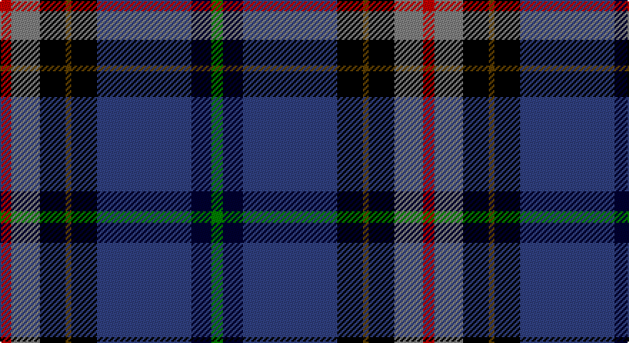

This page is one **sett** — a single exact thread-count. It belongs to the [tartan](/setts/r4y10k9dy2k9db33ki7g4/)
(the same proportion at any scale), whose colour order is pattern [GKBKGKGR](/stripes/gkbkgkgr/).

Part of the [Anne Arundel County](/tartans/anne-arundel-county/) tartan — the named design grouping this sett with its other cloths.

Sourced from weddslist.  It is a [8 stripe tartan](/stripes/stripes8/).

Original link http://www.weddslist.com/cgi-bin/tartans/pg.pl?source=sts

## Thread count
R/8 N20 K18 T4 K18 B66 DB14 G/8

One full sett is **296 threads**.

## Palette

Palette: <strong>Tartan Register</strong> <small style="color:#888">(3 of 7 colours)</small>
<table><thead><tr><th>Colour</th><th>Threads</th><th>Shade</th><th>Base</th><th>OKLCh</th></tr></thead><tbody><tr><td>R/</td><td style="text-align:right;font-variant-numeric:tabular-nums">8</td><td><code style="background-color:#C00000;">#C00000</code> <small style="color:#888">#C00000</small></td><td>R <code style="background-color:#CC0000;">#CC0000</code></td><td><small style="color:#888">oklch(50.7% 0.208 29.2)</small></td></tr><tr><td>N</td><td style="text-align:right;font-variant-numeric:tabular-nums">20</td><td><code style="background-color:#808080;">#808080</code> <small style="color:#888">#808080</small></td><td>G <code style="background-color:#006100;">#006100</code></td><td><small style="color:#888">oklch(60.0% 0.000 89.9)</small></td></tr><tr><td>K</td><td style="text-align:right;font-variant-numeric:tabular-nums">18</td><td><code style="background-color:#000000;">#000000</code> <small style="color:#888">#000000</small></td><td>K <code style="background-color:#000000;">#000000</code></td><td><small style="color:#888">oklch(0.0% 0.000 0.0)</small></td></tr><tr><td>T</td><td style="text-align:right;font-variant-numeric:tabular-nums">4</td><td><code style="background-color:#604000;">#604000</code> <small style="color:#888">#604000</small></td><td>G <code style="background-color:#006100;">#006100</code></td><td><small style="color:#888">oklch(39.8% 0.083 76.8)</small></td></tr><tr><td>K</td><td style="text-align:right;font-variant-numeric:tabular-nums">18</td><td><code style="background-color:#000000;">#000000</code> <small style="color:#888">#000000</small></td><td>K <code style="background-color:#000000;">#000000</code></td><td><small style="color:#888">oklch(0.0% 0.000 0.0)</small></td></tr><tr><td>B</td><td style="text-align:right;font-variant-numeric:tabular-nums">66</td><td><code style="background-color:#304080;">#304080</code> <small style="color:#888">#304080</small></td><td>B <code style="background-color:#2A418A;">#2A418A</code></td><td><small style="color:#888">oklch(39.4% 0.109 270.2)</small></td></tr><tr><td>DB</td><td style="text-align:right;font-variant-numeric:tabular-nums">14</td><td><code style="background-color:#000030;">#000030</code> <small style="color:#888">#000030</small></td><td>K <code style="background-color:#000000;">#000000</code></td><td><small style="color:#888">oklch(14.0% 0.097 264.1)</small></td></tr><tr><td>G/</td><td style="text-align:right;font-variant-numeric:tabular-nums">8</td><td><code style="background-color:#008000;">#008000</code> <small style="color:#888">#008000</small></td><td>G <code style="background-color:#006100;">#006100</code></td><td><small style="color:#888">oklch(52.0% 0.177 142.5)</small></td></tr></tbody></table>

# Sample pattern

## Compared to the master

This cloth is one sett of its design; the master sett (the exemplar the design is anchored on) is below for comparison.

<figure style="margin:0"><figcaption style="color:#888;font-size:smaller">this sett</figcaption></figure>
<figure style="margin:0"><figcaption style="color:#888;font-size:smaller"><a href="/setts/r4oi10k9o2k9db33dt7g4/">master sett →</a></figcaption></figure>

## Nearest tartans

The nearest existing variants by ΔTartan distance, with this tartan at the top so the swatches line up against it.

ΔTartan

Tartan

Sett

—

<a href="/ttd/edit/#slug=r4y10k9dy2k9db33ki7g4~x2">Anne Arundel County</a> <a class="nn-out" href="/variants/s8/r4y10k9dy2k9db33ki7g4~x2/" title="open its dictionary page">↗</a>

1.11

<a href="/ttd/edit/#slug=dg32lb3p3lb3dg2k20db17r3ly4~x2&amp;base=r4y10k9dy2k9db33ki7g4~x2">Colorado (District)</a> <a class="nn-out" href="/variants/s9/dg32lb3p3lb3dg2k20db17r3ly4~x2/" title="open its dictionary page">↗</a>

1.16

<a href="/ttd/edit/#slug=db39o3k14o3t14ly4w2dr2~x2&amp;base=r4y10k9dy2k9db33ki7g4~x2">Unidentified, Lady's kilt</a> <a class="nn-out" href="/variants/s8/db39o3k14o3t14ly4w2dr2~x2/" title="open its dictionary page">↗</a>

1.17

<a href="/ttd/edit/#slug=db11dt5g4w3r3k16dt28lb2~x2&amp;base=r4y10k9dy2k9db33ki7g4~x2">Scottish Italian</a> <a class="nn-out" href="/variants/s8/db11dt5g4w3r3k16dt28lb2~x2/" title="open its dictionary page">↗</a>

1.18

<a href="/ttd/edit/#slug=db60t5w4o12g42p12t5p12&amp;base=r4y10k9dy2k9db33ki7g4~x2">St Columba</a> <a class="nn-out" href="/variants/s8/db60t5w4o12g42p12t5p12/" title="open its dictionary page">↗</a>

1.18

<a href="/ttd/edit/#slug=m4k7m2db25k19w2g13k2ly3~x2&amp;base=r4y10k9dy2k9db33ki7g4~x2">Leung (Personal)</a> <a class="nn-out" href="/variants/s9/m4k7m2db25k19w2g13k2ly3~x2/" title="open its dictionary page">↗</a>

1.18

<a href="/ttd/edit/#slug=ly2do4dg11k30r2db16w1~x2&amp;base=r4y10k9dy2k9db33ki7g4~x2">Buschke (Skye) (Personal)</a> <a class="nn-out" href="/variants/s7/ly2do4dg11k30r2db16w1~x2/" title="open its dictionary page">↗</a>

1.19

<a href="/ttd/edit/#slug=k40n15o10ly3t5w5db10t20&amp;base=r4y10k9dy2k9db33ki7g4~x2">Julien Pigeut Tartan</a> <a class="nn-out" href="/variants/s8/k40n15o10ly3t5w5db10t20/" title="open its dictionary page">↗</a>

1.21

<a href="/ttd/edit/#slug=k1ri4k1w3k1g7k2db16r2lo1~x2&amp;base=r4y10k9dy2k9db33ki7g4~x2">Twempy</a> <a class="nn-out" href="/variants/s10/k1ri4k1w3k1g7k2db16r2lo1~x2/" title="open its dictionary page">↗</a>

1.21

<a href="/ttd/edit/#slug=w2db3t3db13k13db4r2db4g12lp3r1~x2&amp;base=r4y10k9dy2k9db33ki7g4~x2">Fitzgerald, hunting</a> <a class="nn-out" href="/variants/s11/w2db3t3db13k13db4r2db4g12lp3r1~x2/" title="open its dictionary page">↗</a>

1.21

<a href="/ttd/edit/#slug=b11db5g4w3r3k16db28b2~x2&amp;base=r4y10k9dy2k9db33ki7g4~x2">Scottish Italian</a> <a class="nn-out" href="/variants/s8/b11db5g4w3r3k16db28b2~x2/" title="open its dictionary page">↗</a>

## Neighbour map

Every grey dot is one of 14360 variants placed by the first two principal components of the ΔTartan feature space (44% of its variance). Red is this tartan; blue dots are its nearest — click one to open its page.

<svg viewBox="0 0 640 380" role="img" style="max-width:100%;height:auto;border:1px solid #e0e0e0;border-radius:4px;display:block" xmlns="http://www.w3.org/2000/svg"><image href="/nn/cloud.v1.png" width="640" height="380"/><a href="/variants/s9/dg32lb3p3lb3dg2k20db17r3ly4~x2/"><circle cx="135.0" cy="108.5" r="4" fill="#3465a4"><title>Colorado (District)</title></circle></a><a href="/variants/s8/db39o3k14o3t14ly4w2dr2~x2/"><circle cx="207.4" cy="101.6" r="4" fill="#3465a4"><title>Unidentified, Lady's kilt</title></circle></a><a href="/variants/s8/db11dt5g4w3r3k16dt28lb2~x2/"><circle cx="195.3" cy="147.6" r="4" fill="#3465a4"><title>Scottish Italian</title></circle></a><a href="/variants/s8/db60t5w4o12g42p12t5p12/"><circle cx="166.3" cy="138.4" r="4" fill="#3465a4"><title>St Columba</title></circle></a><a href="/variants/s9/m4k7m2db25k19w2g13k2ly3~x2/"><circle cx="152.2" cy="148.7" r="4" fill="#3465a4"><title>Leung (Personal)</title></circle></a><a href="/variants/s7/ly2do4dg11k30r2db16w1~x2/"><circle cx="227.1" cy="115.9" r="4" fill="#3465a4"><title>Buschke (Skye) (Personal)</title></circle></a><a href="/variants/s8/k40n15o10ly3t5w5db10t20/"><circle cx="108.2" cy="136.6" r="4" fill="#3465a4"><title>Julien Pigeut Tartan</title></circle></a><a href="/variants/s10/k1ri4k1w3k1g7k2db16r2lo1~x2/"><circle cx="161.7" cy="96.1" r="4" fill="#3465a4"><title>Twempy</title></circle></a><a href="/variants/s11/w2db3t3db13k13db4r2db4g12lp3r1~x2/"><circle cx="106.9" cy="127.1" r="4" fill="#3465a4"><title>Fitzgerald, hunting</title></circle></a><a href="/variants/s8/b11db5g4w3r3k16db28b2~x2/"><circle cx="208.2" cy="156.9" r="4" fill="#3465a4"><title>Scottish Italian</title></circle></a><circle cx="162.2" cy="128.6" r="5" fill="#c00000"/></svg>

ID: /variants/s8/r4y10k9dy2k9db33ki7g4~x2/
