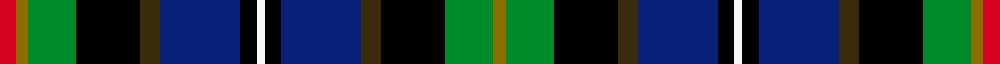

This page is one **sett** — a single exact thread-count. It belongs to the [tartan](/setts/r4y3g12k16dy5db20k4w2/)
(the same proportion at any scale), whose colour order is pattern [GGKGBKWKBGKGGR](/stripes/ggkgbkwkbgkggr/).

Sourced from register-of-tartans.  It is a [14 stripe tartan](/stripes/stripes14/).

Original link https://www.tartanregister.gov.uk/tartanDetails.aspx?ref=1850

2 attestations — the source records this cloth was collapsed from (oldest owns this page)

<ul>
<li>01/09/2004 — Iowa (register-of-tartans, <a href="https://www.tartanregister.gov.uk/tartanDetails.aspx?ref=1850">record</a>)  <em>Iowa has a rich history of Scottish influence in the founding of towns, cities,and counties; and that history is reflected in place names and celebrations throughout Iowa. Iowans of Scottish & Scots-Irish descent have shown leadership in the fields of science, industry, literature, politics, exploration, & conservation. The Iowa Scottish Heritage Society desired to give to the people of Iowa a tartan that symbolizes the state. Blue for the sky, rivers & lakes. Green for the fields our farmers plant. Black for the rich soil for which we are blessed. White for the snow we get. Red for the barns and the state flower the wild rose. Brown (Tan) for the earth. Yellow for corn and the state bird the Goldfinch. Adopted by the State of Iowa General Assembly, House resolution No 149 by Heaton & Whitaker (undated). Sample.</em></li>
<li>Sept 2004 — Iowa (District) (tartans-authority, <a href="http://www.tartansauthority.com/tartan-ferret/display/6051/">record</a>)  <em>Iowa has a rich history of Scottish influence in the founding of towns, cities,and counties; and that history is reflected in place names and celebrations throughout Iowa. Iowans of Scottish & Scots-Irish descent have shown leadership in the fields of science, industry, literature, politics, exploration, & conservation. The Iowa Scottish Heritage Society desired to give to the people of Iowa a tartan that symbolizes the state. Blue for the sky, rivers & lakes, Green for the fields our farmers plant. Black for the rich soil for which we are blessed. White for the snow we get. Red for the barns and the state flower the wild rose. Brown(Tan) for the earth. Yellow for corn and the state bird the Goldfinch. Adopted by the State of Iowa General Assembly, House resolution No 149 by Heaton & Whitaker (undated). Sample.</em></li>
</ul>

## Register references

External register numbers recorded for this tartan.

- Scottish Register of Tartans: [1850](https://www.tartanregister.gov.uk/tartanDetails.aspx?ref=1850)
- Scottish Tartans Authority (ITI): 6051

## Thread count
R/8 Y6 G24 K32 DY10 DB40 K8 W4 K8 DB40 DY10 K32 G24 Y/6

One full sett is **490 threads**.

## Palette
<table><thead><tr><th>Colour</th><th>Shade</th><th>OKLCh</th></tr></thead><tbody><tr><td>DB</td><td><code style="background-color:#082077;">#082077</code> <small style="color:#888">#082077</small></td><td><small style="color:#888">oklch(30.0% 0.149 265.1)</small></td></tr><tr><td>G</td><td><code style="background-color:#008B2A;">#008B2A</code> <small style="color:#888">#008B2A</small></td><td><small style="color:#888">oklch(55.4% 0.170 145.9)</small></td></tr><tr><td>K</td><td><code style="background-color:#000000;">#000000</code> <small style="color:#888">#000000</small></td><td><small style="color:#888">oklch(0.0% 0.000 0.0)</small></td></tr><tr><td>LT</td><td><code style="background-color:#DCBC32;">#DCBC32</code> <small style="color:#888">#DCBC32</small></td><td><small style="color:#888">oklch(80.0% 0.150 95.2)</small></td></tr><tr><td>R</td><td><code style="background-color:#D60020;">#D60020</code> <small style="color:#888">#D60020</small></td><td><small style="color:#888">oklch(55.2% 0.224 25.5)</small></td></tr><tr><td>T</td><td><code style="background-color:#3A2B0D;">#3A2B0D</code> <small style="color:#888">#3A2B0D</small></td><td><small style="color:#888">oklch(30.0% 0.049 82.0)</small></td></tr><tr><td>W</td><td><code style="background-color:#F7F7F7;">#F7F7F7</code> <small style="color:#888">#F7F7F7</small></td><td><small style="color:#888">oklch(97.6% 0.000 89.9)</small></td></tr><tr><td>Y</td><td><code style="background-color:#8B6E00;">#8B6E00</code> <small style="color:#888">#8B6E00</small></td><td><small style="color:#888">oklch(55.1% 0.113 90.4)</small></td></tr></tbody></table>

# Sample pattern

## Nearest variants

The nearest existing variants by ΔTartan distance, with this cloth at the top so the swatches line up against it.

ΔTartan

Threads

Variant

Sett

—

490

<a href="/variants/s8/r4y3g12k16dy5db20k4w2~x2/">Iowa</a>

<a href="/ttd/edit/#slug=g12k16dy5db20k4w2k4db20dy5k16g12y3r4y3~x2&amp;base=r4y3g12k16dy5db20k4w2~x2" title="compare in the TTD">0.00</a>

474

<a href="/variants/s14/g12k16dy5db20k4w2k4db20dy5k16g12y3r4y3~x2/">Iowa American District Tartan</a>

<a href="/ttd/edit/#slug=r2k1db8k7g8y2g8k7db8k1t2~x4&amp;base=r4y3g12k16dy5db20k4w2~x2" title="compare in the TTD">2.38</a>

416

<a href="/variants/s11/r2k1db8k7g8y2g8k7db8k1t2~x4/">Adam Smith (Corporate)</a>

2.38

—

<a href="/variants/s11/r2k1db8k7g8y2g8k7db8k1b2~x4~db1108266-b1511266/">Scottish Economics Society 'Adam Smith'</a>

## Neighbour map

Every grey dot is one of 13620 variants placed by the first two principal components of the ΔTartan feature space (42% of its variance). Red is this tartan; blue dots are its nearest — click one to open its page.

<svg viewBox="0 0 640 380" role="img" style="max-width:100%;height:auto;border:1px solid #e0e0e0;border-radius:4px;display:block" xmlns="http://www.w3.org/2000/svg"><image href="/nn/cloud.v1.png" width="640" height="380"/><a href="/variants/s14/g12k16dy5db20k4w2k4db20dy5k16g12y3r4y3~x2/"><circle cx="56.2" cy="136.4" r="4" fill="#3465a4"><title>Iowa American District Tartan</title></circle></a><a href="/variants/s11/r2k1db8k7g8y2g8k7db8k1t2~x4/"><circle cx="57.0" cy="176.8" r="4" fill="#3465a4"><title>Adam Smith (Corporate)</title></circle></a><a href="/variants/s11/r2k1db8k7g8y2g8k7db8k1b2~x4~db1108266-b1511266/"><circle cx="54.6" cy="175.9" r="4" fill="#3465a4"><title>Scottish Economics Society 'Adam Smith'</title></circle></a><circle cx="56.2" cy="136.4" r="5" fill="#c00000"/><text x="320" y="376" text-anchor="middle" font-size="11" fill="#999">ground</text><text x="11" y="190" text-anchor="middle" font-size="11" fill="#999" transform="rotate(-90 11 190)">complexity</text></svg>

ID: /variants/s8/r4y3g12k16dy5db20k4w2~x2/
