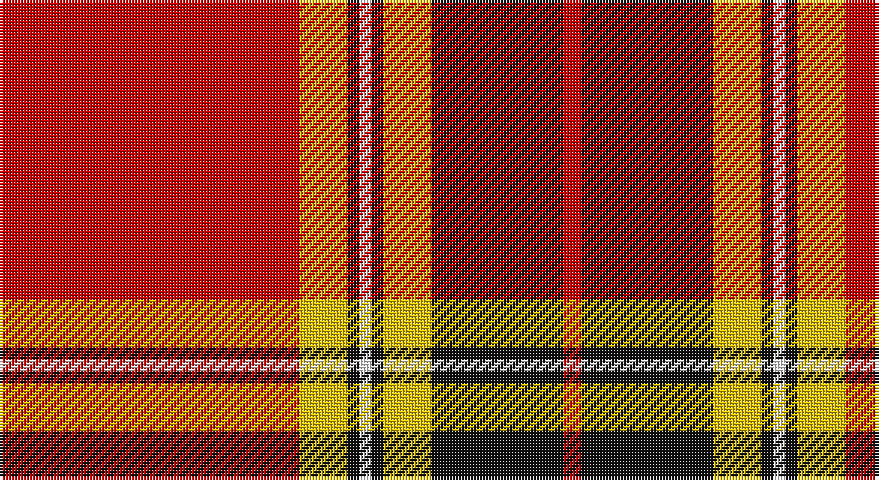

This page is one **sett** — a single exact thread-count. It belongs to the [tartan](/setts/r50ly8k2w2k2ly8k22r3/)
(the same proportion at any scale), whose colour order is pattern [RKYKWKYR](/stripes/rkykwkyr/).

Sourced from tartans-authority.  It is a [8 stripe tartan](/stripes/stripes8/).

Original link http://www.tartansauthority.com/tartan-ferret/display/8741/

## Register references

External register numbers recorded for this tartan.

- Scottish Register of Tartans: [8741](https://www.tartanregister.gov.uk/tartanDetails?ref=8741)
- Scottish Tartans Authority (ITI): 8741

## Thread count
R/100 Y16 K4 W4 K4 Y16 K44 R/6

One full sett is **282 threads**.

## Palette

Palette: <strong>Tartan Register</strong>
<table><thead><tr><th>Colour</th><th>Threads</th><th>Shade</th><th>Base</th><th>OKLCh</th></tr></thead><tbody><tr><td>R/</td><td style="text-align:right;font-variant-numeric:tabular-nums">100</td><td><code style="background-color:#C80000;">#C80000</code> <small style="color:#888">#C80000</small></td><td>R <code style="background-color:#CC0000;">#CC0000</code></td><td><small style="color:#888">oklch(52.3% 0.215 29.2)</small></td></tr><tr><td>Y</td><td style="text-align:right;font-variant-numeric:tabular-nums">16</td><td><code style="background-color:#E8C000;">#E8C000</code> <small style="color:#888">#E8C000</small></td><td>Y <code style="background-color:#F2BF00;">#F2BF00</code></td><td><small style="color:#888">oklch(81.9% 0.168 93.7)</small></td></tr><tr><td>K</td><td style="text-align:right;font-variant-numeric:tabular-nums">4</td><td><code style="background-color:#101010;">#101010</code> <small style="color:#888">#101010</small></td><td>K <code style="background-color:#000000;">#000000</code></td><td><small style="color:#888">oklch(17.3% 0.000 89.9)</small></td></tr><tr><td>W</td><td style="text-align:right;font-variant-numeric:tabular-nums">4</td><td><code style="background-color:#FCFCFC;">#FCFCFC</code> <small style="color:#888">#FCFCFC</small></td><td>W <code style="background-color:#F7F7F7;">#F7F7F7</code></td><td><small style="color:#888">oklch(99.1% 0.000 89.9)</small></td></tr><tr><td>K</td><td style="text-align:right;font-variant-numeric:tabular-nums">4</td><td><code style="background-color:#101010;">#101010</code> <small style="color:#888">#101010</small></td><td>K <code style="background-color:#000000;">#000000</code></td><td><small style="color:#888">oklch(17.3% 0.000 89.9)</small></td></tr><tr><td>Y</td><td style="text-align:right;font-variant-numeric:tabular-nums">16</td><td><code style="background-color:#E8C000;">#E8C000</code> <small style="color:#888">#E8C000</small></td><td>Y <code style="background-color:#F2BF00;">#F2BF00</code></td><td><small style="color:#888">oklch(81.9% 0.168 93.7)</small></td></tr><tr><td>K</td><td style="text-align:right;font-variant-numeric:tabular-nums">44</td><td><code style="background-color:#101010;">#101010</code> <small style="color:#888">#101010</small></td><td>K <code style="background-color:#000000;">#000000</code></td><td><small style="color:#888">oklch(17.3% 0.000 89.9)</small></td></tr><tr><td>R/</td><td style="text-align:right;font-variant-numeric:tabular-nums">6</td><td><code style="background-color:#C80000;">#C80000</code> <small style="color:#888">#C80000</small></td><td>R <code style="background-color:#CC0000;">#CC0000</code></td><td><small style="color:#888">oklch(52.3% 0.215 29.2)</small></td></tr></tbody></table>

# Sample pattern

## Nearest tartans

The nearest existing variants by ΔTartan distance, with this tartan at the top so the swatches line up against it.

ΔTartan

Tartan

Sett

—

<a href="/ttd/edit/#slug=r50ly8k2w2k2ly8k22r3~x2">FIRES Center of Excelence</a> <a class="nn-out" href="/variants/s8/r50ly8k2w2k2ly8k22r3~x2/" title="open its dictionary page">↗</a>

1.16

<a href="/ttd/edit/#slug=lb6k2r32lo2k6lo2r4k2lb3~x2&amp;base=r50ly8k2w2k2ly8k22r3~x2">Lantern, The</a> <a class="nn-out" href="/variants/s9/lb6k2r32lo2k6lo2r4k2lb3~x2/" title="open its dictionary page">↗</a>

1.16

<a href="/ttd/edit/#slug=r3ly6k2ly2k2ly2k3ri20lb1ri3~x4&amp;base=r50ly8k2w2k2ly8k22r3~x2">Motherwell F.C. Fir Park Dress (Spor</a> <a class="nn-out" href="/variants/s10/r3ly6k2ly2k2ly2k3ri20lb1ri3~x4/" title="open its dictionary page">↗</a>

1.18

<a href="/ttd/edit/#slug=ly27k4w4r64w4r4k4r4k12~x2&amp;base=r50ly8k2w2k2ly8k22r3~x2">O'Meehan (Name)</a> <a class="nn-out" href="/variants/s9/ly27k4w4r64w4r4k4r4k12~x2/" title="open its dictionary page">↗</a>

1.20

<a href="/ttd/edit/#slug=dg2r2db1r24lb1db6r3dg12r4db1&amp;base=r50ly8k2w2k2ly8k22r3~x2">MacDonell of Keppoch</a> <a class="nn-out" href="/variants/s10/dg2r2db1r24lb1db6r3dg12r4db1/" title="open its dictionary page">↗</a>

1.21

<a href="/ttd/edit/#slug=r45k2r2k28w16r4k4lo2&amp;base=r50ly8k2w2k2ly8k22r3~x2">Barbecue Plaid</a> <a class="nn-out" href="/variants/s8/r45k2r2k28w16r4k4lo2/" title="open its dictionary page">↗</a>

1.22

<a href="/ttd/edit/#slug=ri42rii2w2rii2ri5r12w32ri4~x2&amp;base=r50ly8k2w2k2ly8k22r3~x2">Longniddry Burgundy (Dance)</a> <a class="nn-out" href="/variants/s8/ri42rii2w2rii2ri5r12w32ri4~x2/" title="open its dictionary page">↗</a>

1.23

<a href="/ttd/edit/#slug=r12g6k1g2k1g1k6r24w2~x2&amp;base=r50ly8k2w2k2ly8k22r3~x2">Stuart/Stewart of Bute</a> <a class="nn-out" href="/variants/s9/r12g6k1g2k1g1k6r24w2~x2/" title="open its dictionary page">↗</a>

1.23

<a href="/ttd/edit/#slug=r33w1k3w1g13r7k3p3w1~x2&amp;base=r50ly8k2w2k2ly8k22r3~x2">Leach, Leech, Leitch, dress</a> <a class="nn-out" href="/variants/s9/r33w1k3w1g13r7k3p3w1~x2/" title="open its dictionary page">↗</a>

1.26

<a href="/ttd/edit/#slug=r28g4k4g4k4t6ly1~x2&amp;base=r50ly8k2w2k2ly8k22r3~x2">Livingstone, MacLay MacLeay</a> <a class="nn-out" href="/variants/s7/r28g4k4g4k4t6ly1~x2/" title="open its dictionary page">↗</a>

1.26

<a href="/ttd/edit/#slug=r28dg4k4dg4k4t6ly1~x2&amp;base=r50ly8k2w2k2ly8k22r3~x2">Livingstone MacLay MacLeay</a> <a class="nn-out" href="/variants/s7/r28dg4k4dg4k4t6ly1~x2/" title="open its dictionary page">↗</a>

## Neighbour map

Every grey dot is one of 14360 variants placed by the first two principal components of the ΔTartan feature space (44% of its variance). Red is this tartan; blue dots are its nearest — click one to open its page.

<svg viewBox="0 0 640 380" role="img" style="max-width:100%;height:auto;border:1px solid #e0e0e0;border-radius:4px;display:block" xmlns="http://www.w3.org/2000/svg"><image href="/nn/cloud.v1.png" width="640" height="380"/><a href="/variants/s9/lb6k2r32lo2k6lo2r4k2lb3~x2/"><circle cx="368.4" cy="117.2" r="4" fill="#3465a4"><title>Lantern, The</title></circle></a><a href="/variants/s10/r3ly6k2ly2k2ly2k3ri20lb1ri3~x4/"><circle cx="284.8" cy="96.6" r="4" fill="#3465a4"><title>Motherwell F.C. Fir Park Dress (Spor</title></circle></a><a href="/variants/s9/ly27k4w4r64w4r4k4r4k12~x2/"><circle cx="325.6" cy="110.0" r="4" fill="#3465a4"><title>O'Meehan (Name)</title></circle></a><a href="/variants/s10/dg2r2db1r24lb1db6r3dg12r4db1/"><circle cx="373.4" cy="120.1" r="4" fill="#3465a4"><title>MacDonell of Keppoch</title></circle></a><a href="/variants/s8/r45k2r2k28w16r4k4lo2/"><circle cx="282.5" cy="114.8" r="4" fill="#3465a4"><title>Barbecue Plaid</title></circle></a><a href="/variants/s8/ri42rii2w2rii2ri5r12w32ri4~x2/"><circle cx="300.3" cy="116.6" r="4" fill="#3465a4"><title>Longniddry Burgundy (Dance)</title></circle></a><a href="/variants/s9/r12g6k1g2k1g1k6r24w2~x2/"><circle cx="394.7" cy="117.7" r="4" fill="#3465a4"><title>Stuart/Stewart of Bute</title></circle></a><a href="/variants/s9/r33w1k3w1g13r7k3p3w1~x2/"><circle cx="373.7" cy="81.9" r="4" fill="#3465a4"><title>Leach, Leech, Leitch, dress</title></circle></a><a href="/variants/s7/r28g4k4g4k4t6ly1~x2/"><circle cx="308.9" cy="107.5" r="4" fill="#3465a4"><title>Livingstone, MacLay MacLeay</title></circle></a><a href="/variants/s7/r28dg4k4dg4k4t6ly1~x2/"><circle cx="323.9" cy="110.5" r="4" fill="#3465a4"><title>Livingstone MacLay MacLeay</title></circle></a><circle cx="336.0" cy="107.6" r="5" fill="#c00000"/></svg>

ID: /variants/s8/r50ly8k2w2k2ly8k22r3~x2/
