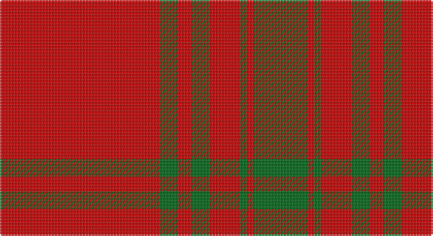

This page is one **sett** — a single exact thread-count. It belongs to the [tartan](/setts/r54g6r5g6r10g3r2g18/)
(the same proportion at any scale), whose colour order is pattern [GRGRGRGR](/stripes/grgrgrgr/).

Part of the [Kyle](/tartans/kyle/) tartan — the named design grouping this sett with its other cloths.

Sourced from tartans-authority.  It is a [8 stripe tartan](/stripes/stripes8/).

Original link http://www.tartansauthority.com/tartan-ferret/display/3615/

## Also known as

This cloth is also recorded under:

- Kyle Blue
- Kyle Green

## Register references

External register numbers recorded for this tartan.

- Scottish Tartans Authority (ITI): 3615

## Thread count
R/108 G12 R10 G12 R20 G6 R4 G/36

One full sett is **272 threads**.

## Palette

Palette: <strong>Tartan Register</strong>
<table><thead><tr><th>Colour</th><th>Threads</th><th>Shade</th><th>Base</th><th>OKLCh</th></tr></thead><tbody><tr><td>R/</td><td style="text-align:right;font-variant-numeric:tabular-nums">108</td><td><code style="background-color:#C80000;">#C80000</code> <small style="color:#888">#C80000</small></td><td>R <code style="background-color:#CC0000;">#CC0000</code></td><td><small style="color:#888">oklch(52.3% 0.215 29.2)</small></td></tr><tr><td>G</td><td style="text-align:right;font-variant-numeric:tabular-nums">12</td><td><code style="background-color:#006818;">#006818</code> <small style="color:#888">#006818</small></td><td>G <code style="background-color:#006100;">#006100</code></td><td><small style="color:#888">oklch(45.0% 0.142 145.0)</small></td></tr><tr><td>R</td><td style="text-align:right;font-variant-numeric:tabular-nums">10</td><td><code style="background-color:#C80000;">#C80000</code> <small style="color:#888">#C80000</small></td><td>R <code style="background-color:#CC0000;">#CC0000</code></td><td><small style="color:#888">oklch(52.3% 0.215 29.2)</small></td></tr><tr><td>G</td><td style="text-align:right;font-variant-numeric:tabular-nums">12</td><td><code style="background-color:#006818;">#006818</code> <small style="color:#888">#006818</small></td><td>G <code style="background-color:#006100;">#006100</code></td><td><small style="color:#888">oklch(45.0% 0.142 145.0)</small></td></tr><tr><td>R</td><td style="text-align:right;font-variant-numeric:tabular-nums">20</td><td><code style="background-color:#C80000;">#C80000</code> <small style="color:#888">#C80000</small></td><td>R <code style="background-color:#CC0000;">#CC0000</code></td><td><small style="color:#888">oklch(52.3% 0.215 29.2)</small></td></tr><tr><td>G</td><td style="text-align:right;font-variant-numeric:tabular-nums">6</td><td><code style="background-color:#006818;">#006818</code> <small style="color:#888">#006818</small></td><td>G <code style="background-color:#006100;">#006100</code></td><td><small style="color:#888">oklch(45.0% 0.142 145.0)</small></td></tr><tr><td>R</td><td style="text-align:right;font-variant-numeric:tabular-nums">4</td><td><code style="background-color:#C80000;">#C80000</code> <small style="color:#888">#C80000</small></td><td>R <code style="background-color:#CC0000;">#CC0000</code></td><td><small style="color:#888">oklch(52.3% 0.215 29.2)</small></td></tr><tr><td>G/</td><td style="text-align:right;font-variant-numeric:tabular-nums">36</td><td><code style="background-color:#006818;">#006818</code> <small style="color:#888">#006818</small></td><td>G <code style="background-color:#006100;">#006100</code></td><td><small style="color:#888">oklch(45.0% 0.142 145.0)</small></td></tr></tbody></table>

# Sample pattern

## Nearest tartans

The nearest existing variants by ΔTartan distance, with this tartan at the top so the swatches line up against it.

ΔTartan

Tartan

Sett

—

<a href="/ttd/edit/#slug=r54g6r5g6r10g3r2g18~x2">Kyle Green (Name)</a> <a class="nn-out" href="/variants/s8/r54g6r5g6r10g3r2g18~x2/" title="open its dictionary page">↗</a>

1.11

<a href="/ttd/edit/#slug=r36lr4r3lr4r6lr2r1lr12~x2&amp;base=r54g6r5g6r10g3r2g18~x2">Menzies Dress</a> <a class="nn-out" href="/variants/s8/r36lr4r3lr4r6lr2r1lr12~x2/" title="open its dictionary page">↗</a>

1.11

<a href="/ttd/edit/#slug=r36lr4r3lr4r6lr2r1lr12&amp;base=r54g6r5g6r10g3r2g18~x2">Menzies Dress</a> <a class="nn-out" href="/variants/s8/r36lr4r3lr4r6lr2r1lr12/" title="open its dictionary page">↗</a>

1.19

<a href="/ttd/edit/#slug=r58ly3r6g16r12g16r6&amp;base=r54g6r5g6r10g3r2g18~x2">Cameron, Ancient</a> <a class="nn-out" href="/variants/s7/r58ly3r6g16r12g16r6/" title="open its dictionary page">↗</a>

1.21

<a href="/ttd/edit/#slug=r24g5r3g9r3db1~x4&amp;base=r54g6r5g6r10g3r2g18~x2">MacKintosh, Red</a> <a class="nn-out" href="/variants/s6/r24g5r3g9r3db1~x4/" title="open its dictionary page">↗</a>

1.23

<a href="/variants/s14/r54g6r5g6r10g3r2g18~x2/">Kyle (Green)</a>

1.38

<a href="/ttd/edit/#slug=r48db2r3g28r4db2~x2&amp;base=r54g6r5g6r10g3r2g18~x2">MacKintosh 2</a> <a class="nn-out" href="/variants/s6/r48db2r3g28r4db2~x2/" title="open its dictionary page">↗</a>

1.40

<a href="/ttd/edit/#slug=r58ly3r6dg16r12dg16r6&amp;base=r54g6r5g6r10g3r2g18~x2">Cameron Ancient</a> <a class="nn-out" href="/variants/s7/r58ly3r6dg16r12dg16r6/" title="open its dictionary page">↗</a>

1.42

<a href="/ttd/edit/#slug=r90k6r6k6r90g6r6g45r6k4r3&amp;base=r54g6r5g6r10g3r2g18~x2">MacPherson-Grant</a> <a class="nn-out" href="/variants/s11/r90k6r6k6r90g6r6g45r6k4r3/" title="open its dictionary page">↗</a>

1.46

<a href="/ttd/edit/#slug=r48db2r3dg28r4db2~x2&amp;base=r54g6r5g6r10g3r2g18~x2">MacKintosh #3</a> <a class="nn-out" href="/variants/s6/r48db2r3dg28r4db2~x2/" title="open its dictionary page">↗</a>

1.49

<a href="/ttd/edit/#slug=r16g1r1g1r4g12~x4&amp;base=r54g6r5g6r10g3r2g18~x2">MacQuarrie #5</a> <a class="nn-out" href="/variants/s6/r16g1r1g1r4g12~x4/" title="open its dictionary page">↗</a>

## Neighbour map

Every grey dot is one of 14360 variants placed by the first two principal components of the ΔTartan feature space (44% of its variance). Red is this tartan; blue dots are its nearest — click one to open its page.

<svg viewBox="0 0 640 380" role="img" style="max-width:100%;height:auto;border:1px solid #e0e0e0;border-radius:4px;display:block" xmlns="http://www.w3.org/2000/svg"><image href="/nn/cloud.v1.png" width="640" height="380"/><a href="/variants/s8/r36lr4r3lr4r6lr2r1lr12~x2/"><circle cx="532.9" cy="150.2" r="4" fill="#3465a4"><title>Menzies Dress</title></circle></a><a href="/variants/s8/r36lr4r3lr4r6lr2r1lr12/"><circle cx="532.9" cy="150.2" r="4" fill="#3465a4"><title>Menzies Dress</title></circle></a><a href="/variants/s7/r58ly3r6g16r12g16r6/"><circle cx="494.4" cy="181.5" r="4" fill="#3465a4"><title>Cameron, Ancient</title></circle></a><a href="/variants/s6/r24g5r3g9r3db1~x4/"><circle cx="488.5" cy="184.0" r="4" fill="#3465a4"><title>MacKintosh, Red</title></circle></a><a href="/variants/s14/r54g6r5g6r10g3r2g18~x2/"><circle cx="503.5" cy="143.5" r="4" fill="#3465a4"><title>Kyle (Green)</title></circle></a><a href="/variants/s6/r48db2r3g28r4db2~x2/"><circle cx="465.6" cy="170.5" r="4" fill="#3465a4"><title>MacKintosh 2</title></circle></a><a href="/variants/s7/r58ly3r6dg16r12dg16r6/"><circle cx="487.3" cy="173.3" r="4" fill="#3465a4"><title>Cameron Ancient</title></circle></a><a href="/variants/s11/r90k6r6k6r90g6r6g45r6k4r3/"><circle cx="553.6" cy="129.5" r="4" fill="#3465a4"><title>MacPherson-Grant</title></circle></a><a href="/variants/s6/r48db2r3dg28r4db2~x2/"><circle cx="459.2" cy="163.0" r="4" fill="#3465a4"><title>MacKintosh #3</title></circle></a><a href="/variants/s6/r16g1r1g1r4g12~x4/"><circle cx="455.5" cy="215.6" r="4" fill="#3465a4"><title>MacQuarrie #5</title></circle></a><circle cx="534.8" cy="172.0" r="5" fill="#c00000"/></svg>

ID: /variants/s8/r54g6r5g6r10g3r2g18~x2/
