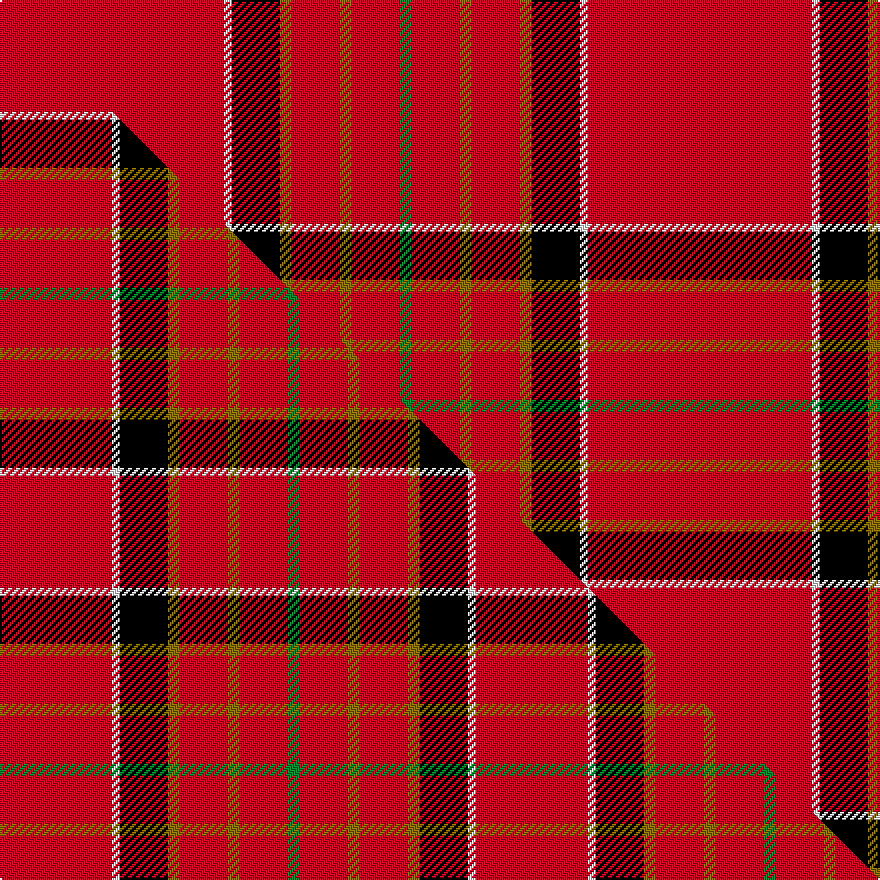

This page is one **sett** — a single exact thread-count. It belongs to the [tartan](/setts/r56w2k12y3r12y3r12g3/)
(the same proportion at any scale), whose colour order is pattern [GRGRGKWR](/stripes/grgrgkwr/).

Part of the [Hackston or Halkerston](/tartans/hackston-or-halkerston/) tartan — the named design grouping this sett with its other cloths.

Sourced from weddslist.  It is a [8 stripe tartan](/stripes/stripes8/).

Original link http://www.weddslist.com/cgi-bin/tartans/pg.pl?source=sts

## Thread count
R/112 W4 K24 Y6 R24 Y6 R24 G/6

One full sett is **294 threads**.

## Palette
<table><thead><tr><th>Colour</th><th>Shade</th><th>OKLCh</th></tr></thead><tbody><tr><td>G</td><td><code style="background-color:#008B2A;">#008B2A</code> <small style="color:#888">#008B2A</small></td><td><small style="color:#888">oklch(55.4% 0.170 145.9)</small></td></tr><tr><td>K</td><td><code style="background-color:#000000;">#000000</code> <small style="color:#888">#000000</small></td><td><small style="color:#888">oklch(0.0% 0.000 0.0)</small></td></tr><tr><td>W</td><td><code style="background-color:#F7F7F7;">#F7F7F7</code> <small style="color:#888">#F7F7F7</small></td><td><small style="color:#888">oklch(97.6% 0.000 89.9)</small></td></tr><tr><td>R</td><td><code style="background-color:#D60020;">#D60020</code> <small style="color:#888">#D60020</small></td><td><small style="color:#888">oklch(55.2% 0.224 25.5)</small></td></tr><tr><td>Y</td><td><code style="background-color:#8B6E00;">#8B6E00</code> <small style="color:#888">#8B6E00</small></td><td><small style="color:#888">oklch(55.1% 0.113 90.4)</small></td></tr></tbody></table>

# Sample pattern

## Compared to the master

This cloth is one sett of its design; the master sett (the exemplar the design is anchored on) is below for comparison.

Its **ΔTartan distance** from the master is **2.03** — the same measure the nearest-tartans table ranks by (0 is identical; a re-scale of the same cloth is near 0, a recolour or a different proportion further).

<figure class="master-compare" style="margin:0">

this sett
master sett ★

<figcaption style="color:#888;font-size:smaller">One weave of this sett against the <a href="/setts/r28w2k12y3r12y3r12g3/">master sett ★</a>, split on the diagonal: a shared proportion runs seamlessly across it with only the shades shifting; a different proportion breaks on it.</figcaption>
</figure>

## Nearest variants

The nearest existing variants by ΔTartan distance, with this cloth at the top so the swatches line up against it.

ΔTartan

Threads

Variant

Sett

—

294

<a href="/variants/s8/r56w2k12y3r12y3r12g3~x2/">Hackston, or Halkerston</a>

<a href="/ttd/edit/#slug=r51lr2k11ly3r11ly3r11g3~x2&amp;base=r56w2k12y3r12y3r12g3~x2" title="compare in the TTD">0.41</a>

272

<a href="/variants/s8/r51lr2k11ly3r11ly3r11g3~x2/">Hackston (Green stripe) (Portrait)</a>

<a href="/ttd/edit/#slug=r72k8r4g16r7n2~x2&amp;base=r56w2k12y3r12y3r12g3~x2" title="compare in the TTD">1.49</a>

288

<a href="/variants/s6/r72k8r4g16r7n2~x2/">MacAndrew Dress (Name)</a>

<a href="/ttd/edit/#slug=r48w4db4k4r12db4r1y4~x2&amp;base=r56w2k12y3r12y3r12g3~x2" title="compare in the TTD">1.71</a>

220

<a href="/variants/s8/r48w4db4k4r12db4r1y4~x2/">Brodie (W &amp; A Smith)</a>

<a href="/ttd/edit/#slug=r48w4db4k4r12db4r1y4&amp;base=r56w2k12y3r12y3r12g3~x2" title="compare in the TTD">1.71</a>

110

<a href="/variants/s8/r48w4db4k4r12db4r1y4/">Brodie</a>

<a href="/ttd/edit/#slug=r42k4w1k6y1db1y1r12~x2&amp;base=r56w2k12y3r12y3r12g3~x2" title="compare in the TTD">1.97</a>

164

<a href="/variants/s8/r42k4w1k6y1db1y1r12~x2/">Princess Elizabeth</a>

<a href="/ttd/edit/#slug=r80w7k2w2k2r3k7r2b12k2~x2&amp;base=r56w2k12y3r12y3r12g3~x2" title="compare in the TTD">2.03</a>

312

<a href="/variants/s10/r80w7k2w2k2r3k7r2b12k2~x2/">Masai Shuka 05 (Artefact)</a>

<a href="/ttd/edit/#slug=r23k1g9r3db1lb1r1~x4&amp;base=r56w2k12y3r12y3r12g3~x2" title="compare in the TTD">2.10</a>

216

<a href="/variants/s7/r23k1g9r3db1lb1r1~x4/">Perthshire Clayquhat District Tartan</a>

<a href="/ttd/edit/#slug=r72k6lb2k11y2db2y2r18~x2&amp;base=r56w2k12y3r12y3r12g3~x2" title="compare in the TTD">2.19</a>

280

<a href="/variants/s8/r72k6lb2k11y2db2y2r18~x2/">Princess Elizabeth (Royal)</a>

<a href="/ttd/edit/#slug=r100db10w5db14y4dbi8y4r24~db1004274-dbi1406275&amp;base=r56w2k12y3r12y3r12g3~x2" title="compare in the TTD">2.23</a>

214

<a href="/variants/s8/r100db10w5db14y4dbi8y4r24~db1004274-dbi1406275/">Earl of Inverness (Royal)</a>

<a href="/ttd/edit/#slug=r114db10w3db16y3k3y3r28~x2&amp;base=r56w2k12y3r12y3r12g3~x2" title="compare in the TTD">2.23</a>

436

<a href="/variants/s8/r114db10w3db16y3k3y3r28~x2/">Inverness #2</a>

## Neighbour map

Every grey dot is one of 13620 variants placed by the first two principal components of the ΔTartan feature space (42% of its variance). Red is this tartan; blue dots are its nearest — click one to open its page.

<svg viewBox="0 0 640 380" role="img" style="max-width:100%;height:auto;border:1px solid #e0e0e0;border-radius:4px;display:block" xmlns="http://www.w3.org/2000/svg"><image href="/nn/cloud.v1.png" width="640" height="380"/><a href="/variants/s8/r51lr2k11ly3r11ly3r11g3~x2/"><circle cx="454.8" cy="90.4" r="4" fill="#3465a4"><title>Hackston (Green stripe) (Portrait)</title></circle></a><a href="/variants/s6/r72k8r4g16r7n2~x2/"><circle cx="494.0" cy="99.9" r="4" fill="#3465a4"><title>MacAndrew Dress (Name)</title></circle></a><a href="/variants/s8/r48w4db4k4r12db4r1y4~x2/"><circle cx="467.1" cy="56.7" r="4" fill="#3465a4"><title>Brodie (W &amp; A Smith)</title></circle></a><a href="/variants/s8/r48w4db4k4r12db4r1y4/"><circle cx="467.1" cy="56.7" r="4" fill="#3465a4"><title>Brodie</title></circle></a><a href="/variants/s8/r42k4w1k6y1db1y1r12~x2/"><circle cx="490.9" cy="49.7" r="4" fill="#3465a4"><title>Princess Elizabeth</title></circle></a><a href="/variants/s10/r80w7k2w2k2r3k7r2b12k2~x2/"><circle cx="438.3" cy="42.9" r="4" fill="#3465a4"><title>Masai Shuka 05 (Artefact)</title></circle></a><a href="/variants/s7/r23k1g9r3db1lb1r1~x4/"><circle cx="422.0" cy="103.2" r="4" fill="#3465a4"><title>Perthshire Clayquhat District Tartan</title></circle></a><a href="/variants/s8/r72k6lb2k11y2db2y2r18~x2/"><circle cx="478.5" cy="55.8" r="4" fill="#3465a4"><title>Princess Elizabeth (Royal)</title></circle></a><a href="/variants/s8/r100db10w5db14y4dbi8y4r24~db1004274-dbi1406275/"><circle cx="478.9" cy="102.2" r="4" fill="#3465a4"><title>Earl of Inverness (Royal)</title></circle></a><a href="/variants/s8/r114db10w3db16y3k3y3r28~x2/"><circle cx="521.7" cy="65.7" r="4" fill="#3465a4"><title>Inverness #2</title></circle></a><circle cx="462.6" cy="82.2" r="5" fill="#c00000"/><text x="320" y="376" text-anchor="middle" font-size="11" fill="#999">ground</text><text x="11" y="190" text-anchor="middle" font-size="11" fill="#999" transform="rotate(-90 11 190)">complexity</text></svg>

ID: /variants/s8/r56w2k12y3r12y3r12g3~x2/
