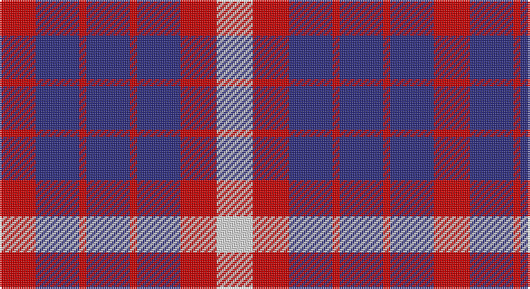

This page is one **sett** — a single exact thread-count. It belongs to the [tartan](/setts/r5db6r1db6r1db6r5w5/)
(the same proportion at any scale), whose colour order is pattern [RBRBRBRW](/stripes/rbrbrbrw/).

Part of the [U.S. Coast Guard](/tartans/u-s-coast-guard/) tartan — the named design grouping this sett with its other cloths.

Sourced from register-of-tartans.  It is a [8 stripe tartan](/stripes/stripes8/).

Original link https://www.tartanregister.gov.uk/tartanDetails.aspx?ref=4184

## Register references

External register numbers recorded for this tartan.

- Scottish Register of Tartans: [4184](https://www.tartanregister.gov.uk/tartanDetails.aspx?ref=4184)
- Scottish Tartans Authority (ITI): 4068

## Thread count
R/20 DB24 R4 DB24 R4 DB24 R20 LN/20

One full sett is **240 threads**.

## Palette

Palette: <strong>Tartan Register</strong>
<table><thead><tr><th>Colour</th><th>Threads</th><th>Shade</th><th>Base</th><th>OKLCh</th></tr></thead><tbody><tr><td>R/</td><td style="text-align:right;font-variant-numeric:tabular-nums">20</td><td><code style="background-color:#C80000;">#C80000</code> <small style="color:#888">#C80000</small></td><td>R <code style="background-color:#CC0000;">#CC0000</code></td><td><small style="color:#888">oklch(52.3% 0.215 29.2)</small></td></tr><tr><td>DB</td><td style="text-align:right;font-variant-numeric:tabular-nums">24</td><td><code style="background-color:#2C2C80;">#2C2C80</code> <small style="color:#888">#2C2C80</small></td><td>B <code style="background-color:#2A418A;">#2A418A</code></td><td><small style="color:#888">oklch(35.0% 0.138 276.6)</small></td></tr><tr><td>R</td><td style="text-align:right;font-variant-numeric:tabular-nums">4</td><td><code style="background-color:#C80000;">#C80000</code> <small style="color:#888">#C80000</small></td><td>R <code style="background-color:#CC0000;">#CC0000</code></td><td><small style="color:#888">oklch(52.3% 0.215 29.2)</small></td></tr><tr><td>DB</td><td style="text-align:right;font-variant-numeric:tabular-nums">24</td><td><code style="background-color:#2C2C80;">#2C2C80</code> <small style="color:#888">#2C2C80</small></td><td>B <code style="background-color:#2A418A;">#2A418A</code></td><td><small style="color:#888">oklch(35.0% 0.138 276.6)</small></td></tr><tr><td>R</td><td style="text-align:right;font-variant-numeric:tabular-nums">4</td><td><code style="background-color:#C80000;">#C80000</code> <small style="color:#888">#C80000</small></td><td>R <code style="background-color:#CC0000;">#CC0000</code></td><td><small style="color:#888">oklch(52.3% 0.215 29.2)</small></td></tr><tr><td>DB</td><td style="text-align:right;font-variant-numeric:tabular-nums">24</td><td><code style="background-color:#2C2C80;">#2C2C80</code> <small style="color:#888">#2C2C80</small></td><td>B <code style="background-color:#2A418A;">#2A418A</code></td><td><small style="color:#888">oklch(35.0% 0.138 276.6)</small></td></tr><tr><td>R</td><td style="text-align:right;font-variant-numeric:tabular-nums">20</td><td><code style="background-color:#C80000;">#C80000</code> <small style="color:#888">#C80000</small></td><td>R <code style="background-color:#CC0000;">#CC0000</code></td><td><small style="color:#888">oklch(52.3% 0.215 29.2)</small></td></tr><tr><td>LN/</td><td style="text-align:right;font-variant-numeric:tabular-nums">20</td><td><code style="background-color:#E0E0E0;">#E0E0E0</code> <small style="color:#888">#E0E0E0</small></td><td>W <code style="background-color:#F7F7F7;">#F7F7F7</code></td><td><small style="color:#888">oklch(90.7% 0.000 89.9)</small></td></tr></tbody></table>

# Sample pattern

## Nearest tartans

The nearest existing variants by ΔTartan distance, with this tartan at the top so the swatches line up against it.

ΔTartan

Tartan

Sett

—

<a href="/ttd/edit/#slug=r5db6r1db6r1db6r5w5~x4">U.S. Coast Guard</a> <a class="nn-out" href="/variants/s8/r5db6r1db6r1db6r5w5~x4/" title="open its dictionary page">↗</a>

0.90

<a href="/ttd/edit/#slug=db7w1r7db4r2db4w2~x2&amp;base=r5db6r1db6r1db6r5w5~x4">Coronation</a> <a class="nn-out" href="/variants/s7/db7w1r7db4r2db4w2~x2/" title="open its dictionary page">↗</a>

1.13

<a href="/ttd/edit/#slug=db6r1db6r5w5~x4&amp;base=r5db6r1db6r1db6r5w5~x4">U.S. Coast Guard (Corporate)</a> <a class="nn-out" href="/variants/s5/db6r1db6r5w5~x4/" title="open its dictionary page">↗</a>

1.58

<a href="/variants/s8/db20k5db18lo26k6~x2/">Johore Regiment</a>

1.60

<a href="/ttd/edit/#slug=db18g5db6r25db6r5db5r6db18r12g16~x2&amp;base=r5db6r1db6r1db6r5w5~x4">Fiddes (Artefact)</a> <a class="nn-out" href="/variants/s11/db18g5db6r25db6r5db5r6db18r12g16~x2/" title="open its dictionary page">↗</a>

1.66

<a href="/ttd/edit/#slug=db6r1db1r2w1r2db1r3~x4&amp;base=r5db6r1db6r1db6r5w5~x4">Edinburgh Marketing</a> <a class="nn-out" href="/variants/s8/db6r1db1r2w1r2db1r3~x4/" title="open its dictionary page">↗</a>

1.71

<a href="/ttd/edit/#slug=db20k5db18lo26k6~x2&amp;base=r5db6r1db6r1db6r5w5~x4">Johore Regiment (Military)</a> <a class="nn-out" href="/variants/s5/db20k5db18lo26k6~x2/" title="open its dictionary page">↗</a>

1.76

<a href="/ttd/edit/#slug=db6w2r6w3k2w6db10r2db3r2~x4&amp;base=r5db6r1db6r1db6r5w5~x4">Commonwealth Games 1986</a> <a class="nn-out" href="/variants/s10/db6w2r6w3k2w6db10r2db3r2~x4/" title="open its dictionary page">↗</a>

1.77

<a href="/ttd/edit/#slug=db12w4r12w5k4w12db20r4db5r4~x2&amp;base=r5db6r1db6r1db6r5w5~x4">Commonwealth, Games 1986</a> <a class="nn-out" href="/variants/s10/db12w4r12w5k4w12db20r4db5r4~x2/" title="open its dictionary page">↗</a>

1.80

<a href="/ttd/edit/#slug=db8r2db8r15w2~x4&amp;base=r5db6r1db6r1db6r5w5~x4">Hamilton (Clan)</a> <a class="nn-out" href="/variants/s5/db8r2db8r15w2~x4/" title="open its dictionary page">↗</a>

1.80

<a href="/ttd/edit/#slug=k4w4k4w4k4r8k2r8k8lo1~x4&amp;base=r5db6r1db6r1db6r5w5~x4">Little of Morton Rigg</a> <a class="nn-out" href="/variants/s10/k4w4k4w4k4r8k2r8k8lo1~x4/" title="open its dictionary page">↗</a>

## Neighbour map

Every grey dot is one of 14360 variants placed by the first two principal components of the ΔTartan feature space (44% of its variance). Red is this tartan; blue dots are its nearest — click one to open its page.

<svg viewBox="0 0 640 380" role="img" style="max-width:100%;height:auto;border:1px solid #e0e0e0;border-radius:4px;display:block" xmlns="http://www.w3.org/2000/svg"><image href="/nn/cloud.v1.png" width="640" height="380"/><a href="/variants/s7/db7w1r7db4r2db4w2~x2/"><circle cx="275.9" cy="244.0" r="4" fill="#3465a4"><title>Coronation</title></circle></a><a href="/variants/s5/db6r1db6r5w5~x4/"><circle cx="211.3" cy="278.4" r="4" fill="#3465a4"><title>U.S. Coast Guard (Corporate)</title></circle></a><a href="/variants/s8/db20k5db18lo26k6~x2/"><circle cx="195.4" cy="253.2" r="4" fill="#3465a4"><title>Johore Regiment</title></circle></a><a href="/variants/s11/db18g5db6r25db6r5db5r6db18r12g16~x2/"><circle cx="207.0" cy="238.9" r="4" fill="#3465a4"><title>Fiddes (Artefact)</title></circle></a><a href="/variants/s8/db6r1db1r2w1r2db1r3~x4/"><circle cx="260.1" cy="221.4" r="4" fill="#3465a4"><title>Edinburgh Marketing</title></circle></a><a href="/variants/s5/db20k5db18lo26k6~x2/"><circle cx="226.7" cy="276.1" r="4" fill="#3465a4"><title>Johore Regiment (Military)</title></circle></a><a href="/variants/s10/db6w2r6w3k2w6db10r2db3r2~x4/"><circle cx="142.5" cy="205.5" r="4" fill="#3465a4"><title>Commonwealth Games 1986</title></circle></a><a href="/variants/s10/db12w4r12w5k4w12db20r4db5r4~x2/"><circle cx="152.6" cy="207.8" r="4" fill="#3465a4"><title>Commonwealth, Games 1986</title></circle></a><a href="/variants/s5/db8r2db8r15w2~x4/"><circle cx="294.6" cy="246.3" r="4" fill="#3465a4"><title>Hamilton (Clan)</title></circle></a><a href="/variants/s10/k4w4k4w4k4r8k2r8k8lo1~x4/"><circle cx="178.5" cy="211.0" r="4" fill="#3465a4"><title>Little of Morton Rigg</title></circle></a><circle cx="222.8" cy="255.0" r="5" fill="#c00000"/></svg>

ID: /variants/s8/r5db6r1db6r1db6r5w5~x4/
