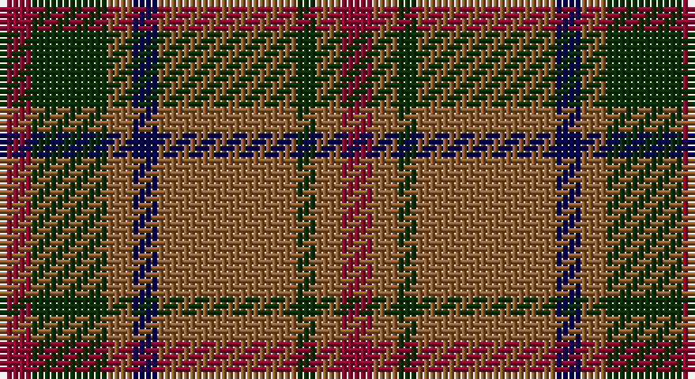

This page is one **sett** — a single exact thread-count. It belongs to the [tartan](/setts/r5dg12o4db4o22dg3o4r5/)
(the same proportion at any scale), whose colour order is pattern [RGRBRGRR](/stripes/rgrbrgrr/).

Part of the [Invertere](/tartans/invertere/) tartan — the named design grouping this sett with its other cloths.

Sourced from weddslist.  It is a [8 stripe tartan](/stripes/stripes8/).

Original link http://www.weddslist.com/cgi-bin/tartans/pg.pl?source=sts

## Also known as

This cloth is also recorded under:

- Invertere,

## Thread count
DR/5 DG12 LT4 DB4 LT22 DG3 LT4 DR/5

One full sett is **108 threads**.

## Palette

Palette: <strong>custom</strong>
<table><thead><tr><th>Colour</th><th>Threads</th><th>Shade</th><th>Base</th><th>OKLCh</th></tr></thead><tbody><tr><td>DR/</td><td style="text-align:right;font-variant-numeric:tabular-nums">5</td><td><code style="background-color:#900030;">#900030</code> <small style="color:#888">#900030</small></td><td>R <code style="background-color:#CC0000;">#CC0000</code></td><td><small style="color:#888">oklch(41.6% 0.166 13.6)</small></td></tr><tr><td>DG</td><td style="text-align:right;font-variant-numeric:tabular-nums">12</td><td><code style="background-color:#003000;">#003000</code> <small style="color:#888">#003000</small></td><td>G <code style="background-color:#006100;">#006100</code></td><td><small style="color:#888">oklch(26.8% 0.091 142.5)</small></td></tr><tr><td>LT</td><td style="text-align:right;font-variant-numeric:tabular-nums">4</td><td><code style="background-color:#906030;">#906030</code> <small style="color:#888">#906030</small></td><td>R <code style="background-color:#CC0000;">#CC0000</code></td><td><small style="color:#888">oklch(53.1% 0.089 63.7)</small></td></tr><tr><td>DB</td><td style="text-align:right;font-variant-numeric:tabular-nums">4</td><td><code style="background-color:#000050;">#000050</code> <small style="color:#888">#000050</small></td><td>B <code style="background-color:#2A418A;">#2A418A</code></td><td><small style="color:#888">oklch(19.5% 0.135 264.1)</small></td></tr><tr><td>LT</td><td style="text-align:right;font-variant-numeric:tabular-nums">22</td><td><code style="background-color:#906030;">#906030</code> <small style="color:#888">#906030</small></td><td>R <code style="background-color:#CC0000;">#CC0000</code></td><td><small style="color:#888">oklch(53.1% 0.089 63.7)</small></td></tr><tr><td>DG</td><td style="text-align:right;font-variant-numeric:tabular-nums">3</td><td><code style="background-color:#003000;">#003000</code> <small style="color:#888">#003000</small></td><td>G <code style="background-color:#006100;">#006100</code></td><td><small style="color:#888">oklch(26.8% 0.091 142.5)</small></td></tr><tr><td>LT</td><td style="text-align:right;font-variant-numeric:tabular-nums">4</td><td><code style="background-color:#906030;">#906030</code> <small style="color:#888">#906030</small></td><td>R <code style="background-color:#CC0000;">#CC0000</code></td><td><small style="color:#888">oklch(53.1% 0.089 63.7)</small></td></tr><tr><td>DR/</td><td style="text-align:right;font-variant-numeric:tabular-nums">5</td><td><code style="background-color:#900030;">#900030</code> <small style="color:#888">#900030</small></td><td>R <code style="background-color:#CC0000;">#CC0000</code></td><td><small style="color:#888">oklch(41.6% 0.166 13.6)</small></td></tr></tbody></table>

# Sample pattern

## Compared to the master

This cloth is one sett of its design; the master sett (the exemplar the design is anchored on) is below for comparison.

<figure style="margin:0"><figcaption style="color:#888;font-size:smaller">this sett</figcaption></figure>
<figure style="margin:0"><figcaption style="color:#888;font-size:smaller"><a href="/setts/dg6lo2db2lo11dg2lo2m3lo2dg2lo11db2lo2dg6m3/">master sett →</a></figcaption></figure>

## Nearest tartans

The nearest existing variants by ΔTartan distance, with this tartan at the top so the swatches line up against it.

ΔTartan

Tartan

Sett

—

<a href="/ttd/edit/#slug=r5dg12o4db4o22dg3o4r5">Invertere, (Daks)</a> <a class="nn-out" href="/variants/s8/r5dg12o4db4o22dg3o4r5/" title="open its dictionary page">↗</a>

0.84

<a href="/ttd/edit/#slug=dt5r19dti2y8r3y18dti2y9dti2~x2&amp;base=r5dg12o4db4o22dg3o4r5">Hubbard (2016)</a> <a class="nn-out" href="/variants/s9/dt5r19dti2y8r3y18dti2y9dti2~x2/" title="open its dictionary page">↗</a>

1.05

<a href="/ttd/edit/#slug=g4r28db6g10k10g3~x2&amp;base=r5dg12o4db4o22dg3o4r5">Canadian Autumn</a> <a class="nn-out" href="/variants/s6/g4r28db6g10k10g3~x2/" title="open its dictionary page">↗</a>

1.10

<a href="/ttd/edit/#slug=do24g2do5lo14g2lo5dy17do2~x2&amp;base=r5dg12o4db4o22dg3o4r5">Loch Rannoch Trade Tartan</a> <a class="nn-out" href="/variants/s8/do24g2do5lo14g2lo5dy17do2~x2/" title="open its dictionary page">↗</a>

1.10

<a href="/ttd/edit/#slug=lo3t7do2m2do14t2do2lo3~x2&amp;base=r5dg12o4db4o22dg3o4r5">Daks (Blue Loden)</a> <a class="nn-out" href="/variants/s8/lo3t7do2m2do14t2do2lo3~x2/" title="open its dictionary page">↗</a>

1.10

<a href="/ttd/edit/#slug=o5t13dr4r4dr27t3dr4o5&amp;base=r5dg12o4db4o22dg3o4r5">Daks, Blue Loden</a> <a class="nn-out" href="/variants/s8/o5t13dr4r4dr27t3dr4o5/" title="open its dictionary page">↗</a>

1.14

<a href="/ttd/edit/#slug=k4lo15dg5k3dg7k3dg30r20dg3~x2&amp;base=r5dg12o4db4o22dg3o4r5">MacKillen</a> <a class="nn-out" href="/variants/s9/k4lo15dg5k3dg7k3dg30r20dg3~x2/" title="open its dictionary page">↗</a>

1.14

<a href="/ttd/edit/#slug=lb2dr12g6dr1n6dr1~x4&amp;base=r5dg12o4db4o22dg3o4r5">Fraser Green</a> <a class="nn-out" href="/variants/s6/lb2dr12g6dr1n6dr1~x4/" title="open its dictionary page">↗</a>

1.15

<a href="/ttd/edit/#slug=dg1ri8dg8r1dg8ri8lb1~x2&amp;base=r5dg12o4db4o22dg3o4r5">MacKinnon Hunting</a> <a class="nn-out" href="/variants/s7/dg1ri8dg8r1dg8ri8lb1~x2/" title="open its dictionary page">↗</a>

1.15

<a href="/ttd/edit/#slug=m3dg6lo2db2lo11dg2lo2m3~x2&amp;base=r5dg12o4db4o22dg3o4r5">Invertere (Daks #1) (Fashion)</a> <a class="nn-out" href="/variants/s8/m3dg6lo2db2lo11dg2lo2m3~x2/" title="open its dictionary page">↗</a>

1.18

<a href="/ttd/edit/#slug=r1b1r6db3r1dg6r1dg6r6db1r1b1~x2&amp;base=r5dg12o4db4o22dg3o4r5">MacQuarrie SM</a> <a class="nn-out" href="/variants/s12/r1b1r6db3r1dg6r1dg6r6db1r1b1~x2/" title="open its dictionary page">↗</a>

## Neighbour map

Every grey dot is one of 14360 variants placed by the first two principal components of the ΔTartan feature space (44% of its variance). Red is this tartan; blue dots are its nearest — click one to open its page.

<svg viewBox="0 0 640 380" role="img" style="max-width:100%;height:auto;border:1px solid #e0e0e0;border-radius:4px;display:block" xmlns="http://www.w3.org/2000/svg"><image href="/nn/cloud.v1.png" width="640" height="380"/><a href="/variants/s9/dt5r19dti2y8r3y18dti2y9dti2~x2/"><circle cx="316.8" cy="213.0" r="4" fill="#3465a4"><title>Hubbard (2016)</title></circle></a><a href="/variants/s6/g4r28db6g10k10g3~x2/"><circle cx="267.4" cy="227.4" r="4" fill="#3465a4"><title>Canadian Autumn</title></circle></a><a href="/variants/s8/do24g2do5lo14g2lo5dy17do2~x2/"><circle cx="277.2" cy="206.8" r="4" fill="#3465a4"><title>Loch Rannoch Trade Tartan</title></circle></a><a href="/variants/s8/lo3t7do2m2do14t2do2lo3~x2/"><circle cx="266.5" cy="207.2" r="4" fill="#3465a4"><title>Daks (Blue Loden)</title></circle></a><a href="/variants/s8/o5t13dr4r4dr27t3dr4o5/"><circle cx="307.1" cy="203.0" r="4" fill="#3465a4"><title>Daks, Blue Loden</title></circle></a><a href="/variants/s9/k4lo15dg5k3dg7k3dg30r20dg3~x2/"><circle cx="268.8" cy="197.1" r="4" fill="#3465a4"><title>MacKillen</title></circle></a><a href="/variants/s6/lb2dr12g6dr1n6dr1~x4/"><circle cx="287.9" cy="212.9" r="4" fill="#3465a4"><title>Fraser Green</title></circle></a><a href="/variants/s7/dg1ri8dg8r1dg8ri8lb1~x2/"><circle cx="303.1" cy="241.2" r="4" fill="#3465a4"><title>MacKinnon Hunting</title></circle></a><a href="/variants/s8/m3dg6lo2db2lo11dg2lo2m3~x2/"><circle cx="230.8" cy="225.8" r="4" fill="#3465a4"><title>Invertere (Daks #1) (Fashion)</title></circle></a><a href="/variants/s12/r1b1r6db3r1dg6r1dg6r6db1r1b1~x2/"><circle cx="248.7" cy="209.7" r="4" fill="#3465a4"><title>MacQuarrie SM</title></circle></a><circle cx="285.0" cy="225.4" r="5" fill="#c00000"/></svg>

ID: /variants/s8/r5dg12o4db4o22dg3o4r5/
