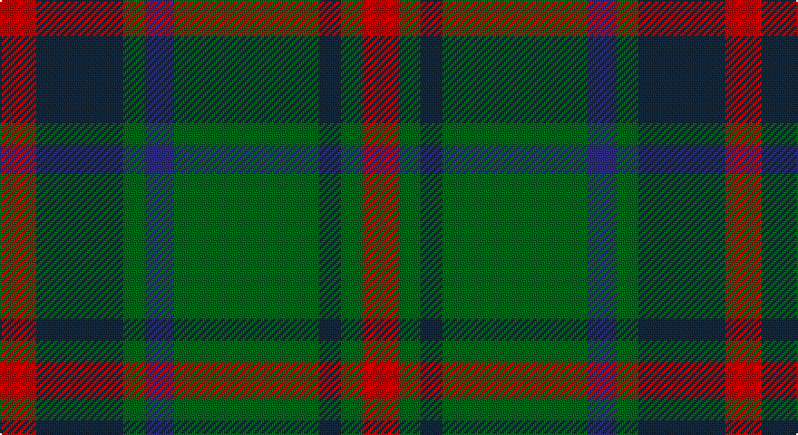

This page is one **sett** — a single exact thread-count. It belongs to the [tartan](/setts/r5dt12g3db4g20dt3g3r5/)
(the same proportion at any scale), whose colour order is pattern [RBGBGBGR](/stripes/rbgbgbgr/).

Part of the [Daks](/tartans/daks/) tartan — the named design grouping this sett with its other cloths.

Sourced from register-of-tartans.  It is a [8 stripe tartan](/stripes/stripes8/).

Original link https://www.tartanregister.gov.uk/tartanDetails.aspx?ref=863

## Also known as

This cloth is also recorded under:

- Daks Muted blue
- Daks, Black
- Daks, Muted blue

## Register references

External register numbers recorded for this tartan.

- Scottish Register of Tartans: [863](https://www.tartanregister.gov.uk/tartanDetails.aspx?ref=863)
- Scottish Tartans Authority (ITI): 6797

## Thread count
R/20 DN48 G12 DB16 G80 DN12 G12 R/20

One full sett is **400 threads**.

## Palette

Palette: <strong>Tartan Register</strong>
<table><thead><tr><th>Colour</th><th>Threads</th><th>Shade</th><th>Base</th><th>OKLCh</th></tr></thead><tbody><tr><td>R/</td><td style="text-align:right;font-variant-numeric:tabular-nums">20</td><td><code style="background-color:#C80000;">#C80000</code> <small style="color:#888">#C80000</small></td><td>R <code style="background-color:#CC0000;">#CC0000</code></td><td><small style="color:#888">oklch(52.3% 0.215 29.2)</small></td></tr><tr><td>DN</td><td style="text-align:right;font-variant-numeric:tabular-nums">48</td><td><code style="background-color:#14283C;">#14283C</code> <small style="color:#888">#14283C</small></td><td>B <code style="background-color:#2A418A;">#2A418A</code></td><td><small style="color:#888">oklch(27.1% 0.046 249.9)</small></td></tr><tr><td>G</td><td style="text-align:right;font-variant-numeric:tabular-nums">12</td><td><code style="background-color:#006818;">#006818</code> <small style="color:#888">#006818</small></td><td>G <code style="background-color:#006100;">#006100</code></td><td><small style="color:#888">oklch(45.0% 0.142 145.0)</small></td></tr><tr><td>DB</td><td style="text-align:right;font-variant-numeric:tabular-nums">16</td><td><code style="background-color:#2C2C80;">#2C2C80</code> <small style="color:#888">#2C2C80</small></td><td>B <code style="background-color:#2A418A;">#2A418A</code></td><td><small style="color:#888">oklch(35.0% 0.138 276.6)</small></td></tr><tr><td>G</td><td style="text-align:right;font-variant-numeric:tabular-nums">80</td><td><code style="background-color:#006818;">#006818</code> <small style="color:#888">#006818</small></td><td>G <code style="background-color:#006100;">#006100</code></td><td><small style="color:#888">oklch(45.0% 0.142 145.0)</small></td></tr><tr><td>DN</td><td style="text-align:right;font-variant-numeric:tabular-nums">12</td><td><code style="background-color:#14283C;">#14283C</code> <small style="color:#888">#14283C</small></td><td>B <code style="background-color:#2A418A;">#2A418A</code></td><td><small style="color:#888">oklch(27.1% 0.046 249.9)</small></td></tr><tr><td>G</td><td style="text-align:right;font-variant-numeric:tabular-nums">12</td><td><code style="background-color:#006818;">#006818</code> <small style="color:#888">#006818</small></td><td>G <code style="background-color:#006100;">#006100</code></td><td><small style="color:#888">oklch(45.0% 0.142 145.0)</small></td></tr><tr><td>R/</td><td style="text-align:right;font-variant-numeric:tabular-nums">20</td><td><code style="background-color:#C80000;">#C80000</code> <small style="color:#888">#C80000</small></td><td>R <code style="background-color:#CC0000;">#CC0000</code></td><td><small style="color:#888">oklch(52.3% 0.215 29.2)</small></td></tr></tbody></table>

# Sample pattern

## Compared to the master

This cloth is one sett of its design; the master sett (the exemplar the design is anchored on) is below for comparison.

<figure style="margin:0"><figcaption style="color:#888;font-size:smaller">this sett</figcaption></figure>
<figure style="margin:0"><figcaption style="color:#888;font-size:smaller"><a href="/setts/db3dy7g2y2g14dy2g2db3/">master sett →</a></figcaption></figure>

## Nearest tartans

The nearest existing variants by ΔTartan distance, with this tartan at the top so the swatches line up against it.

ΔTartan

Tartan

Sett

—

<a href="/ttd/edit/#slug=r5dt12g3db4g20dt3g3r5~x4">Daks (0600150)</a> <a class="nn-out" href="/variants/s8/r5dt12g3db4g20dt3g3r5~x4/" title="open its dictionary page">↗</a>

0.71

<a href="/ttd/edit/#slug=y24dp3y3dp3y3dp7dg20r3~x2&amp;base=r5dt12g3db4g20dt3g3r5~x4">Crantock</a> <a class="nn-out" href="/variants/s8/y24dp3y3dp3y3dp7dg20r3~x2/" title="open its dictionary page">↗</a>

0.93

<a href="/ttd/edit/#slug=db6k1g3k1db3k1g10r3~x2&amp;base=r5dt12g3db4g20dt3g3r5~x4">AIton - 1979 (Clan)</a> <a class="nn-out" href="/variants/s8/db6k1g3k1db3k1g10r3~x2/" title="open its dictionary page">↗</a>

0.99

<a href="/ttd/edit/#slug=t4dy28g6t12k12t3~x2&amp;base=r5dt12g3db4g20dt3g3r5~x4">MacTavish Hunting</a> <a class="nn-out" href="/variants/s6/t4dy28g6t12k12t3~x2/" title="open its dictionary page">↗</a>

1.04

<a href="/ttd/edit/#slug=b5k1g3k1b3k1g10r3~x2&amp;base=r5dt12g3db4g20dt3g3r5~x4">Ayrton 1979 No. 2 (Personal)</a> <a class="nn-out" href="/variants/s8/b5k1g3k1b3k1g10r3~x2/" title="open its dictionary page">↗</a>

1.10

<a href="/ttd/edit/#slug=r1k6g1k1g8k1g8db1g1db6r1~x2&amp;base=r5dt12g3db4g20dt3g3r5~x4">Davidson</a> <a class="nn-out" href="/variants/s11/r1k6g1k1g8k1g8db1g1db6r1~x2/" title="open its dictionary page">↗</a>

1.10

<a href="/ttd/edit/#slug=r1k6g1k1g8k1g8db1g1db6r1~x4&amp;base=r5dt12g3db4g20dt3g3r5~x4">Davidson - 1842 (Clan)</a> <a class="nn-out" href="/variants/s11/r1k6g1k1g8k1g8db1g1db6r1~x4/" title="open its dictionary page">↗</a>

1.11

<a href="/ttd/edit/#slug=y5dt2y18lo2dt5lo2o5dt17y2lo4~x2&amp;base=r5dt12g3db4g20dt3g3r5~x4">Antrim, County</a> <a class="nn-out" href="/variants/s10/y5dt2y18lo2dt5lo2o5dt17y2lo4~x2/" title="open its dictionary page">↗</a>

1.15

<a href="/ttd/edit/#slug=t4dy28dg6t12k12t3~x2&amp;base=r5dt12g3db4g20dt3g3r5~x4">Thompson/Thomson/MacTavish Hunting</a> <a class="nn-out" href="/variants/s6/t4dy28dg6t12k12t3~x2/" title="open its dictionary page">↗</a>

1.16

<a href="/ttd/edit/#slug=dg6r2dg13k6w2k16r3~x2&amp;base=r5dt12g3db4g20dt3g3r5~x4">Sinclair Hunting</a> <a class="nn-out" href="/variants/s7/dg6r2dg13k6w2k16r3~x2/" title="open its dictionary page">↗</a>

1.17

<a href="/ttd/edit/#slug=db2r3g11r3db2t2db11r2g2~x2&amp;base=r5dt12g3db4g20dt3g3r5~x4">Hebridean 1</a> <a class="nn-out" href="/variants/s9/db2r3g11r3db2t2db11r2g2~x2/" title="open its dictionary page">↗</a>

## Neighbour map

Every grey dot is one of 14360 variants placed by the first two principal components of the ΔTartan feature space (44% of its variance). Red is this tartan; blue dots are its nearest — click one to open its page.

<svg viewBox="0 0 640 380" role="img" style="max-width:100%;height:auto;border:1px solid #e0e0e0;border-radius:4px;display:block" xmlns="http://www.w3.org/2000/svg"><image href="/nn/cloud.v1.png" width="640" height="380"/><a href="/variants/s8/y24dp3y3dp3y3dp7dg20r3~x2/"><circle cx="268.1" cy="216.0" r="4" fill="#3465a4"><title>Crantock</title></circle></a><a href="/variants/s8/db6k1g3k1db3k1g10r3~x2/"><circle cx="255.9" cy="216.8" r="4" fill="#3465a4"><title>AIton - 1979 (Clan)</title></circle></a><a href="/variants/s6/t4dy28g6t12k12t3~x2/"><circle cx="237.6" cy="231.6" r="4" fill="#3465a4"><title>MacTavish Hunting</title></circle></a><a href="/variants/s8/b5k1g3k1b3k1g10r3~x2/"><circle cx="258.4" cy="215.7" r="4" fill="#3465a4"><title>Ayrton 1979 No. 2 (Personal)</title></circle></a><a href="/variants/s11/r1k6g1k1g8k1g8db1g1db6r1~x2/"><circle cx="271.9" cy="208.2" r="4" fill="#3465a4"><title>Davidson</title></circle></a><a href="/variants/s11/r1k6g1k1g8k1g8db1g1db6r1~x4/"><circle cx="271.9" cy="208.2" r="4" fill="#3465a4"><title>Davidson - 1842 (Clan)</title></circle></a><a href="/variants/s10/y5dt2y18lo2dt5lo2o5dt17y2lo4~x2/"><circle cx="249.1" cy="206.9" r="4" fill="#3465a4"><title>Antrim, County</title></circle></a><a href="/variants/s6/t4dy28dg6t12k12t3~x2/"><circle cx="249.8" cy="242.4" r="4" fill="#3465a4"><title>Thompson/Thomson/MacTavish Hunting</title></circle></a><a href="/variants/s7/dg6r2dg13k6w2k16r3~x2/"><circle cx="253.8" cy="239.3" r="4" fill="#3465a4"><title>Sinclair Hunting</title></circle></a><a href="/variants/s9/db2r3g11r3db2t2db11r2g2~x2/"><circle cx="212.2" cy="229.8" r="4" fill="#3465a4"><title>Hebridean 1</title></circle></a><circle cx="248.2" cy="232.3" r="5" fill="#c00000"/></svg>

ID: /variants/s8/r5dt12g3db4g20dt3g3r5~x4/
