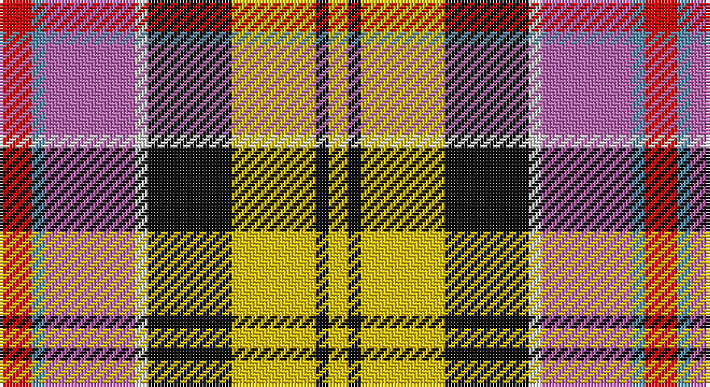

This page is one **sett** — a single exact thread-count. It belongs to the [tartan](/setts/r5t2m14w2k13ly13k2ly3/)
(the same proportion at any scale), whose colour order is pattern [RBRWKYKY](/stripes/rbrwkyky/).

Sourced from house-of-tartan.  It is a [8 stripe tartan](/stripes/stripes8/).

Original link http://www.house-of-tartan.scotland.net/house/TartanViewjs.asp?colr=Def&tnam=1328

## Provenance

Earliest known date: 1746 Worn by a member of Prince Charles' staff during the battle but it is not known with which family or district it was first connected. It was first illustrated in Old & Rare in 1893 by D W Stewart whose son D C Stewart was a founder member of the Scottish Tartans Society. Now firmly established as a district tartan.

## Thread count
R/10 B4 P28 LN4 K26 Y26 K4 Ya/6

One full sett is **200 threads**.

## Palette

Palette: <strong>Tartan Register</strong> <small style="color:#888">(5 of 6 colours)</small>
<table><thead><tr><th>Colour</th><th>Threads</th><th>Shade</th><th>Base</th><th>OKLCh</th></tr></thead><tbody><tr><td>R/</td><td style="text-align:right;font-variant-numeric:tabular-nums">10</td><td><code style="background-color:#C80000;">#C80000</code> <small style="color:#888">#C80000</small></td><td>R <code style="background-color:#CC0000;">#CC0000</code></td><td><small style="color:#888">oklch(52.3% 0.215 29.2)</small></td></tr><tr><td>B</td><td style="text-align:right;font-variant-numeric:tabular-nums">4</td><td><code style="background-color:#5C8CA8;">#5C8CA8</code> <small style="color:#888">#5C8CA8</small></td><td>B <code style="background-color:#2A418A;">#2A418A</code></td><td><small style="color:#888">oklch(61.7% 0.067 235.0)</small></td></tr><tr><td>P</td><td style="text-align:right;font-variant-numeric:tabular-nums">28</td><td><code style="background-color:#B468AC;">#B468AC</code> <small style="color:#888">#B468AC</small></td><td>R <code style="background-color:#CC0000;">#CC0000</code></td><td><small style="color:#888">oklch(62.5% 0.131 330.9)</small></td></tr><tr><td>LN</td><td style="text-align:right;font-variant-numeric:tabular-nums">4</td><td><code style="background-color:#E0E0E0;">#E0E0E0</code> <small style="color:#888">#E0E0E0</small></td><td>W <code style="background-color:#F7F7F7;">#F7F7F7</code></td><td><small style="color:#888">oklch(90.7% 0.000 89.9)</small></td></tr><tr><td>K</td><td style="text-align:right;font-variant-numeric:tabular-nums">26</td><td><code style="background-color:#101010;">#101010</code> <small style="color:#888">#101010</small></td><td>K <code style="background-color:#000000;">#000000</code></td><td><small style="color:#888">oklch(17.3% 0.000 89.9)</small></td></tr><tr><td>Y</td><td style="text-align:right;font-variant-numeric:tabular-nums">26</td><td><code style="background-color:#E8C000;">#E8C000</code> <small style="color:#888">#E8C000</small></td><td>Y <code style="background-color:#F2BF00;">#F2BF00</code></td><td><small style="color:#888">oklch(81.9% 0.168 93.7)</small></td></tr><tr><td>K</td><td style="text-align:right;font-variant-numeric:tabular-nums">4</td><td><code style="background-color:#101010;">#101010</code> <small style="color:#888">#101010</small></td><td>K <code style="background-color:#000000;">#000000</code></td><td><small style="color:#888">oklch(17.3% 0.000 89.9)</small></td></tr><tr><td>Ya/</td><td style="text-align:right;font-variant-numeric:tabular-nums">6</td><td><code style="background-color:#E8C000;">#E8C000</code> <small style="color:#888">#E8C000</small></td><td>Y <code style="background-color:#F2BF00;">#F2BF00</code></td><td><small style="color:#888">oklch(81.9% 0.168 93.7)</small></td></tr></tbody></table>

# Sample pattern

## Nearest tartans

The nearest existing variants by ΔTartan distance, with this tartan at the top so the swatches line up against it.

ΔTartan

Tartan

Sett

—

<a href="/ttd/edit/#slug=r5t2m14w2k13ly13k2ly3~x2">Culloden (Old and Rare) District Tartan</a> <a class="nn-out" href="/variants/s8/r5t2m14w2k13ly13k2ly3~x2/" title="open its dictionary page">↗</a>

0.94

<a href="/ttd/edit/#slug=r5t2dp14w2k13lo13k2ly3~x2&amp;base=r5t2m14w2k13ly13k2ly3~x2">Culloden</a> <a class="nn-out" href="/variants/s8/r5t2dp14w2k13lo13k2ly3~x2/" title="open its dictionary page">↗</a>

1.03

<a href="/ttd/edit/#slug=t3p10w3k3g19r14t3k2ly3~x2&amp;base=r5t2m14w2k13ly13k2ly3~x2">Wilson's, No 110</a> <a class="nn-out" href="/variants/s9/t3p10w3k3g19r14t3k2ly3~x2/" title="open its dictionary page">↗</a>

1.17

<a href="/ttd/edit/#slug=r24g22k2w6k2ly2k15y6ri6w2~x2&amp;base=r5t2m14w2k13ly13k2ly3~x2">Bruce of Kinnaird</a> <a class="nn-out" href="/variants/s10/r24g22k2w6k2ly2k15y6ri6w2~x2/" title="open its dictionary page">↗</a>

1.19

<a href="/ttd/edit/#slug=r6ly15do4db12g12dy4r25w5~x2&amp;base=r5t2m14w2k13ly13k2ly3~x2">Young Presidents Organisation Dress</a> <a class="nn-out" href="/variants/s8/r6ly15do4db12g12dy4r25w5~x2/" title="open its dictionary page">↗</a>

1.27

<a href="/ttd/edit/#slug=ly5lr3db6o8w5r17k2&amp;base=r5t2m14w2k13ly13k2ly3~x2">Barrington Municipality</a> <a class="nn-out" href="/variants/s7/ly5lr3db6o8w5r17k2/" title="open its dictionary page">↗</a>

1.28

<a href="/ttd/edit/#slug=r5t2p16k13ly13k2w3~x2&amp;base=r5t2m14w2k13ly13k2ly3~x2">Casey (Personal)</a> <a class="nn-out" href="/variants/s7/r5t2p16k13ly13k2w3~x2/" title="open its dictionary page">↗</a>

1.29

<a href="/ttd/edit/#slug=r22t6db10ly4r4w4dg22db8ly3&amp;base=r5t2m14w2k13ly13k2ly3~x2">Unidentified No 14</a> <a class="nn-out" href="/variants/s9/r22t6db10ly4r4w4dg22db8ly3/" title="open its dictionary page">↗</a>

1.33

<a href="/ttd/edit/#slug=w6db3w18k5w5dr10o17ly4o17dr10t10dr2t4~x2&amp;base=r5t2m14w2k13ly13k2ly3~x2">Gordon, dress 5</a> <a class="nn-out" href="/variants/s13/w6db3w18k5w5dr10o17ly4o17dr10t10dr2t4~x2/" title="open its dictionary page">↗</a>

1.33

<a href="/ttd/edit/#slug=t4p3gi1g9w1r8k1~x4&amp;base=r5t2m14w2k13ly13k2ly3~x2">Wilson's, No 121</a> <a class="nn-out" href="/variants/s7/t4p3gi1g9w1r8k1~x4/" title="open its dictionary page">↗</a>

1.35

<a href="/ttd/edit/#slug=ly9y7db3r28db4y7db5t4db5g7db3w6~x2&amp;base=r5t2m14w2k13ly13k2ly3~x2">Mayo County Crest (Fashion)</a> <a class="nn-out" href="/variants/s12/ly9y7db3r28db4y7db5t4db5g7db3w6~x2/" title="open its dictionary page">↗</a>

## Neighbour map

Every grey dot is one of 14360 variants placed by the first two principal components of the ΔTartan feature space (44% of its variance). Red is this tartan; blue dots are its nearest — click one to open its page.

<svg viewBox="0 0 640 380" role="img" style="max-width:100%;height:auto;border:1px solid #e0e0e0;border-radius:4px;display:block" xmlns="http://www.w3.org/2000/svg"><image href="/nn/cloud.v1.png" width="640" height="380"/><a href="/variants/s8/r5t2dp14w2k13lo13k2ly3~x2/"><circle cx="43.0" cy="145.6" r="4" fill="#3465a4"><title>Culloden</title></circle></a><a href="/variants/s9/t3p10w3k3g19r14t3k2ly3~x2/"><circle cx="66.0" cy="124.1" r="4" fill="#3465a4"><title>Wilson's, No 110</title></circle></a><a href="/variants/s10/r24g22k2w6k2ly2k15y6ri6w2~x2/"><circle cx="64.5" cy="103.5" r="4" fill="#3465a4"><title>Bruce of Kinnaird</title></circle></a><a href="/variants/s8/r6ly15do4db12g12dy4r25w5~x2/"><circle cx="64.5" cy="157.3" r="4" fill="#3465a4"><title>Young Presidents Organisation Dress</title></circle></a><a href="/variants/s7/ly5lr3db6o8w5r17k2/"><circle cx="70.9" cy="137.4" r="4" fill="#3465a4"><title>Barrington Municipality</title></circle></a><a href="/variants/s7/r5t2p16k13ly13k2w3~x2/"><circle cx="62.0" cy="160.3" r="4" fill="#3465a4"><title>Casey (Personal)</title></circle></a><a href="/variants/s9/r22t6db10ly4r4w4dg22db8ly3/"><circle cx="87.3" cy="162.3" r="4" fill="#3465a4"><title>Unidentified No 14</title></circle></a><a href="/variants/s13/w6db3w18k5w5dr10o17ly4o17dr10t10dr2t4~x2/"><circle cx="29.1" cy="126.8" r="4" fill="#3465a4"><title>Gordon, dress 5</title></circle></a><a href="/variants/s7/t4p3gi1g9w1r8k1~x4/"><circle cx="96.9" cy="150.9" r="4" fill="#3465a4"><title>Wilson's, No 121</title></circle></a><a href="/variants/s12/ly9y7db3r28db4y7db5t4db5g7db3w6~x2/"><circle cx="73.4" cy="114.0" r="4" fill="#3465a4"><title>Mayo County Crest (Fashion)</title></circle></a><circle cx="30.7" cy="138.0" r="5" fill="#c00000"/></svg>

ID: /variants/s8/r5t2m14w2k13ly13k2ly3~x2/
