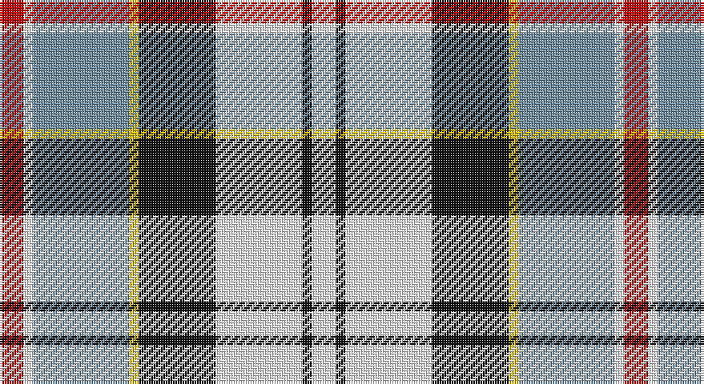

This page is one **sett** — a single exact thread-count. It belongs to the [tartan](/setts/r5w2t20ly2k16w18k2w5/)
(the same proportion at any scale), whose colour order is pattern [RWBYKWKW](/stripes/rwbykwkw/).

Part of the [Ailsa Craig](/tartans/ailsa-craig/) tartan — the named design grouping this sett with its other cloths.

Sourced from tartans-authority.  It is a [8 stripe tartan](/stripes/stripes8/).

Original link http://www.tartansauthority.com/tartan-ferret/display/1673/

## Also known as

This cloth is also recorded under:

- Ailsa, Craig

## Register references

External register numbers recorded for this tartan.

- Scottish Tartans Authority (ITI): 1673

## Thread count
R/10 W4 B40 Y4 K32 W36 K4 W/10

One full sett is **260 threads**.

## Palette

Palette: <strong>Tartan Register</strong> <small style="color:#888">(4 of 5 colours)</small>
<table><thead><tr><th>Colour</th><th>Threads</th><th>Shade</th><th>Base</th><th>OKLCh</th></tr></thead><tbody><tr><td>R/</td><td style="text-align:right;font-variant-numeric:tabular-nums">10</td><td><code style="background-color:#C80000;">#C80000</code> <small style="color:#888">#C80000</small></td><td>R <code style="background-color:#CC0000;">#CC0000</code></td><td><small style="color:#888">oklch(52.3% 0.215 29.2)</small></td></tr><tr><td>W</td><td style="text-align:right;font-variant-numeric:tabular-nums">4</td><td><code style="background-color:#F8F8F8;">#F8F8F8</code> <small style="color:#888">#F8F8F8</small></td><td>W <code style="background-color:#F7F7F7;">#F7F7F7</code></td><td><small style="color:#888">oklch(97.9% 0.000 89.9)</small></td></tr><tr><td>B</td><td style="text-align:right;font-variant-numeric:tabular-nums">40</td><td><code style="background-color:#7490A4;">#7490A4</code> <small style="color:#888">#7490A4</small></td><td>B <code style="background-color:#2A418A;">#2A418A</code></td><td><small style="color:#888">oklch(63.9% 0.044 239.4)</small></td></tr><tr><td>Y</td><td style="text-align:right;font-variant-numeric:tabular-nums">4</td><td><code style="background-color:#E8C000;">#E8C000</code> <small style="color:#888">#E8C000</small></td><td>Y <code style="background-color:#F2BF00;">#F2BF00</code></td><td><small style="color:#888">oklch(81.9% 0.168 93.7)</small></td></tr><tr><td>K</td><td style="text-align:right;font-variant-numeric:tabular-nums">32</td><td><code style="background-color:#101010;">#101010</code> <small style="color:#888">#101010</small></td><td>K <code style="background-color:#000000;">#000000</code></td><td><small style="color:#888">oklch(17.3% 0.000 89.9)</small></td></tr><tr><td>W</td><td style="text-align:right;font-variant-numeric:tabular-nums">36</td><td><code style="background-color:#F8F8F8;">#F8F8F8</code> <small style="color:#888">#F8F8F8</small></td><td>W <code style="background-color:#F7F7F7;">#F7F7F7</code></td><td><small style="color:#888">oklch(97.9% 0.000 89.9)</small></td></tr><tr><td>K</td><td style="text-align:right;font-variant-numeric:tabular-nums">4</td><td><code style="background-color:#101010;">#101010</code> <small style="color:#888">#101010</small></td><td>K <code style="background-color:#000000;">#000000</code></td><td><small style="color:#888">oklch(17.3% 0.000 89.9)</small></td></tr><tr><td>W/</td><td style="text-align:right;font-variant-numeric:tabular-nums">10</td><td><code style="background-color:#F8F8F8;">#F8F8F8</code> <small style="color:#888">#F8F8F8</small></td><td>W <code style="background-color:#F7F7F7;">#F7F7F7</code></td><td><small style="color:#888">oklch(97.9% 0.000 89.9)</small></td></tr></tbody></table>

# Sample pattern

## Compared to the master

This cloth is one sett of its design; the master sett (the exemplar the design is anchored on) is below for comparison.

<figure style="margin:0"><figcaption style="color:#888;font-size:smaller">this sett</figcaption></figure>
<figure style="margin:0"><figcaption style="color:#888;font-size:smaller"><a href="/setts/r5w2o20ly2k16w18k2w5/">master sett →</a></figcaption></figure>

## Nearest tartans

The nearest existing variants by ΔTartan distance, with this tartan at the top so the swatches line up against it.

ΔTartan

Tartan

Sett

—

<a href="/ttd/edit/#slug=r5w2t20ly2k16w18k2w5~x2">Ailsa Craig (District)</a> <a class="nn-out" href="/variants/s8/r5w2t20ly2k16w18k2w5~x2/" title="open its dictionary page">↗</a>

0.26

<a href="/ttd/edit/#slug=r5w2o20ly2k16w18k2w5~x2&amp;base=r5w2t20ly2k16w18k2w5~x2">Ailsa Craig</a> <a class="nn-out" href="/variants/s8/r5w2o20ly2k16w18k2w5~x2/" title="open its dictionary page">↗</a>

0.70

<a href="/ttd/edit/#slug=g5ly2t20w2k20w20k2w5~x2&amp;base=r5w2t20ly2k16w18k2w5~x2">Alexander Brothers - 2007? (Corp.)</a> <a class="nn-out" href="/variants/s8/g5ly2t20w2k20w20k2w5~x2/" title="open its dictionary page">↗</a>

0.90

<a href="/ttd/edit/#slug=w4k2w18k11db2y18ly2~x2&amp;base=r5w2t20ly2k16w18k2w5~x2">Barbour - Ancient</a> <a class="nn-out" href="/variants/s7/w4k2w18k11db2y18ly2~x2/" title="open its dictionary page">↗</a>

0.91

<a href="/variants/s8/wi4k13wi17lo2r2lo24wi2w2~x2/">Lalage (Personal)</a>

0.96

<a href="/ttd/edit/#slug=r6db2p21w3dg19w26dg3w5~x2&amp;base=r5w2t20ly2k16w18k2w5~x2">Culloden, dress Ancient</a> <a class="nn-out" href="/variants/s8/r6db2p21w3dg19w26dg3w5~x2/" title="open its dictionary page">↗</a>

1.01

<a href="/ttd/edit/#slug=r5w28r5lb3r5k21r5lb28w3ly5~x2&amp;base=r5w2t20ly2k16w18k2w5~x2">Stirling &amp; Bannockburn Dress (Dist)</a> <a class="nn-out" href="/variants/s10/r5w28r5lb3r5k21r5lb28w3ly5~x2/" title="open its dictionary page">↗</a>

1.01

<a href="/ttd/edit/#slug=k20w4r4w20dg20w5dg2g2~x2&amp;base=r5w2t20ly2k16w18k2w5~x2">Hackett, William (Coatbridge) (Personal)</a> <a class="nn-out" href="/variants/s8/k20w4r4w20dg20w5dg2g2~x2/" title="open its dictionary page">↗</a>

1.02

<a href="/ttd/edit/#slug=w39db9k10dg11r7k3r7~x2&amp;base=r5w2t20ly2k16w18k2w5~x2">MacDuff Dress #5</a> <a class="nn-out" href="/variants/s7/w39db9k10dg11r7k3r7~x2/" title="open its dictionary page">↗</a>

1.04

<a href="/ttd/edit/#slug=w39db9k10g11r7k3r7~x2&amp;base=r5w2t20ly2k16w18k2w5~x2">MacDuff dress</a> <a class="nn-out" href="/variants/s7/w39db9k10g11r7k3r7~x2/" title="open its dictionary page">↗</a>

1.04

<a href="/ttd/edit/#slug=db6w10g10r2ly3r1db3~x2&amp;base=r5w2t20ly2k16w18k2w5~x2">Ainslie, Lake</a> <a class="nn-out" href="/variants/s7/db6w10g10r2ly3r1db3~x2/" title="open its dictionary page">↗</a>

## Neighbour map

Every grey dot is one of 14360 variants placed by the first two principal components of the ΔTartan feature space (44% of its variance). Red is this tartan; blue dots are its nearest — click one to open its page.

<svg viewBox="0 0 640 380" role="img" style="max-width:100%;height:auto;border:1px solid #e0e0e0;border-radius:4px;display:block" xmlns="http://www.w3.org/2000/svg"><image href="/nn/cloud.v1.png" width="640" height="380"/><a href="/variants/s8/r5w2o20ly2k16w18k2w5~x2/"><circle cx="117.1" cy="147.9" r="4" fill="#3465a4"><title>Ailsa Craig</title></circle></a><a href="/variants/s8/g5ly2t20w2k20w20k2w5~x2/"><circle cx="120.1" cy="154.5" r="4" fill="#3465a4"><title>Alexander Brothers - 2007? (Corp.)</title></circle></a><a href="/variants/s7/w4k2w18k11db2y18ly2~x2/"><circle cx="129.6" cy="159.4" r="4" fill="#3465a4"><title>Barbour - Ancient</title></circle></a><a href="/variants/s8/wi4k13wi17lo2r2lo24wi2w2~x2/"><circle cx="165.7" cy="134.6" r="4" fill="#3465a4"><title>Lalage (Personal)</title></circle></a><a href="/variants/s8/r6db2p21w3dg19w26dg3w5~x2/"><circle cx="154.6" cy="140.9" r="4" fill="#3465a4"><title>Culloden, dress Ancient</title></circle></a><a href="/variants/s10/r5w28r5lb3r5k21r5lb28w3ly5~x2/"><circle cx="85.0" cy="133.4" r="4" fill="#3465a4"><title>Stirling &amp; Bannockburn Dress (Dist)</title></circle></a><a href="/variants/s8/k20w4r4w20dg20w5dg2g2~x2/"><circle cx="121.9" cy="153.2" r="4" fill="#3465a4"><title>Hackett, William (Coatbridge) (Personal)</title></circle></a><a href="/variants/s7/w39db9k10dg11r7k3r7~x2/"><circle cx="170.4" cy="139.6" r="4" fill="#3465a4"><title>MacDuff Dress #5</title></circle></a><a href="/variants/s7/w39db9k10g11r7k3r7~x2/"><circle cx="164.3" cy="138.9" r="4" fill="#3465a4"><title>MacDuff dress</title></circle></a><a href="/variants/s7/db6w10g10r2ly3r1db3~x2/"><circle cx="72.2" cy="172.1" r="4" fill="#3465a4"><title>Ainslie, Lake</title></circle></a><circle cx="115.6" cy="148.7" r="5" fill="#c00000"/></svg>

ID: /variants/s8/r5w2t20ly2k16w18k2w5~x2/
