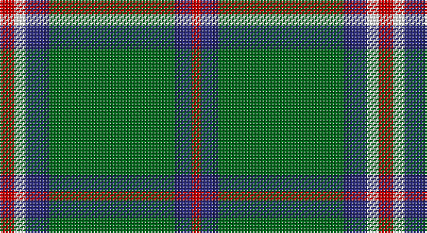

This page is one **sett** — a single exact thread-count. It belongs to the [tartan](/setts/r5w4dbi6db2g43db2dbi4r3/)
(the same proportion at any scale), whose colour order is pattern [RBBGBBWR](/stripes/rbbgbbwr/).

Part of the [Mullikin](/tartans/mullikin/) tartan — the named design grouping this sett with its other cloths.

Sourced from tartans-authority.  It is a [8 stripe tartan](/stripes/stripes8/).

Original link http://www.tartansauthority.com/tartan-ferret/display/10863/

## Register references

External register numbers recorded for this tartan.

- Scottish Register of Tartans: [10863](https://www.tartanregister.gov.uk/tartanDetails?ref=10863)
- Scottish Tartans Authority (ITI): 10863

## Thread count
R/10 W8 DB12 DBa4 G86 DBa4 DB8 R/6

One full sett is **260 threads**.

## Palette

Palette: <strong>Tartan Register</strong>
<table><thead><tr><th>Colour</th><th>Threads</th><th>Shade</th><th>Base</th><th>OKLCh</th></tr></thead><tbody><tr><td>R/</td><td style="text-align:right;font-variant-numeric:tabular-nums">10</td><td><code style="background-color:#C80000;">#C80000</code> <small style="color:#888">#C80000</small></td><td>R <code style="background-color:#CC0000;">#CC0000</code></td><td><small style="color:#888">oklch(52.3% 0.215 29.2)</small></td></tr><tr><td>W</td><td style="text-align:right;font-variant-numeric:tabular-nums">8</td><td><code style="background-color:#FCFCFC;">#FCFCFC</code> <small style="color:#888">#FCFCFC</small></td><td>W <code style="background-color:#F7F7F7;">#F7F7F7</code></td><td><small style="color:#888">oklch(99.1% 0.000 89.9)</small></td></tr><tr><td>DB</td><td style="text-align:right;font-variant-numeric:tabular-nums">12</td><td><code style="background-color:#2C2C80;">#2C2C80</code> <small style="color:#888">#2C2C80</small></td><td>B <code style="background-color:#2A418A;">#2A418A</code></td><td><small style="color:#888">oklch(35.0% 0.138 276.6)</small></td></tr><tr><td>DBa</td><td style="text-align:right;font-variant-numeric:tabular-nums">4</td><td><code style="background-color:#202060;">#202060</code> <small style="color:#888">#202060</small></td><td>B <code style="background-color:#2A418A;">#2A418A</code></td><td><small style="color:#888">oklch(28.9% 0.111 276.9)</small></td></tr><tr><td>G</td><td style="text-align:right;font-variant-numeric:tabular-nums">86</td><td><code style="background-color:#006818;">#006818</code> <small style="color:#888">#006818</small></td><td>G <code style="background-color:#006100;">#006100</code></td><td><small style="color:#888">oklch(45.0% 0.142 145.0)</small></td></tr><tr><td>DBa</td><td style="text-align:right;font-variant-numeric:tabular-nums">4</td><td><code style="background-color:#202060;">#202060</code> <small style="color:#888">#202060</small></td><td>B <code style="background-color:#2A418A;">#2A418A</code></td><td><small style="color:#888">oklch(28.9% 0.111 276.9)</small></td></tr><tr><td>DB</td><td style="text-align:right;font-variant-numeric:tabular-nums">8</td><td><code style="background-color:#2C2C80;">#2C2C80</code> <small style="color:#888">#2C2C80</small></td><td>B <code style="background-color:#2A418A;">#2A418A</code></td><td><small style="color:#888">oklch(35.0% 0.138 276.6)</small></td></tr><tr><td>R/</td><td style="text-align:right;font-variant-numeric:tabular-nums">6</td><td><code style="background-color:#C80000;">#C80000</code> <small style="color:#888">#C80000</small></td><td>R <code style="background-color:#CC0000;">#CC0000</code></td><td><small style="color:#888">oklch(52.3% 0.215 29.2)</small></td></tr></tbody></table>

# Sample pattern

## Compared to the master

This cloth is one sett of its design; the master sett (the exemplar the design is anchored on) is below for comparison.

<figure style="margin:0"><figcaption style="color:#888;font-size:smaller">this sett</figcaption></figure>
<figure style="margin:0"><figcaption style="color:#888;font-size:smaller"><a href="/setts/r5w4lg6db2dg43db2lg4r3/">master sett →</a></figcaption></figure>

## Nearest tartans

The nearest existing variants by ΔTartan distance, with this tartan at the top so the swatches line up against it.

ΔTartan

Tartan

Sett

—

<a href="/ttd/edit/#slug=r5w4dbi6db2g43db2dbi4r3~x2">Mullikin (2013)</a> <a class="nn-out" href="/variants/s8/r5w4dbi6db2g43db2dbi4r3~x2/" title="open its dictionary page">↗</a>

0.77

<a href="/ttd/edit/#slug=ly5g3ly3g53r7db5r13w4~x2&amp;base=r5w4dbi6db2g43db2dbi4r3~x2">Hall (P.I.E.) (Personal)</a> <a class="nn-out" href="/variants/s8/ly5g3ly3g53r7db5r13w4~x2/" title="open its dictionary page">↗</a>

0.78

<a href="/ttd/edit/#slug=db17r3g55db3g4db3g4ly3w5~x2&amp;base=r5w4dbi6db2g43db2dbi4r3~x2">Bundanoon (District)</a> <a class="nn-out" href="/variants/s9/db17r3g55db3g4db3g4ly3w5~x2/" title="open its dictionary page">↗</a>

0.90

<a href="/ttd/edit/#slug=dg20r1ly1r1lb1dg1r1lb1db5~x4&amp;base=r5w4dbi6db2g43db2dbi4r3~x2">Scotts Valley</a> <a class="nn-out" href="/variants/s9/dg20r1ly1r1lb1dg1r1lb1db5~x4/" title="open its dictionary page">↗</a>

0.98

<a href="/ttd/edit/#slug=r5w4lg6db2dg43db2lg4r3~x2&amp;base=r5w4dbi6db2g43db2dbi4r3~x2">Mullikin (2013)</a> <a class="nn-out" href="/variants/s8/r5w4lg6db2dg43db2lg4r3~x2/" title="open its dictionary page">↗</a>

1.06

<a href="/ttd/edit/#slug=k3g2k3g18r2db2lo1~x4&amp;base=r5w4dbi6db2g43db2dbi4r3~x2">Selvon-Bruce (Personal)</a> <a class="nn-out" href="/variants/s7/k3g2k3g18r2db2lo1~x4/" title="open its dictionary page">↗</a>

1.18

<a href="/ttd/edit/#slug=g16k8g1k1lb1g1lb1lo1g1k1o1g4k1~x4&amp;base=r5w4dbi6db2g43db2dbi4r3~x2">Savoy</a> <a class="nn-out" href="/variants/s13/g16k8g1k1lb1g1lb1lo1g1k1o1g4k1~x4/" title="open its dictionary page">↗</a>

1.18

<a href="/ttd/edit/#slug=yi40dt10o2dt2w2dt3y8yi6dt2yi4w2~x2&amp;base=r5w4dbi6db2g43db2dbi4r3~x2">Cavalier, Blue</a> <a class="nn-out" href="/variants/s11/yi40dt10o2dt2w2dt3y8yi6dt2yi4w2~x2/" title="open its dictionary page">↗</a>

1.18

<a href="/ttd/edit/#slug=db3g16ly1r1w1r6g3r1g3w1~x4&amp;base=r5w4dbi6db2g43db2dbi4r3~x2">Canadian Caledonian</a> <a class="nn-out" href="/variants/s10/db3g16ly1r1w1r6g3r1g3w1~x4/" title="open its dictionary page">↗</a>

1.20

<a href="/ttd/edit/#slug=db6w3r3g55k10r3~x4&amp;base=r5w4dbi6db2g43db2dbi4r3~x2">Military Medical Memorial (USA)</a> <a class="nn-out" href="/variants/s6/db6w3r3g55k10r3~x4/" title="open its dictionary page">↗</a>

1.20

<a href="/ttd/edit/#slug=g4lb1db2r1g1r1db2lb1g14lo1~x4&amp;base=r5w4dbi6db2g43db2dbi4r3~x2">Seattle (District)</a> <a class="nn-out" href="/variants/s10/g4lb1db2r1g1r1db2lb1g14lo1~x4/" title="open its dictionary page">↗</a>

## Neighbour map

Every grey dot is one of 14360 variants placed by the first two principal components of the ΔTartan feature space (44% of its variance). Red is this tartan; blue dots are its nearest — click one to open its page.

<svg viewBox="0 0 640 380" role="img" style="max-width:100%;height:auto;border:1px solid #e0e0e0;border-radius:4px;display:block" xmlns="http://www.w3.org/2000/svg"><image href="/nn/cloud.v1.png" width="640" height="380"/><a href="/variants/s8/ly5g3ly3g53r7db5r13w4~x2/"><circle cx="344.4" cy="131.8" r="4" fill="#3465a4"><title>Hall (P.I.E.) (Personal)</title></circle></a><a href="/variants/s9/db17r3g55db3g4db3g4ly3w5~x2/"><circle cx="385.2" cy="128.0" r="4" fill="#3465a4"><title>Bundanoon (District)</title></circle></a><a href="/variants/s9/dg20r1ly1r1lb1dg1r1lb1db5~x4/"><circle cx="402.4" cy="123.1" r="4" fill="#3465a4"><title>Scotts Valley</title></circle></a><a href="/variants/s8/r5w4lg6db2dg43db2lg4r3~x2/"><circle cx="353.7" cy="115.7" r="4" fill="#3465a4"><title>Mullikin (2013)</title></circle></a><a href="/variants/s7/k3g2k3g18r2db2lo1~x4/"><circle cx="378.6" cy="155.1" r="4" fill="#3465a4"><title>Selvon-Bruce (Personal)</title></circle></a><a href="/variants/s13/g16k8g1k1lb1g1lb1lo1g1k1o1g4k1~x4/"><circle cx="343.5" cy="114.8" r="4" fill="#3465a4"><title>Savoy</title></circle></a><a href="/variants/s11/yi40dt10o2dt2w2dt3y8yi6dt2yi4w2~x2/"><circle cx="360.7" cy="110.6" r="4" fill="#3465a4"><title>Cavalier, Blue</title></circle></a><a href="/variants/s10/db3g16ly1r1w1r6g3r1g3w1~x4/"><circle cx="333.5" cy="130.5" r="4" fill="#3465a4"><title>Canadian Caledonian</title></circle></a><a href="/variants/s6/db6w3r3g55k10r3~x4/"><circle cx="410.7" cy="150.4" r="4" fill="#3465a4"><title>Military Medical Memorial (USA)</title></circle></a><a href="/variants/s10/g4lb1db2r1g1r1db2lb1g14lo1~x4/"><circle cx="382.3" cy="139.5" r="4" fill="#3465a4"><title>Seattle (District)</title></circle></a><circle cx="366.6" cy="122.0" r="5" fill="#c00000"/></svg>

ID: /variants/s8/r5w4dbi6db2g43db2dbi4r3~x2/
