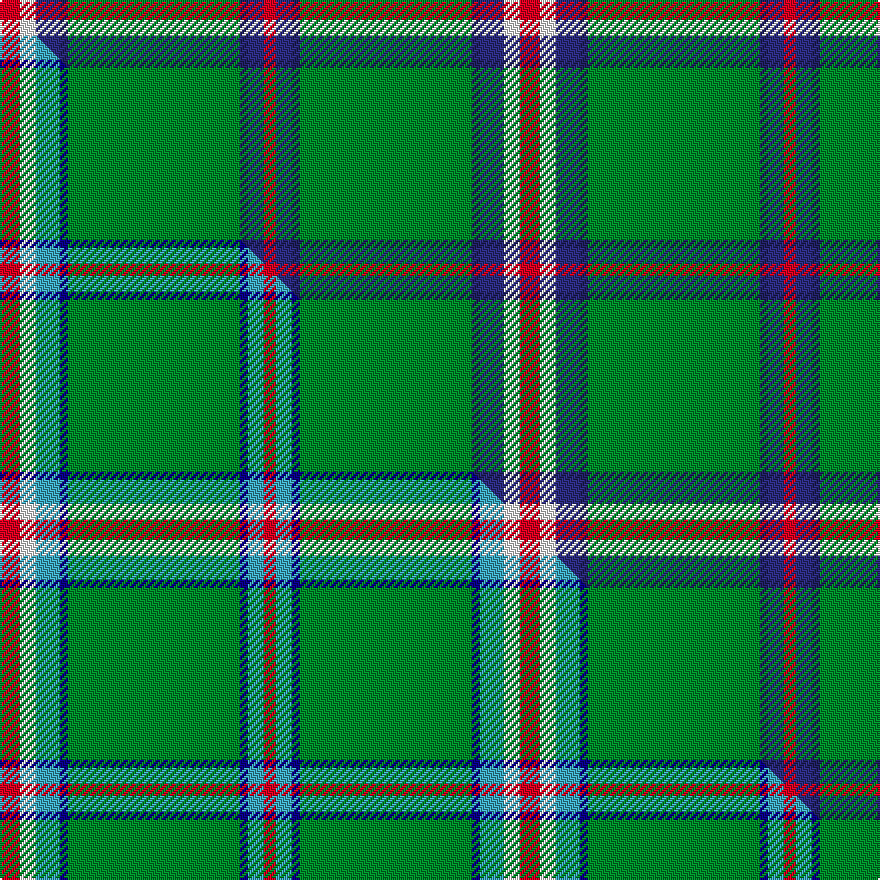

This is one **variant** — a specific cloth: this exact thread count and colourway, with its own
provenance below. It is one weaving of the [sett](/tartans/m/mu/mullikin/) (the scale-free proportion — the
same cloth at any scale or shade), whose colour order is pattern [RBBGBBWR](/stripes/rbbgbbwr/).

Part of the [Mullikin](/tartans/m/mu/mullikin/) tartan — the named design grouping this sett with its other cloths.

Sourced from tartans-authority.  It is a [8 stripe tartan](/stripes/stripes8/).

Original link <code>http://www.tartansauthority.com/tartan-ferret/display/10863/</code> — retired · [Internet Archive copy](https://web.archive.org/web/*/http://www.tartansauthority.com/tartan-ferret/display/10863/*)

Dataset <small>— provenance for this record, inherited from the source manifest</small>

<dl class="dataset-prov">
<dt>source</dt><dd><a href="/sources/tartans-authority/">Scottish Tartans Authority</a></dd>
<dt>data captured from</dt><dd><a href="https://github.com/thetartan/tartan-database/blob/master/data/tartans-authority/data.csv">https://github.com/thetartan/tartan-database/blob/master/data/tartans-authority/data.csv</a></dd>
<dt>data date</dt><dd>2013 <small>(this record)</small></dd>
<dt>licence</dt><dd><a href="https://creativecommons.org/licenses/by-nc-nd/4.0/">CC BY-NC-ND 4.0</a></dd>
</dl>

Capture chain <small>— the hands this data passed through, oldest first; each capture carries its own licence</small>

<ol class="capture-chain">
<li><a href="https://www.tartansauthority.com/">Scottish Tartans Authority</a> <small>the heritage body’s archive — its tartan-ferret record browser is retired; dead record links are shown unlinked, with an Internet Archive copy (ITI numbers are not SRT references)</small></li>
<li><a href="https://github.com/thetartan/tartan-database">thetartan/tartan-database</a> <small>2016-2017</small> · <a href="https://creativecommons.org/licenses/by-nc-nd/4.0/">CC BY-NC-ND 4.0</a> <small>Levko Kravets's frozen compilation — the capture we vendored, and where its CC licence text came from</small></li>
<li>this dictionary <small>captured 2026-06-10 · commit 5bf86c7566</small> <small>each re-capture is a git commit to data/sources</small></li>
</ol>

## Register references

External register numbers recorded for this tartan.

- Scottish Register of Tartans: [10863](https://www.tartanregister.gov.uk/tartanDetails?ref=10863)
- Scottish Tartans Authority (ITI): 10863

## Thread count
R/10 W8 DBi12 DB4 G86 DB4 DBi8 R/6

One full sett is **260 threads**.

## Palette
<table><thead><tr><th>Colour</th><th>Shade</th><th>OKLCh</th></tr></thead><tbody><tr><td>DB</td><td><code style="background-color:#2C2C80;">#2C2C80</code> <small style="color:#888">#2C2C80</small></td><td><small style="color:#888">oklch(35.0% 0.138 276.6)</small></td></tr><tr><td>DB</td><td><code style="background-color:#202060;">#202060</code> <small style="color:#888">#202060</small></td><td><small style="color:#888">oklch(28.9% 0.111 276.9)</small></td></tr><tr><td>G</td><td><code style="background-color:#008B2A;">#008B2A</code> <small style="color:#888">#008B2A</small></td><td><small style="color:#888">oklch(55.4% 0.170 145.9)</small></td></tr><tr><td>R</td><td><code style="background-color:#D60020;">#D60020</code> <small style="color:#888">#D60020</small></td><td><small style="color:#888">oklch(55.2% 0.224 25.5)</small></td></tr><tr><td>W</td><td><code style="background-color:#F7F7F7;">#F7F7F7</code> <small style="color:#888">#F7F7F7</small></td><td><small style="color:#888">oklch(97.6% 0.000 89.9)</small></td></tr></tbody></table>

# Sample pattern

## Compared to the master

This cloth is one sett of its design; the master sett (the exemplar the design is anchored on) is below for comparison.

Its **ΔTartan distance** from the master is **0.11** — the same measure the nearest-tartans table ranks by (0 is identical; a re-scale of the same cloth is near 0, a recolour or a different proportion further).

<figure class="master-compare" style="margin:0">

this sett
master sett ★

<figcaption style="color:#888;font-size:smaller">One weave of this sett against the <a href="/setts/r5w4lg6db2g43db2lg4r3/">master sett ★</a>, split on the diagonal: a shared proportion runs seamlessly across it with only the shades shifting; a different proportion breaks on it.</figcaption>
</figure>

## Nearest tartan variants

The nearest existing variants by ΔTartan distance, with this cloth at the top so the swatches line up against it.

ΔTartan

Threads

Variant

Sett

—

260

<a href="/variants/s8/r5w4dbi6db2g43db2dbi4r3~x2~dbi1406275-db1204274/">Mullikin (2013)</a>

<a href="/ttd/edit/#slug=r5w4lg6db2g43db2lg4r3~x2~lg2704216-db1108266&amp;base=r5w4dbi6db2g43db2dbi4r3~x2~dbi1406275-db1204274" title="compare in the TTD">0.11</a>

260

<a href="/variants/s8/r5w4lg6db2g43db2lg4r3~x2~lg2704216-db1108266/">Mullikin (2013)</a>

<a href="/ttd/edit/#slug=w8r6y2g34db3~x2&amp;base=r5w4dbi6db2g43db2dbi4r3~x2~dbi1406275-db1204274" title="compare in the TTD">1.73</a>

190

<a href="/variants/s5/w8r6y2g34db3~x2/">Milling-Christensen</a>

<a href="/ttd/edit/#slug=db6w3r3g55k10r3~x4&amp;base=r5w4dbi6db2g43db2dbi4r3~x2~dbi1406275-db1204274" title="compare in the TTD">1.78</a>

604

<a href="/variants/s6/db6w3r3g55k10r3~x4/">Military Medical Memorial (USA)</a>

<a href="/ttd/edit/#slug=k5w4r15g70k4w5~x2&amp;base=r5w4dbi6db2g43db2dbi4r3~x2~dbi1406275-db1204274" title="compare in the TTD">1.82</a>

392

<a href="/variants/s6/k5w4r15g70k4w5~x2/">Tahrir (Liberation)</a>

<a href="/ttd/edit/#slug=db17r3g55db3g4db3g4y3w5~x2&amp;base=r5w4dbi6db2g43db2dbi4r3~x2~dbi1406275-db1204274" title="compare in the TTD">1.93</a>

344

<a href="/variants/s9/db17r3g55db3g4db3g4y3w5~x2/">Bundanoon</a>

<a href="/ttd/edit/#slug=ly10k2g5k2dg46y2k2~x2~g1903133&amp;base=r5w4dbi6db2g43db2dbi4r3~x2~dbi1406275-db1204274" title="compare in the TTD">1.94</a>

252

<a href="/variants/s7/ly10k2g5k2dg46y2k2~x2~g1903133/">Green Rover, The</a>

<a href="/ttd/edit/#slug=o10k2g5k2dg46ly2k2~x2~o2503076-ly2705081&amp;base=r5w4dbi6db2g43db2dbi4r3~x2~dbi1406275-db1204274" title="compare in the TTD">1.94</a>

252

<a href="/variants/s7/ly10k2g5k2dg46lyi2k2~x2~ly2503076-lyi2705081/">Green Rover (Personal)</a>

<a href="/ttd/edit/#slug=db17r3g55db3g4db3g4dy3w5~x2&amp;base=r5w4dbi6db2g43db2dbi4r3~x2~dbi1406275-db1204274" title="compare in the TTD">1.97</a>

344

<a href="/variants/s9/db17r3g55db3g4db3g4dy3w5~x2/">Bundanoon</a>

<a href="/ttd/edit/#slug=g55y4db15w3r3w5~x2&amp;base=r5w4dbi6db2g43db2dbi4r3~x2~dbi1406275-db1204274" title="compare in the TTD">2.06</a>

220

<a href="/variants/s6/g55y4db15w3r3w5~x2/">Spencer (2013)</a>

<a href="/ttd/edit/#slug=g55y4db15w3dr3w5~x2&amp;base=r5w4dbi6db2g43db2dbi4r3~x2~dbi1406275-db1204274" title="compare in the TTD">2.06</a>

220

<a href="/variants/s6/g55y4db15w3dr3w5~x2/">Spencer (2013)</a>

## Neighbour map

Every grey dot is one of 13657 variants placed by the first two principal components of the ΔTartan feature space (42% of its variance). Red is this tartan; blue dots are its nearest — click one to open its page. The map is a flat projection of a many-dimensional space — [how to read it](/posts/neighbourhood-maps/).

<svg viewBox="0 0 640 380" role="img" style="max-width:100%;height:auto;border:1px solid #e0e0e0;border-radius:4px;display:block" xmlns="http://www.w3.org/2000/svg"><image href="/nn/cloud.v1.png" width="640" height="380"/><a href="/variants/s8/r5w4lg6db2g43db2lg4r3~x2~lg2704216-db1108266/"><circle cx="374.1" cy="128.3" r="4" fill="#3465a4"><title>Mullikin (2013)</title></circle></a><a href="/variants/s5/w8r6y2g34db3~x2/"><circle cx="356.7" cy="169.7" r="4" fill="#3465a4"><title>Milling-Christensen</title></circle></a><a href="/variants/s6/db6w3r3g55k10r3~x4/"><circle cx="355.6" cy="121.2" r="4" fill="#3465a4"><title>Military Medical Memorial (USA)</title></circle></a><a href="/variants/s6/k5w4r15g70k4w5~x2/"><circle cx="371.1" cy="137.9" r="4" fill="#3465a4"><title>Tahrir (Liberation)</title></circle></a><a href="/variants/s9/db17r3g55db3g4db3g4y3w5~x2/"><circle cx="381.0" cy="127.3" r="4" fill="#3465a4"><title>Bundanoon</title></circle></a><a href="/variants/s7/ly10k2g5k2dg46y2k2~x2~g1903133/"><circle cx="371.1" cy="104.7" r="4" fill="#3465a4"><title>Green Rover, The</title></circle></a><a href="/variants/s7/ly10k2g5k2dg46lyi2k2~x2~ly2503076-lyi2705081/"><circle cx="397.9" cy="113.8" r="4" fill="#3465a4"><title>Green Rover (Personal)</title></circle></a><a href="/variants/s9/db17r3g55db3g4db3g4dy3w5~x2/"><circle cx="378.4" cy="126.3" r="4" fill="#3465a4"><title>Bundanoon</title></circle></a><a href="/variants/s6/g55y4db15w3r3w5~x2/"><circle cx="379.9" cy="156.7" r="4" fill="#3465a4"><title>Spencer (2013)</title></circle></a><a href="/variants/s6/g55y4db15w3dr3w5~x2/"><circle cx="390.6" cy="164.3" r="4" fill="#3465a4"><title>Spencer (2013)</title></circle></a><circle cx="360.6" cy="121.1" r="5" fill="#c00000"/><text x="320" y="376" text-anchor="middle" font-size="11" fill="#999">ground</text><text x="11" y="190" text-anchor="middle" font-size="11" fill="#999" transform="rotate(-90 11 190)">complexity</text></svg>

ID: /variants/s8/r5w4dbi6db2g43db2dbi4r3~x2~dbi1406275-db1204274/
