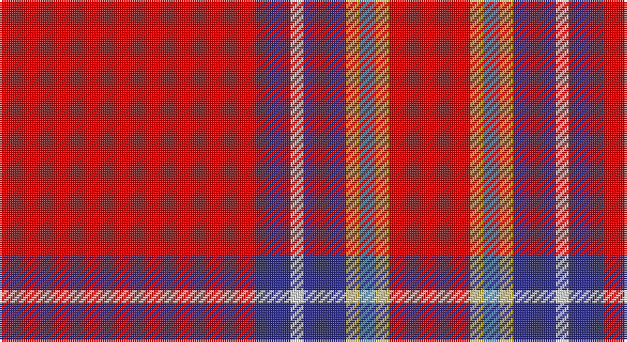

This page is one **sett** — a single exact thread-count. It belongs to the [tartan](/setts/r60db8w3db10ly3t4ly3r19/)
(the same proportion at any scale), whose colour order is pattern [RBWBYBYR](/stripes/rbwbybyr/).

Part of the [Princess Elizabeth](/tartans/princess-elizabeth/) tartan — the named design grouping this sett with its other cloths.

Sourced from register-of-tartans.  It is a [8 stripe tartan](/stripes/stripes8/).

Original link https://www.tartanregister.gov.uk/tartanDetails.aspx?ref=3403

## Provenance

Earliest known date: pre 2003 Also Earl of Inverness

## Also known as

This cloth is also recorded under:

- Princess Elizabeth #2
- Princess Elizabeth Royal

3 attestations — the source records this cloth was collapsed from (oldest owns this page)

<ul>
<li>01/01/2002 — Princess Elizabeth #2 (register-of-tartans, <a href="https://www.tartanregister.gov.uk/tartanDetails.aspx?ref=3403">record</a>)</li>
<li>undated — Princess Elizabeth (weddslist, <a href="http://www.weddslist.com/cgi-bin/tartans/pg.pl?source=sts">record</a>)</li>
<li>undated — Princess Elizabeth Royal Family Tartan (house-of-tartan, <a href="http://www.house-of-tartan.scotland.net/house/TartanViewjs.asp?colr=Def&tnam=1444">record</a>)</li>
</ul>

## Register references

External register numbers recorded for this tartan.

- Scottish Register of Tartans: [3403](https://www.tartanregister.gov.uk/tartanDetails.aspx?ref=3403)
- Scottish Tartans Authority (ITI): 1444
- Scottish Tartans World Register: 1444

## Thread count
R/120 DB16 LN6 DB20 Y6 B8 Y6 R/38

One full sett is **282 threads**.

## Palette

Palette: <strong>Tartan Register</strong>
<table><thead><tr><th>Colour</th><th>Threads</th><th>Shade</th><th>Base</th><th>OKLCh</th></tr></thead><tbody><tr><td>R/</td><td style="text-align:right;font-variant-numeric:tabular-nums">120</td><td><code style="background-color:#C80000;">#C80000</code> <small style="color:#888">#C80000</small></td><td>R <code style="background-color:#CC0000;">#CC0000</code></td><td><small style="color:#888">oklch(52.3% 0.215 29.2)</small></td></tr><tr><td>DB</td><td style="text-align:right;font-variant-numeric:tabular-nums">16</td><td><code style="background-color:#2C2C80;">#2C2C80</code> <small style="color:#888">#2C2C80</small></td><td>B <code style="background-color:#2A418A;">#2A418A</code></td><td><small style="color:#888">oklch(35.0% 0.138 276.6)</small></td></tr><tr><td>LN</td><td style="text-align:right;font-variant-numeric:tabular-nums">6</td><td><code style="background-color:#E0E0E0;">#E0E0E0</code> <small style="color:#888">#E0E0E0</small></td><td>W <code style="background-color:#F7F7F7;">#F7F7F7</code></td><td><small style="color:#888">oklch(90.7% 0.000 89.9)</small></td></tr><tr><td>DB</td><td style="text-align:right;font-variant-numeric:tabular-nums">20</td><td><code style="background-color:#2C2C80;">#2C2C80</code> <small style="color:#888">#2C2C80</small></td><td>B <code style="background-color:#2A418A;">#2A418A</code></td><td><small style="color:#888">oklch(35.0% 0.138 276.6)</small></td></tr><tr><td>Y</td><td style="text-align:right;font-variant-numeric:tabular-nums">6</td><td><code style="background-color:#E8C000;">#E8C000</code> <small style="color:#888">#E8C000</small></td><td>Y <code style="background-color:#F2BF00;">#F2BF00</code></td><td><small style="color:#888">oklch(81.9% 0.168 93.7)</small></td></tr><tr><td>B</td><td style="text-align:right;font-variant-numeric:tabular-nums">8</td><td><code style="background-color:#5C8CA8;">#5C8CA8</code> <small style="color:#888">#5C8CA8</small></td><td>B <code style="background-color:#2A418A;">#2A418A</code></td><td><small style="color:#888">oklch(61.7% 0.067 235.0)</small></td></tr><tr><td>Y</td><td style="text-align:right;font-variant-numeric:tabular-nums">6</td><td><code style="background-color:#E8C000;">#E8C000</code> <small style="color:#888">#E8C000</small></td><td>Y <code style="background-color:#F2BF00;">#F2BF00</code></td><td><small style="color:#888">oklch(81.9% 0.168 93.7)</small></td></tr><tr><td>R/</td><td style="text-align:right;font-variant-numeric:tabular-nums">38</td><td><code style="background-color:#C80000;">#C80000</code> <small style="color:#888">#C80000</small></td><td>R <code style="background-color:#CC0000;">#CC0000</code></td><td><small style="color:#888">oklch(52.3% 0.215 29.2)</small></td></tr></tbody></table>

# Sample pattern

## Nearest tartans

The nearest existing variants by ΔTartan distance, with this tartan at the top so the swatches line up against it.

ΔTartan

Tartan

Sett

—

<a href="/ttd/edit/#slug=r60db8w3db10ly3t4ly3r19~x2">Princess Elizabeth #2</a> <a class="nn-out" href="/variants/s8/r60db8w3db10ly3t4ly3r19~x2/" title="open its dictionary page">↗</a>

0.48

<a href="/ttd/edit/#slug=r68db27r5ly3r5g3r13t3~x2&amp;base=r60db8w3db10ly3t4ly3r19~x2">De Nardi #2 (Personal)</a> <a class="nn-out" href="/variants/s8/r68db27r5ly3r5g3r13t3~x2/" title="open its dictionary page">↗</a>

0.55

<a href="/ttd/edit/#slug=r100dbi10w5dbi14ly4db8ly4r24&amp;base=r60db8w3db10ly3t4ly3r19~x2">Earl of Inverness (Royal)</a> <a class="nn-out" href="/variants/s8/r100dbi10w5dbi14ly4db8ly4r24/" title="open its dictionary page">↗</a>

0.55

<a href="/ttd/edit/#slug=r68db26r5ly3r5g3r13o3~x2&amp;base=r60db8w3db10ly3t4ly3r19~x2">De Nardi (Personal)</a> <a class="nn-out" href="/variants/s8/r68db26r5ly3r5g3r13o3~x2/" title="open its dictionary page">↗</a>

0.80

<a href="/ttd/edit/#slug=r23k1g9r3db1lr1r1~x4&amp;base=r60db8w3db10ly3t4ly3r19~x2">Perthshire Clayquhat District Tartan</a> <a class="nn-out" href="/variants/s7/r23k1g9r3db1lr1r1~x4/" title="open its dictionary page">↗</a>

1.02

<a href="/ttd/edit/#slug=r40k3r2db12r2g2r2g2ly3~x2&amp;base=r60db8w3db10ly3t4ly3r19~x2">Oliver, dress</a> <a class="nn-out" href="/variants/s9/r40k3r2db12r2g2r2g2ly3~x2/" title="open its dictionary page">↗</a>

1.09

<a href="/ttd/edit/#slug=g4r32db9r6db2r3db2r12w3~x2&amp;base=r60db8w3db10ly3t4ly3r19~x2">Rose</a> <a class="nn-out" href="/variants/s9/g4r32db9r6db2r3db2r12w3~x2/" title="open its dictionary page">↗</a>

1.12

<a href="/ttd/edit/#slug=r51lr2k11lo3r11lo3r11g3~x2&amp;base=r60db8w3db10ly3t4ly3r19~x2">Hackston (Green stripe) (Portrait)</a> <a class="nn-out" href="/variants/s8/r51lr2k11lo3r11lo3r11g3~x2/" title="open its dictionary page">↗</a>

1.26

<a href="/ttd/edit/#slug=r32lb4dt7ly2t2~x5&amp;base=r60db8w3db10ly3t4ly3r19~x2">Sildesalaten</a> <a class="nn-out" href="/variants/s5/r32lb4dt7ly2t2~x5/" title="open its dictionary page">↗</a>

1.27

<a href="/ttd/edit/#slug=r48w3k3g2ly6g2r6~x4&amp;base=r60db8w3db10ly3t4ly3r19~x2">Ferguson the Astronomer</a> <a class="nn-out" href="/variants/s7/r48w3k3g2ly6g2r6~x4/" title="open its dictionary page">↗</a>

1.31

<a href="/ttd/edit/#slug=r65g16r4dp4r4w5~x2&amp;base=r60db8w3db10ly3t4ly3r19~x2">Howard, Vincent (Personal)</a> <a class="nn-out" href="/variants/s6/r65g16r4dp4r4w5~x2/" title="open its dictionary page">↗</a>

## Neighbour map

Every grey dot is one of 14360 variants placed by the first two principal components of the ΔTartan feature space (44% of its variance). Red is this tartan; blue dots are its nearest — click one to open its page.

<svg viewBox="0 0 640 380" role="img" style="max-width:100%;height:auto;border:1px solid #e0e0e0;border-radius:4px;display:block" xmlns="http://www.w3.org/2000/svg"><image href="/nn/cloud.v1.png" width="640" height="380"/><a href="/variants/s8/r68db27r5ly3r5g3r13t3~x2/"><circle cx="474.1" cy="114.3" r="4" fill="#3465a4"><title>De Nardi #2 (Personal)</title></circle></a><a href="/variants/s8/r100dbi10w5dbi14ly4db8ly4r24/"><circle cx="483.0" cy="99.6" r="4" fill="#3465a4"><title>Earl of Inverness (Royal)</title></circle></a><a href="/variants/s8/r68db26r5ly3r5g3r13o3~x2/"><circle cx="488.3" cy="118.1" r="4" fill="#3465a4"><title>De Nardi (Personal)</title></circle></a><a href="/variants/s7/r23k1g9r3db1lr1r1~x4/"><circle cx="463.2" cy="121.0" r="4" fill="#3465a4"><title>Perthshire Clayquhat District Tartan</title></circle></a><a href="/variants/s9/r40k3r2db12r2g2r2g2ly3~x2/"><circle cx="430.4" cy="98.6" r="4" fill="#3465a4"><title>Oliver, dress</title></circle></a><a href="/variants/s9/g4r32db9r6db2r3db2r12w3~x2/"><circle cx="461.9" cy="145.7" r="4" fill="#3465a4"><title>Rose</title></circle></a><a href="/variants/s8/r51lr2k11lo3r11lo3r11g3~x2/"><circle cx="521.1" cy="115.2" r="4" fill="#3465a4"><title>Hackston (Green stripe) (Portrait)</title></circle></a><a href="/variants/s5/r32lb4dt7ly2t2~x5/"><circle cx="415.6" cy="142.8" r="4" fill="#3465a4"><title>Sildesalaten</title></circle></a><a href="/variants/s7/r48w3k3g2ly6g2r6~x4/"><circle cx="516.9" cy="98.6" r="4" fill="#3465a4"><title>Ferguson the Astronomer</title></circle></a><a href="/variants/s6/r65g16r4dp4r4w5~x2/"><circle cx="501.7" cy="149.4" r="4" fill="#3465a4"><title>Howard, Vincent (Personal)</title></circle></a><circle cx="462.0" cy="114.8" r="5" fill="#c00000"/></svg>

ID: /variants/s8/r60db8w3db10ly3t4ly3r19~x2/
