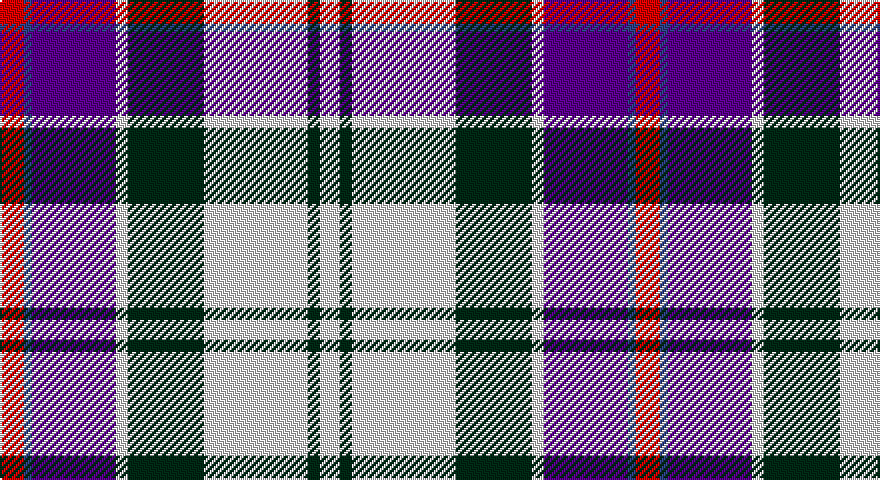

This page is one **sett** — a single exact thread-count. It belongs to the [tartan](/setts/r6db2dp21w3dg19w26dg3w5/)
(the same proportion at any scale), whose colour order is pattern [RBBWGWGW](/stripes/rbbwgwgw/).

Part of the [Culloden Dress](/tartans/culloden-dress/) tartan — the named design grouping this sett with its other cloths.

Sourced from register-of-tartans.  It is a [8 stripe tartan](/stripes/stripes8/).

Original link https://www.tartanregister.gov.uk/tartanDetails.aspx?ref=824

## Provenance

Earliest known date: 1983 Worn by a member of Prince Charles' staff during the battle but it is not known with which family or district it was first connected. It was first illustrated in Old & Rare in 1893 by D W Stewart whose son D C Stewart was a founder member of the Scottish Tartans Society. Now firmly established as a district tartan.

## Also known as

This cloth is also recorded under:

- Culloden Dress Ancient
- Culloden Dress Old
- Culloden, Dress
- Culloden, dress Ancient

2 attestations — the source records this cloth was collapsed from (oldest owns this page)

<ul>
<li>undated — Culloden Dress Ancient (register-of-tartans, <a href="https://www.tartanregister.gov.uk/tartanDetails.aspx?ref=824">record</a>)</li>
<li>undated — Culloden Dress Old Tartan (house-of-tartan, <a href="http://www.house-of-tartan.scotland.net/house/TartanViewjs.asp?colr=Def&tnam=1322">record</a>)</li>
</ul>

## Register references

External register numbers recorded for this tartan.

- Scottish Register of Tartans: [824](https://www.tartanregister.gov.uk/tartanDetails.aspx?ref=824)
- Scottish Tartans World Register: 1322

## Thread count
R/12 B4 P42 LN6 DG38 LN52 DG6 LN/10

One full sett is **318 threads**.

## Palette

Palette: <strong>Tartan Register</strong>
<table><thead><tr><th>Colour</th><th>Threads</th><th>Shade</th><th>Base</th><th>OKLCh</th></tr></thead><tbody><tr><td>R/</td><td style="text-align:right;font-variant-numeric:tabular-nums">12</td><td><code style="background-color:#DC0000;">#DC0000</code> <small style="color:#888">#DC0000</small></td><td>R <code style="background-color:#CC0000;">#CC0000</code></td><td><small style="color:#888">oklch(56.2% 0.230 29.2)</small></td></tr><tr><td>B</td><td style="text-align:right;font-variant-numeric:tabular-nums">4</td><td><code style="background-color:#2C4084;">#2C4084</code> <small style="color:#888">#2C4084</small></td><td>B <code style="background-color:#2A418A;">#2A418A</code></td><td><small style="color:#888">oklch(39.4% 0.117 268.3)</small></td></tr><tr><td>P</td><td style="text-align:right;font-variant-numeric:tabular-nums">42</td><td><code style="background-color:#5A008C;">#5A008C</code> <small style="color:#888">#5A008C</small></td><td>B <code style="background-color:#2A418A;">#2A418A</code></td><td><small style="color:#888">oklch(37.0% 0.191 306.3)</small></td></tr><tr><td>LN</td><td style="text-align:right;font-variant-numeric:tabular-nums">6</td><td><code style="background-color:#E0E0E0;">#E0E0E0</code> <small style="color:#888">#E0E0E0</small></td><td>W <code style="background-color:#F7F7F7;">#F7F7F7</code></td><td><small style="color:#888">oklch(90.7% 0.000 89.9)</small></td></tr><tr><td>DG</td><td style="text-align:right;font-variant-numeric:tabular-nums">38</td><td><code style="background-color:#002814;">#002814</code> <small style="color:#888">#002814</small></td><td>G <code style="background-color:#006100;">#006100</code></td><td><small style="color:#888">oklch(24.4% 0.059 156.5)</small></td></tr><tr><td>LN</td><td style="text-align:right;font-variant-numeric:tabular-nums">52</td><td><code style="background-color:#E0E0E0;">#E0E0E0</code> <small style="color:#888">#E0E0E0</small></td><td>W <code style="background-color:#F7F7F7;">#F7F7F7</code></td><td><small style="color:#888">oklch(90.7% 0.000 89.9)</small></td></tr><tr><td>DG</td><td style="text-align:right;font-variant-numeric:tabular-nums">6</td><td><code style="background-color:#002814;">#002814</code> <small style="color:#888">#002814</small></td><td>G <code style="background-color:#006100;">#006100</code></td><td><small style="color:#888">oklch(24.4% 0.059 156.5)</small></td></tr><tr><td>LN/</td><td style="text-align:right;font-variant-numeric:tabular-nums">10</td><td><code style="background-color:#E0E0E0;">#E0E0E0</code> <small style="color:#888">#E0E0E0</small></td><td>W <code style="background-color:#F7F7F7;">#F7F7F7</code></td><td><small style="color:#888">oklch(90.7% 0.000 89.9)</small></td></tr></tbody></table>

# Sample pattern

## Nearest tartans

The nearest existing variants by ΔTartan distance, with this tartan at the top so the swatches line up against it.

ΔTartan

Tartan

Sett

—

<a href="/ttd/edit/#slug=r6db2dp21w3dg19w26dg3w5~x2">Culloden Dress Ancient</a> <a class="nn-out" href="/variants/s8/r6db2dp21w3dg19w26dg3w5~x2/" title="open its dictionary page">↗</a>

0.47

<a href="/ttd/edit/#slug=r6db2p21w3dg19w26dg3w5~x2&amp;base=r6db2dp21w3dg19w26dg3w5~x2">Culloden, dress Ancient</a> <a class="nn-out" href="/variants/s8/r6db2p21w3dg19w26dg3w5~x2/" title="open its dictionary page">↗</a>

0.70

<a href="/ttd/edit/#slug=r2db14k6g1w12g1w2~x4&amp;base=r6db2dp21w3dg19w26dg3w5~x2">Davidson (Wedding) (Personal)</a> <a class="nn-out" href="/variants/s7/r2db14k6g1w12g1w2~x4/" title="open its dictionary page">↗</a>

0.87

<a href="/ttd/edit/#slug=db8r3db34b3k9w31r5w3r3w8~x2&amp;base=r6db2dp21w3dg19w26dg3w5~x2">Stewart of Appin, dress</a> <a class="nn-out" href="/variants/s10/db8r3db34b3k9w31r5w3r3w8~x2/" title="open its dictionary page">↗</a>

0.91

<a href="/ttd/edit/#slug=db68k42w32r5w32dg4w6&amp;base=r6db2dp21w3dg19w26dg3w5~x2">Ferguson Dress #2</a> <a class="nn-out" href="/variants/s7/db68k42w32r5w32dg4w6/" title="open its dictionary page">↗</a>

0.91

<a href="/ttd/edit/#slug=r5w2db20ly2k16w18k2w5~x2&amp;base=r6db2dp21w3dg19w26dg3w5~x2">Ailsa, Craig</a> <a class="nn-out" href="/variants/s8/r5w2db20ly2k16w18k2w5~x2/" title="open its dictionary page">↗</a>

0.93

<a href="/ttd/edit/#slug=db8r3db34t3k9w31r5w3r3w8~x2&amp;base=r6db2dp21w3dg19w26dg3w5~x2">Stewart of Appin Dress Clan Tartan</a> <a class="nn-out" href="/variants/s10/db8r3db34t3k9w31r5w3r3w8~x2/" title="open its dictionary page">↗</a>

0.96

<a href="/ttd/edit/#slug=db8r3db34b3k9w31r5w3r3w8&amp;base=r6db2dp21w3dg19w26dg3w5~x2">Stuart/Stewart of Appin Dress</a> <a class="nn-out" href="/variants/s10/db8r3db34b3k9w31r5w3r3w8/" title="open its dictionary page">↗</a>

0.98

<a href="/ttd/edit/#slug=w17k2n6t6w1n1dp10k2dp3~x4&amp;base=r6db2dp21w3dg19w26dg3w5~x2">Hebridean Arisaid Blue (Dance) Fashion Tartan</a> <a class="nn-out" href="/variants/s9/w17k2n6t6w1n1dp10k2dp3~x4/" title="open its dictionary page">↗</a>

1.01

<a href="/ttd/edit/#slug=g4w28dp8ly2db17g4~x2&amp;base=r6db2dp21w3dg19w26dg3w5~x2">Manx Dress</a> <a class="nn-out" href="/variants/s6/g4w28dp8ly2db17g4~x2/" title="open its dictionary page">↗</a>

1.07

<a href="/ttd/edit/#slug=lb5k26ly4lb24dp8k3r4~x2&amp;base=r6db2dp21w3dg19w26dg3w5~x2">Pengelly, The Cornish (Name)</a> <a class="nn-out" href="/variants/s7/lb5k26ly4lb24dp8k3r4~x2/" title="open its dictionary page">↗</a>

## Neighbour map

Every grey dot is one of 14360 variants placed by the first two principal components of the ΔTartan feature space (44% of its variance). Red is this tartan; blue dots are its nearest — click one to open its page.

<svg viewBox="0 0 640 380" role="img" style="max-width:100%;height:auto;border:1px solid #e0e0e0;border-radius:4px;display:block" xmlns="http://www.w3.org/2000/svg"><image href="/nn/cloud.v1.png" width="640" height="380"/><a href="/variants/s8/r6db2p21w3dg19w26dg3w5~x2/"><circle cx="154.6" cy="140.9" r="4" fill="#3465a4"><title>Culloden, dress Ancient</title></circle></a><a href="/variants/s7/r2db14k6g1w12g1w2~x4/"><circle cx="148.7" cy="139.6" r="4" fill="#3465a4"><title>Davidson (Wedding) (Personal)</title></circle></a><a href="/variants/s10/db8r3db34b3k9w31r5w3r3w8~x2/"><circle cx="165.1" cy="126.1" r="4" fill="#3465a4"><title>Stewart of Appin, dress</title></circle></a><a href="/variants/s7/db68k42w32r5w32dg4w6/"><circle cx="159.6" cy="149.0" r="4" fill="#3465a4"><title>Ferguson Dress #2</title></circle></a><a href="/variants/s8/r5w2db20ly2k16w18k2w5~x2/"><circle cx="116.3" cy="155.2" r="4" fill="#3465a4"><title>Ailsa, Craig</title></circle></a><a href="/variants/s10/db8r3db34t3k9w31r5w3r3w8~x2/"><circle cx="167.2" cy="126.9" r="4" fill="#3465a4"><title>Stewart of Appin Dress Clan Tartan</title></circle></a><a href="/variants/s10/db8r3db34b3k9w31r5w3r3w8/"><circle cx="168.5" cy="127.3" r="4" fill="#3465a4"><title>Stuart/Stewart of Appin Dress</title></circle></a><a href="/variants/s9/w17k2n6t6w1n1dp10k2dp3~x4/"><circle cx="151.5" cy="123.6" r="4" fill="#3465a4"><title>Hebridean Arisaid Blue (Dance) Fashion Tartan</title></circle></a><a href="/variants/s6/g4w28dp8ly2db17g4~x2/"><circle cx="180.7" cy="151.3" r="4" fill="#3465a4"><title>Manx Dress</title></circle></a><a href="/variants/s7/lb5k26ly4lb24dp8k3r4~x2/"><circle cx="151.8" cy="163.3" r="4" fill="#3465a4"><title>Pengelly, The Cornish (Name)</title></circle></a><circle cx="151.8" cy="142.5" r="5" fill="#c00000"/></svg>

ID: /variants/s8/r6db2dp21w3dg19w26dg3w5~x2/
