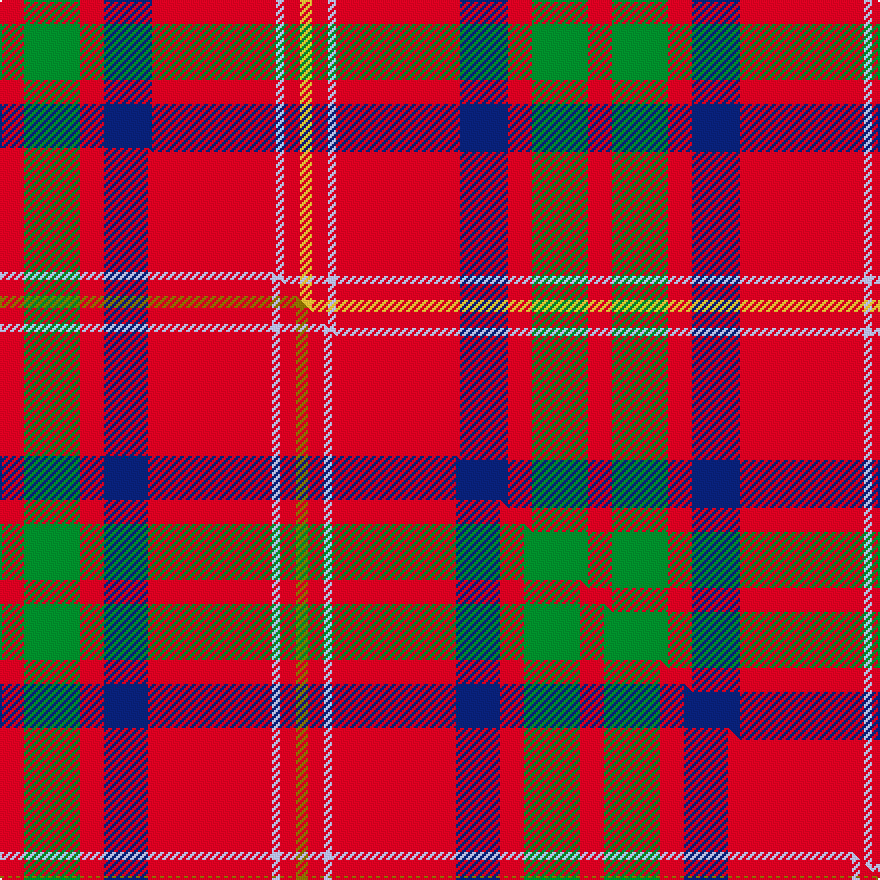

This is one **variant** — a specific cloth: this exact thread count and colourway, with its own
provenance below. It is one weaving of the [sett](/tartans/l/lo/loch-lochy/) (the scale-free proportion — the
same cloth at any scale or shade), whose colour order is pattern [RGRBRWRY](/stripes/rgrbrwry/).

Part of the [Loch Lochy](/tartans/l/lo/loch-lochy/) tartan — the named design grouping this sett with its other cloths.

Sourced from tartans-authority.  It is a [8 stripe tartan](/stripes/stripes8/).

Original link <code>http://www.tartansauthority.com/tartan-ferret/display/10768/</code> — retired · [Internet Archive copy](https://web.archive.org/web/*/http://www.tartansauthority.com/tartan-ferret/display/10768/*)

Dataset <small>— provenance for this record, inherited from the source manifest</small>

<dl class="dataset-prov">
<dt>source</dt><dd><a href="/sources/tartans-authority/">Scottish Tartans Authority</a></dd>
<dt>data captured from</dt><dd><a href="https://github.com/thetartan/tartan-database/blob/master/data/tartans-authority/data.csv">https://github.com/thetartan/tartan-database/blob/master/data/tartans-authority/data.csv</a></dd>
<dt>data date</dt><dd>January 2013 <small>(this record)</small></dd>
<dt>licence</dt><dd><a href="https://creativecommons.org/licenses/by-nc-nd/4.0/">CC BY-NC-ND 4.0</a></dd>
</dl>

Capture chain <small>— the hands this data passed through, oldest first; each capture carries its own licence</small>

<ol class="capture-chain">
<li><a href="https://www.tartansauthority.com/">Scottish Tartans Authority</a> <small>the heritage body’s archive — its tartan-ferret record browser is retired; dead record links are shown unlinked, with an Internet Archive copy (ITI numbers are not SRT references)</small></li>
<li><a href="https://github.com/thetartan/tartan-database">thetartan/tartan-database</a> <small>2016-2017</small> · <a href="https://creativecommons.org/licenses/by-nc-nd/4.0/">CC BY-NC-ND 4.0</a> <small>Levko Kravets's frozen compilation — the capture we vendored, and where its CC licence text came from</small></li>
<li>this dictionary <small>captured 2026-06-10 · commit 5bf86c7566</small> <small>each re-capture is a git commit to data/sources</small></li>
</ol>

## Register references

External register numbers recorded for this tartan.

- Scottish Register of Tartans: [10768](https://www.tartanregister.gov.uk/tartanDetails?ref=10768)
- Scottish Tartans Authority (ITI): 10768

## Thread count
R/12 G28 R12 DB24 R62 LB4 R8 LY/6

One full sett is **294 threads**.

## Palette
<table><thead><tr><th>Colour</th><th>Shade</th><th>OKLCh</th></tr></thead><tbody><tr><td>DB</td><td><code style="background-color:#082077;">#082077</code> <small style="color:#888">#082077</small></td><td><small style="color:#888">oklch(30.0% 0.149 265.1)</small></td></tr><tr><td>G</td><td><code style="background-color:#008B2A;">#008B2A</code> <small style="color:#888">#008B2A</small></td><td><small style="color:#888">oklch(55.4% 0.170 145.9)</small></td></tr><tr><td>LB</td><td><code style="background-color:#B5BBDE;">#B5BBDE</code> <small style="color:#888">#B5BBDE</small></td><td><small style="color:#888">oklch(79.9% 0.050 277.6)</small></td></tr><tr><td>R</td><td><code style="background-color:#D60020;">#D60020</code> <small style="color:#888">#D60020</small></td><td><small style="color:#888">oklch(55.2% 0.224 25.5)</small></td></tr><tr><td>LY</td><td><code style="background-color:#DCBC32;">#DCBC32</code> <small style="color:#888">#DCBC32</small></td><td><small style="color:#888">oklch(80.0% 0.150 95.2)</small></td></tr></tbody></table>

# Sample pattern

## Compared to the master

This cloth is one sett of its design; the master sett (the exemplar the design is anchored on) is below for comparison.

Its **ΔTartan distance** from the master is **0.04** — the same measure the nearest-tartans table ranks by (0 is identical; a re-scale of the same cloth is near 0, a recolour or a different proportion further).

<figure class="master-compare" style="margin:0">

this sett
master sett ★

<figcaption style="color:#888;font-size:smaller">One weave of this sett against the <a href="/setts/r6g14r6db11r31lb2r4y3/">master sett ★</a>, split on the diagonal: a shared proportion runs seamlessly across it with only the shades shifting; a different proportion breaks on it.</figcaption>
</figure>

## Nearest tartan variants

The nearest existing variants by ΔTartan distance, with this cloth at the top so the swatches line up against it.

ΔTartan

Threads

Variant

Sett

—

294

<a href="/variants/s8/r6g14r6db12r31lb2r4ly3~x2/">Loch Lochy (District)</a>

<a href="/ttd/edit/#slug=r6g14r6db11r31lb2r4y3~x2&amp;base=r6g14r6db12r31lb2r4ly3~x2" title="compare in the TTD">0.04</a>

290

<a href="/variants/s8/r6g14r6db11r31lb2r4y3~x2/">Loch Lochy</a>

<a href="/ttd/edit/#slug=r6g16r4db12r16lb1r2~x2&amp;base=r6g14r6db12r31lb2r4ly3~x2" title="compare in the TTD">1.01</a>

212

<a href="/variants/s7/r6g16r4db12r16lb1r2~x2/">MacQuarrie #6</a>

<a href="/ttd/edit/#slug=r6g16r4db12r16w1r2~x2&amp;base=r6g14r6db12r31lb2r4ly3~x2" title="compare in the TTD">1.32</a>

212

<a href="/variants/s7/r6g16r4db12r16w1r2~x2/">MacQuarrie LO</a>

<a href="/ttd/edit/#slug=r52db16k16g22r16y3r16&amp;base=r6g14r6db12r31lb2r4ly3~x2" title="compare in the TTD">1.63</a>

214

<a href="/variants/s7/r52db16k16g22r16y3r16/">Sturrock</a>

<a href="/ttd/edit/#slug=r2db10r2g10r25w2~x2&amp;base=r6g14r6db12r31lb2r4ly3~x2" title="compare in the TTD">2.23</a>

196

<a href="/variants/s6/r2db10r2g10r25w2~x2/">Grant of Lurg</a>

<a href="/ttd/edit/#slug=g2r2db1r24lb1db6r3g12r4db1~x2&amp;base=r6g14r6db12r31lb2r4ly3~x2" title="compare in the TTD">2.28</a>

218

<a href="/variants/s10/g2r2db1r24lb1db6r3g12r4db1~x2/">MacDonell of Keppoch Clan Tartan</a>

<a href="/ttd/edit/#slug=g2r2db1r24lb1db6r3g12r4db1&amp;base=r6g14r6db12r31lb2r4ly3~x2" title="compare in the TTD">2.28</a>

109

<a href="/variants/s10/g2r2db1r24lb1db6r3g12r4db1/">MacDonell of Keppoch</a>

<a href="/ttd/edit/#slug=dg2r2db1r24lb1db6r3dg12r4db1~x2&amp;base=r6g14r6db12r31lb2r4ly3~x2" title="compare in the TTD">2.29</a>

218

<a href="/variants/s10/dg2r2db1r24lb1db6r3dg12r4db1~x2/">MacDonell of Keppoch</a>

<a href="/ttd/edit/#slug=r1db6r1g6r12w1&amp;base=r6g14r6db12r31lb2r4ly3~x2" title="compare in the TTD">2.30</a>

52

<a href="/variants/s6/r1db6r1g6r12w1/">Fraser VS</a>

<a href="/ttd/edit/#slug=r1db6r1g6r12w1~x2&amp;base=r6g14r6db12r31lb2r4ly3~x2" title="compare in the TTD">2.35</a>

104

<a href="/variants/s6/r1db6r1g6r12w1~x2/">Fraser VS</a>

## Neighbour map

Every grey dot is one of 13657 variants placed by the first two principal components of the ΔTartan feature space (42% of its variance). Red is this tartan; blue dots are its nearest — click one to open its page. The map is a flat projection of a many-dimensional space — [how to read it](/posts/neighbourhood-maps/).

<svg viewBox="0 0 640 380" role="img" style="max-width:100%;height:auto;border:1px solid #e0e0e0;border-radius:4px;display:block" xmlns="http://www.w3.org/2000/svg"><image href="/nn/cloud.v1.png" width="640" height="380"/><a href="/variants/s8/r6g14r6db11r31lb2r4y3~x2/"><circle cx="344.7" cy="158.1" r="4" fill="#3465a4"><title>Loch Lochy</title></circle></a><a href="/variants/s7/r6g16r4db12r16lb1r2~x2/"><circle cx="274.6" cy="192.6" r="4" fill="#3465a4"><title>MacQuarrie #6</title></circle></a><a href="/variants/s7/r6g16r4db12r16w1r2~x2/"><circle cx="271.1" cy="191.5" r="4" fill="#3465a4"><title>MacQuarrie LO</title></circle></a><a href="/variants/s7/r52db16k16g22r16y3r16/"><circle cx="271.6" cy="155.6" r="4" fill="#3465a4"><title>Sturrock</title></circle></a><a href="/variants/s6/r2db10r2g10r25w2~x2/"><circle cx="321.7" cy="183.4" r="4" fill="#3465a4"><title>Grant of Lurg</title></circle></a><a href="/variants/s10/g2r2db1r24lb1db6r3g12r4db1~x2/"><circle cx="373.6" cy="126.2" r="4" fill="#3465a4"><title>MacDonell of Keppoch Clan Tartan</title></circle></a><a href="/variants/s10/g2r2db1r24lb1db6r3g12r4db1/"><circle cx="373.6" cy="126.2" r="4" fill="#3465a4"><title>MacDonell of Keppoch</title></circle></a><a href="/variants/s10/dg2r2db1r24lb1db6r3dg12r4db1~x2/"><circle cx="375.8" cy="124.2" r="4" fill="#3465a4"><title>MacDonell of Keppoch</title></circle></a><a href="/variants/s6/r1db6r1g6r12w1/"><circle cx="286.4" cy="192.0" r="4" fill="#3465a4"><title>Fraser VS</title></circle></a><a href="/variants/s6/r1db6r1g6r12w1~x2/"><circle cx="286.4" cy="192.0" r="4" fill="#3465a4"><title>Fraser VS</title></circle></a><circle cx="330.6" cy="156.4" r="5" fill="#c00000"/><text x="320" y="376" text-anchor="middle" font-size="11" fill="#999">ground</text><text x="11" y="190" text-anchor="middle" font-size="11" fill="#999" transform="rotate(-90 11 190)">complexity</text></svg>

ID: /variants/s8/r6g14r6db12r31lb2r4ly3~x2/
