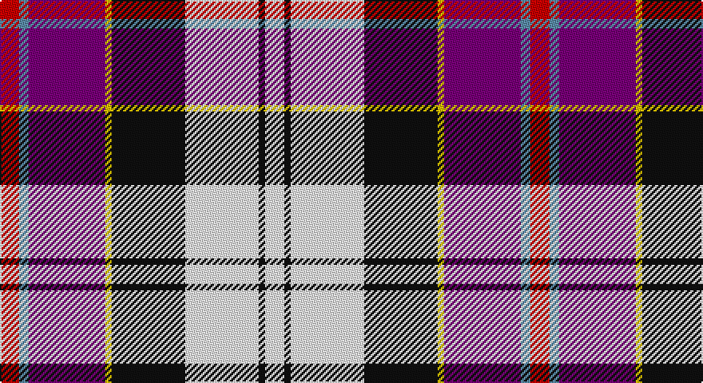

This page is one **sett** — a single exact thread-count. It belongs to the [tartan](/setts/r6t3dp24ly2k23w23k2w6/)
(the same proportion at any scale), whose colour order is pattern [RBBYKWKW](/stripes/rbbykwkw/).

Part of the [Culloden Dress](/tartans/culloden-dress/) tartan — the named design grouping this sett with its other cloths.

Sourced from register-of-tartans.  It is a [8 stripe tartan](/stripes/stripes8/).

Original link https://www.tartanregister.gov.uk/tartanDetails.aspx?ref=822

## Also known as

This cloth is also recorded under:

- Culloden Dress Ancient
- Culloden Dress Old
- Culloden, Dress
- Culloden, dress Ancient

## Register references

External register numbers recorded for this tartan.

- Scottish Register of Tartans: [822](https://www.tartanregister.gov.uk/tartanDetails.aspx?ref=822)
- Scottish Tartans Authority (ITI): 1323
- Scottish Tartans World Register: 1323

## Thread count
R/12 B6 P48 Y4 K46 W46 K4 W/12

One full sett is **332 threads**.

## Palette

Palette: <strong>Tartan Register</strong>
<table><thead><tr><th>Colour</th><th>Threads</th><th>Shade</th><th>Base</th><th>OKLCh</th></tr></thead><tbody><tr><td>R/</td><td style="text-align:right;font-variant-numeric:tabular-nums">12</td><td><code style="background-color:#C80000;">#C80000</code> <small style="color:#888">#C80000</small></td><td>R <code style="background-color:#CC0000;">#CC0000</code></td><td><small style="color:#888">oklch(52.3% 0.215 29.2)</small></td></tr><tr><td>B</td><td style="text-align:right;font-variant-numeric:tabular-nums">6</td><td><code style="background-color:#5C8CA8;">#5C8CA8</code> <small style="color:#888">#5C8CA8</small></td><td>B <code style="background-color:#2A418A;">#2A418A</code></td><td><small style="color:#888">oklch(61.7% 0.067 235.0)</small></td></tr><tr><td>P</td><td style="text-align:right;font-variant-numeric:tabular-nums">48</td><td><code style="background-color:#780078;">#780078</code> <small style="color:#888">#780078</small></td><td>B <code style="background-color:#2A418A;">#2A418A</code></td><td><small style="color:#888">oklch(40.2% 0.185 328.4)</small></td></tr><tr><td>Y</td><td style="text-align:right;font-variant-numeric:tabular-nums">4</td><td><code style="background-color:#E8C000;">#E8C000</code> <small style="color:#888">#E8C000</small></td><td>Y <code style="background-color:#F2BF00;">#F2BF00</code></td><td><small style="color:#888">oklch(81.9% 0.168 93.7)</small></td></tr><tr><td>K</td><td style="text-align:right;font-variant-numeric:tabular-nums">46</td><td><code style="background-color:#101010;">#101010</code> <small style="color:#888">#101010</small></td><td>K <code style="background-color:#000000;">#000000</code></td><td><small style="color:#888">oklch(17.3% 0.000 89.9)</small></td></tr><tr><td>W</td><td style="text-align:right;font-variant-numeric:tabular-nums">46</td><td><code style="background-color:#FCFCFC;">#FCFCFC</code> <small style="color:#888">#FCFCFC</small></td><td>W <code style="background-color:#F7F7F7;">#F7F7F7</code></td><td><small style="color:#888">oklch(99.1% 0.000 89.9)</small></td></tr><tr><td>K</td><td style="text-align:right;font-variant-numeric:tabular-nums">4</td><td><code style="background-color:#101010;">#101010</code> <small style="color:#888">#101010</small></td><td>K <code style="background-color:#000000;">#000000</code></td><td><small style="color:#888">oklch(17.3% 0.000 89.9)</small></td></tr><tr><td>W/</td><td style="text-align:right;font-variant-numeric:tabular-nums">12</td><td><code style="background-color:#FCFCFC;">#FCFCFC</code> <small style="color:#888">#FCFCFC</small></td><td>W <code style="background-color:#F7F7F7;">#F7F7F7</code></td><td><small style="color:#888">oklch(99.1% 0.000 89.9)</small></td></tr></tbody></table>

# Sample pattern

## Compared to the master

This cloth is one sett of its design; the master sett (the exemplar the design is anchored on) is below for comparison.

<figure style="margin:0"><figcaption style="color:#888;font-size:smaller">this sett</figcaption></figure>
<figure style="margin:0"><figcaption style="color:#888;font-size:smaller"><a href="/setts/r6db2dp21w3dg19w26dg3w5/">master sett →</a></figcaption></figure>

## Nearest tartans

The nearest existing variants by ΔTartan distance, with this tartan at the top so the swatches line up against it.

ΔTartan

Tartan

Sett

—

<a href="/ttd/edit/#slug=r6t3dp24ly2k23w23k2w6~x2">Culloden Dress</a> <a class="nn-out" href="/variants/s8/r6t3dp24ly2k23w23k2w6~x2/" title="open its dictionary page">↗</a>

0.53

<a href="/ttd/edit/#slug=r6t3m20ly2k20w20k2w5~x2&amp;base=r6t3dp24ly2k23w23k2w6~x2">Humming Bird (Fashion)</a> <a class="nn-out" href="/variants/s8/r6t3m20ly2k20w20k2w5~x2/" title="open its dictionary page">↗</a>

0.63

<a href="/ttd/edit/#slug=r6t3p24ly2k23w23k2w6~x2&amp;base=r6t3dp24ly2k23w23k2w6~x2">Culloden, Dress</a> <a class="nn-out" href="/variants/s8/r6t3p24ly2k23w23k2w6~x2/" title="open its dictionary page">↗</a>

1.04

<a href="/ttd/edit/#slug=r3w2db27k19w27dp2ly3~x2&amp;base=r6t3dp24ly2k23w23k2w6~x2">Christian Dress (Personal)</a> <a class="nn-out" href="/variants/s7/r3w2db27k19w27dp2ly3~x2/" title="open its dictionary page">↗</a>

1.05

<a href="/ttd/edit/#slug=r5t2p16k13ly13k2w3~x2&amp;base=r6t3dp24ly2k23w23k2w6~x2">Casey (Personal)</a> <a class="nn-out" href="/variants/s7/r5t2p16k13ly13k2w3~x2/" title="open its dictionary page">↗</a>

1.05

<a href="/ttd/edit/#slug=r4o2b15ly2k14w14k2w4~x2&amp;base=r6t3dp24ly2k23w23k2w6~x2">Culloden, Stirling</a> <a class="nn-out" href="/variants/s8/r4o2b15ly2k14w14k2w4~x2/" title="open its dictionary page">↗</a>

1.17

<a href="/ttd/edit/#slug=w5k26ly4lb24dp8k3r4~x2&amp;base=r6t3dp24ly2k23w23k2w6~x2">Pengelly, The Cornish</a> <a class="nn-out" href="/variants/s7/w5k26ly4lb24dp8k3r4~x2/" title="open its dictionary page">↗</a>

1.21

<a href="/ttd/edit/#slug=r6db2p21w3dg19w26dg3w5~x2&amp;base=r6t3dp24ly2k23w23k2w6~x2">Culloden, dress Ancient</a> <a class="nn-out" href="/variants/s8/r6db2p21w3dg19w26dg3w5~x2/" title="open its dictionary page">↗</a>

1.22

<a href="/ttd/edit/#slug=db36ly5r12ri9dp5w12ly7~x2&amp;base=r6t3dp24ly2k23w23k2w6~x2">Galvez-Brown</a> <a class="nn-out" href="/variants/s7/db36ly5r12ri9dp5w12ly7~x2/" title="open its dictionary page">↗</a>

1.23

<a href="/ttd/edit/#slug=r6db2dp21w3dg19w26dg3w5~x2&amp;base=r6t3dp24ly2k23w23k2w6~x2">Culloden Dress Ancient</a> <a class="nn-out" href="/variants/s8/r6db2dp21w3dg19w26dg3w5~x2/" title="open its dictionary page">↗</a>

1.24

<a href="/ttd/edit/#slug=w2r1w2r2w9k9r1db10r2k2ly2~x2&amp;base=r6t3dp24ly2k23w23k2w6~x2">Cameron of Erracht Dress</a> <a class="nn-out" href="/variants/s11/w2r1w2r2w9k9r1db10r2k2ly2~x2/" title="open its dictionary page">↗</a>

## Neighbour map

Every grey dot is one of 14360 variants placed by the first two principal components of the ΔTartan feature space (44% of its variance). Red is this tartan; blue dots are its nearest — click one to open its page.

<svg viewBox="0 0 640 380" role="img" style="max-width:100%;height:auto;border:1px solid #e0e0e0;border-radius:4px;display:block" xmlns="http://www.w3.org/2000/svg"><image href="/nn/cloud.v1.png" width="640" height="380"/><a href="/variants/s8/r6t3m20ly2k20w20k2w5~x2/"><circle cx="90.2" cy="134.3" r="4" fill="#3465a4"><title>Humming Bird (Fashion)</title></circle></a><a href="/variants/s8/r6t3p24ly2k23w23k2w6~x2/"><circle cx="97.6" cy="126.7" r="4" fill="#3465a4"><title>Culloden, Dress</title></circle></a><a href="/variants/s7/r3w2db27k19w27dp2ly3~x2/"><circle cx="118.8" cy="125.1" r="4" fill="#3465a4"><title>Christian Dress (Personal)</title></circle></a><a href="/variants/s7/r5t2p16k13ly13k2w3~x2/"><circle cx="62.0" cy="160.3" r="4" fill="#3465a4"><title>Casey (Personal)</title></circle></a><a href="/variants/s8/r4o2b15ly2k14w14k2w4~x2/"><circle cx="61.4" cy="149.4" r="4" fill="#3465a4"><title>Culloden, Stirling</title></circle></a><a href="/variants/s7/w5k26ly4lb24dp8k3r4~x2/"><circle cx="117.9" cy="147.7" r="4" fill="#3465a4"><title>Pengelly, The Cornish</title></circle></a><a href="/variants/s8/r6db2p21w3dg19w26dg3w5~x2/"><circle cx="154.6" cy="140.9" r="4" fill="#3465a4"><title>Culloden, dress Ancient</title></circle></a><a href="/variants/s7/db36ly5r12ri9dp5w12ly7~x2/"><circle cx="110.5" cy="151.7" r="4" fill="#3465a4"><title>Galvez-Brown</title></circle></a><a href="/variants/s8/r6db2dp21w3dg19w26dg3w5~x2/"><circle cx="151.8" cy="142.5" r="4" fill="#3465a4"><title>Culloden Dress Ancient</title></circle></a><a href="/variants/s11/w2r1w2r2w9k9r1db10r2k2ly2~x2/"><circle cx="87.3" cy="131.3" r="4" fill="#3465a4"><title>Cameron of Erracht Dress</title></circle></a><circle cx="96.7" cy="123.4" r="5" fill="#c00000"/></svg>

ID: /variants/s8/r6t3dp24ly2k23w23k2w6~x2/
