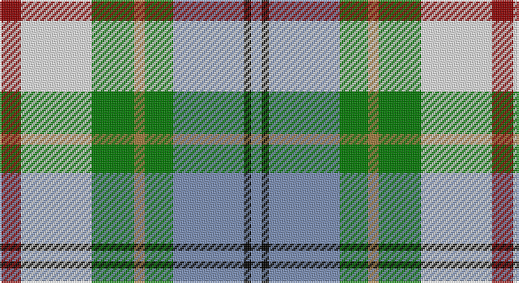

This page is one **sett** — a single exact thread-count. It belongs to the [tartan](/setts/r6w20g12o3g8t20k2t3/)
(the same proportion at any scale), whose colour order is pattern [BKBGRGWR](/stripes/bkbgrgwr/).

Sourced from register-of-tartans.  It is a [8 stripe tartan](/stripes/stripes8/).

Original link https://www.tartanregister.gov.uk/tartanDetails.aspx?ref=776

2 attestations — the source records this cloth was collapsed from (oldest owns this page)

<ul>
<li>01/01/2002 — Coulter Dress (Personal) (register-of-tartans, <a href="https://www.tartanregister.gov.uk/tartanDetails.aspx?ref=776">record</a>)</li>
<li>pre 2002 — Coulter Dress (Personal) (tartans-authority, <a href="http://www.tartansauthority.com/tartan-ferret/display/4142/">record</a>)</li>
</ul>

## Register references

External register numbers recorded for this tartan.

- Scottish Register of Tartans: [776](https://www.tartanregister.gov.uk/tartanDetails.aspx?ref=776)
- Scottish Tartans Authority (ITI): 4142

## Thread count
DR/12 W40 G24 LT6 G16 B40 K4 B/6

One full sett is **278 threads**.

## Palette

Palette: <strong>Tartan Register</strong> <small style="color:#888">(5 of 8 colours)</small>
<table><thead><tr><th>Colour</th><th>Threads</th><th>Shade</th><th>Base</th><th>OKLCh</th></tr></thead><tbody><tr><td>DR/</td><td style="text-align:right;font-variant-numeric:tabular-nums">12</td><td><code style="background-color:#8C0000;">#8C0000</code> <small style="color:#888">#8C0000</small></td><td>R <code style="background-color:#CC0000;">#CC0000</code></td><td><small style="color:#888">oklch(40.2% 0.165 29.2)</small></td></tr><tr><td>W</td><td style="text-align:right;font-variant-numeric:tabular-nums">40</td><td><code style="background-color:#F0F0F0;">#F0F0F0</code> <small style="color:#888">#F0F0F0</small></td><td>W <code style="background-color:#F7F7F7;">#F7F7F7</code></td><td><small style="color:#888">oklch(95.5% 0.000 89.9)</small></td></tr><tr><td>G</td><td style="text-align:right;font-variant-numeric:tabular-nums">24</td><td><code style="background-color:#007800;">#007800</code> <small style="color:#888">#007800</small></td><td>G <code style="background-color:#006100;">#006100</code></td><td><small style="color:#888">oklch(49.6% 0.169 142.5)</small></td></tr><tr><td>LT</td><td style="text-align:right;font-variant-numeric:tabular-nums">6</td><td><code style="background-color:#A0783C;">#A0783C</code> <small style="color:#888">#A0783C</small></td><td>R <code style="background-color:#CC0000;">#CC0000</code></td><td><small style="color:#888">oklch(60.0% 0.092 75.5)</small></td></tr><tr><td>G</td><td style="text-align:right;font-variant-numeric:tabular-nums">16</td><td><code style="background-color:#007800;">#007800</code> <small style="color:#888">#007800</small></td><td>G <code style="background-color:#006100;">#006100</code></td><td><small style="color:#888">oklch(49.6% 0.169 142.5)</small></td></tr><tr><td>B</td><td style="text-align:right;font-variant-numeric:tabular-nums">40</td><td><code style="background-color:#788CB4;">#788CB4</code> <small style="color:#888">#788CB4</small></td><td>B <code style="background-color:#2A418A;">#2A418A</code></td><td><small style="color:#888">oklch(63.9% 0.065 264.0)</small></td></tr><tr><td>K</td><td style="text-align:right;font-variant-numeric:tabular-nums">4</td><td><code style="background-color:#000000;">#000000</code> <small style="color:#888">#000000</small></td><td>K <code style="background-color:#000000;">#000000</code></td><td><small style="color:#888">oklch(0.0% 0.000 0.0)</small></td></tr><tr><td>B/</td><td style="text-align:right;font-variant-numeric:tabular-nums">6</td><td><code style="background-color:#788CB4;">#788CB4</code> <small style="color:#888">#788CB4</small></td><td>B <code style="background-color:#2A418A;">#2A418A</code></td><td><small style="color:#888">oklch(63.9% 0.065 264.0)</small></td></tr></tbody></table>

# Sample pattern

## Nearest tartans

The nearest existing variants by ΔTartan distance, with this tartan at the top so the swatches line up against it.

ΔTartan

Tartan

Sett

—

<a href="/ttd/edit/#slug=r6w20g12o3g8t20k2t3~x2">Coulter Dress (Personal)</a> <a class="nn-out" href="/variants/s8/r6w20g12o3g8t20k2t3~x2/" title="open its dictionary page">↗</a>

0.96

<a href="/ttd/edit/#slug=w30lb4dt6m4dt6g6dt12g13lt4~x2&amp;base=r6w20g12o3g8t20k2t3~x2">Sound of Iona</a> <a class="nn-out" href="/variants/s9/w30lb4dt6m4dt6g6dt12g13lt4~x2/" title="open its dictionary page">↗</a>

0.98

<a href="/ttd/edit/#slug=dy17o5db2w12db2ly4g7~x2&amp;base=r6w20g12o3g8t20k2t3~x2">Ontario Northern Canadian District Tartan</a> <a class="nn-out" href="/variants/s7/dy17o5db2w12db2ly4g7~x2/" title="open its dictionary page">↗</a>

0.98

<a href="/ttd/edit/#slug=db2w12k8g8r2g8k1lo2~x2&amp;base=r6w20g12o3g8t20k2t3~x2">MacLaren Dress</a> <a class="nn-out" href="/variants/s8/db2w12k8g8r2g8k1lo2~x2/" title="open its dictionary page">↗</a>

0.99

<a href="/ttd/edit/#slug=ly8r3b2db1w6g12db2~x2&amp;base=r6w20g12o3g8t20k2t3~x2">Carmen Lau (Hong Kong) (Personal)</a> <a class="nn-out" href="/variants/s7/ly8r3b2db1w6g12db2~x2/" title="open its dictionary page">↗</a>

1.00

<a href="/ttd/edit/#slug=t8ly2g4ly2dp4ly2t8w15lo2~x4&amp;base=r6w20g12o3g8t20k2t3~x2">Edmonton, City of</a> <a class="nn-out" href="/variants/s9/t8ly2g4ly2dp4ly2t8w15lo2~x4/" title="open its dictionary page">↗</a>

1.01

<a href="/ttd/edit/#slug=w8g14r6g24db30ly10w40ly10db7ly4&amp;base=r6w20g12o3g8t20k2t3~x2">John, Hamilton Gray</a> <a class="nn-out" href="/variants/s10/w8g14r6g24db30ly10w40ly10db7ly4/" title="open its dictionary page">↗</a>

1.07

<a href="/ttd/edit/#slug=ly8k3t2do1w6g12do2~x2&amp;base=r6w20g12o3g8t20k2t3~x2">Carmen Lau (Hong Kong) (Personal)</a> <a class="nn-out" href="/variants/s7/ly8k3t2do1w6g12do2~x2/" title="open its dictionary page">↗</a>

1.08

<a href="/ttd/edit/#slug=o17y5db2w12db2ly4g7~x2&amp;base=r6w20g12o3g8t20k2t3~x2">Ontario, Northern</a> <a class="nn-out" href="/variants/s7/o17y5db2w12db2ly4g7~x2/" title="open its dictionary page">↗</a>

1.09

<a href="/ttd/edit/#slug=k4ly2lg13k8r2w13r2w13k2g12ly4~x2&amp;base=r6w20g12o3g8t20k2t3~x2">MacLellan Dress (Personal)</a> <a class="nn-out" href="/variants/s11/k4ly2lg13k8r2w13r2w13k2g12ly4~x2/" title="open its dictionary page">↗</a>

1.09

<a href="/ttd/edit/#slug=p3t1w9r6g5t2w2t2w2t2g12ly2~x2&amp;base=r6w20g12o3g8t20k2t3~x2">Fredericton</a> <a class="nn-out" href="/variants/s12/p3t1w9r6g5t2w2t2w2t2g12ly2~x2/" title="open its dictionary page">↗</a>

## Neighbour map

Every grey dot is one of 14360 variants placed by the first two principal components of the ΔTartan feature space (44% of its variance). Red is this tartan; blue dots are its nearest — click one to open its page.

<svg viewBox="0 0 640 380" role="img" style="max-width:100%;height:auto;border:1px solid #e0e0e0;border-radius:4px;display:block" xmlns="http://www.w3.org/2000/svg"><image href="/nn/cloud.v1.png" width="640" height="380"/><a href="/variants/s9/w30lb4dt6m4dt6g6dt12g13lt4~x2/"><circle cx="81.7" cy="146.9" r="4" fill="#3465a4"><title>Sound of Iona</title></circle></a><a href="/variants/s7/dy17o5db2w12db2ly4g7~x2/"><circle cx="87.2" cy="167.3" r="4" fill="#3465a4"><title>Ontario Northern Canadian District Tartan</title></circle></a><a href="/variants/s8/db2w12k8g8r2g8k1lo2~x2/"><circle cx="97.3" cy="145.6" r="4" fill="#3465a4"><title>MacLaren Dress</title></circle></a><a href="/variants/s7/ly8r3b2db1w6g12db2~x2/"><circle cx="88.9" cy="145.2" r="4" fill="#3465a4"><title>Carmen Lau (Hong Kong) (Personal)</title></circle></a><a href="/variants/s9/t8ly2g4ly2dp4ly2t8w15lo2~x4/"><circle cx="87.9" cy="154.3" r="4" fill="#3465a4"><title>Edmonton, City of</title></circle></a><a href="/variants/s10/w8g14r6g24db30ly10w40ly10db7ly4/"><circle cx="88.9" cy="157.1" r="4" fill="#3465a4"><title>John, Hamilton Gray</title></circle></a><a href="/variants/s7/ly8k3t2do1w6g12do2~x2/"><circle cx="82.7" cy="141.4" r="4" fill="#3465a4"><title>Carmen Lau (Hong Kong) (Personal)</title></circle></a><a href="/variants/s7/o17y5db2w12db2ly4g7~x2/"><circle cx="104.5" cy="174.6" r="4" fill="#3465a4"><title>Ontario, Northern</title></circle></a><a href="/variants/s11/k4ly2lg13k8r2w13r2w13k2g12ly4~x2/"><circle cx="44.0" cy="152.5" r="4" fill="#3465a4"><title>MacLellan Dress (Personal)</title></circle></a><a href="/variants/s12/p3t1w9r6g5t2w2t2w2t2g12ly2~x2/"><circle cx="104.0" cy="125.9" r="4" fill="#3465a4"><title>Fredericton</title></circle></a><circle cx="81.8" cy="153.8" r="5" fill="#c00000"/></svg>

ID: /variants/s8/r6w20g12o3g8t20k2t3~x2/
