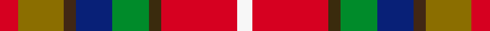

This page is one **sett** — a single exact thread-count. It belongs to the [tartan](/setts/r6y15do4db12g12dy4r25w5/)
(the same proportion at any scale), whose colour order is pattern [RGBBGGRW](/stripes/rgbbggrw/).

Sourced from register-of-tartans.  It is a [8 stripe tartan](/stripes/stripes8/).

Original link https://www.tartanregister.gov.uk/tartanDetails.aspx?ref=4798

Dataset <small>— provenance for this record, inherited from the source manifest</small>

<dl class="dataset-prov">
<dt>source</dt><dd><a href="/sources/register-of-tartans/">Scottish Register of Tartans</a></dd>
<dt>data captured from</dt><dd><a href="https://github.com/thetartan/tartan-database/blob/master/data/register-of-tartans/data.csv">https://github.com/thetartan/tartan-database/blob/master/data/register-of-tartans/data.csv</a></dd>
<dt>data date</dt><dd>2000 <small>(this record)</small></dd>
<dt>licence</dt><dd><a href="https://www.tartanregister.gov.uk/copyright">Crown copyright</a></dd>
</dl>

Capture chain <small>— the hands this data passed through, oldest first; each capture carries its own licence</small>

<ol class="capture-chain">
<li><a href="https://www.tartanregister.gov.uk/">Scottish Register of Tartans</a> · <a href="https://www.tartanregister.gov.uk/copyright">Crown copyright</a> <small>the living register — still published by National Records of Scotland</small></li>
<li><a href="https://github.com/thetartan/tartan-database">thetartan/tartan-database</a> <small>2016-2017</small> · <a href="https://creativecommons.org/licenses/by-nc-nd/4.0/">CC BY-NC-ND 4.0</a> <small>Levko Kravets's frozen compilation — the capture we vendored, and where its CC licence text came from</small></li>
<li>this dictionary <small>captured 2026-06-10 · commit 5bf86c7566</small> <small>each re-capture is a git commit to data/sources</small></li>
</ol>

## Register references

External register numbers recorded for this tartan.

- Scottish Register of Tartans: [4798](https://www.tartanregister.gov.uk/tartanDetails.aspx?ref=4798)
- Scottish Tartans Authority (ITI): 6276

## Thread count
R/12 Y30 DO8 DB24 G24 DY8 R50 W/10

One full sett is **310 threads**.

## Palette
<table><thead><tr><th>Colour</th><th>Shade</th><th>OKLCh</th></tr></thead><tbody><tr><td>DB</td><td><code style="background-color:#082077;">#082077</code> <small style="color:#888">#082077</small></td><td><small style="color:#888">oklch(30.0% 0.149 265.1)</small></td></tr><tr><td>DO</td><td><code style="background-color:#412714;">#412714</code> <small style="color:#888">#412714</small></td><td><small style="color:#888">oklch(30.1% 0.050 55.7)</small></td></tr><tr><td>G</td><td><code style="background-color:#008B2A;">#008B2A</code> <small style="color:#888">#008B2A</small></td><td><small style="color:#888">oklch(55.4% 0.170 145.9)</small></td></tr><tr><td>LY</td><td><code style="background-color:#DCBC32;">#DCBC32</code> <small style="color:#888">#DCBC32</small></td><td><small style="color:#888">oklch(80.0% 0.150 95.2)</small></td></tr><tr><td>R</td><td><code style="background-color:#D60020;">#D60020</code> <small style="color:#888">#D60020</small></td><td><small style="color:#888">oklch(55.2% 0.224 25.5)</small></td></tr><tr><td>DY</td><td><code style="background-color:#3A2B0D;">#3A2B0D</code> <small style="color:#888">#3A2B0D</small></td><td><small style="color:#888">oklch(30.0% 0.049 82.0)</small></td></tr><tr><td>W</td><td><code style="background-color:#F7F7F7;">#F7F7F7</code> <small style="color:#888">#F7F7F7</small></td><td><small style="color:#888">oklch(97.6% 0.000 89.9)</small></td></tr><tr><td>Y</td><td><code style="background-color:#8B6E00;">#8B6E00</code> <small style="color:#888">#8B6E00</small></td><td><small style="color:#888">oklch(55.1% 0.113 90.4)</small></td></tr></tbody></table>

# Sample pattern

## Nearest tartan variants

The nearest existing variants by ΔTartan distance, with this cloth at the top so the swatches line up against it.

ΔTartan

Threads

Variant

Sett

—

310

<a href="/variants/s8/r6y15do4db12g12dy4r25w5~x2/">Young Presidents Organisation Dress</a>

<a href="/ttd/edit/#slug=r24w3y4dg18dp18dgi3lb4~x2~dg1104144-dgi1703114&amp;base=r6y15do4db12g12dy4r25w5~x2" title="compare in the TTD">2.72</a>

240

<a href="/variants/s7/r24w3y4dg18dp18dy3lb4~x2~dg1104144-dy1703114/">Walter</a>

<a href="/ttd/edit/#slug=y5n3db6dy8w5r17k2&amp;base=r6y15do4db12g12dy4r25w5~x2" title="compare in the TTD">2.79</a>

85

<a href="/variants/s7/y5n3db6dy8w5r17k2/">Barrington Municipality</a>

<a href="/ttd/edit/#slug=dp4n10r18ly3r3ly5ri8n9w4~x2~r1807008-ri2806019&amp;base=r6y15do4db12g12dy4r25w5~x2" title="compare in the TTD">2.96</a>

240

<a href="/variants/s9/dp4n10r18ly3r3ly5ri8n9w4~x2~r1807008-ri2806019/">Khosla, Sarah and Jatin (Personal)</a>

<a href="/ttd/edit/#slug=r1dy1r9g6lg2gi3r2y1~x4~lg2803208-gi2203208&amp;base=r6y15do4db12g12dy4r25w5~x2" title="compare in the TTD">2.96</a>

192

<a href="/variants/s8/r1dy1r9g6lg2t3r2y1~x4~lg2803208-t2203208/">Battle of Bannockburn, The</a>

<a href="/ttd/edit/#slug=r22lb6db10y4r4w4g22db8y3&amp;base=r6y15do4db12g12dy4r25w5~x2" title="compare in the TTD">3.06</a>

141

<a href="/variants/s9/r22lb6db10y4r4w4g22db8y3/">Unidentified No 14</a>

<a href="/ttd/edit/#slug=dt3db5n2dg5r11w3~x4&amp;base=r6y15do4db12g12dy4r25w5~x2" title="compare in the TTD">3.10</a>

208

<a href="/variants/s6/dt3db5n2dg5r11w3~x4/">Nicolson of Lewis (Clan?)</a>

<a href="/ttd/edit/#slug=r1lo4dr3r1dr3lr1g3db3lr1~x4~r1606028-dr1004029&amp;base=r6y15do4db12g12dy4r25w5~x2" title="compare in the TTD">3.19</a>

152

<a href="/variants/s9/r1lo4dr3r1dr3lr1g3db3lr1~x4~r1606028-dr1004029/">Isle of Arran (Personal)</a>

<a href="/ttd/edit/#slug=dp4n10r18ly3r3ly5ri8n9w4~x2~r1807008-ri2109013&amp;base=r6y15do4db12g12dy4r25w5~x2" title="compare in the TTD">3.28</a>

240

<a href="/variants/s9/dp4n10r18ly3r3ly5ri8n9w4~x2~r1807008-ri2109013/">Khosla, Sarah and Justin (Personal)</a>

<a href="/ttd/edit/#slug=y9g7db3r28db4g7db5lb4db5dg7db3w6~x2~g1903114-dg1806142&amp;base=r6y15do4db12g12dy4r25w5~x2" title="compare in the TTD">3.29</a>

322

<a href="/variants/s12/y9g7db3r28db4g7db5lb4db5dg7db3w6~x2~g1903114-dg1806142/">Mayo County Crest (Fashion)</a>

<a href="/ttd/edit/#slug=dp2r9g8r4y1r4db10w2~x4&amp;base=r6y15do4db12g12dy4r25w5~x2" title="compare in the TTD">3.30</a>

304

<a href="/variants/s8/dp2r9g8r4y1r4db10w2~x4/">De Maynard (Personal)</a>

## Neighbour map

Every grey dot is one of 13620 variants placed by the first two principal components of the ΔTartan feature space (42% of its variance). Red is this tartan; blue dots are its nearest — click one to open its page.

<svg viewBox="0 0 640 380" role="img" style="max-width:100%;height:auto;border:1px solid #e0e0e0;border-radius:4px;display:block" xmlns="http://www.w3.org/2000/svg"><image href="/nn/cloud.v1.png" width="640" height="380"/><a href="/variants/s7/r24w3y4dg18dp18dy3lb4~x2~dg1104144-dy1703114/"><circle cx="124.0" cy="182.8" r="4" fill="#3465a4"><title>Walter</title></circle></a><a href="/variants/s7/y5n3db6dy8w5r17k2/"><circle cx="79.3" cy="162.1" r="4" fill="#3465a4"><title>Barrington Municipality</title></circle></a><a href="/variants/s9/dp4n10r18ly3r3ly5ri8n9w4~x2~r1807008-ri2806019/"><circle cx="134.7" cy="216.7" r="4" fill="#3465a4"><title>Khosla, Sarah and Jatin (Personal)</title></circle></a><a href="/variants/s8/r1dy1r9g6lg2t3r2y1~x4~lg2803208-t2203208/"><circle cx="247.1" cy="186.0" r="4" fill="#3465a4"><title>Battle of Bannockburn, The</title></circle></a><a href="/variants/s9/r22lb6db10y4r4w4g22db8y3/"><circle cx="107.2" cy="188.8" r="4" fill="#3465a4"><title>Unidentified No 14</title></circle></a><a href="/variants/s6/dt3db5n2dg5r11w3~x4/"><circle cx="110.9" cy="224.0" r="4" fill="#3465a4"><title>Nicolson of Lewis (Clan?)</title></circle></a><a href="/variants/s9/r1lo4dr3r1dr3lr1g3db3lr1~x4~r1606028-dr1004029/"><circle cx="46.6" cy="237.4" r="4" fill="#3465a4"><title>Isle of Arran (Personal)</title></circle></a><a href="/variants/s9/dp4n10r18ly3r3ly5ri8n9w4~x2~r1807008-ri2109013/"><circle cx="140.8" cy="217.7" r="4" fill="#3465a4"><title>Khosla, Sarah and Justin (Personal)</title></circle></a><a href="/variants/s12/y9g7db3r28db4g7db5lb4db5dg7db3w6~x2~g1903114-dg1806142/"><circle cx="101.5" cy="147.9" r="4" fill="#3465a4"><title>Mayo County Crest (Fashion)</title></circle></a><a href="/variants/s8/dp2r9g8r4y1r4db10w2~x4/"><circle cx="163.7" cy="185.8" r="4" fill="#3465a4"><title>De Maynard (Personal)</title></circle></a><circle cx="108.3" cy="196.7" r="5" fill="#c00000"/><text x="320" y="376" text-anchor="middle" font-size="11" fill="#999">ground</text><text x="11" y="190" text-anchor="middle" font-size="11" fill="#999" transform="rotate(-90 11 190)">complexity</text></svg>

ID: /variants/s8/r6y15do4db12g12dy4r25w5~x2/
