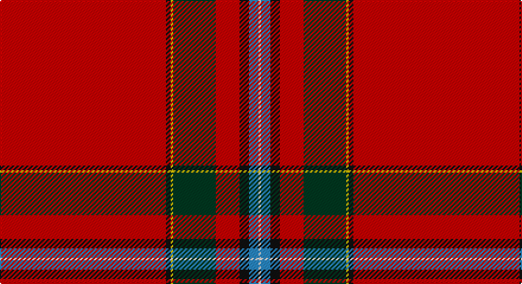

This page is one **sett** — a single exact thread-count. It belongs to the [tartan](/setts/r70k2ly1dg18r10k4t4w1/)
(the same proportion at any scale), whose colour order is pattern [RKYGRKBW](/stripes/rkygrkbw/).

Sourced from register-of-tartans.  It is a [8 stripe tartan](/stripes/stripes8/).

Original link https://www.tartanregister.gov.uk/tartanDetails.aspx?ref=2470

2 attestations — the source records this cloth was collapsed from (oldest owns this page)

<ul>
<li>01/01/2003 — MacIngust (register-of-tartans, <a href="https://www.tartanregister.gov.uk/tartanDetails.aspx?ref=2470">record</a>)</li>
<li>pre 2003 — MacIngust (Clan?) (tartans-authority, <a href="http://www.tartansauthority.com/tartan-ferret/display/5912/">record</a>)</li>
</ul>

## Register references

External register numbers recorded for this tartan.

- Scottish Register of Tartans: [2470](https://www.tartanregister.gov.uk/tartanDetails.aspx?ref=2470)
- Scottish Tartans Authority (ITI): 5912

## Thread count
R/140 K4 Y2 DG36 R20 K8 B8 LN/2

One full sett is **298 threads**.

## Palette

Palette: <strong>Tartan Register</strong>
<table><thead><tr><th>Colour</th><th>Threads</th><th>Shade</th><th>Base</th><th>OKLCh</th></tr></thead><tbody><tr><td>R/</td><td style="text-align:right;font-variant-numeric:tabular-nums">140</td><td><code style="background-color:#C80000;">#C80000</code> <small style="color:#888">#C80000</small></td><td>R <code style="background-color:#CC0000;">#CC0000</code></td><td><small style="color:#888">oklch(52.3% 0.215 29.2)</small></td></tr><tr><td>K</td><td style="text-align:right;font-variant-numeric:tabular-nums">4</td><td><code style="background-color:#101010;">#101010</code> <small style="color:#888">#101010</small></td><td>K <code style="background-color:#000000;">#000000</code></td><td><small style="color:#888">oklch(17.3% 0.000 89.9)</small></td></tr><tr><td>Y</td><td style="text-align:right;font-variant-numeric:tabular-nums">2</td><td><code style="background-color:#E8C000;">#E8C000</code> <small style="color:#888">#E8C000</small></td><td>Y <code style="background-color:#F2BF00;">#F2BF00</code></td><td><small style="color:#888">oklch(81.9% 0.168 93.7)</small></td></tr><tr><td>DG</td><td style="text-align:right;font-variant-numeric:tabular-nums">36</td><td><code style="background-color:#003820;">#003820</code> <small style="color:#888">#003820</small></td><td>G <code style="background-color:#006100;">#006100</code></td><td><small style="color:#888">oklch(30.0% 0.070 158.3)</small></td></tr><tr><td>R</td><td style="text-align:right;font-variant-numeric:tabular-nums">20</td><td><code style="background-color:#C80000;">#C80000</code> <small style="color:#888">#C80000</small></td><td>R <code style="background-color:#CC0000;">#CC0000</code></td><td><small style="color:#888">oklch(52.3% 0.215 29.2)</small></td></tr><tr><td>K</td><td style="text-align:right;font-variant-numeric:tabular-nums">8</td><td><code style="background-color:#101010;">#101010</code> <small style="color:#888">#101010</small></td><td>K <code style="background-color:#000000;">#000000</code></td><td><small style="color:#888">oklch(17.3% 0.000 89.9)</small></td></tr><tr><td>B</td><td style="text-align:right;font-variant-numeric:tabular-nums">8</td><td><code style="background-color:#2888C4;">#2888C4</code> <small style="color:#888">#2888C4</small></td><td>B <code style="background-color:#2A418A;">#2A418A</code></td><td><small style="color:#888">oklch(60.1% 0.125 241.5)</small></td></tr><tr><td>LN/</td><td style="text-align:right;font-variant-numeric:tabular-nums">2</td><td><code style="background-color:#E0E0E0;">#E0E0E0</code> <small style="color:#888">#E0E0E0</small></td><td>W <code style="background-color:#F7F7F7;">#F7F7F7</code></td><td><small style="color:#888">oklch(90.7% 0.000 89.9)</small></td></tr></tbody></table>

# Sample pattern

## Nearest tartans

The nearest existing variants by ΔTartan distance, with this tartan at the top so the swatches line up against it.

ΔTartan

Tartan

Sett

—

<a href="/ttd/edit/#slug=r70k2ly1dg18r10k4t4w1~x2">MacIngust</a> <a class="nn-out" href="/variants/s8/r70k2ly1dg18r10k4t4w1~x2/" title="open its dictionary page">↗</a>

0.89

<a href="/ttd/edit/#slug=r48db3ly1dg14r8db3lb4lr1&amp;base=r70k2ly1dg18r10k4t4w1~x2">Prince Charles Cloak</a> <a class="nn-out" href="/variants/s8/r48db3ly1dg14r8db3lb4lr1/" title="open its dictionary page">↗</a>

0.91

<a href="/ttd/edit/#slug=r70b1r2g12k2g1k10w1~x2&amp;base=r70k2ly1dg18r10k4t4w1~x2">Zamzam (Personal)</a> <a class="nn-out" href="/variants/s8/r70b1r2g12k2g1k10w1~x2/" title="open its dictionary page">↗</a>

1.03

<a href="/ttd/edit/#slug=r96db1dg24db1r10db1dg12k1w4~x2&amp;base=r70k2ly1dg18r10k4t4w1~x2">MacAulay (MacGregor)</a> <a class="nn-out" href="/variants/s9/r96db1dg24db1r10db1dg12k1w4~x2/" title="open its dictionary page">↗</a>

1.03

<a href="/ttd/edit/#slug=r72db6ly1db12k4w1n4w1k5~x2&amp;base=r70k2ly1dg18r10k4t4w1~x2">Inverness Cathedral (Corporate)</a> <a class="nn-out" href="/variants/s9/r72db6ly1db12k4w1n4w1k5~x2/" title="open its dictionary page">↗</a>

1.10

<a href="/ttd/edit/#slug=r50db3g6db1r3db1g8k1lb3~x2&amp;base=r70k2ly1dg18r10k4t4w1~x2">MacAulay of Ardincaple (Clan)</a> <a class="nn-out" href="/variants/s9/r50db3g6db1r3db1g8k1lb3~x2/" title="open its dictionary page">↗</a>

1.12

<a href="/ttd/edit/#slug=r134db10k14ly2k3w3k3g21r11k3r4w2&amp;base=r70k2ly1dg18r10k4t4w1~x2">Royal Stewart - 1819</a> <a class="nn-out" href="/variants/s12/r134db10k14ly2k3w3k3g21r11k3r4w2/" title="open its dictionary page">↗</a>

1.12

<a href="/ttd/edit/#slug=r48lr4db4k4r12db4r1ly4~x2&amp;base=r70k2ly1dg18r10k4t4w1~x2">Brodie</a> <a class="nn-out" href="/variants/s8/r48lr4db4k4r12db4r1ly4~x2/" title="open its dictionary page">↗</a>

1.12

<a href="/ttd/edit/#slug=r48lr4db4k4r12db4r1ly4&amp;base=r70k2ly1dg18r10k4t4w1~x2">Brodie</a> <a class="nn-out" href="/variants/s8/r48lr4db4k4r12db4r1ly4/" title="open its dictionary page">↗</a>

1.16

<a href="/ttd/edit/#slug=r48db3ly1dg14r8db3b4lr1~x2&amp;base=r70k2ly1dg18r10k4t4w1~x2">Prince Charles Cloak</a> <a class="nn-out" href="/variants/s8/r48db3ly1dg14r8db3b4lr1~x2/" title="open its dictionary page">↗</a>

1.16

<a href="/ttd/edit/#slug=r48db3ly1dg14r8db3b4lr1&amp;base=r70k2ly1dg18r10k4t4w1~x2">Prince Charles Cloak</a> <a class="nn-out" href="/variants/s8/r48db3ly1dg14r8db3b4lr1/" title="open its dictionary page">↗</a>

## Neighbour map

Every grey dot is one of 14360 variants placed by the first two principal components of the ΔTartan feature space (44% of its variance). Red is this tartan; blue dots are its nearest — click one to open its page.

<svg viewBox="0 0 640 380" role="img" style="max-width:100%;height:auto;border:1px solid #e0e0e0;border-radius:4px;display:block" xmlns="http://www.w3.org/2000/svg"><image href="/nn/cloud.v1.png" width="640" height="380"/><a href="/variants/s8/r48db3ly1dg14r8db3lb4lr1/"><circle cx="442.7" cy="60.6" r="4" fill="#3465a4"><title>Prince Charles Cloak</title></circle></a><a href="/variants/s8/r70b1r2g12k2g1k10w1~x2/"><circle cx="525.6" cy="67.4" r="4" fill="#3465a4"><title>Zamzam (Personal)</title></circle></a><a href="/variants/s9/r96db1dg24db1r10db1dg12k1w4~x2/"><circle cx="511.9" cy="61.3" r="4" fill="#3465a4"><title>MacAulay (MacGregor)</title></circle></a><a href="/variants/s9/r72db6ly1db12k4w1n4w1k5~x2/"><circle cx="465.8" cy="42.8" r="4" fill="#3465a4"><title>Inverness Cathedral (Corporate)</title></circle></a><a href="/variants/s9/r50db3g6db1r3db1g8k1lb3~x2/"><circle cx="505.1" cy="66.4" r="4" fill="#3465a4"><title>MacAulay of Ardincaple (Clan)</title></circle></a><a href="/variants/s12/r134db10k14ly2k3w3k3g21r11k3r4w2/"><circle cx="483.6" cy="22.7" r="4" fill="#3465a4"><title>Royal Stewart - 1819</title></circle></a><a href="/variants/s8/r48lr4db4k4r12db4r1ly4~x2/"><circle cx="516.0" cy="81.2" r="4" fill="#3465a4"><title>Brodie</title></circle></a><a href="/variants/s8/r48lr4db4k4r12db4r1ly4/"><circle cx="516.0" cy="81.2" r="4" fill="#3465a4"><title>Brodie</title></circle></a><a href="/variants/s8/r48db3ly1dg14r8db3b4lr1~x2/"><circle cx="470.6" cy="80.4" r="4" fill="#3465a4"><title>Prince Charles Cloak</title></circle></a><a href="/variants/s8/r48db3ly1dg14r8db3b4lr1/"><circle cx="470.6" cy="80.4" r="4" fill="#3465a4"><title>Prince Charles Cloak</title></circle></a><circle cx="502.0" cy="60.2" r="5" fill="#c00000"/></svg>

ID: /variants/s8/r70k2ly1dg18r10k4t4w1~x2/
