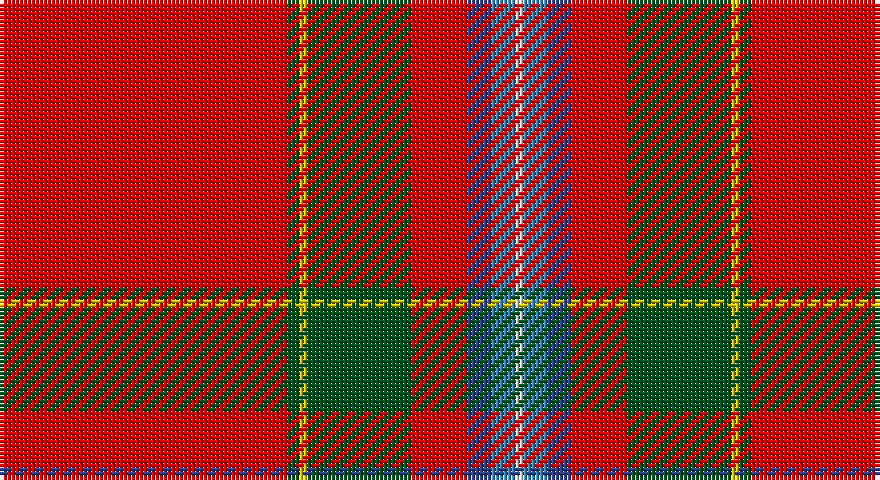

This page is one **sett** — a single exact thread-count. It belongs to the [tartan](/setts/r72dg3ly2dg26r14db6t6w2/)
(the same proportion at any scale), whose colour order is pattern [RGYGRBBW](/stripes/rgygrbbw/).

Sourced from register-of-tartans.  It is a [8 stripe tartan](/stripes/stripes8/).

Original link https://www.tartanregister.gov.uk/tartanDetails.aspx?ref=4019

## Register references

External register numbers recorded for this tartan.

- Scottish Register of Tartans: [4019](https://www.tartanregister.gov.uk/tartanDetails.aspx?ref=4019)
- Scottish Tartans World Register: 1553

## Thread count
R/72 G3 Y2 G26 R14 B6 Ba6 LN/2

One full sett is **188 threads**.

## Palette

Palette: <strong>Tartan Register</strong>
<table><thead><tr><th>Colour</th><th>Threads</th><th>Shade</th><th>Base</th><th>OKLCh</th></tr></thead><tbody><tr><td>R/</td><td style="text-align:right;font-variant-numeric:tabular-nums">72</td><td><code style="background-color:#DC0000;">#DC0000</code> <small style="color:#888">#DC0000</small></td><td>R <code style="background-color:#CC0000;">#CC0000</code></td><td><small style="color:#888">oklch(56.2% 0.230 29.2)</small></td></tr><tr><td>G</td><td style="text-align:right;font-variant-numeric:tabular-nums">3</td><td><code style="background-color:#005020;">#005020</code> <small style="color:#888">#005020</small></td><td>G <code style="background-color:#006100;">#006100</code></td><td><small style="color:#888">oklch(37.7% 0.105 149.6)</small></td></tr><tr><td>Y</td><td style="text-align:right;font-variant-numeric:tabular-nums">2</td><td><code style="background-color:#E8C000;">#E8C000</code> <small style="color:#888">#E8C000</small></td><td>Y <code style="background-color:#F2BF00;">#F2BF00</code></td><td><small style="color:#888">oklch(81.9% 0.168 93.7)</small></td></tr><tr><td>G</td><td style="text-align:right;font-variant-numeric:tabular-nums">26</td><td><code style="background-color:#005020;">#005020</code> <small style="color:#888">#005020</small></td><td>G <code style="background-color:#006100;">#006100</code></td><td><small style="color:#888">oklch(37.7% 0.105 149.6)</small></td></tr><tr><td>R</td><td style="text-align:right;font-variant-numeric:tabular-nums">14</td><td><code style="background-color:#DC0000;">#DC0000</code> <small style="color:#888">#DC0000</small></td><td>R <code style="background-color:#CC0000;">#CC0000</code></td><td><small style="color:#888">oklch(56.2% 0.230 29.2)</small></td></tr><tr><td>B</td><td style="text-align:right;font-variant-numeric:tabular-nums">6</td><td><code style="background-color:#2C4084;">#2C4084</code> <small style="color:#888">#2C4084</small></td><td>B <code style="background-color:#2A418A;">#2A418A</code></td><td><small style="color:#888">oklch(39.4% 0.117 268.3)</small></td></tr><tr><td>Ba</td><td style="text-align:right;font-variant-numeric:tabular-nums">6</td><td><code style="background-color:#3C82AF;">#3C82AF</code> <small style="color:#888">#3C82AF</small></td><td>B <code style="background-color:#2A418A;">#2A418A</code></td><td><small style="color:#888">oklch(58.1% 0.099 239.8)</small></td></tr><tr><td>LN/</td><td style="text-align:right;font-variant-numeric:tabular-nums">2</td><td><code style="background-color:#E0E0E0;">#E0E0E0</code> <small style="color:#888">#E0E0E0</small></td><td>W <code style="background-color:#F7F7F7;">#F7F7F7</code></td><td><small style="color:#888">oklch(90.7% 0.000 89.9)</small></td></tr></tbody></table>

# Sample pattern

## Nearest tartans

The nearest existing variants by ΔTartan distance, with this tartan at the top so the swatches line up against it.

ΔTartan

Tartan

Sett

—

<a href="/ttd/edit/#slug=r72dg3ly2dg26r14db6t6w2">Stuart/Stewart of Fingask</a> <a class="nn-out" href="/variants/s8/r72dg3ly2dg26r14db6t6w2/" title="open its dictionary page">↗</a>

0.44

<a href="/ttd/edit/#slug=r72g3ly2g26r14db6t6w2&amp;base=r72dg3ly2dg26r14db6t6w2">Stewart of Fingask - 1745 (Clan?)</a> <a class="nn-out" href="/variants/s8/r72g3ly2g26r14db6t6w2/" title="open its dictionary page">↗</a>

0.67

<a href="/ttd/edit/#slug=r36w1db3ly1dg16r8db3t2w1~x2&amp;base=r72dg3ly2dg26r14db6t6w2">Perthshire or Drummond of Perth</a> <a class="nn-out" href="/variants/s9/r36w1db3ly1dg16r8db3t2w1~x2/" title="open its dictionary page">↗</a>

0.69

<a href="/ttd/edit/#slug=r38ly1db3w1g13r6db3t3w1~x2&amp;base=r72dg3ly2dg26r14db6t6w2">Drummond, Ancient</a> <a class="nn-out" href="/variants/s9/r38ly1db3w1g13r6db3t3w1~x2/" title="open its dictionary page">↗</a>

0.70

<a href="/ttd/edit/#slug=r48db3ly1dg14r8db3lb4lr1&amp;base=r72dg3ly2dg26r14db6t6w2">Prince Charles Cloak</a> <a class="nn-out" href="/variants/s8/r48db3ly1dg14r8db3lb4lr1/" title="open its dictionary page">↗</a>

0.71

<a href="/ttd/edit/#slug=r48db3lo2g14r8db3t4w3~x2&amp;base=r72dg3ly2dg26r14db6t6w2">Drummond of Fingask</a> <a class="nn-out" href="/variants/s8/r48db3lo2g14r8db3t4w3~x2/" title="open its dictionary page">↗</a>

0.72

<a href="/ttd/edit/#slug=r36w1db3ly1g16r8db3b2w1~x2&amp;base=r72dg3ly2dg26r14db6t6w2">Drummond of Perth (Clan)</a> <a class="nn-out" href="/variants/s9/r36w1db3ly1g16r8db3b2w1~x2/" title="open its dictionary page">↗</a>

0.84

<a href="/ttd/edit/#slug=r36w1db3ly1g16r8db3t2w1~x2&amp;base=r72dg3ly2dg26r14db6t6w2">Drummond of Perth</a> <a class="nn-out" href="/variants/s9/r36w1db3ly1g16r8db3t2w1~x2/" title="open its dictionary page">↗</a>

0.97

<a href="/ttd/edit/#slug=r64k10ly4m5w2k2db3ly4~x2&amp;base=r72dg3ly2dg26r14db6t6w2">Conroy Family Tartan</a> <a class="nn-out" href="/variants/s8/r64k10ly4m5w2k2db3ly4~x2/" title="open its dictionary page">↗</a>

1.18

<a href="/ttd/edit/#slug=r48db3ly1dg14r8db3b4lr1~x2&amp;base=r72dg3ly2dg26r14db6t6w2">Prince Charles Cloak</a> <a class="nn-out" href="/variants/s8/r48db3ly1dg14r8db3b4lr1~x2/" title="open its dictionary page">↗</a>

1.18

<a href="/ttd/edit/#slug=r48db3ly1dg14r8db3b4lr1&amp;base=r72dg3ly2dg26r14db6t6w2">Prince Charles Cloak</a> <a class="nn-out" href="/variants/s8/r48db3ly1dg14r8db3b4lr1/" title="open its dictionary page">↗</a>

## Neighbour map

Every grey dot is one of 14360 variants placed by the first two principal components of the ΔTartan feature space (44% of its variance). Red is this tartan; blue dots are its nearest — click one to open its page.

<svg viewBox="0 0 640 380" role="img" style="max-width:100%;height:auto;border:1px solid #e0e0e0;border-radius:4px;display:block" xmlns="http://www.w3.org/2000/svg"><image href="/nn/cloud.v1.png" width="640" height="380"/><a href="/variants/s8/r72g3ly2g26r14db6t6w2/"><circle cx="430.4" cy="84.4" r="4" fill="#3465a4"><title>Stewart of Fingask - 1745 (Clan?)</title></circle></a><a href="/variants/s9/r36w1db3ly1dg16r8db3t2w1~x2/"><circle cx="396.9" cy="75.4" r="4" fill="#3465a4"><title>Perthshire or Drummond of Perth</title></circle></a><a href="/variants/s9/r38ly1db3w1g13r6db3t3w1~x2/"><circle cx="410.5" cy="69.7" r="4" fill="#3465a4"><title>Drummond, Ancient</title></circle></a><a href="/variants/s8/r48db3ly1dg14r8db3lb4lr1/"><circle cx="442.7" cy="60.6" r="4" fill="#3465a4"><title>Prince Charles Cloak</title></circle></a><a href="/variants/s8/r48db3lo2g14r8db3t4w3~x2/"><circle cx="400.9" cy="91.6" r="4" fill="#3465a4"><title>Drummond of Fingask</title></circle></a><a href="/variants/s9/r36w1db3ly1g16r8db3b2w1~x2/"><circle cx="392.6" cy="74.4" r="4" fill="#3465a4"><title>Drummond of Perth (Clan)</title></circle></a><a href="/variants/s9/r36w1db3ly1g16r8db3t2w1~x2/"><circle cx="393.2" cy="75.6" r="4" fill="#3465a4"><title>Drummond of Perth</title></circle></a><a href="/variants/s8/r64k10ly4m5w2k2db3ly4~x2/"><circle cx="436.0" cy="59.9" r="4" fill="#3465a4"><title>Conroy Family Tartan</title></circle></a><a href="/variants/s8/r48db3ly1dg14r8db3b4lr1~x2/"><circle cx="470.6" cy="80.4" r="4" fill="#3465a4"><title>Prince Charles Cloak</title></circle></a><a href="/variants/s8/r48db3ly1dg14r8db3b4lr1/"><circle cx="470.6" cy="80.4" r="4" fill="#3465a4"><title>Prince Charles Cloak</title></circle></a><circle cx="422.5" cy="77.6" r="5" fill="#c00000"/></svg>

ID: /variants/s8/r72dg3ly2dg26r14db6t6w2/
