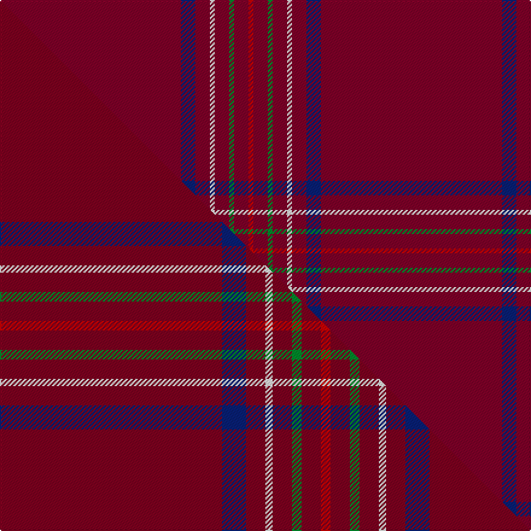

This page is one **sett** — a single exact thread-count. It belongs to the [tartan](/setts/r75db6r6w2r6g2r6ri2/)
(the same proportion at any scale), whose colour order is pattern [RBRWRGRR](/stripes/rbrwrgrr/).

Part of the [Burnett of Leys Hunting](/tartans/burnett-of-leys-hunting/) tartan — the named design grouping this sett with its other cloths.

Sourced from tartans-authority.  It is a [8 stripe tartan](/stripes/stripes8/).

Original link http://www.tartansauthority.com/tartan-ferret/display/1657/

## Register references

External register numbers recorded for this tartan.

- Scottish Tartans Authority (ITI): 1657

## Thread count
R/150 DB12 R12 W4 R12 G4 R12 Ri/4

One full sett is **266 threads**.

## Palette
<table><thead><tr><th>Colour</th><th>Shade</th><th>OKLCh</th></tr></thead><tbody><tr><td>DB</td><td><code style="background-color:#082077;">#082077</code> <small style="color:#888">#082077</small></td><td><small style="color:#888">oklch(30.0% 0.149 265.1)</small></td></tr><tr><td>R</td><td><code style="background-color:#800028;">#800028</code> <small style="color:#888">#800028</small></td><td><small style="color:#888">oklch(38.2% 0.152 14.5)</small></td></tr><tr><td>G</td><td><code style="background-color:#008B2A;">#008B2A</code> <small style="color:#888">#008B2A</small></td><td><small style="color:#888">oklch(55.4% 0.170 145.9)</small></td></tr><tr><td>R</td><td><code style="background-color:#C80000;">#C80000</code> <small style="color:#888">#C80000</small></td><td><small style="color:#888">oklch(52.3% 0.215 29.2)</small></td></tr><tr><td>W</td><td><code style="background-color:#F7F7F7;">#F7F7F7</code> <small style="color:#888">#F7F7F7</small></td><td><small style="color:#888">oklch(97.6% 0.000 89.9)</small></td></tr></tbody></table>

# Sample pattern

## Compared to the master

This cloth is one sett of its design; the master sett (the exemplar the design is anchored on) is below for comparison.

Its **ΔTartan distance** from the master is **0.99** — the same measure the nearest-tartans table ranks by (0 is identical; a re-scale of the same cloth is near 0, a recolour or a different proportion further).

<figure class="master-compare" style="margin:0">

this sett
master sett ★

<figcaption style="color:#888;font-size:smaller">One weave of this sett against the <a href="/setts/r92db10r8w3r8g4r8ri4/">master sett ★</a>, split on the diagonal: a shared proportion runs seamlessly across it with only the shades shifting; a different proportion breaks on it.</figcaption>
</figure>

## Nearest tartan variants

The nearest existing variants by ΔTartan distance, with this cloth at the top so the swatches line up against it.

ΔTartan

Threads

Variant

Sett

—

266

<a href="/variants/s8/r75db6r6w2r6g2r6ri2~x2~r1506019-ri2109032/">Burnett of Leys Htg (Clan)</a>

<a href="/ttd/edit/#slug=r92db10r8w3r8g4r8ri4~x2~r1506019-ri2109032&amp;base=r75db6r6w2r6g2r6ri2~x2~r1506019-ri2109032" title="compare in the TTD">0.22</a>

356

<a href="/variants/s8/r92db10r8w3r8g4r8ri4~x2~r1506019-ri2109032/">Burnett of Leys Hunting</a>

<a href="/ttd/edit/#slug=dr75db6dr6w2dr6g2dr6lo2~x2&amp;base=r75db6r6w2r6g2r6ri2~x2~r1506019-ri2109032" title="compare in the TTD">0.30</a>

266

<a href="/variants/s8/dr75db6dr6w2dr6g2dr6lo2~x2/">Burnett of Leys (Clan)</a>

<a href="/ttd/edit/#slug=r92db10r8w3r8g4r8lo3~x2&amp;base=r75db6r6w2r6g2r6ri2~x2~r1506019-ri2109032" title="compare in the TTD">0.52</a>

354

<a href="/variants/s8/r92db10r8w3r8g4r8lo3~x2/">Burnett of Leys</a>

<a href="/ttd/edit/#slug=r60db5r5w2r5g2r5y2~x2&amp;base=r75db6r6w2r6g2r6ri2~x2~r1506019-ri2109032" title="compare in the TTD">0.54</a>

220

<a href="/variants/s8/r60db5r5w2r5g2r5y2~x2/">Burnett, of Leys</a>

<a href="/ttd/edit/#slug=r68db26r5y3r5g3r13n3~x2&amp;base=r75db6r6w2r6g2r6ri2~x2~r1506019-ri2109032" title="compare in the TTD">0.90</a>

362

<a href="/variants/s8/r68db26r5y3r5g3r13n3~x2/">De Nardi (Personal)</a>

<a href="/ttd/edit/#slug=r75g12r3k2r2k2r36~x2&amp;base=r75db6r6w2r6g2r6ri2~x2~r1506019-ri2109032" title="compare in the TTD">1.13</a>

306

<a href="/variants/s7/r75g12r3k2r2k2r36~x2/">MacKintosh #5</a>

<a href="/ttd/edit/#slug=dr32k2dr4k2dr2k8dr30lb3~x2&amp;base=r75db6r6w2r6g2r6ri2~x2~r1506019-ri2109032" title="compare in the TTD">1.14</a>

262

<a href="/variants/s8/dr32k2dr4k2dr2k8dr30lb3~x2/">University of Chicago (Corporate)</a>

<a href="/ttd/edit/#slug=r80w2r5k10r6n4r10k2n6&amp;base=r75db6r6w2r6g2r6ri2~x2~r1506019-ri2109032" title="compare in the TTD">1.36</a>

164

<a href="/variants/s9/r80w2r5k10r6n4r10k2n6/">Hampden-Sydney College</a>

<a href="/ttd/edit/#slug=r108g3r2db2r2y2n5w2r6w6~x2&amp;base=r75db6r6w2r6g2r6ri2~x2~r1506019-ri2109032" title="compare in the TTD">1.80</a>

324

<a href="/variants/s10/r108g3r2db2r2y2n5w2r6w6~x2/">Swiss Country</a>

<a href="/ttd/edit/#slug=r52dg2r2dg2r3w3db2w2db2~x4&amp;base=r75db6r6w2r6g2r6ri2~x2~r1506019-ri2109032" title="compare in the TTD">2.01</a>

344

<a href="/variants/s9/r52dg2r2dg2r3w3db2w2db2~x4/">Prince of Denmark (Corporate)</a>

## Neighbour map

Every grey dot is one of 13620 variants placed by the first two principal components of the ΔTartan feature space (42% of its variance). Red is this tartan; blue dots are its nearest — click one to open its page.

<svg viewBox="0 0 640 380" role="img" style="max-width:100%;height:auto;border:1px solid #e0e0e0;border-radius:4px;display:block" xmlns="http://www.w3.org/2000/svg"><image href="/nn/cloud.v1.png" width="640" height="380"/><a href="/variants/s8/r92db10r8w3r8g4r8ri4~x2~r1506019-ri2109032/"><circle cx="626.0" cy="100.2" r="4" fill="#3465a4"><title>Burnett of Leys Hunting</title></circle></a><a href="/variants/s8/dr75db6dr6w2dr6g2dr6lo2~x2/"><circle cx="626.0" cy="104.7" r="4" fill="#3465a4"><title>Burnett of Leys (Clan)</title></circle></a><a href="/variants/s8/r92db10r8w3r8g4r8lo3~x2/"><circle cx="616.2" cy="88.7" r="4" fill="#3465a4"><title>Burnett of Leys</title></circle></a><a href="/variants/s8/r60db5r5w2r5g2r5y2~x2/"><circle cx="626.0" cy="90.4" r="4" fill="#3465a4"><title>Burnett, of Leys</title></circle></a><a href="/variants/s8/r68db26r5y3r5g3r13n3~x2/"><circle cx="471.9" cy="114.2" r="4" fill="#3465a4"><title>De Nardi (Personal)</title></circle></a><a href="/variants/s7/r75g12r3k2r2k2r36~x2/"><circle cx="626.0" cy="111.8" r="4" fill="#3465a4"><title>MacKintosh #5</title></circle></a><a href="/variants/s8/dr32k2dr4k2dr2k8dr30lb3~x2/"><circle cx="554.9" cy="159.9" r="4" fill="#3465a4"><title>University of Chicago (Corporate)</title></circle></a><a href="/variants/s9/r80w2r5k10r6n4r10k2n6/"><circle cx="537.9" cy="60.6" r="4" fill="#3465a4"><title>Hampden-Sydney College</title></circle></a><a href="/variants/s10/r108g3r2db2r2y2n5w2r6w6~x2/"><circle cx="626.0" cy="31.9" r="4" fill="#3465a4"><title>Swiss Country</title></circle></a><a href="/variants/s9/r52dg2r2dg2r3w3db2w2db2~x4/"><circle cx="570.3" cy="83.7" r="4" fill="#3465a4"><title>Prince of Denmark (Corporate)</title></circle></a><circle cx="626.0" cy="90.5" r="5" fill="#c00000"/><text x="320" y="376" text-anchor="middle" font-size="11" fill="#999">ground</text><text x="11" y="190" text-anchor="middle" font-size="11" fill="#999" transform="rotate(-90 11 190)">complexity</text></svg>

ID: /variants/s8/r75db6r6w2r6g2r6ri2~x2~r1506019-ri2109032/
