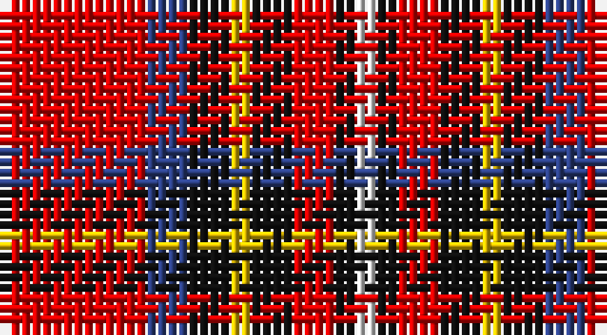

This page is one **sett** — a single exact thread-count. It belongs to the [tartan](/setts/r7db2k2ly1k2r2k1w1/)
(the same proportion at any scale), whose colour order is pattern [RBKYKRKW](/stripes/rbkykrkw/).

Part of the [Royal Stewart](/tartans/royal-stewart/) tartan — the named design grouping this sett with its other cloths.

Sourced from register-of-tartans.  It is a [8 stripe tartan](/stripes/stripes8/).

Original link https://www.tartanregister.gov.uk/tartanDetails.aspx?ref=3612

## Also known as

This cloth is also recorded under:

- Royal Stewart,
- Royal Stuart/Stewart
- Stewart/Stuart, Royal

2 attestations — the source records this cloth was collapsed from (oldest owns this page)

<ul>
<li>undated — Royal Stuart/Stewart (register-of-tartans, <a href="https://www.tartanregister.gov.uk/tartanDetails.aspx?ref=3612">record</a>)</li>
<li>undated — Royal Stewart (weddslist, <a href="http://www.weddslist.com/cgi-bin/tartans/pg.pl?source=sts">record</a>)</li>
</ul>

## Register references

External register numbers recorded for this tartan.

- Scottish Register of Tartans: [3612](https://www.tartanregister.gov.uk/tartanDetails.aspx?ref=3612)
- Scottish Tartans World Register: 1369

## Thread count
R/14 B4 K4 Y2 K4 R4 K2 LN/2

One full sett is **56 threads**.

## Palette

Palette: <strong>Tartan Register</strong>
<table><thead><tr><th>Colour</th><th>Threads</th><th>Shade</th><th>Base</th><th>OKLCh</th></tr></thead><tbody><tr><td>R/</td><td style="text-align:right;font-variant-numeric:tabular-nums">14</td><td><code style="background-color:#DC0000;">#DC0000</code> <small style="color:#888">#DC0000</small></td><td>R <code style="background-color:#CC0000;">#CC0000</code></td><td><small style="color:#888">oklch(56.2% 0.230 29.2)</small></td></tr><tr><td>B</td><td style="text-align:right;font-variant-numeric:tabular-nums">4</td><td><code style="background-color:#2C4084;">#2C4084</code> <small style="color:#888">#2C4084</small></td><td>B <code style="background-color:#2A418A;">#2A418A</code></td><td><small style="color:#888">oklch(39.4% 0.117 268.3)</small></td></tr><tr><td>K</td><td style="text-align:right;font-variant-numeric:tabular-nums">4</td><td><code style="background-color:#101010;">#101010</code> <small style="color:#888">#101010</small></td><td>K <code style="background-color:#000000;">#000000</code></td><td><small style="color:#888">oklch(17.3% 0.000 89.9)</small></td></tr><tr><td>Y</td><td style="text-align:right;font-variant-numeric:tabular-nums">2</td><td><code style="background-color:#E8C000;">#E8C000</code> <small style="color:#888">#E8C000</small></td><td>Y <code style="background-color:#F2BF00;">#F2BF00</code></td><td><small style="color:#888">oklch(81.9% 0.168 93.7)</small></td></tr><tr><td>K</td><td style="text-align:right;font-variant-numeric:tabular-nums">4</td><td><code style="background-color:#101010;">#101010</code> <small style="color:#888">#101010</small></td><td>K <code style="background-color:#000000;">#000000</code></td><td><small style="color:#888">oklch(17.3% 0.000 89.9)</small></td></tr><tr><td>R</td><td style="text-align:right;font-variant-numeric:tabular-nums">4</td><td><code style="background-color:#DC0000;">#DC0000</code> <small style="color:#888">#DC0000</small></td><td>R <code style="background-color:#CC0000;">#CC0000</code></td><td><small style="color:#888">oklch(56.2% 0.230 29.2)</small></td></tr><tr><td>K</td><td style="text-align:right;font-variant-numeric:tabular-nums">2</td><td><code style="background-color:#101010;">#101010</code> <small style="color:#888">#101010</small></td><td>K <code style="background-color:#000000;">#000000</code></td><td><small style="color:#888">oklch(17.3% 0.000 89.9)</small></td></tr><tr><td>LN/</td><td style="text-align:right;font-variant-numeric:tabular-nums">2</td><td><code style="background-color:#E0E0E0;">#E0E0E0</code> <small style="color:#888">#E0E0E0</small></td><td>W <code style="background-color:#F7F7F7;">#F7F7F7</code></td><td><small style="color:#888">oklch(90.7% 0.000 89.9)</small></td></tr></tbody></table>

# Sample pattern

## Nearest tartans

The nearest existing variants by ΔTartan distance, with this tartan at the top so the swatches line up against it.

ΔTartan

Tartan

Sett

—

<a href="/ttd/edit/#slug=r7db2k2ly1k2r2k1w1~x2">Royal Stuart/Stewart</a> <a class="nn-out" href="/variants/s8/r7db2k2ly1k2r2k1w1~x2/" title="open its dictionary page">↗</a>

0.74

<a href="/ttd/edit/#slug=r20k5g5r5w5n3g3~x4&amp;base=r7db2k2ly1k2r2k1w1~x2">Mangles, Peter and Annette (Personal)</a> <a class="nn-out" href="/variants/s7/r20k5g5r5w5n3g3~x4/" title="open its dictionary page">↗</a>

0.83

<a href="/ttd/edit/#slug=k4w2db8w3r16k2r5ly2r5w2~x2&amp;base=r7db2k2ly1k2r2k1w1~x2">Blaylock</a> <a class="nn-out" href="/variants/s10/k4w2db8w3r16k2r5ly2r5w2~x2/" title="open its dictionary page">↗</a>

0.84

<a href="/ttd/edit/#slug=r20k5dg5r5w5o3dg3~x4&amp;base=r7db2k2ly1k2r2k1w1~x2">Mangles, Peter and Annette (Personal</a> <a class="nn-out" href="/variants/s7/r20k5dg5r5w5o3dg3~x4/" title="open its dictionary page">↗</a>

0.97

<a href="/ttd/edit/#slug=w15g8k12g14r64k12r16k10ly8k14&amp;base=r7db2k2ly1k2r2k1w1~x2">Carlow County Crest (Fashion)</a> <a class="nn-out" href="/variants/s10/w15g8k12g14r64k12r16k10ly8k14/" title="open its dictionary page">↗</a>

1.01

<a href="/ttd/edit/#slug=k23r27db3r5w3k14ly6~x2&amp;base=r7db2k2ly1k2r2k1w1~x2">Hoffman Texas German</a> <a class="nn-out" href="/variants/s7/k23r27db3r5w3k14ly6~x2/" title="open its dictionary page">↗</a>

1.01

<a href="/ttd/edit/#slug=r20k5g5r5w5lr3g3~x4&amp;base=r7db2k2ly1k2r2k1w1~x2">Mangles, Peter and Annette Family/Personal Tartan</a> <a class="nn-out" href="/variants/s7/r20k5g5r5w5lr3g3~x4/" title="open its dictionary page">↗</a>

1.13

<a href="/ttd/edit/#slug=r24ri5lr7dt2lr4dt14r11dt3r3w4~x2&amp;base=r7db2k2ly1k2r2k1w1~x2">MIT1951</a> <a class="nn-out" href="/variants/s10/r24ri5lr7dt2lr4dt14r11dt3r3w4~x2/" title="open its dictionary page">↗</a>

1.15

<a href="/ttd/edit/#slug=lo7k3db4k3r21k2r4k2w4~x2&amp;base=r7db2k2ly1k2r2k1w1~x2">Castle Stewart (District)</a> <a class="nn-out" href="/variants/s9/lo7k3db4k3r21k2r4k2w4~x2/" title="open its dictionary page">↗</a>

1.20

<a href="/ttd/edit/#slug=k1r7k2r1k2do1g3ly1~x4&amp;base=r7db2k2ly1k2r2k1w1~x2">Craigmoor (Fashion)</a> <a class="nn-out" href="/variants/s8/k1r7k2r1k2do1g3ly1~x4/" title="open its dictionary page">↗</a>

1.21

<a href="/ttd/edit/#slug=k6r20w2ri9w3lb2~x2&amp;base=r7db2k2ly1k2r2k1w1~x2">Thermos Un-named (aretefact)</a> <a class="nn-out" href="/variants/s6/k6r20w2ri9w3lb2~x2/" title="open its dictionary page">↗</a>

## Neighbour map

Every grey dot is one of 14360 variants placed by the first two principal components of the ΔTartan feature space (44% of its variance). Red is this tartan; blue dots are its nearest — click one to open its page.

<svg viewBox="0 0 640 380" role="img" style="max-width:100%;height:auto;border:1px solid #e0e0e0;border-radius:4px;display:block" xmlns="http://www.w3.org/2000/svg"><image href="/nn/cloud.v1.png" width="640" height="380"/><a href="/variants/s7/r20k5g5r5w5n3g3~x4/"><circle cx="221.3" cy="171.3" r="4" fill="#3465a4"><title>Mangles, Peter and Annette (Personal)</title></circle></a><a href="/variants/s10/k4w2db8w3r16k2r5ly2r5w2~x2/"><circle cx="210.9" cy="147.5" r="4" fill="#3465a4"><title>Blaylock</title></circle></a><a href="/variants/s7/r20k5dg5r5w5o3dg3~x4/"><circle cx="229.8" cy="176.1" r="4" fill="#3465a4"><title>Mangles, Peter and Annette (Personal</title></circle></a><a href="/variants/s10/w15g8k12g14r64k12r16k10ly8k14/"><circle cx="189.0" cy="150.9" r="4" fill="#3465a4"><title>Carlow County Crest (Fashion)</title></circle></a><a href="/variants/s7/k23r27db3r5w3k14ly6~x2/"><circle cx="206.5" cy="174.1" r="4" fill="#3465a4"><title>Hoffman Texas German</title></circle></a><a href="/variants/s7/r20k5g5r5w5lr3g3~x4/"><circle cx="226.6" cy="172.3" r="4" fill="#3465a4"><title>Mangles, Peter and Annette Family/Personal Tartan</title></circle></a><a href="/variants/s10/r24ri5lr7dt2lr4dt14r11dt3r3w4~x2/"><circle cx="231.1" cy="143.7" r="4" fill="#3465a4"><title>MIT1951</title></circle></a><a href="/variants/s9/lo7k3db4k3r21k2r4k2w4~x2/"><circle cx="237.5" cy="146.6" r="4" fill="#3465a4"><title>Castle Stewart (District)</title></circle></a><a href="/variants/s8/k1r7k2r1k2do1g3ly1~x4/"><circle cx="190.7" cy="179.8" r="4" fill="#3465a4"><title>Craigmoor (Fashion)</title></circle></a><a href="/variants/s6/k6r20w2ri9w3lb2~x2/"><circle cx="225.6" cy="163.0" r="4" fill="#3465a4"><title>Thermos Un-named (aretefact)</title></circle></a><circle cx="207.3" cy="169.5" r="5" fill="#c00000"/></svg>

ID: /variants/s8/r7db2k2ly1k2r2k1w1~x2/
