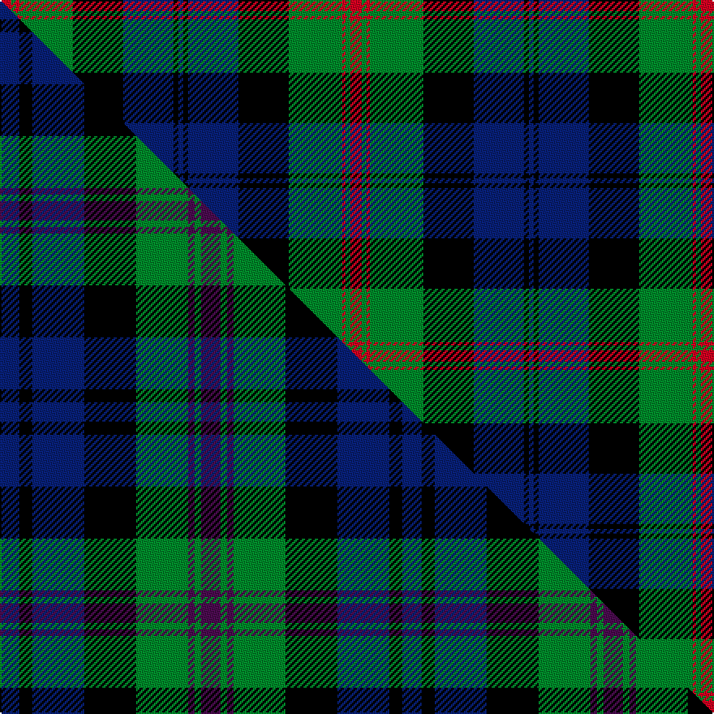

This page is one **sett** — a single exact thread-count. It belongs to the [tartan](/setts/r7g3r2g33k31db31k3db3/)
(the same proportion at any scale), whose colour order is pattern [BKBKGRGR](/stripes/bkbkgrgr/).

Part of the [Baird](/tartans/baird/) tartan — the named design grouping this sett with its other cloths.

Sourced from register-of-tartans.  It is a [8 stripe tartan](/stripes/stripes8/).

Original link https://www.tartanregister.gov.uk/tartanDetails.aspx?ref=169

## Provenance

Earliest known date: c.1906 This tartan is first recorded in Johnston's work of 1906, and the sample from the Highland Society of London probably dates from the same period. In both these early references the triple stripes are rendered in red. Today, however, they are generally woven in purple. The name originates from 'bard' meaning poet. The Bairds owned estates in Aberdeenshire which were later purchased by the Gordons.

3 attestations — the source records this cloth was collapsed from (oldest owns this page)

<ul>
<li>undated — Baird (register-of-tartans, <a href="https://www.tartanregister.gov.uk/tartanDetails.aspx?ref=169">record</a>)  <em>This tartan is first recorded in Johnston's work of 1906, and the sample from the Highland Society of London probably dates from the same period. In both these early references the triple stripes are rendered in red. Today, however, they are generally woven in purple. The name originates from 'bard' meaning poet. The Bairds owned estates in Aberdeenshire which were later purchased by the Gordons.</em></li>
<li>undated — Baird (weddslist, <a href="http://www.weddslist.com/cgi-bin/tartans/pg.pl?source=sts">record</a>) </li>
<li>undated — Baird (Old) Clan Tartan (house-of-tartan, <a href="http://www.house-of-tartan.scotland.net/house/TartanViewjs.asp?colr=Def&tnam=273">record</a>) </li>
</ul>

## Register references

External register numbers recorded for this tartan.

- Scottish Register of Tartans: [169](https://www.tartanregister.gov.uk/tartanDetails.aspx?ref=169)
- Scottish Tartans World Register: 273

## Thread count
R/7 G3 R2 G33 K31 DB31 K3 DB/3

One full sett is **216 threads**.

## Palette
<table><thead><tr><th>Colour</th><th>Shade</th><th>OKLCh</th></tr></thead><tbody><tr><td>DB</td><td><code style="background-color:#082077;">#082077</code> <small style="color:#888">#082077</small></td><td><small style="color:#888">oklch(30.0% 0.149 265.1)</small></td></tr><tr><td>R</td><td><code style="background-color:#D60020;">#D60020</code> <small style="color:#888">#D60020</small></td><td><small style="color:#888">oklch(55.2% 0.224 25.5)</small></td></tr><tr><td>G</td><td><code style="background-color:#008B2A;">#008B2A</code> <small style="color:#888">#008B2A</small></td><td><small style="color:#888">oklch(55.4% 0.170 145.9)</small></td></tr><tr><td>K</td><td><code style="background-color:#000000;">#000000</code> <small style="color:#888">#000000</small></td><td><small style="color:#888">oklch(0.0% 0.000 0.0)</small></td></tr></tbody></table>

# Sample pattern

## Compared to the master

This cloth is one sett of its design; the master sett (the exemplar the design is anchored on) is below for comparison.

Its **ΔTartan distance** from the master is **1.57** — the same measure the nearest-tartans table ranks by (0 is identical; a re-scale of the same cloth is near 0, a recolour or a different proportion further).

<figure class="master-compare" style="margin:0">

this sett
master sett ★

<figcaption style="color:#888;font-size:smaller">One weave of this sett against the <a href="/setts/db3k2db8k8g8dp1g1dp3/">master sett ★</a>, split on the diagonal: a shared proportion runs seamlessly across it with only the shades shifting; a different proportion breaks on it.</figcaption>
</figure>

## Nearest variants

The nearest existing variants by ΔTartan distance, with this cloth at the top so the swatches line up against it.

ΔTartan

Threads

Variant

Sett

—

216

<a href="/variants/s8/r7g3r2g33k31db31k3db3/">Baird</a>

<a href="/ttd/edit/#slug=db4k3db12k11dg13g1dg1g3~x2~dg1806142-g2408144&amp;base=r7g3r2g33k31db31k3db3" title="compare in the TTD">0.96</a>

178

<a href="/variants/s8/db4k3db12k11dg13g1dg1g3~x2~dg1806142-g2408144/">Bedford High School</a>

<a href="/ttd/edit/#slug=db4r1db18k20g18r1g4~x2&amp;base=r7g3r2g33k31db31k3db3" title="compare in the TTD">1.56</a>

248

<a href="/variants/s7/db4r1db18k20g18r1g4~x2/">Blair (Name)</a>

<a href="/ttd/edit/#slug=dg4r1dg18k20db18r1db4~x2~dg1806142-r2109032-db1406275&amp;base=r7g3r2g33k31db31k3db3" title="compare in the TTD">1.56</a>

248

<a href="/variants/s7/dg4r1dg18k20db18r1db4~x2~dg1806142-r2109032-db1406275/">Blair</a>

<a href="/ttd/edit/#slug=db4k3db18k18g18db1g2w4~x2&amp;base=r7g3r2g33k31db31k3db3" title="compare in the TTD">1.56</a>

256

<a href="/variants/s8/db4k3db18k18g18db1g2w4~x2/">Dress Watch</a>

<a href="/ttd/edit/#slug=k4db16k12g12r1g2k2~x2&amp;base=r7g3r2g33k31db31k3db3" title="compare in the TTD">1.71</a>

184

<a href="/variants/s7/k4db16k12g12r1g2k2~x2/">Dundas #2</a>

<a href="/ttd/edit/#slug=db2g1db16r1k12g16r1g2~x2&amp;base=r7g3r2g33k31db31k3db3" title="compare in the TTD">1.95</a>

196

<a href="/variants/s8/db2g1db16r1k12g16r1g2~x2/">Lochaber District</a>

<a href="/ttd/edit/#slug=r2g10k12db1k2db14k1db1g2~x2&amp;base=r7g3r2g33k31db31k3db3" title="compare in the TTD">1.99</a>

172

<a href="/variants/s9/r2g10k12db1k2db14k1db1g2~x2/">McWilliams Wedding (Personal)</a>

<a href="/ttd/edit/#slug=db2r2db21k11g21r2g2~x2&amp;base=r7g3r2g33k31db31k3db3" title="compare in the TTD">2.11</a>

236

<a href="/variants/s7/db2r2db21k11g21r2g2~x2/">MacThomas</a>

<a href="/ttd/edit/#slug=db3r2db21k11g21r2g3~x2&amp;base=r7g3r2g33k31db31k3db3" title="compare in the TTD">2.12</a>

240

<a href="/variants/s7/db3r2db21k11g21r2g3~x2/">MacThomas</a>

<a href="/ttd/edit/#slug=db3r2db21k11g21r2g3&amp;base=r7g3r2g33k31db31k3db3" title="compare in the TTD">2.12</a>

120

<a href="/variants/s7/db3r2db21k11g21r2g3/">MacThomas</a>

## Neighbour map

Every grey dot is one of 13620 variants placed by the first two principal components of the ΔTartan feature space (42% of its variance). Red is this tartan; blue dots are its nearest — click one to open its page.

<svg viewBox="0 0 640 380" role="img" style="max-width:100%;height:auto;border:1px solid #e0e0e0;border-radius:4px;display:block" xmlns="http://www.w3.org/2000/svg"><image href="/nn/cloud.v1.png" width="640" height="380"/><a href="/variants/s8/db4k3db12k11dg13g1dg1g3~x2~dg1806142-g2408144/"><circle cx="161.3" cy="187.7" r="4" fill="#3465a4"><title>Bedford High School</title></circle></a><a href="/variants/s7/db4r1db18k20g18r1g4~x2/"><circle cx="176.7" cy="165.9" r="4" fill="#3465a4"><title>Blair (Name)</title></circle></a><a href="/variants/s7/dg4r1dg18k20db18r1db4~x2~dg1806142-r2109032-db1406275/"><circle cx="196.4" cy="170.2" r="4" fill="#3465a4"><title>Blair</title></circle></a><a href="/variants/s8/db4k3db18k18g18db1g2w4~x2/"><circle cx="156.9" cy="160.8" r="4" fill="#3465a4"><title>Dress Watch</title></circle></a><a href="/variants/s7/k4db16k12g12r1g2k2~x2/"><circle cx="174.3" cy="172.6" r="4" fill="#3465a4"><title>Dundas #2</title></circle></a><a href="/variants/s8/db2g1db16r1k12g16r1g2~x2/"><circle cx="189.3" cy="154.9" r="4" fill="#3465a4"><title>Lochaber District</title></circle></a><a href="/variants/s9/r2g10k12db1k2db14k1db1g2~x2/"><circle cx="152.1" cy="143.0" r="4" fill="#3465a4"><title>McWilliams Wedding (Personal)</title></circle></a><a href="/variants/s7/db2r2db21k11g21r2g2~x2/"><circle cx="182.4" cy="182.5" r="4" fill="#3465a4"><title>MacThomas</title></circle></a><a href="/variants/s7/db3r2db21k11g21r2g3~x2/"><circle cx="181.8" cy="187.0" r="4" fill="#3465a4"><title>MacThomas</title></circle></a><a href="/variants/s7/db3r2db21k11g21r2g3/"><circle cx="181.8" cy="187.0" r="4" fill="#3465a4"><title>MacThomas</title></circle></a><circle cx="159.1" cy="157.5" r="5" fill="#c00000"/><text x="320" y="376" text-anchor="middle" font-size="11" fill="#999">ground</text><text x="11" y="190" text-anchor="middle" font-size="11" fill="#999" transform="rotate(-90 11 190)">complexity</text></svg>

ID: /variants/s8/r7g3r2g33k31db31k3db3/
