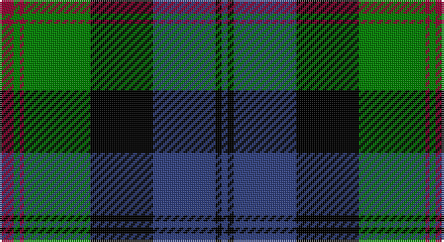

This page is one **sett** — a single exact thread-count. It belongs to the [tartan](/setts/r7g3r2g33k31db31k3db3/)
(the same proportion at any scale), whose colour order is pattern [BKBKGRGR](/stripes/bkbkgrgr/).

Part of the [Baird](/tartans/baird/) tartan — the named design grouping this sett with its other cloths.

Sourced from weddslist.  It is a [8 stripe tartan](/stripes/stripes8/).

Original link http://www.weddslist.com/cgi-bin/tartans/pg.pl?source=sts

## Thread count
DR/7 G3 DR2 G33 K31 B31 K3 B/3

One full sett is **216 threads**.

## Palette

Palette: <strong>Ingles Buchan</strong> <small style="color:#888">(1 of 4 colours)</small>
<table><thead><tr><th>Colour</th><th>Threads</th><th>Shade</th><th>Base</th><th>OKLCh</th></tr></thead><tbody><tr><td>DR/</td><td style="text-align:right;font-variant-numeric:tabular-nums">7</td><td><code style="background-color:#900030;">#900030</code> <small style="color:#888">#900030</small></td><td>R <code style="background-color:#CC0000;">#CC0000</code></td><td><small style="color:#888">oklch(41.6% 0.166 13.6)</small></td></tr><tr><td>G</td><td style="text-align:right;font-variant-numeric:tabular-nums">3</td><td><code style="background-color:#008000;">#008000</code> <small style="color:#888">#008000</small></td><td>G <code style="background-color:#006100;">#006100</code></td><td><small style="color:#888">oklch(52.0% 0.177 142.5)</small></td></tr><tr><td>DR</td><td style="text-align:right;font-variant-numeric:tabular-nums">2</td><td><code style="background-color:#900030;">#900030</code> <small style="color:#888">#900030</small></td><td>R <code style="background-color:#CC0000;">#CC0000</code></td><td><small style="color:#888">oklch(41.6% 0.166 13.6)</small></td></tr><tr><td>G</td><td style="text-align:right;font-variant-numeric:tabular-nums">33</td><td><code style="background-color:#008000;">#008000</code> <small style="color:#888">#008000</small></td><td>G <code style="background-color:#006100;">#006100</code></td><td><small style="color:#888">oklch(52.0% 0.177 142.5)</small></td></tr><tr><td>K</td><td style="text-align:right;font-variant-numeric:tabular-nums">31</td><td><code style="background-color:#000000;">#000000</code> <small style="color:#888">#000000</small></td><td>K <code style="background-color:#000000;">#000000</code></td><td><small style="color:#888">oklch(0.0% 0.000 0.0)</small></td></tr><tr><td>B</td><td style="text-align:right;font-variant-numeric:tabular-nums">31</td><td><code style="background-color:#304080;">#304080</code> <small style="color:#888">#304080</small></td><td>B <code style="background-color:#2A418A;">#2A418A</code></td><td><small style="color:#888">oklch(39.4% 0.109 270.2)</small></td></tr><tr><td>K</td><td style="text-align:right;font-variant-numeric:tabular-nums">3</td><td><code style="background-color:#000000;">#000000</code> <small style="color:#888">#000000</small></td><td>K <code style="background-color:#000000;">#000000</code></td><td><small style="color:#888">oklch(0.0% 0.000 0.0)</small></td></tr><tr><td>B/</td><td style="text-align:right;font-variant-numeric:tabular-nums">3</td><td><code style="background-color:#304080;">#304080</code> <small style="color:#888">#304080</small></td><td>B <code style="background-color:#2A418A;">#2A418A</code></td><td><small style="color:#888">oklch(39.4% 0.109 270.2)</small></td></tr></tbody></table>

# Sample pattern

## Compared to the master

This cloth is one sett of its design; the master sett (the exemplar the design is anchored on) is below for comparison.

<figure style="margin:0"><figcaption style="color:#888;font-size:smaller">this sett</figcaption></figure>
<figure style="margin:0"><figcaption style="color:#888;font-size:smaller"><a href="/setts/db3k2db8k8g8dp1g1dp3/">master sett →</a></figcaption></figure>

## Nearest tartans

The nearest existing variants by ΔTartan distance, with this tartan at the top so the swatches line up against it.

ΔTartan

Tartan

Sett

—

<a href="/ttd/edit/#slug=r7g3r2g33k31db31k3db3">Baird</a> <a class="nn-out" href="/variants/s8/r7g3r2g33k31db31k3db3/" title="open its dictionary page">↗</a>

0.78

<a href="/ttd/edit/#slug=db56k6db6k6db6k44g44ly4g5ly8&amp;base=r7g3r2g33k31db31k3db3">Gordon 3</a> <a class="nn-out" href="/variants/s10/db56k6db6k6db6k44g44ly4g5ly8/" title="open its dictionary page">↗</a>

0.83

<a href="/ttd/edit/#slug=db4r1db18k20g18r1g4~x2&amp;base=r7g3r2g33k31db31k3db3">Blair</a> <a class="nn-out" href="/variants/s7/db4r1db18k20g18r1g4~x2/" title="open its dictionary page">↗</a>

0.89

<a href="/ttd/edit/#slug=k2db3g16b1k13b1db18k2db2~x2&amp;base=r7g3r2g33k31db31k3db3">Hebridean Old</a> <a class="nn-out" href="/variants/s9/k2db3g16b1k13b1db18k2db2~x2/" title="open its dictionary page">↗</a>

0.89

<a href="/ttd/edit/#slug=r3g16k12db34k12g2k2g2k2g7r3~x2&amp;base=r7g3r2g33k31db31k3db3">Rangers F.C.</a> <a class="nn-out" href="/variants/s11/r3g16k12db34k12g2k2g2k2g7r3~x2/" title="open its dictionary page">↗</a>

0.93

<a href="/ttd/edit/#slug=db4k3db18k18g18db1g2w4~x2&amp;base=r7g3r2g33k31db31k3db3">Dress Watch</a> <a class="nn-out" href="/variants/s8/db4k3db18k18g18db1g2w4~x2/" title="open its dictionary page">↗</a>

0.94

<a href="/ttd/edit/#slug=db17r2db2r6db32r2k34g32r6g2r2g17~x2&amp;base=r7g3r2g33k31db31k3db3">MacDonald 4</a> <a class="nn-out" href="/variants/s12/db17r2db2r6db32r2k34g32r6g2r2g17~x2/" title="open its dictionary page">↗</a>

0.94

<a href="/ttd/edit/#slug=db16r2db2r5db29r2k31g29r5g2r2g16~x2&amp;base=r7g3r2g33k31db31k3db3">MacDonald 5</a> <a class="nn-out" href="/variants/s12/db16r2db2r5db29r2k31g29r5g2r2g16~x2/" title="open its dictionary page">↗</a>

0.96

<a href="/ttd/edit/#slug=r3k2db25k28g25k2r1db2~x2&amp;base=r7g3r2g33k31db31k3db3">Common Kilt</a> <a class="nn-out" href="/variants/s8/r3k2db25k28g25k2r1db2~x2/" title="open its dictionary page">↗</a>

0.96

<a href="/ttd/edit/#slug=db12r2db2r5db26r2k29g27r5g2r2g12~x2&amp;base=r7g3r2g33k31db31k3db3">MacDonald 3</a> <a class="nn-out" href="/variants/s12/db12r2db2r5db26r2k29g27r5g2r2g12~x2/" title="open its dictionary page">↗</a>

0.97

<a href="/ttd/edit/#slug=g2r1g16k12r1t16g1t2~x2&amp;base=r7g3r2g33k31db31k3db3">Lochaber District</a> <a class="nn-out" href="/variants/s8/g2r1g16k12r1t16g1t2~x2/" title="open its dictionary page">↗</a>

## Neighbour map

Every grey dot is one of 14360 variants placed by the first two principal components of the ΔTartan feature space (44% of its variance). Red is this tartan; blue dots are its nearest — click one to open its page.

<svg viewBox="0 0 640 380" role="img" style="max-width:100%;height:auto;border:1px solid #e0e0e0;border-radius:4px;display:block" xmlns="http://www.w3.org/2000/svg"><image href="/nn/cloud.v1.png" width="640" height="380"/><a href="/variants/s10/db56k6db6k6db6k44g44ly4g5ly8/"><circle cx="185.4" cy="157.3" r="4" fill="#3465a4"><title>Gordon 3</title></circle></a><a href="/variants/s7/db4r1db18k20g18r1g4~x2/"><circle cx="205.3" cy="185.8" r="4" fill="#3465a4"><title>Blair</title></circle></a><a href="/variants/s9/k2db3g16b1k13b1db18k2db2~x2/"><circle cx="220.3" cy="161.2" r="4" fill="#3465a4"><title>Hebridean Old</title></circle></a><a href="/variants/s11/r3g16k12db34k12g2k2g2k2g7r3~x2/"><circle cx="187.4" cy="142.3" r="4" fill="#3465a4"><title>Rangers F.C.</title></circle></a><a href="/variants/s8/db4k3db18k18g18db1g2w4~x2/"><circle cx="197.2" cy="181.0" r="4" fill="#3465a4"><title>Dress Watch</title></circle></a><a href="/variants/s12/db17r2db2r6db32r2k34g32r6g2r2g17~x2/"><circle cx="174.7" cy="148.6" r="4" fill="#3465a4"><title>MacDonald 4</title></circle></a><a href="/variants/s12/db16r2db2r5db29r2k31g29r5g2r2g16~x2/"><circle cx="172.1" cy="152.6" r="4" fill="#3465a4"><title>MacDonald 5</title></circle></a><a href="/variants/s8/r3k2db25k28g25k2r1db2~x2/"><circle cx="224.6" cy="146.7" r="4" fill="#3465a4"><title>Common Kilt</title></circle></a><a href="/variants/s12/db12r2db2r5db26r2k29g27r5g2r2g12~x2/"><circle cx="164.5" cy="153.0" r="4" fill="#3465a4"><title>MacDonald 3</title></circle></a><a href="/variants/s8/g2r1g16k12r1t16g1t2~x2/"><circle cx="208.8" cy="167.4" r="4" fill="#3465a4"><title>Lochaber District</title></circle></a><circle cx="179.0" cy="170.9" r="5" fill="#c00000"/></svg>

ID: /variants/s8/r7g3r2g33k31db31k3db3/
