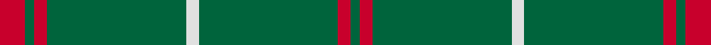
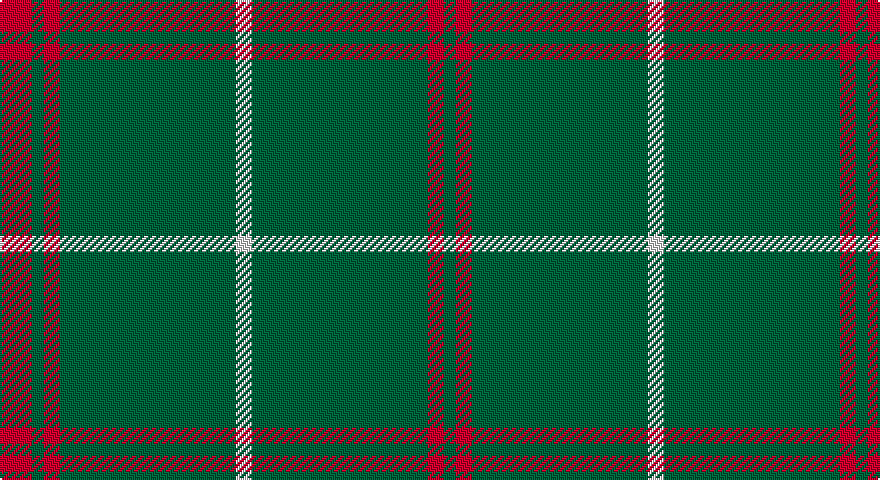

This page is one **sett** — a single exact thread-count. It belongs to the [tartan](/setts/r8g3r4g44w4/)
(the same proportion at any scale), whose colour order is pattern [GRGWGRGR](/stripes/grgwgrgr/).

Part of the [Welsh National](/tartans/welsh-national/) tartan — the named design grouping this sett with its other cloths.

Sourced from register-of-tartans.  It is a [8 stripe tartan](/stripes/stripes8/).

Original link https://www.tartanregister.gov.uk/tartanDetails.aspx?ref=4597

## Also known as

This cloth is also recorded under:

- Welsh National #2
- Welsh National #3
- Welsh, National

## Register references

External register numbers recorded for this tartan.

- Scottish Register of Tartans: [4597](https://www.tartanregister.gov.uk/tartanDetails.aspx?ref=4597)
- Scottish Tartans Authority (ITI): 1523
- Scottish Tartans World Register: 1523

## Thread count
R/16 G6 R8 G88 LN8 G88 R8 G/6

One full sett is **434 threads**.

## Palette

Palette: <strong>Tartan Register</strong>
<table><thead><tr><th>Colour</th><th>Threads</th><th>Shade</th><th>Base</th><th>OKLCh</th></tr></thead><tbody><tr><td>R/</td><td style="text-align:right;font-variant-numeric:tabular-nums">16</td><td><code style="background-color:#C8002C;">#C8002C</code> <small style="color:#888">#C8002C</small></td><td>R <code style="background-color:#CC0000;">#CC0000</code></td><td><small style="color:#888">oklch(52.6% 0.212 22.0)</small></td></tr><tr><td>G</td><td style="text-align:right;font-variant-numeric:tabular-nums">6</td><td><code style="background-color:#00643C;">#00643C</code> <small style="color:#888">#00643C</small></td><td>G <code style="background-color:#006100;">#006100</code></td><td><small style="color:#888">oklch(44.3% 0.104 157.7)</small></td></tr><tr><td>R</td><td style="text-align:right;font-variant-numeric:tabular-nums">8</td><td><code style="background-color:#C8002C;">#C8002C</code> <small style="color:#888">#C8002C</small></td><td>R <code style="background-color:#CC0000;">#CC0000</code></td><td><small style="color:#888">oklch(52.6% 0.212 22.0)</small></td></tr><tr><td>G</td><td style="text-align:right;font-variant-numeric:tabular-nums">88</td><td><code style="background-color:#00643C;">#00643C</code> <small style="color:#888">#00643C</small></td><td>G <code style="background-color:#006100;">#006100</code></td><td><small style="color:#888">oklch(44.3% 0.104 157.7)</small></td></tr><tr><td>LN</td><td style="text-align:right;font-variant-numeric:tabular-nums">8</td><td><code style="background-color:#E0E0E0;">#E0E0E0</code> <small style="color:#888">#E0E0E0</small></td><td>W <code style="background-color:#F7F7F7;">#F7F7F7</code></td><td><small style="color:#888">oklch(90.7% 0.000 89.9)</small></td></tr><tr><td>G</td><td style="text-align:right;font-variant-numeric:tabular-nums">88</td><td><code style="background-color:#00643C;">#00643C</code> <small style="color:#888">#00643C</small></td><td>G <code style="background-color:#006100;">#006100</code></td><td><small style="color:#888">oklch(44.3% 0.104 157.7)</small></td></tr><tr><td>R</td><td style="text-align:right;font-variant-numeric:tabular-nums">8</td><td><code style="background-color:#C8002C;">#C8002C</code> <small style="color:#888">#C8002C</small></td><td>R <code style="background-color:#CC0000;">#CC0000</code></td><td><small style="color:#888">oklch(52.6% 0.212 22.0)</small></td></tr><tr><td>G/</td><td style="text-align:right;font-variant-numeric:tabular-nums">6</td><td><code style="background-color:#00643C;">#00643C</code> <small style="color:#888">#00643C</small></td><td>G <code style="background-color:#006100;">#006100</code></td><td><small style="color:#888">oklch(44.3% 0.104 157.7)</small></td></tr></tbody></table>

# Sample pattern

## Compared to the master

This cloth is one sett of its design; the master sett (the exemplar the design is anchored on) is below for comparison.

<figure style="margin:0"><figcaption style="color:#888;font-size:smaller">this sett</figcaption></figure>
<figure style="margin:0"><figcaption style="color:#888;font-size:smaller"><a href="/setts/k4dy2r2dy2k2dy15lo2/">master sett →</a></figcaption></figure>

## Nearest tartans

The nearest existing variants by ΔTartan distance, with this tartan at the top so the swatches line up against it.

ΔTartan

Tartan

Sett

—

<a href="/ttd/edit/#slug=r8g3r4g44w4~x2">Welsh National</a> <a class="nn-out" href="/variants/s8/r8g3r4g44w4~x2/" title="open its dictionary page">↗</a>

1.32

<a href="/ttd/edit/#slug=g51dp3g5lo3g5dp5g5dp5g5lo3~x2&amp;base=r8g3r4g44w4~x2">Highland Hospice (Fashion)</a> <a class="nn-out" href="/variants/s10/g51dp3g5lo3g5dp5g5dp5g5lo3~x2/" title="open its dictionary page">↗</a>

1.72

<a href="/ttd/edit/#slug=r8g3r4g44w4~x2">Welsh National (District)</a> <a class="nn-out" href="/variants/s5/r8g3r4g44w4~x2/" title="open its dictionary page">↗</a>

1.76

<a href="/ttd/edit/#slug=g3r1g2db1g3r3g2r2g18r2~x2&amp;base=r8g3r4g44w4~x2">Owen (Welsh Name)</a> <a class="nn-out" href="/variants/s10/g3r1g2db1g3r3g2r2g18r2~x2/" title="open its dictionary page">↗</a>

1.80

<a href="/ttd/edit/#slug=g48r4g2r4g6r2g3r9~x2&amp;base=r8g3r4g44w4~x2">Menzies</a> <a class="nn-out" href="/variants/s8/g48r4g2r4g6r2g3r9~x2/" title="open its dictionary page">↗</a>

1.84

<a href="/ttd/edit/#slug=r3g12r1g2r2g2r1g12r3k1~x4&amp;base=r8g3r4g44w4~x2">Connell (Dalgliesh) (Personal)</a> <a class="nn-out" href="/variants/s10/r3g12r1g2r2g2r1g12r3k1~x4/" title="open its dictionary page">↗</a>

1.86

<a href="/ttd/edit/#slug=g23r3g7r3g23dp7~x2&amp;base=r8g3r4g44w4~x2">Highland Spring (1997)</a> <a class="nn-out" href="/variants/s6/g23r3g7r3g23dp7~x2/" title="open its dictionary page">↗</a>

1.90

<a href="/ttd/edit/#slug=r19g6r7g101k7g7&amp;base=r8g3r4g44w4~x2">Loch Laggan</a> <a class="nn-out" href="/variants/s6/r19g6r7g101k7g7/" title="open its dictionary page">↗</a>

1.90

<a href="/ttd/edit/#slug=dg48r4dg2r4dg6r2dg3r9&amp;base=r8g3r4g44w4~x2">Menzies Hunting</a> <a class="nn-out" href="/variants/s8/dg48r4dg2r4dg6r2dg3r9/" title="open its dictionary page">↗</a>

1.91

<a href="/ttd/edit/#slug=m2g1m1g10w1~x4&amp;base=r8g3r4g44w4~x2">Welsh National District Tartan</a> <a class="nn-out" href="/variants/s5/m2g1m1g10w1~x4/" title="open its dictionary page">↗</a>

1.92

<a href="/ttd/edit/#slug=r2k3g45k3ly2&amp;base=r8g3r4g44w4~x2">Mar Tribe</a> <a class="nn-out" href="/variants/s5/r2k3g45k3ly2/" title="open its dictionary page">↗</a>

## Neighbour map

Every grey dot is one of 14360 variants placed by the first two principal components of the ΔTartan feature space (44% of its variance). Red is this tartan; blue dots are its nearest — click one to open its page.

<svg viewBox="0 0 640 380" role="img" style="max-width:100%;height:auto;border:1px solid #e0e0e0;border-radius:4px;display:block" xmlns="http://www.w3.org/2000/svg"><image href="/nn/cloud.v1.png" width="640" height="380"/><a href="/variants/s10/g51dp3g5lo3g5dp5g5dp5g5lo3~x2/"><circle cx="558.6" cy="179.0" r="4" fill="#3465a4"><title>Highland Hospice (Fashion)</title></circle></a><a href="/variants/s5/r8g3r4g44w4~x2/"><circle cx="503.5" cy="208.4" r="4" fill="#3465a4"><title>Welsh National (District)</title></circle></a><a href="/variants/s10/g3r1g2db1g3r3g2r2g18r2~x2/"><circle cx="513.4" cy="169.9" r="4" fill="#3465a4"><title>Owen (Welsh Name)</title></circle></a><a href="/variants/s8/g48r4g2r4g6r2g3r9~x2/"><circle cx="583.5" cy="188.4" r="4" fill="#3465a4"><title>Menzies</title></circle></a><a href="/variants/s10/r3g12r1g2r2g2r1g12r3k1~x4/"><circle cx="474.2" cy="206.7" r="4" fill="#3465a4"><title>Connell (Dalgliesh) (Personal)</title></circle></a><a href="/variants/s6/g23r3g7r3g23dp7~x2/"><circle cx="515.0" cy="278.5" r="4" fill="#3465a4"><title>Highland Spring (1997)</title></circle></a><a href="/variants/s6/r19g6r7g101k7g7/"><circle cx="527.5" cy="189.4" r="4" fill="#3465a4"><title>Loch Laggan</title></circle></a><a href="/variants/s8/dg48r4dg2r4dg6r2dg3r9/"><circle cx="580.6" cy="187.4" r="4" fill="#3465a4"><title>Menzies Hunting</title></circle></a><a href="/variants/s5/m2g1m1g10w1~x4/"><circle cx="478.5" cy="228.8" r="4" fill="#3465a4"><title>Welsh National District Tartan</title></circle></a><a href="/variants/s5/r2k3g45k3ly2/"><circle cx="588.3" cy="184.8" r="4" fill="#3465a4"><title>Mar Tribe</title></circle></a><circle cx="575.0" cy="207.6" r="5" fill="#c00000"/></svg>

ID: /variants/s8/r8g3r4g44w4~x2/
