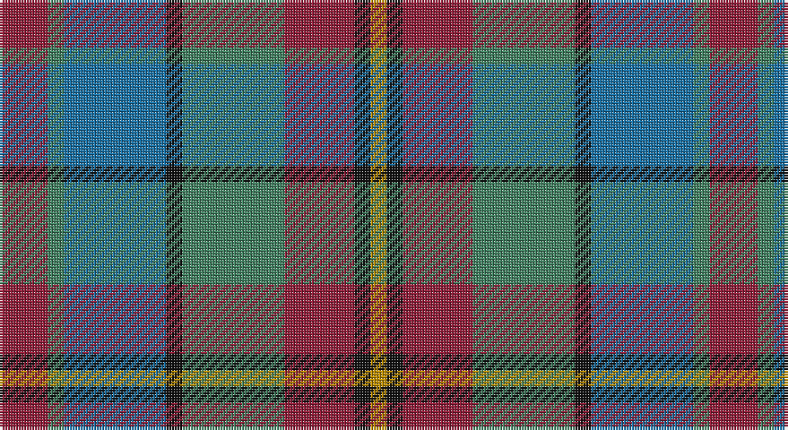

This page is one **sett** — a single exact thread-count. It belongs to the [tartan](/setts/r9g3b19k3g19r13k3lo3/)
(the same proportion at any scale), whose colour order is pattern [RGBKGRKY](/stripes/rgbkgrky/).

Part of the [Orkney](/tartans/orkney/) tartan — the named design grouping this sett with its other cloths.

Sourced from tartans-authority.  It is a [8 stripe tartan](/stripes/stripes8/).

Original link http://www.tartansauthority.com/tartan-ferret/display/2681/

## Register references

External register numbers recorded for this tartan.

- Scottish Tartans Authority (ITI): 2681

## Thread count
DR/18 G6 B38 K6 G38 DR26 K6 DY/6

One full sett is **264 threads**.

## Palette

Palette: <strong>Tartan Register</strong>
<table><thead><tr><th>Colour</th><th>Threads</th><th>Shade</th><th>Base</th><th>OKLCh</th></tr></thead><tbody><tr><td>DR/</td><td style="text-align:right;font-variant-numeric:tabular-nums">18</td><td><code style="background-color:#901C38;">#901C38</code> <small style="color:#888">#901C38</small></td><td>R <code style="background-color:#CC0000;">#CC0000</code></td><td><small style="color:#888">oklch(43.2% 0.150 13.1)</small></td></tr><tr><td>G</td><td style="text-align:right;font-variant-numeric:tabular-nums">6</td><td><code style="background-color:#408060;">#408060</code> <small style="color:#888">#408060</small></td><td>G <code style="background-color:#006100;">#006100</code></td><td><small style="color:#888">oklch(54.8% 0.084 160.1)</small></td></tr><tr><td>B</td><td style="text-align:right;font-variant-numeric:tabular-nums">38</td><td><code style="background-color:#1870A4;">#1870A4</code> <small style="color:#888">#1870A4</small></td><td>B <code style="background-color:#2A418A;">#2A418A</code></td><td><small style="color:#888">oklch(52.2% 0.113 241.2)</small></td></tr><tr><td>K</td><td style="text-align:right;font-variant-numeric:tabular-nums">6</td><td><code style="background-color:#101010;">#101010</code> <small style="color:#888">#101010</small></td><td>K <code style="background-color:#000000;">#000000</code></td><td><small style="color:#888">oklch(17.3% 0.000 89.9)</small></td></tr><tr><td>G</td><td style="text-align:right;font-variant-numeric:tabular-nums">38</td><td><code style="background-color:#408060;">#408060</code> <small style="color:#888">#408060</small></td><td>G <code style="background-color:#006100;">#006100</code></td><td><small style="color:#888">oklch(54.8% 0.084 160.1)</small></td></tr><tr><td>DR</td><td style="text-align:right;font-variant-numeric:tabular-nums">26</td><td><code style="background-color:#901C38;">#901C38</code> <small style="color:#888">#901C38</small></td><td>R <code style="background-color:#CC0000;">#CC0000</code></td><td><small style="color:#888">oklch(43.2% 0.150 13.1)</small></td></tr><tr><td>K</td><td style="text-align:right;font-variant-numeric:tabular-nums">6</td><td><code style="background-color:#101010;">#101010</code> <small style="color:#888">#101010</small></td><td>K <code style="background-color:#000000;">#000000</code></td><td><small style="color:#888">oklch(17.3% 0.000 89.9)</small></td></tr><tr><td>DY/</td><td style="text-align:right;font-variant-numeric:tabular-nums">6</td><td><code style="background-color:#BC8C00;">#BC8C00</code> <small style="color:#888">#BC8C00</small></td><td>Y <code style="background-color:#F2BF00;">#F2BF00</code></td><td><small style="color:#888">oklch(66.8% 0.137 84.1)</small></td></tr></tbody></table>

# Sample pattern

## Compared to the master

This cloth is one sett of its design; the master sett (the exemplar the design is anchored on) is below for comparison.

<figure style="margin:0"><figcaption style="color:#888;font-size:smaller">this sett</figcaption></figure>
<figure style="margin:0"><figcaption style="color:#888;font-size:smaller"><a href="/setts/k3r13g19k3b19g3r9g3b19k3g19r13k3lo3/">master sett →</a></figcaption></figure>

## Nearest tartans

The nearest existing variants by ΔTartan distance, with this tartan at the top so the swatches line up against it.

ΔTartan

Tartan

Sett

—

<a href="/ttd/edit/#slug=r9g3b19k3g19r13k3lo3~x2">Orkney (District?)</a> <a class="nn-out" href="/variants/s8/r9g3b19k3g19r13k3lo3~x2/" title="open its dictionary page">↗</a>

0.98

<a href="/ttd/edit/#slug=m6y2db12k2y12m9k2lo2~x2&amp;base=r9g3b19k3g19r13k3lo3~x2">Orkney</a> <a class="nn-out" href="/variants/s8/m6y2db12k2y12m9k2lo2~x2/" title="open its dictionary page">↗</a>

1.02

<a href="/ttd/edit/#slug=dt20b3dt4r3dt3k10g21k4r20~x2&amp;base=r9g3b19k3g19r13k3lo3~x2">Holland &amp; Sherry (Corporate)</a> <a class="nn-out" href="/variants/s9/dt20b3dt4r3dt3k10g21k4r20~x2/" title="open its dictionary page">↗</a>

1.10

<a href="/ttd/edit/#slug=m3g1t6k1g6m4k1lo1~x4&amp;base=r9g3b19k3g19r13k3lo3~x2">Orkney District Tartan</a> <a class="nn-out" href="/variants/s8/m3g1t6k1g6m4k1lo1~x4/" title="open its dictionary page">↗</a>

1.13

<a href="/ttd/edit/#slug=r5o20dt13db42dt13o20lo5&amp;base=r9g3b19k3g19r13k3lo3~x2">Newmill Corporate Tartan</a> <a class="nn-out" href="/variants/s7/r5o20dt13db42dt13o20lo5/" title="open its dictionary page">↗</a>

1.16

<a href="/ttd/edit/#slug=k2m15dy15g15r2g3ly2~x2&amp;base=r9g3b19k3g19r13k3lo3~x2">Crossbill</a> <a class="nn-out" href="/variants/s7/k2m15dy15g15r2g3ly2~x2/" title="open its dictionary page">↗</a>

1.19

<a href="/ttd/edit/#slug=k3r13g19k3b19g3r9g3b19k3g19r13k3lo3~x2&amp;base=r9g3b19k3g19r13k3lo3~x2">Orkney</a> <a class="nn-out" href="/variants/s14/k3r13g19k3b19g3r9g3b19k3g19r13k3lo3~x2/" title="open its dictionary page">↗</a>

1.21

<a href="/ttd/edit/#slug=dt23lo2r3db7r3lo2g15r21lo5~x2&amp;base=r9g3b19k3g19r13k3lo3~x2">Land's End Maroon</a> <a class="nn-out" href="/variants/s9/dt23lo2r3db7r3lo2g15r21lo5~x2/" title="open its dictionary page">↗</a>

1.23

<a href="/ttd/edit/#slug=k4m14b2y16m3k3m3b12y4~x2&amp;base=r9g3b19k3g19r13k3lo3~x2">Crook</a> <a class="nn-out" href="/variants/s9/k4m14b2y16m3k3m3b12y4~x2/" title="open its dictionary page">↗</a>

1.28

<a href="/ttd/edit/#slug=r1dy7db3g1o3g1db3g7w1~x4&amp;base=r9g3b19k3g19r13k3lo3~x2">Adamson (Personal)</a> <a class="nn-out" href="/variants/s9/r1dy7db3g1o3g1db3g7w1~x4/" title="open its dictionary page">↗</a>

1.29

<a href="/ttd/edit/#slug=r4g11k11g2n11y3~x4&amp;base=r9g3b19k3g19r13k3lo3~x2">Casely</a> <a class="nn-out" href="/variants/s6/r4g11k11g2n11y3~x4/" title="open its dictionary page">↗</a>

## Neighbour map

Every grey dot is one of 14360 variants placed by the first two principal components of the ΔTartan feature space (44% of its variance). Red is this tartan; blue dots are its nearest — click one to open its page.

<svg viewBox="0 0 640 380" role="img" style="max-width:100%;height:auto;border:1px solid #e0e0e0;border-radius:4px;display:block" xmlns="http://www.w3.org/2000/svg"><image href="/nn/cloud.v1.png" width="640" height="380"/><a href="/variants/s8/m6y2db12k2y12m9k2lo2~x2/"><circle cx="141.2" cy="218.7" r="4" fill="#3465a4"><title>Orkney</title></circle></a><a href="/variants/s9/dt20b3dt4r3dt3k10g21k4r20~x2/"><circle cx="157.4" cy="218.7" r="4" fill="#3465a4"><title>Holland &amp; Sherry (Corporate)</title></circle></a><a href="/variants/s8/m3g1t6k1g6m4k1lo1~x4/"><circle cx="117.7" cy="213.0" r="4" fill="#3465a4"><title>Orkney District Tartan</title></circle></a><a href="/variants/s7/r5o20dt13db42dt13o20lo5/"><circle cx="177.0" cy="219.4" r="4" fill="#3465a4"><title>Newmill Corporate Tartan</title></circle></a><a href="/variants/s7/k2m15dy15g15r2g3ly2~x2/"><circle cx="163.4" cy="201.3" r="4" fill="#3465a4"><title>Crossbill</title></circle></a><a href="/variants/s14/k3r13g19k3b19g3r9g3b19k3g19r13k3lo3~x2/"><circle cx="152.4" cy="202.5" r="4" fill="#3465a4"><title>Orkney</title></circle></a><a href="/variants/s9/dt23lo2r3db7r3lo2g15r21lo5~x2/"><circle cx="185.9" cy="184.2" r="4" fill="#3465a4"><title>Land's End Maroon</title></circle></a><a href="/variants/s9/k4m14b2y16m3k3m3b12y4~x2/"><circle cx="201.3" cy="226.0" r="4" fill="#3465a4"><title>Crook</title></circle></a><a href="/variants/s9/r1dy7db3g1o3g1db3g7w1~x4/"><circle cx="130.0" cy="197.2" r="4" fill="#3465a4"><title>Adamson (Personal)</title></circle></a><a href="/variants/s6/r4g11k11g2n11y3~x4/"><circle cx="133.1" cy="264.8" r="4" fill="#3465a4"><title>Casely</title></circle></a><circle cx="151.5" cy="222.4" r="5" fill="#c00000"/></svg>

ID: /variants/s8/r9g3b19k3g19r13k3lo3~x2/
