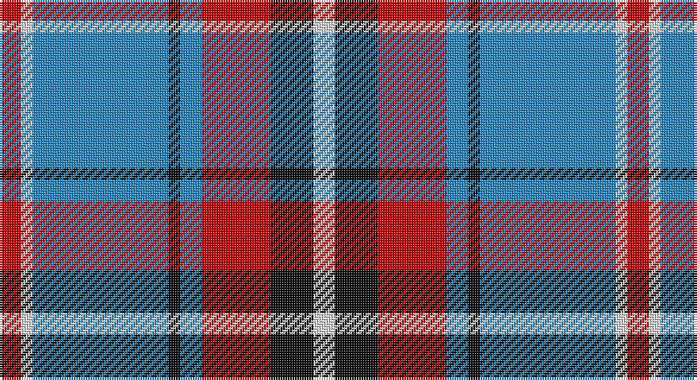

This page is one **sett** — a single exact thread-count. It belongs to the [tartan](/setts/r9w5t57k5t9r29k18w9/)
(the same proportion at any scale), whose colour order is pattern [RWBKBRKW](/stripes/rwbkbrkw/).

Sourced from tartans-authority.  It is a [8 stripe tartan](/stripes/stripes8/).

Original link http://www.tartansauthority.com/tartan-ferret/display/10464/

## Register references

External register numbers recorded for this tartan.

- Scottish Register of Tartans: [10464](https://www.tartanregister.gov.uk/tartanDetails?ref=10464)
- Scottish Tartans Authority (ITI): 10464

## Thread count
R/9 LN5 B57 K5 B9 R29 K18 LN/9

One full sett is **264 threads**.

## Palette

Palette: <strong>Tartan Register</strong>
<table><thead><tr><th>Colour</th><th>Threads</th><th>Shade</th><th>Base</th><th>OKLCh</th></tr></thead><tbody><tr><td>R/</td><td style="text-align:right;font-variant-numeric:tabular-nums">9</td><td><code style="background-color:#C80000;">#C80000</code> <small style="color:#888">#C80000</small></td><td>R <code style="background-color:#CC0000;">#CC0000</code></td><td><small style="color:#888">oklch(52.3% 0.215 29.2)</small></td></tr><tr><td>LN</td><td style="text-align:right;font-variant-numeric:tabular-nums">5</td><td><code style="background-color:#E0E0E0;">#E0E0E0</code> <small style="color:#888">#E0E0E0</small></td><td>W <code style="background-color:#F7F7F7;">#F7F7F7</code></td><td><small style="color:#888">oklch(90.7% 0.000 89.9)</small></td></tr><tr><td>B</td><td style="text-align:right;font-variant-numeric:tabular-nums">57</td><td><code style="background-color:#2888C4;">#2888C4</code> <small style="color:#888">#2888C4</small></td><td>B <code style="background-color:#2A418A;">#2A418A</code></td><td><small style="color:#888">oklch(60.1% 0.125 241.5)</small></td></tr><tr><td>K</td><td style="text-align:right;font-variant-numeric:tabular-nums">5</td><td><code style="background-color:#101010;">#101010</code> <small style="color:#888">#101010</small></td><td>K <code style="background-color:#000000;">#000000</code></td><td><small style="color:#888">oklch(17.3% 0.000 89.9)</small></td></tr><tr><td>B</td><td style="text-align:right;font-variant-numeric:tabular-nums">9</td><td><code style="background-color:#2888C4;">#2888C4</code> <small style="color:#888">#2888C4</small></td><td>B <code style="background-color:#2A418A;">#2A418A</code></td><td><small style="color:#888">oklch(60.1% 0.125 241.5)</small></td></tr><tr><td>R</td><td style="text-align:right;font-variant-numeric:tabular-nums">29</td><td><code style="background-color:#C80000;">#C80000</code> <small style="color:#888">#C80000</small></td><td>R <code style="background-color:#CC0000;">#CC0000</code></td><td><small style="color:#888">oklch(52.3% 0.215 29.2)</small></td></tr><tr><td>K</td><td style="text-align:right;font-variant-numeric:tabular-nums">18</td><td><code style="background-color:#101010;">#101010</code> <small style="color:#888">#101010</small></td><td>K <code style="background-color:#000000;">#000000</code></td><td><small style="color:#888">oklch(17.3% 0.000 89.9)</small></td></tr><tr><td>LN/</td><td style="text-align:right;font-variant-numeric:tabular-nums">9</td><td><code style="background-color:#E0E0E0;">#E0E0E0</code> <small style="color:#888">#E0E0E0</small></td><td>W <code style="background-color:#F7F7F7;">#F7F7F7</code></td><td><small style="color:#888">oklch(90.7% 0.000 89.9)</small></td></tr></tbody></table>

# Sample pattern

## Nearest tartans

The nearest existing variants by ΔTartan distance, with this tartan at the top so the swatches line up against it.

ΔTartan

Tartan

Sett

—

<a href="/ttd/edit/#slug=r9w5t57k5t9r29k18w9">Yale College of Wrexham (Corporate)</a> <a class="nn-out" href="/variants/s8/r9w5t57k5t9r29k18w9/" title="open its dictionary page">↗</a>

0.82

<a href="/ttd/edit/#slug=r3dy1w12dy2db2dy2db14w2db2~x2&amp;base=r9w5t57k5t9r29k18w9">Lord Arran (Corporate)</a> <a class="nn-out" href="/variants/s9/r3dy1w12dy2db2dy2db14w2db2~x2/" title="open its dictionary page">↗</a>

0.83

<a href="/ttd/edit/#slug=t57k5t9m29k18w9m9w5&amp;base=r9w5t57k5t9r29k18w9">Yale College, Wrexham</a> <a class="nn-out" href="/variants/s8/t57k5t9m29k18w9m9w5/" title="open its dictionary page">↗</a>

0.85

<a href="/ttd/edit/#slug=r12ly3w14dt10ly2dt24r2~x2&amp;base=r9w5t57k5t9r29k18w9">Yusra (Malay) (Personal)</a> <a class="nn-out" href="/variants/s7/r12ly3w14dt10ly2dt24r2~x2/" title="open its dictionary page">↗</a>

0.95

<a href="/ttd/edit/#slug=r4o41k5w14k18r4~x2&amp;base=r9w5t57k5t9r29k18w9">Downside (Corporate)</a> <a class="nn-out" href="/variants/s6/r4o41k5w14k18r4~x2/" title="open its dictionary page">↗</a>

1.02

<a href="/ttd/edit/#slug=r12k3w14dt10k2dt24r2~x2&amp;base=r9w5t57k5t9r29k18w9">Yusra Personal Tartan</a> <a class="nn-out" href="/variants/s7/r12k3w14dt10k2dt24r2~x2/" title="open its dictionary page">↗</a>

1.03

<a href="/ttd/edit/#slug=r4w4k4w4k4w4k2o23w2~x2&amp;base=r9w5t57k5t9r29k18w9">Virtuoso (Corporate)</a> <a class="nn-out" href="/variants/s9/r4w4k4w4k4w4k2o23w2~x2/" title="open its dictionary page">↗</a>

1.05

<a href="/ttd/edit/#slug=r18ly2b6ly2b4ly2b12ly3r4g2~x2&amp;base=r9w5t57k5t9r29k18w9">Unnamed</a> <a class="nn-out" href="/variants/s10/r18ly2b6ly2b4ly2b12ly3r4g2~x2/" title="open its dictionary page">↗</a>

1.09

<a href="/variants/s8/wi32db3r4db3r8db32w3db4~x2/">Clemens and August (Personal)</a>

1.09

<a href="/ttd/edit/#slug=lb33k4lb4k5lb4k7db41r4~x2&amp;base=r9w5t57k5t9r29k18w9">Kinnaird</a> <a class="nn-out" href="/variants/s8/lb33k4lb4k5lb4k7db41r4~x2/" title="open its dictionary page">↗</a>

1.12

<a href="/ttd/edit/#slug=m3db15w13dy6db2dy2m2~x2&amp;base=r9w5t57k5t9r29k18w9">Thompson Navy Trade Tartan</a> <a class="nn-out" href="/variants/s7/m3db15w13dy6db2dy2m2~x2/" title="open its dictionary page">↗</a>

## Neighbour map

Every grey dot is one of 14360 variants placed by the first two principal components of the ΔTartan feature space (44% of its variance). Red is this tartan; blue dots are its nearest — click one to open its page.

<svg viewBox="0 0 640 380" role="img" style="max-width:100%;height:auto;border:1px solid #e0e0e0;border-radius:4px;display:block" xmlns="http://www.w3.org/2000/svg"><image href="/nn/cloud.v1.png" width="640" height="380"/><a href="/variants/s9/r3dy1w12dy2db2dy2db14w2db2~x2/"><circle cx="224.4" cy="144.0" r="4" fill="#3465a4"><title>Lord Arran (Corporate)</title></circle></a><a href="/variants/s8/t57k5t9m29k18w9m9w5/"><circle cx="223.1" cy="167.6" r="4" fill="#3465a4"><title>Yale College, Wrexham</title></circle></a><a href="/variants/s7/r12ly3w14dt10ly2dt24r2~x2/"><circle cx="229.2" cy="181.5" r="4" fill="#3465a4"><title>Yusra (Malay) (Personal)</title></circle></a><a href="/variants/s6/r4o41k5w14k18r4~x2/"><circle cx="223.5" cy="182.6" r="4" fill="#3465a4"><title>Downside (Corporate)</title></circle></a><a href="/variants/s7/r12k3w14dt10k2dt24r2~x2/"><circle cx="227.4" cy="183.8" r="4" fill="#3465a4"><title>Yusra Personal Tartan</title></circle></a><a href="/variants/s9/r4w4k4w4k4w4k2o23w2~x2/"><circle cx="216.6" cy="145.0" r="4" fill="#3465a4"><title>Virtuoso (Corporate)</title></circle></a><a href="/variants/s10/r18ly2b6ly2b4ly2b12ly3r4g2~x2/"><circle cx="203.6" cy="168.1" r="4" fill="#3465a4"><title>Unnamed</title></circle></a><a href="/variants/s8/wi32db3r4db3r8db32w3db4~x2/"><circle cx="227.9" cy="149.0" r="4" fill="#3465a4"><title>Clemens and August (Personal)</title></circle></a><a href="/variants/s8/lb33k4lb4k5lb4k7db41r4~x2/"><circle cx="202.4" cy="157.9" r="4" fill="#3465a4"><title>Kinnaird</title></circle></a><a href="/variants/s7/m3db15w13dy6db2dy2m2~x2/"><circle cx="159.0" cy="190.3" r="4" fill="#3465a4"><title>Thompson Navy Trade Tartan</title></circle></a><circle cx="225.3" cy="167.9" r="5" fill="#c00000"/></svg>

ID: /variants/s8/r9w5t57k5t9r29k18w9/
