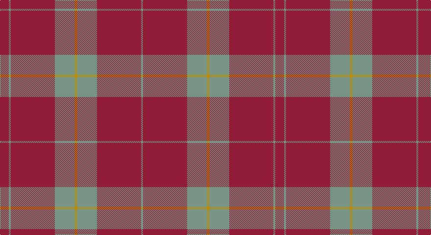

This page is one **sett** — a single exact thread-count. It belongs to the [tartan](/setts/r9y2r45y20lo3/)
(the same proportion at any scale), whose colour order is pattern [GRGYGRGR](/stripes/grgygrgr/).

Sourced from register-of-tartans.  It is a [8 stripe tartan](/stripes/stripes8/).

Original link https://www.tartanregister.gov.uk/tartanDetails.aspx?ref=1787

## Register references

External register numbers recorded for this tartan.

- Scottish Register of Tartans: [1787](https://www.tartanregister.gov.uk/tartanDetails.aspx?ref=1787)
- Scottish Tartans Authority (ITI): 6254

## Thread count
DRa/18 LG4 DRa90 LG40 DY6 LG40 DRa90 LG/4

One full sett is **562 threads**.

## Palette

Palette: <strong>Tartan Register</strong>
<table><thead><tr><th>Colour</th><th>Threads</th><th>Shade</th><th>Base</th><th>OKLCh</th></tr></thead><tbody><tr><td>DRa/</td><td style="text-align:right;font-variant-numeric:tabular-nums">18</td><td><code style="background-color:#901C38;">#901C38</code> <small style="color:#888">#901C38</small></td><td>R <code style="background-color:#CC0000;">#CC0000</code></td><td><small style="color:#888">oklch(43.2% 0.150 13.1)</small></td></tr><tr><td>LG</td><td style="text-align:right;font-variant-numeric:tabular-nums">4</td><td><code style="background-color:#789484;">#789484</code> <small style="color:#888">#789484</small></td><td>G <code style="background-color:#006100;">#006100</code></td><td><small style="color:#888">oklch(64.0% 0.040 160.0)</small></td></tr><tr><td>DRa</td><td style="text-align:right;font-variant-numeric:tabular-nums">90</td><td><code style="background-color:#901C38;">#901C38</code> <small style="color:#888">#901C38</small></td><td>R <code style="background-color:#CC0000;">#CC0000</code></td><td><small style="color:#888">oklch(43.2% 0.150 13.1)</small></td></tr><tr><td>LG</td><td style="text-align:right;font-variant-numeric:tabular-nums">40</td><td><code style="background-color:#789484;">#789484</code> <small style="color:#888">#789484</small></td><td>G <code style="background-color:#006100;">#006100</code></td><td><small style="color:#888">oklch(64.0% 0.040 160.0)</small></td></tr><tr><td>DY</td><td style="text-align:right;font-variant-numeric:tabular-nums">6</td><td><code style="background-color:#BC8C00;">#BC8C00</code> <small style="color:#888">#BC8C00</small></td><td>Y <code style="background-color:#F2BF00;">#F2BF00</code></td><td><small style="color:#888">oklch(66.8% 0.137 84.1)</small></td></tr><tr><td>LG</td><td style="text-align:right;font-variant-numeric:tabular-nums">40</td><td><code style="background-color:#789484;">#789484</code> <small style="color:#888">#789484</small></td><td>G <code style="background-color:#006100;">#006100</code></td><td><small style="color:#888">oklch(64.0% 0.040 160.0)</small></td></tr><tr><td>DRa</td><td style="text-align:right;font-variant-numeric:tabular-nums">90</td><td><code style="background-color:#901C38;">#901C38</code> <small style="color:#888">#901C38</small></td><td>R <code style="background-color:#CC0000;">#CC0000</code></td><td><small style="color:#888">oklch(43.2% 0.150 13.1)</small></td></tr><tr><td>LG/</td><td style="text-align:right;font-variant-numeric:tabular-nums">4</td><td><code style="background-color:#789484;">#789484</code> <small style="color:#888">#789484</small></td><td>G <code style="background-color:#006100;">#006100</code></td><td><small style="color:#888">oklch(64.0% 0.040 160.0)</small></td></tr></tbody></table>

# Sample pattern

## Nearest tartans

The nearest existing variants by ΔTartan distance, with this tartan at the top so the swatches line up against it.

ΔTartan

Tartan

Sett

—

<a href="/ttd/edit/#slug=r9y2r45y20lo3~x2">Hunt (Personal)</a> <a class="nn-out" href="/variants/s8/r9y2r45y20lo3~x2/" title="open its dictionary page">↗</a>

0.99

<a href="/ttd/edit/#slug=r9y2r45y20lo3~x2">Hunt (Personal)</a> <a class="nn-out" href="/variants/s5/r9y2r45y20lo3~x2/" title="open its dictionary page">↗</a>

1.06

<a href="/ttd/edit/#slug=r3o10r3o4r20lb1~x4&amp;base=r9y2r45y20lo3~x2">Monica</a> <a class="nn-out" href="/variants/s6/r3o10r3o4r20lb1~x4/" title="open its dictionary page">↗</a>

1.38

<a href="/ttd/edit/#slug=m6lb2m30g12m3g12m3~x2&amp;base=r9y2r45y20lo3~x2">Crawford</a> <a class="nn-out" href="/variants/s7/m6lb2m30g12m3g12m3~x2/" title="open its dictionary page">↗</a>

1.40

<a href="/ttd/edit/#slug=m5y20m5y3m4y5m36y1w4~x2&amp;base=r9y2r45y20lo3~x2">Baluchistan Fitzgerald Regimental Tartan</a> <a class="nn-out" href="/variants/s9/m5y20m5y3m4y5m36y1w4~x2/" title="open its dictionary page">↗</a>

1.51

<a href="/ttd/edit/#slug=m6w2m30g12m3g12m3~x2&amp;base=r9y2r45y20lo3~x2">Crawford (Clan)</a> <a class="nn-out" href="/variants/s7/m6w2m30g12m3g12m3~x2/" title="open its dictionary page">↗</a>

1.63

<a href="/ttd/edit/#slug=r24g5r3g9r3db1~x4&amp;base=r9y2r45y20lo3~x2">MacKintosh, Red</a> <a class="nn-out" href="/variants/s6/r24g5r3g9r3db1~x4/" title="open its dictionary page">↗</a>

1.73

<a href="/ttd/edit/#slug=m96g42m16g17k4lb6&amp;base=r9y2r45y20lo3~x2">MacGregor Hunting Glengyle Clan Tartan</a> <a class="nn-out" href="/variants/s6/m96g42m16g17k4lb6/" title="open its dictionary page">↗</a>

1.74

<a href="/ttd/edit/#slug=m6lb3n6o10m38lb2n4&amp;base=r9y2r45y20lo3~x2">Washington State University Cougar</a> <a class="nn-out" href="/variants/s7/m6lb3n6o10m38lb2n4/" title="open its dictionary page">↗</a>

1.79

<a href="/ttd/edit/#slug=r16db6r2g6r2db1~x2&amp;base=r9y2r45y20lo3~x2">MacKintosh, Plaid</a> <a class="nn-out" href="/variants/s6/r16db6r2g6r2db1~x2/" title="open its dictionary page">↗</a>

1.79

<a href="/ttd/edit/#slug=r8g2r6db1r2db1r8g12r14db1r2~x2&amp;base=r9y2r45y20lo3~x2">MacDonell of Keppoch</a> <a class="nn-out" href="/variants/s11/r8g2r6db1r2db1r8g12r14db1r2~x2/" title="open its dictionary page">↗</a>

## Neighbour map

Every grey dot is one of 14360 variants placed by the first two principal components of the ΔTartan feature space (44% of its variance). Red is this tartan; blue dots are its nearest — click one to open its page.

<svg viewBox="0 0 640 380" role="img" style="max-width:100%;height:auto;border:1px solid #e0e0e0;border-radius:4px;display:block" xmlns="http://www.w3.org/2000/svg"><image href="/nn/cloud.v1.png" width="640" height="380"/><a href="/variants/s5/r9y2r45y20lo3~x2/"><circle cx="515.3" cy="209.3" r="4" fill="#3465a4"><title>Hunt (Personal)</title></circle></a><a href="/variants/s6/r3o10r3o4r20lb1~x4/"><circle cx="460.8" cy="199.5" r="4" fill="#3465a4"><title>Monica</title></circle></a><a href="/variants/s7/m6lb2m30g12m3g12m3~x2/"><circle cx="425.7" cy="204.0" r="4" fill="#3465a4"><title>Crawford</title></circle></a><a href="/variants/s9/m5y20m5y3m4y5m36y1w4~x2/"><circle cx="473.4" cy="151.2" r="4" fill="#3465a4"><title>Baluchistan Fitzgerald Regimental Tartan</title></circle></a><a href="/variants/s7/m6w2m30g12m3g12m3~x2/"><circle cx="419.7" cy="200.9" r="4" fill="#3465a4"><title>Crawford (Clan)</title></circle></a><a href="/variants/s6/r24g5r3g9r3db1~x4/"><circle cx="488.5" cy="184.0" r="4" fill="#3465a4"><title>MacKintosh, Red</title></circle></a><a href="/variants/s6/m96g42m16g17k4lb6/"><circle cx="428.6" cy="168.2" r="4" fill="#3465a4"><title>MacGregor Hunting Glengyle Clan Tartan</title></circle></a><a href="/variants/s7/m6lb3n6o10m38lb2n4/"><circle cx="442.5" cy="165.3" r="4" fill="#3465a4"><title>Washington State University Cougar</title></circle></a><a href="/variants/s6/r16db6r2g6r2db1~x2/"><circle cx="401.6" cy="202.3" r="4" fill="#3465a4"><title>MacKintosh, Plaid</title></circle></a><a href="/variants/s11/r8g2r6db1r2db1r8g12r14db1r2~x2/"><circle cx="461.1" cy="189.5" r="4" fill="#3465a4"><title>MacDonell of Keppoch</title></circle></a><circle cx="499.3" cy="196.0" r="5" fill="#c00000"/></svg>

ID: /variants/s8/r9y2r45y20lo3~x2/
